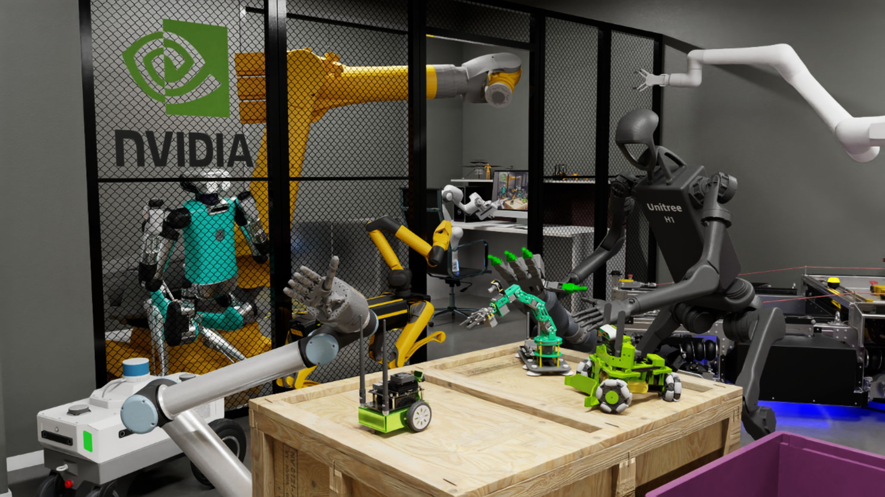
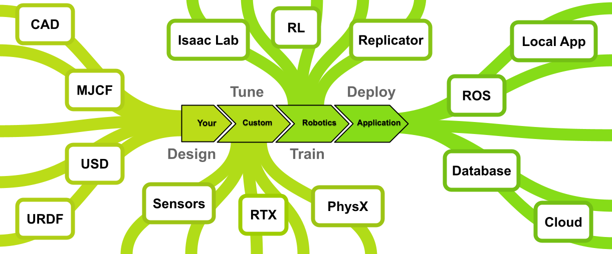

# Isaac Sim이란?
Isaac Sim은 NVIDIA에서 밀어주고 있는 시뮬레이터로서, NVIDIA Omniverse 기반으로 개발되었다.  
사용자들은 Isaac Sim을 활용해서 다양한 로봇 알고리즘 개발 및 테스트를 진행할 수 있으며, 동시에 로봇 학습 및 합성 데이터 생성도 사용할 수 있는 다목적 + 고기능 시뮬레이션 툴이라고 할 수 있다.

참고로 기본적으로 Linux + x86/amd64 OS를 산정하고 만들어졌지만, Isaac Sim 5.1은 **DGX Spark에 대한 제한적인 기능을 지원한다.**

언젠가의 문서에서 다루겠지만, NVIDIA에서 공개한 Omniverse 관련 플랫폼들을 아주 간단히 구분해보자면 다음과 같다.
| 이름 | 용도 |
| --- | --- |
| Omniverse | 가장 기본, 근간이 되는 플랫폼 + SDK |
| Isaac sim | Omniverse 위에 올라가있는 로봇 시뮬레이터 |
| Isaac Lab | Isaac Sim 위에서 로봇 학습을 쉽게 하기 위한 프레임워크 |
  
NVIDIA (이하 영어로 적기 귀찮아서 "엔비디아")에서 제공하는 Omniverse Kit는 `USD/Hydra`, `RTX Renderer`, `Extension` 등의 시스템을 조합해서 자체적인 3D/로보틱스 어플리케이션을 개발하고 만들 수 있는 SDK이다. Isaac Sim은 이 Kit 기반으로 개발된 시뮬레이션 어플리케이션이라고 할 수 있다.  
Isaac Lab은 이 Isaac Sim 위에 올라간 **robot-learning application 개발용 프레임워크**이며 Isaac Sim을 활용해서 RL (강화학습), IL (모방학습), Learning from demonstrations, Motion planning 등의 다양한 Workflow를 쉽게 개발 가능하도록 만든 것이다.

## Isaac Sim의 디자인
Isaac Sim은 기존의 시뮬레이션 및 로보틱스 프로그램들에서 사용하는 다양한 자료형식들을 모두 호환 가능하도록 하는 것이 초점을 맞췄다. 엔비디아에서는 Isaac Sim을 개발한 이유 자체가 기존에 존재하던 프로그램들을 모두 대체해버리기 위함이 아니라, 서로 보완하는 것이 목적이라고 한 만큼, 쉽게 호환이 가능하도록 설계가 되었다는 뜻이다.  
예를 들어서 Isaac Sim에서는, 다음과 같은 파일들을 Isaac Sim 전용 파일(USD)로 쉽게 전용해서 사용 가능하다.  
| 이름 | 용도 |
| --- | --- |
| URDF | ROS, Gazebo를 사용하면 익숙한 파일 형식. link와 joint로 로봇을 모사하는 XML 형식의 파일. |
| MJCF | XML 형식으로 MuJoCo에서 사용하는 파일 형식.|

## Tune and Train, Deploy
Isaac Sim의 가장 큰 특징 중 하나라고 한다면 GPU 기반의 (엔비디아가 뭐 파는 회사인지 생각해본다면 ..) 물리연산엔진인 [PhysX 엔진](https://developer.nvidia.com/physx-sdk), 그리고 마찬가지로 GPU 기반의 [RTX 센서와 렌더링](https://docs.isaacsim.omniverse.nvidia.com/5.1.0/sensors/index.html#isaac-sim-sensor-simulation)을 산업계 규모(industrial scale)로 구현 가능하다는 점이 있다. GPU를 통해 연산을 진행하기 때문에 카메라 / 라이다 / Contact 센서와 같은 다양한 센서 모델링이 가능하며, Neural 렌더링 등을 통해 Gaussian Splatting 같은 기술 적용도 지원하기 때문에 디지털 트윈 구현도 가능하다. 또한 동시에 합성 데이터 생성기인 [Replicator](https://docs.omniverse.nvidia.com/extensions/latest/ext_replicator.html), 다수의 시뮬레이션 환경들을 오케스트레이션 하는 툴인 [Omnigraph](https://docs.omniverse.nvidia.com/extensions/latest/ext_omnigraph.html), PhysX 엔진에 대한 튜닝 기능, 그리고 강화학습과 모방학습을 진행할 수 있는 [Isaac Lab](https://docs.isaacsim.omniverse.nvidia.com/5.1.0/isaac_lab_tutorials/index.html#isaac-lab-tutorials-page)을 동시에 제공한다.  
  
그리고 로보틱스 학계 + 입문자들에게 매우 친절하게도, ROS2에 대한 지원을 제공한다. 거의 ROS2-native 수준으로 지원을 제공하게 되는데, 그냥 ROS2랑 연결 뿐만 아니라 GPU 가속을 활용한 [Isaac ROS](https://nvidia-isaac-ros.github.io/) 등과의 강력한 연동을 제공한다. 이에 대해서는 추후 ROS2 연동 관련 튜토리얼 문서에서 다루게 될 것이다.  
  

  
Isaac Sim 5.1이 어떤 점에서 달라졌는지에 대해서는 다음 [Release note](https://docs.isaacsim.omniverse.nvidia.com/5.1.0/overview/release_notes.html)를 참고하면 된다.