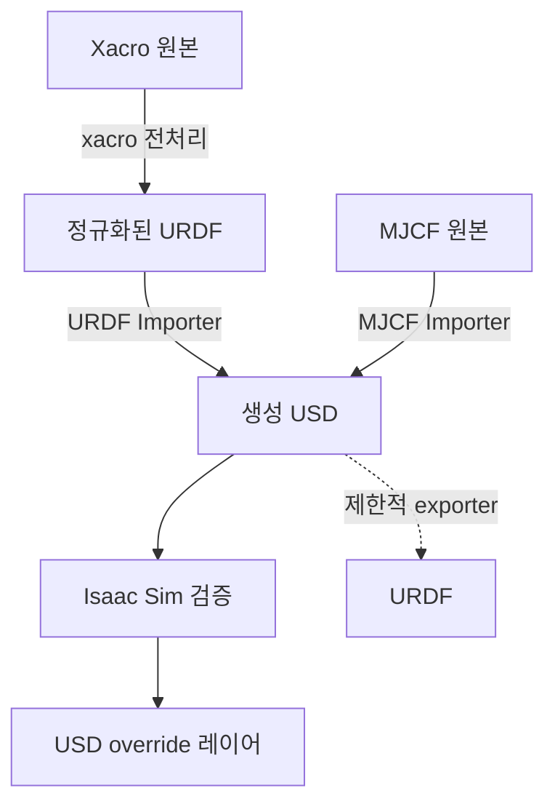

# URDF·Xacro·MJCF와 USD 사이의 변환

이 장에서는 로봇 설명 파일을 Isaac Sim 5.1이 사용하는 USD 자산으로 가져오고, 필요한 경우 USD를 다시 URDF 계열로 내보내는 방법을 다룬다. 먼저 가장 중요한 원칙부터 짚어야 한다.

> **변환은 단순한 확장자 변경이 아니다.** URDF, Xacro, MJCF, USD는 표현할 수 있는 정보와 실행 시점이 다르다. 가져오기(import)는 원본의 의미를 PhysX·USD 스키마로 번역하는 작업이고, 내보내기(export)는 USD의 일부만 대상 형식에 맞춰 투영하는 작업이다.

따라서 프로젝트에서는 원본 URDF/Xacro/MJCF와 생성된 USD를 모두 버전 관리하고, 생성 절차도 스크립트로 남기는 편이 안전하다.

## 1. 지원 경로를 먼저 이해하다

Isaac Sim 5.1의 공식 지원 범위를 요약하면 다음과 같다.

| 출발 형식 | 도착 형식 | 5.1의 공식 경로 | 기대 수준 |
|---|---|---|---|
| URDF | USD | URDF Importer GUI·Kit 명령 | 주요 링크·조인트·관성·충돌·재질을 가져온다 |
| Xacro | USD | Xacro를 URDF로 펼친 뒤 URDF Importer를 사용한다 | 펼친 결과만 보존한다. 매크로 구조는 USD에 남지 않는다 |
| MJCF | USD | MJCF Importer GUI·Kit 명령 | body·joint·geom·site 등의 지원 항목을 USD/PhysX로 번역한다 |
| USD | URDF | URDF Exporter GUI | 호환되는 articulation의 부분집합을 내보낸다 |
| USD | Xacro | 직접 경로 없음 | USD→URDF 후 사람이 매크로로 재구성한다 |
| USD | MJCF | 5.1 공식 exporter 없음 | 필요하면 USD→URDF→MuJoCo 경로를 실험하되 손실을 감사한다 |

다음 흐름은 실무에서 가장 재현성이 높다.



`생성 USD`와 사람이 조정한 `override 레이어`를 분리하면 원본을 다시 가져와도 튜닝 값을 비교하거나 재적용하기 쉽다. 변환 결과 한 파일을 직접 계속 고치는 방식은 재가져오기 때 수정 내역을 잃기 쉽다.

## 2. 변환 전 공통 준비

### 2.1 절대 경로와 실행 환경을 확인하다

이 장의 Python 예제는 Isaac Sim 5.1의 Python 환경에서 실행해야 한다. 워크스테이션 설치를 예로 들면 다음과 같다.

```bash
cd ~/isaacsim
./python.sh /absolute/path/to/import_robot.py
```

일반 시스템 Python에서 `pip install pxr` 같은 임의 패키지를 추가해 importer를 호출하려 하면 Kit 확장과 PhysX 스키마를 찾지 못한다. `pxr`만 사용하는 순수 USD 검사는 시스템의 OpenUSD 환경에서도 할 수 있지만, `omni.kit.commands`와 `isaacsim.asset.importer.*`는 Isaac Sim 프로세스가 필요하다.

입력 파일과 출력 디렉터리는 절대 경로로 정규화하는 것이 좋다.

```python
from pathlib import Path

source = Path("~/robot_ws/src/my_robot/urdf/robot.urdf").expanduser().resolve()
output = Path("~/sim_assets/my_robot/robot.usd").expanduser().resolve()

if not source.is_file():
    raise FileNotFoundError(source)
output.parent.mkdir(parents=True, exist_ok=True)
print(f"입력: {source}\n출력: {output}")
```

### 2.2 입력 자산의 단위와 축을 기록하다

변환 전에 다음 항목을 표로 기록한다.

- 길이 단위와 mesh 자체의 단위를 확인한다. URDF는 관례상 SI 단위를 사용하지만 mesh 파일이 밀리미터로 모델링된 사례가 많다.
- 각 링크의 질량, 질량중심, 관성 텐서를 확인한다.
- 조인트 축, 한계, damping/friction과 mimic 관계를 확인한다.
- visual mesh와 collision mesh를 구분한다.
- `package://`, 상대 경로, compiler 경로 등 외부 의존성을 확인한다.
- 고정 베이스 여부와 root link를 결정한다.

잘못된 단위는 변환 후에도 문법적으로는 정상인 USD가 된다. 예를 들어 길이가 1000배 커지면 관성과 접촉 응답도 기대와 완전히 달라진다. importer 창의 미리 보기만으로 끝내지 말고 bounding box와 질량을 수치로 검사해야 한다.

### 2.3 결과 검증 기준을 미리 만들다

최소한 다음 값은 변환 전후에 비교한다.

| 항목 | 확인 질문 |
|---|---|
| 계층 | link/body 수와 joint 수가 예상과 같은가 |
| pose | 기본 자세에서 링크 원점과 joint frame이 같은가 |
| 동역학 | 총질량, 링크별 질량, COM, inertia가 합리적인가 |
| 구동 | joint type, axis, lower/upper limit, effort, velocity가 맞는가 |
| 충돌 | collider가 누락되거나 visual mesh 전체로 과도하게 생성되지 않았는가 |
| 재질 | 텍스처 경로와 색이 유효한가 |
| 시뮬레이션 | 중력 낙하, 고정 베이스, self-collision 동작이 의도와 같은가 |

## 3. URDF를 USD로 가져오다

URDF Importer는 `link`, `joint`, `visual`, `collision`, `inertial`을 읽어 USD prim과 PhysX articulation 구조를 만든다. URDF에 없는 풍부한 렌더링·레이어·variant 정보는 importer가 만들어 낼 수 없다.

### 3.1 GUI에서 가져오다

1. Isaac Sim을 실행하고 **Window > Extensions**를 연다.
2. `isaacsim.asset.importer.urdf`를 검색해 활성화한다. 일반 배포에서는 기본으로 활성화되어 있을 수 있다.
3. **File > Import**를 선택하고 `.urdf` 파일을 지정한다.
4. 쓰기 가능한 **USD Output** 경로를 지정한다. 설치 디렉터리나 읽기 전용 Nucleus 경로를 출력으로 선택하지 않는다.
5. 옵션을 설정한 뒤 **Import**를 누른다.
6. 생성된 USD를 새 stage에서 다시 열어 의존 자산 경로까지 유효한지 검사한다.

중요 옵션은 다음과 같다. UI의 정확한 배치와 표기는 확장 버전에 따라 조금 달라질 수 있다.

| 옵션 | 의미와 선택 기준 |
|---|---|
| Fix Base | root를 월드에 고정한다. 이동 로봇은 보통 끈다 |
| Merge Fixed Joints | fixed joint로 연결된 링크를 합친다. 링크 이름·센서 부착점 보존이 중요하면 끈다 |
| Import Inertia Tensor | URDF의 관성 값을 사용한다. 원본이 신뢰할 만할 때 켠다 |
| Self Collision | 같은 articulation 내부 충돌을 허용한다. 필요한 경우만 켜고 인접 링크 필터를 검토한다 |
| Collision From Visuals | collision이 없을 때 visual로 collider를 만든다. 정밀 mesh는 성능 비용이 크다 |
| Convex Decomposition | 복잡한 collision mesh를 convex 조각으로 근사한다 |
| Replace Cylinders with Capsules | 접촉 안정성과 성능을 위해 cylinder collider를 capsule로 대체한다 |
| Density | 질량 정보가 없는 링크의 질량 계산에 쓰는 밀도를 설정한다 |
| Distance Scale | 원본 길이와 stage 단위 사이의 배율을 조절한다 |
| Parse Mimic | URDF mimic joint 관계를 해석한다 |
| Make Default Prim | 생성 자산의 defaultPrim을 설정한다. reference로 재사용할 때 유용하다 |

고정 조인트 병합은 단순 성능 옵션이 아니다. 센서가 특정 링크 경로를 참조하거나 ROS 쪽에서 link frame 이름을 기대한다면 병합 후 경로가 사라질 수 있다. 먼저 끈 상태로 가져와 구조를 검증한 뒤 최적화한다.

### 3.2 Python으로 반복 가능하게 가져오다

다음은 standalone 스크립트의 뼈대이다. `SimulationApp`을 가장 먼저 생성한 뒤 Kit·importer 모듈을 import해야 한다.

```python
# import_urdf.py
import argparse
from pathlib import Path
from isaacsim import SimulationApp

parser = argparse.ArgumentParser()
parser.add_argument("urdf", help="입력 URDF 절대 또는 상대 경로")
parser.add_argument("usd", help="출력 USD 절대 또는 상대 경로")
args = parser.parse_args()

simulation_app = SimulationApp({"headless": True})

import omni.kit.commands
from isaacsim.asset.importer.urdf import _urdf

urdf_path = Path(args.urdf).expanduser().resolve()
usd_path = Path(args.usd).expanduser().resolve()
if not urdf_path.is_file():
    simulation_app.close()
    raise FileNotFoundError(urdf_path)
usd_path.parent.mkdir(parents=True, exist_ok=True)

config = _urdf.ImportConfig()
config.set_fix_base(False)
config.set_merge_fixed_joints(False)
config.set_import_inertia_tensor(True)
config.set_self_collision(False)
config.set_collision_from_visuals(False)
config.set_convex_decomp(False)
config.set_make_default_prim(True)

status, imported_prim_path = omni.kit.commands.execute(
    "URDFParseAndImportFile",
    urdf_path=str(urdf_path),
    import_config=config,
    dest_path=str(usd_path),
)

if not status:
    simulation_app.close()
    raise RuntimeError(f"URDF 가져오기에 실패했다: {urdf_path}")

print(f"생성 완료: {usd_path}")
print(f"가져온 prim: {imported_prim_path}")
simulation_app.update()
simulation_app.close()
```

```bash
cd ~/isaacsim
./python.sh /absolute/path/to/import_urdf.py \
  /absolute/path/to/robot.urdf \
  /absolute/path/to/generated/robot.usd
```

5.1 문서에는 command로 설정 객체를 만드는 형태도 나온다. 이 형태는 현재 확장이 등록한 command 구현을 사용한다.

```python
status, config = omni.kit.commands.execute("URDFCreateImportConfig")
if not status:
    raise RuntimeError("URDF ImportConfig를 만들 수 없다")

config.set_fix_base(True)
config.set_merge_fixed_joints(False)
config.set_import_inertia_tensor(True)

status, result = omni.kit.commands.execute(
    "URDFParseAndImportFile",
    urdf_path="/absolute/path/to/arm.urdf",
    import_config=config,
    dest_path="/absolute/path/to/arm.usd",
)
```

URDF importer가 제공하는 대표 command는 다음과 같다.

- `URDFCreateImportConfig`: importer 설정 객체를 만든다.
- `URDFParseFile`: URDF를 파싱해 중간 로봇 모델을 얻는다.
- `URDFImportRobot`: 파싱된 모델을 stage 또는 자산으로 가져온다.
- `URDFParseAndImportFile`: 파싱과 import를 한 번에 수행한다.

직접 `_urdf` 모듈을 사용할 때는 Isaac Sim **5.1.0 문서의 API**를 기준으로 한다. 다른 버전의 예제에서 가져온 클래스나 setter를 섞으면 실행 시점에 속성 오류가 날 수 있다.

### 3.3 관절 drive 값을 선택하다

importer는 position 또는 velocity drive를 만들 수 있다. 자연 주파수 방식으로 stiffness와 damping을 정할 때 단일 자유도 근사식은 다음과 같다.

\[
K_p = m\omega_n^2, \qquad K_d = 2m\zeta\omega_n
\]

여기서 \(m\)은 관절이 보는 등가 질량, \(\omega_n\)은 자연 각주파수, \(\zeta\)는 감쇠비이다. 회전 관절에는 질량 대신 등가 관성의 관점으로 해석한다. 값이 크다고 무조건 좋은 제어가 되는 것은 아니다. physics step, solver iteration, 질량비와 함께 튜닝한다.

학습 정책이 effort를 직접 출력한다면 import 단계에서 강한 position drive를 남겨 두지 않는다. 반대로 GUI에서 간단히 자세를 유지하려면 적절한 drive가 필요하다.

### 3.4 URDF 특유의 함정을 점검하다

- `package://my_robot/...` URI는 ROS package 검색 경로가 올바르게 설정되어야 한다. 자동화 서버에서는 작업공간을 source했는지 확인한다.
- 파일 이름과 prim 이름에 공백, 특수 문자, 숫자로 시작하는 이름이 있으면 importer가 USD 식별자 규칙에 맞게 바꿀 수 있다. 변환 후 이름 매핑을 검사한다.
- 관성 텐서는 양의 정부호이고 링크 좌표계에 대해 올바르게 표현되어야 한다. 비정상 값은 폭발적인 동역학을 만든다.
- concave triangle mesh는 동적 rigid body collider에 그대로 쓰기 어렵다. 단순 collision mesh 또는 convex decomposition을 사용한다.
- `mimic`과 transmission 정보가 downstream controller에서 같은 의미로 사용되는지 별도로 확인한다.

## 4. Xacro를 USD로 가져오다

Xacro는 별도 로봇 물리 형식이라기보다 XML macro 언어이다. property, macro, include, 조건문, 인자를 평가하면 URDF가 나온다. Isaac Sim의 핵심 URDF importer에 `.xacro`를 그대로 넘기는 경로를 전제로 하지 않는다.

### 4.1 Xacro를 URDF로 펼치다

Ubuntu 24.04와 ROS 2 Jazzy 환경에서 다음과 같이 실행한다.

```bash
sudo apt update
sudo apt install ros-jazzy-xacro liburdfdom-tools
source /opt/ros/jazzy/setup.bash

ros2 run xacro xacro \
  ~/robot_ws/src/my_robot/urdf/robot.urdf.xacro \
  use_sim:=true prefix:="" \
  -o /tmp/robot.expanded.urdf

check_urdf /tmp/robot.expanded.urdf
```

그 다음 `/tmp/robot.expanded.urdf`를 앞 절의 GUI 또는 Python 절차로 가져온다. 생성 파일을 재현하려면 정확한 Xacro 인자를 스크립트나 빌드 시스템에 남긴다.

```bash
#!/usr/bin/env bash
set -euo pipefail

source /opt/ros/jazzy/setup.bash
mkdir -p "$PWD/build" "$PWD/generated"
ros2 run xacro xacro \
  "$PWD/urdf/robot.urdf.xacro" \
  use_sim:=true safety_limits:=true \
  -o "$PWD/build/robot.urdf"

~/isaacsim/python.sh "$PWD/tools/import_urdf.py" \
  "$PWD/build/robot.urdf" "$PWD/generated/robot.usd"
```

### 4.2 ROS 2 `robot_description`에서 가져오다

Isaac Sim 5.1에는 ROS 2 URDF 관련 확장이 있으며, ROS 2 노드가 게시한 `robot_description`을 이용하는 워크플로도 제공한다. 이 경우 Xacro를 실행하는 launch 파일이 먼저 `robot_description`을 만들고, Isaac Sim이 그 결과를 받는다.

이 방법은 다음 조건을 만족할 때 유용하다.

- 로봇 패키지의 launch 인자에 따라 description이 달라진다.
- `package://` mesh와 package dependency를 ROS 작업공간에서 해석해야 한다.
- 실제 ROS 2 배포와 같은 description을 가져오고 싶다.

반면 CI에서 결정론적인 자산을 만들 때는 **펼친 URDF를 파일로 보존한 뒤 import**하는 편이 문제 추적에 쉽다. 어떤 방식을 사용하든 Xacro macro 이름과 include 구조는 결과 USD에서 복구할 수 없다.

## 5. MJCF를 USD로 가져오다

MJCF는 MuJoCo 모델 형식으로, body 계층뿐 아니라 actuator, sensor, contact, equality, compiler default 등 시뮬레이터 의미를 담을 수 있다. Isaac Sim importer는 지원하는 요소를 USD·PhysX 표현으로 옮기며, MuJoCo solver의 모든 의미를 동일하게 복제하는 것은 아니다.

### 5.1 GUI에서 가져오다

1. **Window > Extensions**에서 `isaacsim.asset.importer.mjcf`를 활성화한다.
2. **File > Import**를 열고 MJCF `.xml` 파일과 출력 USD 경로를 선택한다.
3. root 고정, 관성, site, collider, instanceable 옵션을 설정한다.
4. 가져온 뒤 MuJoCo에서의 초기 pose와 Isaac Sim의 초기 pose를 나란히 비교한다.

대표 옵션은 다음과 같다.

| 옵션 | 의미와 주의점 |
|---|---|
| Fix Base | root body를 월드에 고정한다 |
| Merge Fixed Joints | 고정 연결을 병합한다. 이름·site 부착점을 검사한다 |
| Create Body for Fixed Joint | 고정 조인트에 대응하는 body 보존 방식을 제어한다 |
| Import Inertia Tensor | MJCF의 관성 텐서를 가져온다 |
| Override COM / Inertia | importer가 계산한 질량중심·관성으로 대체할지 결정한다 |
| Import Sites | MJCF site를 가져온다. 목표점·센서 위치 표시에 중요하다 |
| Self Collision | articulation 내부 충돌을 활성화한다 |
| Convex Decomposition | 복잡한 collision mesh를 convex 근사한다 |
| Make Instanceable | 반복 mesh를 instanceable USD 자산으로 구성한다 |
| Instanceable USD Path | instanceable geometry를 저장할 별도 USD 경로를 정한다 |
| Distance Scale / Density | 단위 배율과 누락 질량 계산을 설정한다 |

### 5.2 Python으로 가져오다

```python
# import_mjcf.py
import argparse
from pathlib import Path
from isaacsim import SimulationApp

parser = argparse.ArgumentParser()
parser.add_argument("mjcf", help="입력 MJCF XML 경로")
parser.add_argument("usd", help="출력 USD 경로")
args = parser.parse_args()

simulation_app = SimulationApp({"headless": True})

import omni.kit.commands

mjcf_path = Path(args.mjcf).expanduser().resolve()
usd_path = Path(args.usd).expanduser().resolve()
if not mjcf_path.is_file():
    simulation_app.close()
    raise FileNotFoundError(mjcf_path)
usd_path.parent.mkdir(parents=True, exist_ok=True)

status, config = omni.kit.commands.execute("MJCFCreateImportConfig")
if not status:
    simulation_app.close()
    raise RuntimeError("MJCF ImportConfig를 만들 수 없다")

config.set_fix_base(False)
config.set_import_inertia_tensor(True)
config.set_import_sites(True)
config.set_self_collision(False)
config.set_make_instanceable(True)

status, result = omni.kit.commands.execute(
    "MJCFCreateAsset",
    mjcf_path=str(mjcf_path),
    import_config=config,
    prim_path="/Robot",
    dest_path=str(usd_path),
)

if not status:
    simulation_app.close()
    raise RuntimeError(f"MJCF 가져오기에 실패했다: {mjcf_path}")

print(f"생성 완료: {usd_path}; 결과: {result}")
simulation_app.update()
simulation_app.close()
```

```bash
cd ~/isaacsim
./python.sh /absolute/path/to/import_mjcf.py \
  /absolute/path/to/robot.xml \
  /absolute/path/to/generated/robot.usd
```

`MJCFCreateAsset`의 반환값과 선택 인자는 설치된 5.1 확장의 command 정의에 맞춰 확인한다. Script Editor에서 다음처럼 command 문서를 찾을 수 있다.

```python
import omni.kit.commands

for name in omni.kit.commands.get_commands_list():
    if "MJCF" in name:
        print(name)
```

GUI에서 가져오기까지는 되지만 자동화 코드가 실패한다면 다른 Isaac Sim 버전의 예제를 복사했는지 먼저 확인한다. 5.1에서는 5.1 API 문서에 나온 `MJCFCreateImportConfig`와 `MJCFCreateAsset` 조합을 기준으로 한다.

### 5.3 MJCF 의미 차이를 검증하다

다음 항목은 이름이 비슷해도 MuJoCo와 PhysX에서 수치적으로 같은 응답을 보장하지 않는다.

- contact softness, friction 조합과 solver 파라미터
- tendon, equality constraint와 actuator transmission
- implicit damping, armature, joint limit 응답
- MuJoCo default class가 상속한 최종 속성
- sensor sampling과 noise 의미
- mesh compiler의 scale, angle, coordinate 설정

따라서 MuJoCo와 Isaac Sim에서 같은 제어 입력을 넣고 joint trajectory, contact force, 에너지 변화를 비교하는 회귀 시험을 만든다. 포맷 변환 성공 메시지는 동역학 동등성의 증거가 아니다.

## 6. Isaac Lab 도구로 일괄 변환하다

Isaac Lab 2.3 계열은 Isaac Sim 5.1 기반 워크플로에서 URDF와 MJCF 변환 스크립트를 제공한다. 여러 자산을 CI에서 변환하거나 Isaac Lab 프로젝트 구조에 맞출 때 유용하다.

```bash
# Isaac Lab 루트에서 실행한다.
./isaaclab.sh -p scripts/tools/convert_urdf.py \
  /absolute/path/to/robot.urdf \
  /absolute/path/to/robot.usd \
  --merge-joints \
  --joint-stiffness 0.0 \
  --joint-damping 0.0 \
  --joint-target-type none \
  --headless
```

```bash
./isaaclab.sh -p scripts/tools/convert_mjcf.py \
  /absolute/path/to/robot.xml \
  /absolute/path/to/robot.usd \
  --import-sites \
  --make-instanceable \
  --headless
```

사용 중인 Isaac Lab checkout의 `--help`를 먼저 확인한다. release에 따라 옵션 이름과 기본값이 달라질 수 있다.

```bash
./isaaclab.sh -p scripts/tools/convert_urdf.py --help
./isaaclab.sh -p scripts/tools/convert_mjcf.py --help
```

## 7. USD를 URDF로 내보내다

Isaac Sim 5.1은 URDF Exporter 확장을 제공하지만, **임의의 USD stage를 완전한 URDF로 역변환하는 기능**으로 이해해서는 안 된다. URDF가 표현할 수 있는 tree형 링크·조인트 구조와 지원 geometry를 갖춘 articulation이 대상이다.

### 7.1 내보내기 전에 자산을 정리하다

내보낼 root prim 아래에서 다음을 확인한다.

- rigid body와 joint가 단일 tree를 이루는가
- 각 joint의 parent/body0와 child/body1 관계가 모두 유효한가
- kinematic loop가 없는가
- visual과 collision 용도가 Physics Collision API와 visibility로 명확히 구분되는가
- 링크 이름과 joint 이름이 URDF 소비 도구에서 허용되는가
- 무한대 effort/velocity 같은 값이 downstream parser에서 허용되는가

URDF는 폐루프 기구를 직접 표현하지 못한다. USD articulation에 loop joint가 있다면 exporter가 실패하거나 의미를 보존할 수 없다. loop를 끊고 별도 constraint를 재구성하는 설계가 필요하다.

### 7.2 GUI exporter를 사용하다

1. **Window > Extensions**에서 `isaacsim.asset.exporter.urdf`를 활성화한다.
2. 내보낼 articulation root를 확인한다.
3. **File > Export to URDF**를 연다.
4. 출력 `.urdf`, 출력 디렉터리, mesh 디렉터리와 root prim을 설정한다.
5. 필요하면 **Visualize Collisions**를 사용해 분류를 확인한다.
6. Export 후 URDF와 생성된 `meshes/*.obj`를 함께 보관한다.

mesh 경로 prefix는 소비 환경에 맞춰 정한다.

- `file://`: 절대 파일 URI가 필요한 로컬 검사에 쓸 수 있다.
- `package://`: ROS package로 배포할 때 사용한다. 실제 package 구조와 일치시킨다.
- `./`: URDF 파일 기준 상대 경로로 이식성을 높인다.

visual/collision 분류는 stage의 가시성과 Collision API 구성에 영향을 받는다. 일반적인 의도는 다음과 같다.

| USD prim 상태 | URDF에서의 의도 |
|---|---|
| visible, Collision API 없음 | visual |
| visible, Collision API 있음 | visual과 collision 양쪽 |
| invisible, Collision API 있음 | collision만 |

export 뒤에는 반드시 `check_urdf`와 시각화 도구로 확인한다.

```bash
source /opt/ros/jazzy/setup.bash
check_urdf exported/robot.urdf

# robot_state_publisher가 읽는 최종 내용을 확인하는 예이다.
ros2 run xacro xacro exported/robot.urdf -o /tmp/exported.normalized.urdf
```

### 7.3 5.1 exporter의 알려진 제약을 다루다

5.1 공식 known issues에는 다음 문제가 기록되어 있다.

- 일부 collider가 URDF의 visual에도 잘못 나타날 수 있으므로 수동으로 제거해야 한다.
- body와 joint가 알파벳 순서로 기록될 수 있다.
- frame 병합 과정에서 이름이 덮어써질 수 있다.
- 제한이 없는 effort 또는 velocity가 `inf`로 기록될 수 있고, 일부 URDF parser는 이를 거부한다.

따라서 export를 자동화 파이프라인의 마지막 정답으로 여기지 않는다. 생성 결과에 대해 lint·diff·시뮬레이션 검증을 수행하고, 필요한 최소 후처리를 명시적인 스크립트로 남긴다.

Isaac Sim 5.1 공개 문서에서 안정적으로 안내하는 경로는 GUI exporter이다. 6.x 문서에서 본 converter class를 5.1 자동화 코드라고 가정하지 않는다. 내부 확장 API를 직접 호출하는 자동화는 공개 호환성 계약 밖일 수 있으므로 버전 고정과 회귀 시험이 필요하다.

## 8. USD에서 Xacro로 돌아갈 수 있는가

직접적이고 무손실인 역변환은 없다. 가능한 실무 경로는 다음과 같다.

1. 호환되는 USD articulation을 공식 exporter로 URDF로 내보낸다.
2. 생성 URDF를 검사하고 누락·오분류 항목을 수정한다.
3. 반복되는 link/joint 묶음을 사람이 Xacro macro로 추출한다.
4. 재사용할 숫자를 `<xacro:property>`로 만들고 파일을 의미 단위로 include한다.
5. 원래 Xacro가 있다면 새로 추론하지 말고 원본을 source of truth로 유지한다.

USD에는 Xacro의 macro 호출, 인자 이름, 조건문, include 경계가 저장되지 않는다. 서로 다른 Xacro 프로그램이 완전히 같은 URDF를 만들 수 있으므로 결과만 보고 원래 프로그램을 복구하는 것은 원리적으로도 모호하다.

예를 들어 exporter가 만든 반복 구문을 다음처럼 사람이 정리할 수 있다.

```xml
<?xml version="1.0"?>
<robot xmlns:xacro="http://www.ros.org/wiki/xacro" name="exported_robot">
  <xacro:property name="wheel_radius" value="0.08"/>

  <xacro:macro name="wheel" params="name parent xyz">
    <link name="${name}">
      <visual>
        <geometry><cylinder radius="${wheel_radius}" length="0.04"/></geometry>
      </visual>
      <collision>
        <geometry><cylinder radius="${wheel_radius}" length="0.04"/></geometry>
      </collision>
    </link>
    <joint name="${name}_joint" type="continuous">
      <parent link="${parent}"/>
      <child link="${name}"/>
      <origin xyz="${xyz}" rpy="0 1.57079632679 0"/>
      <axis xyz="0 0 1"/>
    </joint>
  </xacro:macro>

  <xacro:wheel name="left_wheel" parent="base_link" xyz="0 0.22 0"/>
  <xacro:wheel name="right_wheel" parent="base_link" xyz="0 -0.22 0"/>
</robot>
```

이 macro 구조는 변환기가 복원한 정보가 아니라 사람이 새로 설계한 소스 코드이다.

## 9. USD에서 MJCF로 돌아갈 수 있는가

Isaac Sim 5.1에는 공식 USD→MJCF exporter가 없다. 다음 우회 경로는 가능하지만 **실험적이고 손실이 큰 마이그레이션**으로 취급한다.

1. USD→URDF 공식 exporter로 tree형 로봇을 내보낸다.
2. MuJoCo가 지원하는 URDF 부분집합으로 URDF를 정리한다.
3. MuJoCo의 `mj_loadXML`로 컴파일한다.
4. `mj_saveLastXML`로 canonical MJCF를 저장한다.
5. actuator, sensor, contact, equality, default, solver 설정을 사람이 다시 작성한다.

MuJoCo C API의 개념적 예는 다음과 같다.

```c
#include <mujoco/mujoco.h>
#include <stdio.h>

int main(void) {
    char error[1024] = {0};
    mjModel* model = mj_loadXML("robot.urdf", NULL, error, sizeof(error));
    if (!model) {
        fprintf(stderr, "compile error: %s\n", error);
        return 1;
    }

    // 마지막으로 성공한 XML 모델을 canonical MJCF 형태로 저장한다.
    if (!mj_saveLastXML("robot.xml", model, error, sizeof(error))) {
        fprintf(stderr, "save error: %s\n", error);
        mj_deleteModel(model);
        return 2;
    }

    mj_deleteModel(model);
    return 0;
}
```

이 경로에서는 적어도 다음 정보가 사라지거나 재해석될 수 있다.

- USD layer, reference, payload, variant, instance 구조
- MaterialX/MDL 재질과 고급 렌더링 속성
- PhysX material, articulation, drive의 고유 속성
- RTX sensor와 annotator 구성
- URDF가 표현하지 못하는 폐루프 constraint
- MJCF actuator, tendon, equality, contact pair/exclude, sensor와 solver 설정

원본 MJCF가 있는 경우 항상 원본을 수정하고 다시 USD로 가져오는 편이 낫다.

## 10. 손실 가능성을 USD에서 자동 점검하다

내보내기 전에 composition arc와 variant, 적용 API를 나열하면 URDF/MJCF가 표현하지 못할 정보를 미리 찾을 수 있다.

```python
# audit_before_export.py
from pxr import Usd

stage = Usd.Stage.Open("robot.usd", load=Usd.Stage.LoadNone)
if stage is None:
    raise RuntimeError("robot.usd를 열 수 없다")

for prim in stage.Traverse():
    info = []
    if prim.HasAuthoredReferences():
        info.append("references")
    if prim.HasAuthoredPayloads():
        info.append("payloads")

    variant_sets = prim.GetVariantSets().GetNames()
    if variant_sets:
        info.append(f"variants={variant_sets}")

    applied = prim.GetAppliedSchemas()
    custom_api = [name for name in applied if name.startswith("Physx") or "Sensor" in name]
    if custom_api:
        info.append(f"APIs={custom_api}")

    if info:
        print(prim.GetPath(), ", ".join(info))
```

`LoadNone`은 payload를 열지 않으므로 빠른 구조 감사에 유용하다. 실제 export 대상 전체를 검사하려면 `stage.Load()` 후 다시 순회한다. 이 스크립트는 손실을 자동으로 해결하지 않으며, 사람이 검토할 후보를 만드는 용도이다.

## 11. round-trip 시험을 설계하다

`URDF → USD → URDF`의 두 파일이 텍스트로 같을 필요도 없고, 대개 같지 않다. 대신 의미 기반 시험을 만든다.

```yaml
# conversion_expectations.yaml
robot:
  link_count: 13
  joint_count: 12
  total_mass_kg: 18.4
  root_link: base_link
  actuated_joints:
    - shoulder_pan_joint
    - shoulder_lift_joint
    - elbow_joint
tolerance:
  mass_kg: 1.0e-5
  pose_m: 1.0e-5
  pose_rad: 1.0e-5
```

권장 시험 순서는 다음과 같다.

1. 원본 parser로 link, joint, 질량, limit 목록을 추출한다.
2. import 후 `pxr.Usd`, `UsdPhysics`, `PhysxSchema`로 같은 항목을 추출한다.
3. 기준 pose에서 world transform을 비교한다.
4. 작은 torque 또는 position step을 넣고 응답 방향과 범위를 비교한다.
5. export가 필요하면 내보낸 파일을 대상 simulator에서 다시 로드한다.
6. 허용 오차와 의도적인 차이를 문서화한다.

## 12. 변환 실패를 진단하다

### mesh를 찾지 못하다

- `package://` package가 `AMENT_PREFIX_PATH`에서 보이는지 확인한다.
- 상대 경로가 입력 XML 파일 기준인지 확인한다.
- 대소문자가 다른 파일 이름은 Linux에서 실패한다.
- 텍스처까지 포함해 USD를 다른 디렉터리에서 다시 열어 본다.

### 로봇이 너무 크거나 작다

- source mesh의 실제 단위를 확인한다.
- importer의 distance scale과 USD stage의 `metersPerUnit`을 함께 확인한다.
- transform scale로 임시 보정한 뒤 끝내지 말고 source 단위를 고친다.

### 로봇이 폭발하거나 떨리다

- 질량이 0이거나 극단적으로 작은 링크가 있는지 확인한다.
- inertia 행렬의 고윳값과 COM 위치를 확인한다.
- 초기 pose에서 collider가 깊게 겹치는지 확인한다.
- stiffness/damping을 낮추고 physics timestep을 점검한다.
- 인접 링크 self-collision을 불필요하게 켰는지 확인한다.

### joint 방향 또는 자세가 틀리다

- URDF `origin xyz/rpy`, MJCF compiler angle 설정과 joint axis를 확인한다.
- USD joint의 local pose 0/1과 body0/body1을 검사한다.
- 단순 링크 두 개짜리 최소 모델로 같은 문제를 재현한다.

### importer command를 찾지 못하다

- 해당 importer 확장이 활성화되었는지 확인한다.
- `SimulationApp` 생성 전에 `omni` 모듈을 import하지 않았는지 확인한다.
- Isaac Sim 5.1 Python으로 실행 중인지 확인한다.
- 다른 버전 문서의 module path나 command 이름을 섞지 않았는지 확인한다.

## 13. 권장 디렉터리 구조

```text
my_robot_assets/
├── source/
│   ├── urdf/
│   │   ├── robot.urdf.xacro
│   │   └── materials.xacro
│   ├── mjcf/
│   │   └── robot.xml
│   └── meshes/
├── build/
│   └── robot.expanded.urdf
├── generated/
│   ├── robot.usd
│   └── geometry/
├── overrides/
│   └── robot_sim_overrides.usda
├── tools/
│   ├── import_urdf.py
│   ├── import_mjcf.py
│   └── audit_before_export.py
└── tests/
    └── conversion_expectations.yaml
```

`source/`는 사람이 편집하는 정본, `generated/`는 importer가 재생성할 수 있는 결과, `overrides/`는 Isaac Sim 고유 튜닝을 담는 레이어로 구분한다. 생성 파일 안에만 중요한 수정사항을 두지 않는다.

## 14. 체크리스트

- [ ] Isaac Sim 5.1 문서와 설치된 확장 버전을 기준으로 했다.
- [ ] Xacro를 동일한 인자로 펼치는 명령을 기록했다.
- [ ] 입력 mesh, texture, package URI를 모두 해석할 수 있다.
- [ ] 단위, 축, 총질량, COM, inertia를 비교했다.
- [ ] link/body와 joint 이름 매핑을 저장했다.
- [ ] fixed-joint 병합과 self-collision의 영향을 확인했다.
- [ ] visual과 collision을 구분해 검사했다.
- [ ] 생성 USD를 새 stage와 headless 환경에서 다시 열었다.
- [ ] 역변환에서 사라지는 USD/PhysX/RTX 정보를 목록화했다.
- [ ] 원본 설명 파일을 보존하고 변환을 자동화했다.

## 출처

- [Isaac Sim 5.1 — URDF Importer](https://docs.isaacsim.omniverse.nvidia.com/5.1.0/importer_exporter/import_urdf.html)
- [Isaac Sim 5.1 — URDF Importer Extension](https://docs.isaacsim.omniverse.nvidia.com/5.1.0/importer_exporter/ext_isaacsim_asset_importer_urdf.html)
- [Isaac Sim 5.1 Python API — `isaacsim.asset.importer.urdf`](https://docs.isaacsim.omniverse.nvidia.com/5.1.0/py/source/extensions/isaacsim.asset.importer.urdf/docs/index.html)
- [Isaac Sim 5.1 — Importing a MJCF](https://docs.isaacsim.omniverse.nvidia.com/5.1.0/importer_exporter/import_mjcf.html)
- [Isaac Sim 5.1 — MJCF Importer Extension](https://docs.isaacsim.omniverse.nvidia.com/5.1.0/importer_exporter/ext_isaacsim_asset_importer_mjcf.html)
- [Isaac Sim 5.1 Python API — `isaacsim.asset.importer.mjcf`](https://docs.isaacsim.omniverse.nvidia.com/5.1.0/py/source/extensions/isaacsim.asset.importer.mjcf/docs/index.html)
- [Isaac Sim 5.1 — URDF Exporter Extension](https://docs.isaacsim.omniverse.nvidia.com/5.1.0/importer_exporter/ext_omni_exporter_urdf.html)
- [Isaac Sim 5.1 Python API — `isaacsim.asset.exporter.urdf`](https://docs.isaacsim.omniverse.nvidia.com/5.1.0/py/source/extensions/isaacsim.asset.exporter.urdf/docs/index.html)
- [Isaac Sim 5.1 — Known Issues](https://docs.isaacsim.omniverse.nvidia.com/5.1.0/overview/known_issues.html)
- [ROS 2 Jazzy — Using Xacro to Clean Up a URDF File](https://docs.ros.org/en/jazzy/Tutorials/Intermediate/URDF/Using-Xacro-to-Clean-Up-a-URDF-File.html)
- [Isaac Lab — Importing a New Asset](https://isaac-sim.github.io/IsaacLab/v2.3.0/source/how-to/import_new_asset.html)
- [MuJoCo API Reference — XML loading and saving](https://mujoco.readthedocs.io/en/stable/APIreference/APIfunctions.html)
- [MuJoCo Programming — Samples](https://mujoco.readthedocs.io/en/stable/programming/samples.html)
