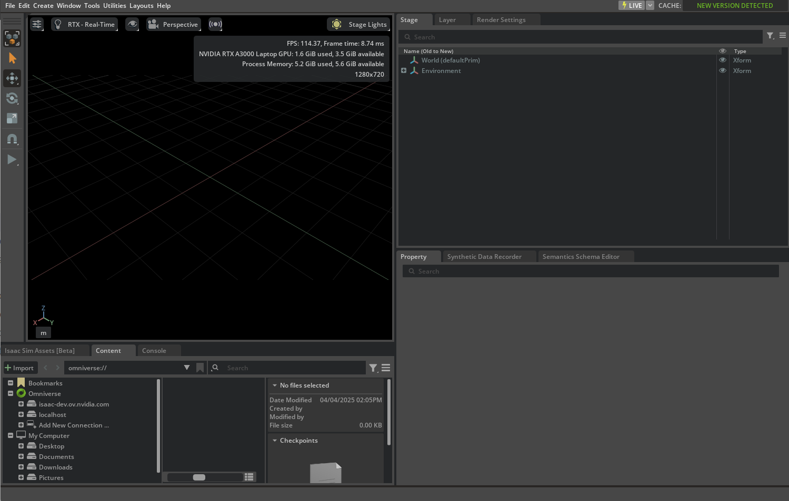
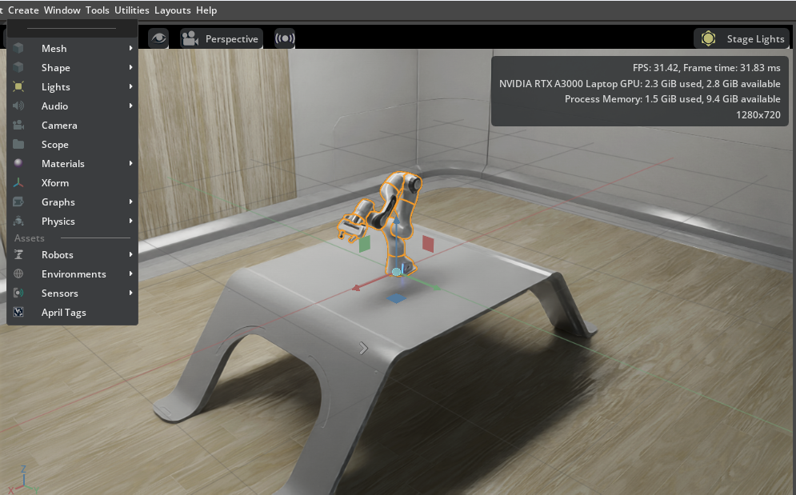

# Isaac Sim 설치하기
엔비디아에서 안내하는 Isaac Sim 설치 방법에는 여러가지가 있다.  
다만 사실 전부 알 필요도 없다는게 개인적인 생각이다. 왜냐하면 뭘로 설치하던 사실 Isaac Sim 자체의 기능 차이가 없는데,  
그러면 그냥 본인 선택과 기호 (로컬에 직접 설치할 것인가? 아니면 도커 컨테이너 등으로 설치해서 가상 환경 위에서 굴릴 것인가?)에 달려있기 때문이다.  
  
이번 튜토리얼에서는 엔비디아에서 가장 초보자에게 권장하는 설치법, **Quick Install**만 설명한다.  
다른 설치방법의 경우, 엔비디아에서 공식적으로 제공하는 [**설치 페이지**](https://docs.isaacsim.omniverse.nvidia.com/5.1.0/installation/index.html)를 참고한다.

## Quick Install
엔비디아에서 제공하는 Quick Install 관련 링크는 다음과 같이 제공된다: [Quick Install](https://docs.isaacsim.omniverse.nvidia.com/5.1.0/installation/quick-install.html)  
  
1. 해당 링크에서 제공하는 파일을 자신의 운영체제(윈도우 or 리눅스(x86 or aarch64))에 따라서 선택해 다운로드를 받는다.
2. 적절하게 본인이 원하는 경로에 저장한다.
3. 압축을 해제한다.
4. 압축을 해제한 경로로 들어가서, 다음 작업 중 하나를 수행한다.
   1. 윈도우의 경우 `isaac-sim.selector.bat` 파일을 더블클릭한다.
   2. 리눅스의 경우, CLI에서 `./post_install.sh` 파일을 실행한다. 이후 `./isaac-sim.selector.sh`도 연속으로 실행한다.
5. [Isaac Sim Selector](https://docs.isaacsim.omniverse.nvidia.com/5.1.0/gui/app_selector.html)에서 **Start** 버튼을 누른다.
6. 그러면 다음과 같은 화면을 확인할 수 있다.

7. **Create > Environment > Simple Room**을 선택하고, 거기서 다시 **Create > Robots > Franka Emika Panda Arm**을 선택한다.
