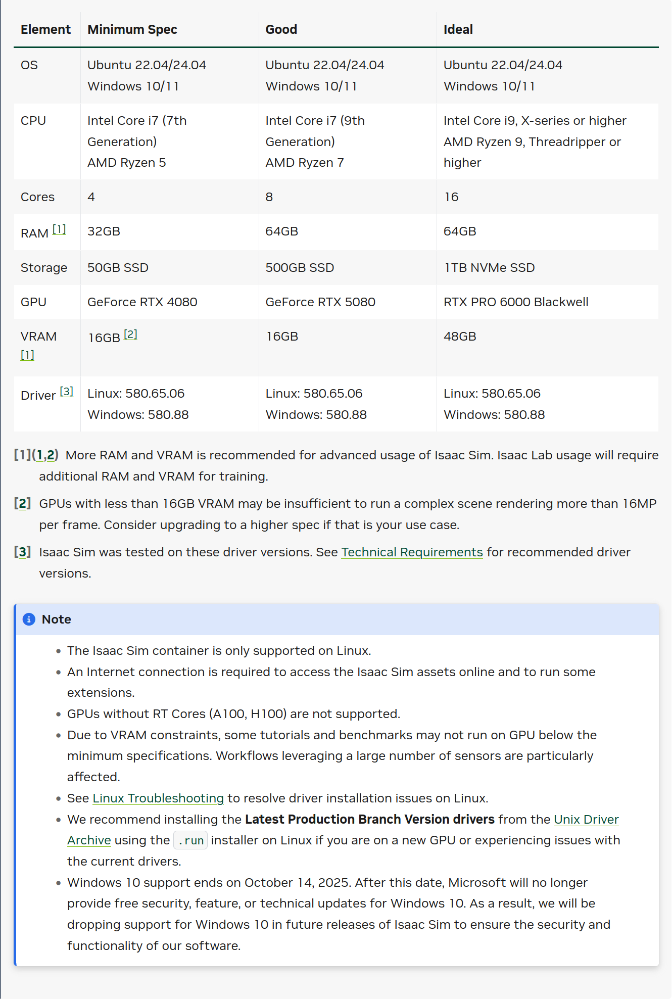

# Isaac Sim 이모저모
그냥 Isaac Sim의 사양, CLI 등에 대해서 이모저모 다루는 내용들.  

## Isaac Sim 사양
[이 링크](https://docs.isaacsim.omniverse.nvidia.com/5.1.0/installation/requirements.html)에서 확인할 수 있다.


## Isaac Sim 관련 여러 Setup Tips
[이 링크](https://docs.isaacsim.omniverse.nvidia.com/5.1.0/installation/install_faq.html)에서 자세하게 확인할 수 있다.  
대표적인 Tip들로는 다음과 같은 것들이 있다.  
  
***Isaac Sim을 실행하는 여러가지 스크립트***
| 파일 | 설명 |
|---|---|
| `isaac-sim.selector.sh` | Mini-app |
| `isaac-sim.sh` | Full-app |
| `python.sh` | Isaac Sim Python Executable |
| `setup_python.env.sh` | Isaac Sim Python 환경 setup |
| `setup_conda.env.sh` | Isaac Sim Conda 환경 setup |
  
***Isaac Sim common path***
| 경로 | 설명 |
| --- | --- |
| `~/isaacsim` | 리눅스에서 일반적인 Isaac Sim 경로 |
| `C:\isaacsim` | 윈도우에서 일반적인 isaac Sim 경로 |
| `/isaacsim` | 도커를 사용했을 때 일반적인 isaac sim 경로 |

***Multi-GPU Isaac Sim Support***
| CLI | 설명 |
| --- | ---- |
| `./isaac-sim.sh --/renderer/multiGpu/enabled=ture | Isaac Sim을 활용할 때 Multi-GPU 모드 활성화 |
이것 말고도 파이썬을 활용해서도 가능하다.  
```python3
import carb.settings
setttings = carb.settings.get_settings()  
  
# set different types into different keys  
# guildline : each extension puts settings in /etx/[ext name]/ and lists the extension.toml for discoverability
settings.set("/renderer/multiGpu/enabled", True)
```
  
그 외에 **Isaac Sim Local Asset Pack 다운로드, Workstation과 Docker의 차이, Cloud 실행** 등 다양한 주제에 대해서 많은 팁을 담고 있으니 한번은 훑어보는 것을 추천한다.