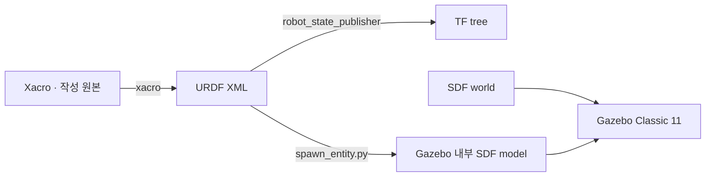

# URDF, Xacro, SDF를 한 번에 이해하기

URDF, Xacro, SDF는 서로 경쟁하는 형식이 아니라 서로 다른 역할로 규정된 형식이다. 이 튜토리얼에서는 **Xacro로 URDF를 생성하고**, ROS 2가 그 URDF로 TF를 구성하며, Gazebo Classic 11이 URDF를 내부 SDF 모델로 변환하여 world에 삽입한다. 조명·지면·물리 엔진과 같은 환경은 SDF world로 작성한다.



## 세 형식의 책임

| 형식 | 가장 잘하는 일 | 주의점 | 이 튜토리얼의 사용처 |
| --- | --- | --- | --- |
| URDF | 하나의 로봇을 link/joint 트리로 표현하고 ROS 도구와 연동한다 | 반복·조건문이 없고 닫힌 운동학 고리와 world 표현이 제한적이다 | `robot_description`, TF, RViz RobotModel |
| Xacro | URDF XML에 변수, 수식, 매크로, include, 조건을 추가한다 | 전개하기 전에는 완전한 URDF가 아니므로 모든 인자 조합을 검사해야 한다 | 바퀴·센서·관성 모델을 재사용 가능한 원본으로 관리한다 |
| SDF | world, physics, sensor, plugin, 여러 model을 풍부하게 표현한다 | `robot_state_publisher`가 직접 소비하는 기본 형식과 다르다 | `empty.world`, `sensor.world`, Gazebo 센서·플러그인 설정 |

다음 원칙을 적용하면 파일의 책임이 선명해진다.

- ROS가 알아야 하는 link, joint, 좌표 관계는 URDF에 둔다.
- 반복되는 형상과 센서 조립 규칙은 Xacro 매크로로 분리한다.
- Gazebo만 알아야 하는 마찰, 센서, model plugin은 URDF의 `<gazebo>` 확장에 둔다.
- 조명, 지면, 장애물, 물리 step과 같은 환경은 SDF world에 둔다.

## 1. 실제 URDF 코드 읽기

URDF의 최상위 요소는 `<robot>`이며, 그 아래에 물체인 `<link>`와 물체 사이 관계인 `<joint>`를 둔다. 다음 예제는 차체와 바퀴 하나를 가진 최소 모델이다. 그대로 `/tmp/minimal_robot.urdf`에 저장한 뒤 `check_urdf`로 검사할 수 있는 완전한 XML이다.

```xml
<?xml version="1.0"?>
<robot name="minimal_robot">
  <!-- 차체: 크기 0.40 × 0.30 × 0.10 m, 질량 4 kg -->
  <link name="base_link">
    <visual>
      <origin xyz="0 0 0" rpy="0 0 0"/>
      <geometry>
        <box size="0.40 0.30 0.10"/>
      </geometry>
      <material name="blue">
        <color rgba="0.12 0.35 0.80 1.0"/>
      </material>
    </visual>

    <collision>
      <origin xyz="0 0 0" rpy="0 0 0"/>
      <geometry>
        <box size="0.40 0.30 0.10"/>
      </geometry>
    </collision>

    <inertial>
      <origin xyz="0 0 0" rpy="0 0 0"/>
      <mass value="4.0"/>
      <inertia ixx="0.033333" ixy="0" ixz="0"
               iyy="0.056667" iyz="0" izz="0.083333"/>
    </inertial>
  </link>

  <!-- 바퀴: 반지름 0.08 m, 폭 0.04 m, 질량 0.5 kg -->
  <link name="left_wheel_link">
    <visual>
      <!-- URDF cylinder의 기본 대칭축 +z를 바퀴축 +y에 맞춘다. -->
      <origin xyz="0 0 0" rpy="1.570796 0 0"/>
      <geometry>
        <cylinder radius="0.08" length="0.04"/>
      </geometry>
      <material name="black">
        <color rgba="0.05 0.05 0.05 1.0"/>
      </material>
    </visual>
    <collision>
      <origin xyz="0 0 0" rpy="1.570796 0 0"/>
      <geometry>
        <cylinder radius="0.08" length="0.04"/>
      </geometry>
    </collision>
    <inertial>
      <origin xyz="0 0 0" rpy="1.570796 0 0"/>
      <mass value="0.5"/>
      <inertia ixx="0.000867" ixy="0" ixz="0"
               iyy="0.000867" iyz="0" izz="0.001600"/>
    </inertial>
  </link>

  <joint name="left_wheel_joint" type="continuous">
    <parent link="base_link"/>
    <child link="left_wheel_link"/>
    <origin xyz="0 0.17 -0.05" rpy="0 0 0"/>
    <axis xyz="0 1 0"/>
    <limit effort="20.0" velocity="30.0"/>
    <dynamics damping="0.05" friction="0.0"/>
  </joint>
</robot>
```

이 예제에서 눈여겨볼 부분은 다음과 같다.

- `<visual>`은 RViz와 Gazebo에 그리는 형상을 정의한다. `<material>`의 `rgba`는 빨강·초록·파랑·투명도를 0~1 범위로 표현한다.
- `<collision>`은 접촉 판정에 사용하는 형상을 정의한다. 복잡한 mesh 대신 box, cylinder, sphere를 조합하면 물리 계산이 빠르고 안정적이다.
- `<inertial>`은 질량중심, 질량, 관성 텐서를 정의한다. Gazebo에서 움직이는 모든 link에 물리적으로 타당한 관성을 두는 것을 원칙으로 한다.
- joint의 `<origin>`은 parent frame에서 본 joint/child 기준 위치와 자세이다. `xyz`의 단위는 m이고 `rpy`의 단위는 rad이다.
- `<axis>`는 joint frame에서 표현한 운동축이다. `0 1 0`은 바퀴가 로봇의 좌우축인 +y를 중심으로 회전한다는 의미이다.
- `<limit>`의 `effort`와 `velocity`는 최대 힘·토크와 최대 속도를 나타낸다. `continuous` joint에는 각도 상·하한이 없지만 이 두 값은 둘 수 있다.

파일을 검사하면 link 수와 root link, joint 연결 관계를 확인할 수 있다.

```bash
source /opt/ros/humble/setup.bash
check_urdf /tmp/minimal_robot.urdf
```

성공하면 `robot name is: minimal_robot`, `Successfully Parsed XML`과 link 트리가 출력된다. XML 문법 오류뿐 아니라 존재하지 않는 parent/child link와 트리 구조 오류도 이 단계에서 발견할 수 있다.

### 관성값 계산

질량이 \(m\), 변 길이가 \(x,y,z\)인 균일한 직육면체의 중심 관성은 다음과 같다.

\[
I_{xx}=\frac{m}{12}(y^2+z^2),\quad
I_{yy}=\frac{m}{12}(x^2+z^2),\quad
I_{zz}=\frac{m}{12}(x^2+y^2)
\]

질량이 \(m\), 반지름이 \(r\), 길이가 \(l\)이고 대칭축이 local +z인 균일한 원기둥의 중심 관성은 다음과 같다.

\[
I_{xx}=I_{yy}=\frac{m}{12}(3r^2+l^2),\quad
I_{zz}=\frac{mr^2}{2}
\]

위 최소 URDF의 숫자는 이 식으로 계산한 값이다. 실제 튜토리얼에서는 숫자를 반복해서 적지 않고 [`common.xacro`](https://github.com/kimhoyun-robotair/robotics-sim-tutorial-kr/blob/Humble/ros2_ws/src/gazebo_tutorial_description/urdf/common.xacro)의 `box_inertial`, `cylinder_inertial` 매크로로 계산한다.

!!! danger "관성에 0을 넣지 않는다"
    대각 원소가 0이거나 음수인 관성 텐서는 실제 강체가 될 수 없다. 경고만 피하려고 형상과 무관한 극단적으로 작은 값을 넣어도 수치 불안정이 생긴다. 실제 크기와 질량으로 계산한 값을 사용한다.

## 2. joint와 좌표계

joint type은 허용할 상대 운동에 따라 선택한다.

| type | 자유도 | 필수 또는 주요 요소 | 대표 사용처 |
| --- | --- | --- | --- |
| `fixed` | 0 | `parent`, `child`, `origin` | `base_footprint` → `base_link`, 센서 마운트 |
| `continuous` | 회전 1, 각도 제한 없음 | `axis`, `effort`, `velocity` | 구동 바퀴 |
| `revolute` | 회전 1, 각도 제한 있음 | `axis`, `lower`, `upper`, `effort`, `velocity` | Ackermann 조향축 |
| `prismatic` | 직선 1 | `axis`, `lower`, `upper`, `effort`, `velocity` | 리프트, 슬라이더 |

조향 joint는 다음처럼 회전 한계까지 명시한다.

```xml
<joint name="front_left_steering_joint" type="revolute">
  <parent link="base_link"/>
  <child link="front_left_steering_link"/>
  <origin xyz="0.28 0.22 0" rpy="0 0 0"/>
  <axis xyz="0 0 1"/>
  <limit lower="-0.55" upper="0.55" effort="30.0" velocity="2.0"/>
  <dynamics damping="0.2" friction="0.05"/>
</joint>
```

ROS 모바일 로봇은 [REP-103](https://www.ros.org/reps/rep-0103.html)의 오른손 좌표계를 따른다.

- +x는 전방이다.
- +y는 좌측이다.
- +z는 위쪽이다.
- 양의 yaw는 위에서 볼 때 반시계 방향이다.
- 길이는 m, 각도는 rad, 시간은 s를 사용한다.

따라서 `cmd_vel.linear.x > 0`이면 전진하고 `cmd_vel.angular.z > 0`이면 좌회전하도록 wheel axis와 플러그인의 left/right joint를 배치한다. 로봇이 뒤로 가거나 반대로 회전하면 teleop 부호를 바꾸기 전에 joint axis, 좌우 joint 이름, wheel 회전 방향을 먼저 확인한다.

## 3. Xacro를 활용한 반복 구조화

Xacro는 URDF XML에 변수와 함수 호출에 가까운 기능을 추가한다. 핵심 요소는 property, macro, include, macro 호출이다.

### property와 macro 정의

다음 코드는 [`common.xacro`](https://github.com/kimhoyun-robotair/robotics-sim-tutorial-kr/blob/Humble/ros2_ws/src/gazebo_tutorial_description/urdf/common.xacro)의 구성 방식을 축약한 예이다. 매크로 파일은 자체 로봇을 만들지 않고 재사용할 정의만 제공한다.

```xml
<?xml version="1.0"?>
<!-- urdf/common.xacro -->
<robot xmlns:xacro="http://www.ros.org/wiki/xacro">
  <xacro:property name="PI" value="3.141592653589793"/>

  <xacro:macro name="cylinder_inertial"
               params="mass radius length origin_rpy:='0 0 0'">
    <inertial>
      <origin xyz="0 0 0" rpy="${origin_rpy}"/>
      <mass value="${mass}"/>
      <inertia
        ixx="${mass * (3.0 * radius * radius + length * length) / 12.0}"
        ixy="0" ixz="0"
        iyy="${mass * (3.0 * radius * radius + length * length) / 12.0}"
        iyz="0"
        izz="${mass * radius * radius / 2.0}"/>
    </inertial>
  </xacro:macro>

  <xacro:macro name="simple_wheel"
               params="name parent xyz radius width mass">
    <link name="${name}_link">
      <visual>
        <origin xyz="0 0 0" rpy="${PI / 2.0} 0 0"/>
        <geometry>
          <cylinder radius="${radius}" length="${width}"/>
        </geometry>
      </visual>
      <collision>
        <origin xyz="0 0 0" rpy="${PI / 2.0} 0 0"/>
        <geometry>
          <cylinder radius="${radius}" length="${width}"/>
        </geometry>
      </collision>
      <xacro:cylinder_inertial
        mass="${mass}"
        radius="${radius}"
        length="${width}"
        origin_rpy="${PI / 2.0} 0 0"/>
    </link>

    <joint name="${name}_joint" type="continuous">
      <parent link="${parent}"/>
      <child link="${name}_link"/>
      <origin xyz="${xyz}" rpy="0 0 0"/>
      <axis xyz="0 1 0"/>
      <limit effort="20.0" velocity="30.0"/>
      <dynamics damping="0.05" friction="0.0"/>
    </joint>
  </xacro:macro>
</robot>
```

각 문법은 다음 책임을 가진다.

- `<xacro:property>`는 파일 범위에서 재사용할 값을 선언한다. `PI`, wheel radius, track width처럼 여러 계산에서 공유하는 값에 주로 사용한다.
- `<xacro:macro>`는 반복할 XML 구조와 입력 parameter를 선언한다. 위 `simple_wheel`은 link와 joint를 항상 한 쌍으로 생성한다.
- `params`는 공백으로 구분한 매크로 parameter 목록이다. `origin_rpy:='0 0 0'`처럼 기본값도 지정할 수 있다.
- `${...}`는 수식 평가 구문이다. 사칙연산과 전달받은 parameter를 사용하여 최종 XML 속성값을 만든다.

### include와 macro 호출

main Xacro에서는 매크로 파일을 include한 뒤 좌우 바퀴에 서로 다른 값을 전달한다. 다음 코드는 [`diffbot.urdf.xacro`](https://github.com/kimhoyun-robotair/robotics-sim-tutorial-kr/blob/Humble/ros2_ws/src/gazebo_tutorial_description/urdf/diffbot.urdf.xacro)에서 실제로 사용하는 패턴이다.

```xml
<?xml version="1.0"?>
<!-- urdf/diffbot.urdf.xacro -->
<robot name="diffbot" xmlns:xacro="http://www.ros.org/wiki/xacro">
  <xacro:include
    filename="$(find gazebo_tutorial_description)/urdf/common.xacro"/>

  <xacro:property name="wheel_radius" value="0.09"/>
  <xacro:property name="wheel_width" value="0.04"/>
  <xacro:property name="wheel_mass" value="0.55"/>
  <xacro:property name="wheel_separation" value="0.36"/>
  <xacro:property name="wheel_x" value="0.075"/>
  <xacro:property name="wheel_z" value="-0.03"/>

  <!-- 이 앞에 base_link 정의를 둔다. -->

  <xacro:simple_wheel
    name="left_wheel"
    parent="base_link"
    xyz="${wheel_x} ${wheel_separation / 2.0} ${wheel_z}"
    radius="${wheel_radius}"
    width="${wheel_width}"
    mass="${wheel_mass}"/>

  <xacro:simple_wheel
    name="right_wheel"
    parent="base_link"
    xyz="${wheel_x} ${-wheel_separation / 2.0} ${wheel_z}"
    radius="${wheel_radius}"
    width="${wheel_width}"
    mass="${wheel_mass}"/>
</robot>
```

`$(find gazebo_tutorial_description)`은 설치된 package share 경로를 찾는다. 따라서 다른 package에서 include하더라도 현재 작업 디렉터리에 의존하지 않는다. `left_wheel`과 `right_wheel` 호출은 같은 구조를 재사용하고 y 위치의 부호만 다르게 계산한다. 바퀴 반지름을 바꾸면 geometry, 관성, 위치 계산과 drive plugin 값을 같은 property에서 파생하도록 구성하는 편이 좋다.

!!! note "코드 조각과 실제 파일의 차이"
    위 main 코드는 include와 호출 관계를 강조하려고 `base_link` 본문을 생략한 조각이다. 실행 가능한 전체 모델은 [`diffbot.urdf.xacro`](https://github.com/kimhoyun-robotair/robotics-sim-tutorial-kr/blob/Humble/ros2_ws/src/gazebo_tutorial_description/urdf/diffbot.urdf.xacro)에 있고, 실제 공통 매크로는 [`common.xacro`](https://github.com/kimhoyun-robotair/robotics-sim-tutorial-kr/blob/Humble/ros2_ws/src/gazebo_tutorial_description/urdf/common.xacro)에 있다.

### arg와 조건을 활용한 변형 선택

launch에서 선택할 기능에는 property보다 `<xacro:arg>`가 적합하다. 다음 패턴은 같은 로봇 본체에 센서 묶음을 선택적으로 조립할 때 사용할 수 있다.

```xml
<robot name="configurable_robot" xmlns:xacro="http://www.ros.org/wiki/xacro">
  <xacro:arg name="use_camera" default="true"/>
  <xacro:arg name="camera_name" default="front_camera"/>

  <xacro:include
    filename="$(find my_robot_description)/urdf/sensors/camera.xacro"/>

  <!-- base_link 정의를 이 위치보다 앞에 둔다. -->
  <xacro:if value="$(arg use_camera)">
    <xacro:mono_camera
      name="$(arg camera_name)"
      parent="base_link"
      xyz="0.20 0 0.12"
      rpy="0 0 0"/>
  </xacro:if>
</robot>
```

명령행에서 arg를 덮어쓰면 다른 URDF를 생성할 수 있다.

```bash
xacro configurable_robot.urdf.xacro use_camera:=false \
  > /tmp/robot_without_camera.urdf
```

각 URDF 파일에서 모든 부분을 재작성하고, 중첩해서 작성하게 되면 어떤 profile 파일에서 어떤 link와 어떤 plugin을 만들고 사용하는지에 대해서 파악하기가 어렵다. 이에 따라서 재사용/재활용이 가능한 부분은 macro와 main URDF 파일로 분리하고, property와 arg를 활용해서 CLI에서 쉽게 만들거나, 재활용 하는 것이 관리하기에 유리하다.

### Xacro 생성 결과 검사

Xacro 원본이 XML parser를 통과해도 매크로 호출 뒤에 중복 이름이나 잘못된 parent가 생길 수 있다. Gazebo를 띄우기 전에 완전한 URDF를 만들고 검사한다.

```bash
source /opt/ros/humble/setup.bash
cd ~/robotics-sim-tutorial-kr/ros2_ws
source install/setup.bash

xacro \
  src/gazebo_tutorial_description/urdf/diffbot.urdf.xacro \
  > /tmp/diffbot.urdf

check_urdf /tmp/diffbot.urdf
```

`xacro`는 `${...}`, include, macro 호출을 모두 해석하여 표준 URDF만 출력한다. `check_urdf`는 그 결과의 XML과 link/joint 트리를 검사한다. 실제 저장소의 전체 모델을 검사하는 명령이므로 쉽게 결과를 확인할 수 있다는 장점이 있다.

## 4. URDF의 Gazebo Classic 확장

표준 URDF만으로는 ODE 접촉 물성, Gazebo material, sensor, Gazebo plugin을 충분히 표현할 수 없다. Gazebo Classic은 이를 위해 `<gazebo>` 확장 블록을 읽는다.

### 특정 link의 접촉 물성 추가

`reference`가 있는 블록은 이미 정의한 link 또는 joint에 Gazebo 전용 속성을 추가한다. 다음 코드는 바퀴 link의 마찰과 접촉 solver parameter를 설정한다.

```xml
<gazebo reference="left_wheel_link">
  <material>Gazebo/Black</material>
  <mu1>1.2</mu1>
  <mu2>1.2</mu2>
  <kp>1000000.0</kp>
  <kd>10.0</kd>
  <minDepth>0.001</minDepth>
  <maxVel>0.1</maxVel>
</gazebo>
```

| parameter | 의미 | 조정할 때의 관찰점 |
| --- | --- | --- |
| `material` | Gazebo Classic 렌더링 material이다 | RViz의 URDF material과 별개이다 |
| `mu1`, `mu2` | ODE 접촉면의 두 마찰 방향 계수이다 | 너무 낮으면 헛돌고 너무 높으면 급격한 접촉력이 생길 수 있다 |
| `kp` | 접촉을 스프링처럼 처리할 때의 강성이다 | 너무 낮으면 바닥에 깊이 잠기며 너무 높으면 떨림이 생길 수 있다 |
| `kd` | 접촉 감쇠이다 | `kp`와 함께 튜닝하며 반발과 떨림을 줄인다 |
| `minDepth` | solver가 유지하려는 최소 접촉 깊이이다 | 작은 penetration을 안정적으로 유지하는 데 사용한다 |
| `maxVel` | 접촉 오차 보정 속도의 상한이다 | 큰 값은 튀는 현상을 키울 수 있다 |

이 저장소는 같은 구성을 [`common.xacro`](https://github.com/kimhoyun-robotair/robotics-sim-tutorial-kr/blob/Humble/ros2_ws/src/gazebo_tutorial_description/urdf/common.xacro)의 `gazebo_contact`와 `simple_wheel` 매크로에 넣어 모든 바퀴에 일관되게 적용한다.

### 모델 전체에 drive plugin 추가

`reference`가 없는 `<gazebo>` 블록은 로봇 모델 전체에 적용할 model plugin을 두는 데 사용한다. 다음 코드는 [`diffbot.urdf.xacro`](https://github.com/kimhoyun-robotair/robotics-sim-tutorial-kr/blob/Humble/ros2_ws/src/gazebo_tutorial_description/urdf/diffbot.urdf.xacro)의 Differential Drive 설정을 축약한 코드이다.

```xml
<gazebo>
  <plugin name="diffbot_diff_drive" filename="libgazebo_ros_diff_drive.so">
    <ros>
      <namespace>/</namespace>
      <remapping>cmd_vel:=cmd_vel</remapping>
      <remapping>odom:=odom</remapping>
    </ros>
    <update_rate>50.0</update_rate>

    <left_joint>left_wheel_joint</left_joint>
    <right_joint>right_wheel_joint</right_joint>
    <wheel_separation>${wheel_separation}</wheel_separation>
    <wheel_diameter>${2.0 * wheel_radius}</wheel_diameter>

    <max_wheel_torque>20.0</max_wheel_torque>
    <max_wheel_acceleration>5.0</max_wheel_acceleration>
    <odometry_source>0</odometry_source>
    <odometry_frame>odom</odometry_frame>
    <robot_base_frame>base_footprint</robot_base_frame>
    <publish_odom>true</publish_odom>
    <publish_odom_tf>true</publish_odom_tf>
    <publish_wheel_tf>false</publish_wheel_tf>
  </plugin>
</gazebo>
```

| parameter | 역할 |
| --- | --- |
| `left_joint`, `right_joint` | plugin이 속도를 적용할 wheel joint 이름이다. URDF 이름과 한 글자까지 같아야 한다 |
| `wheel_separation` | 좌우 바퀴 접촉 중심 사이 거리이다. 단위는 m이다 |
| `wheel_diameter` | 구동 바퀴 지름이다. 단위는 m이며 geometry 반지름의 두 배와 일치해야 한다 |
| `update_rate` | plugin update 주파수이다. 단위는 Hz이다 |
| `max_wheel_torque` | wheel joint에 적용할 최대 토크이다 |
| `max_wheel_acceleration` | wheel 속도 변화율 상한이다 |
| `odometry_source` | `0`은 wheel encoder 적분, `1`은 Gazebo world pose를 사용한다. 이 튜토리얼은 wheel odom 확인을 위해 `0`을 사용한다 |
| `odometry_frame` | `nav_msgs/Odometry.header.frame_id`와 odom TF의 parent frame이다 |
| `robot_base_frame` | odom TF의 child frame이다 |
| `publish_odom`, `publish_odom_tf` | odometry message와 TF 발행 여부이다 |
| `publish_wheel_tf` | plugin의 wheel TF 발행 여부이다. `robot_state_publisher`와 중복되지 않도록 `false`로 둔다 |

`filename`은 ROS 2 Humble과 Gazebo Classic 11의 `libgazebo_ros_diff_drive.so`를 사용한다. 만약에 헷갈려서 Gazebo Harmonic의 system plugin 이름과 설정 구조를 가져오게 되면 작동하지 않는다.

fixed joint가 Gazebo의 URDF→SDF 변환 과정에서 parent link로 통합하지 않게 하고 싶다면면 해당 joint에 다음 확장을 둘 수 있다.

```xml
<gazebo reference="camera_mount_joint">
  <preserveFixedJoint>true</preserveFixedJoint>
</gazebo>
```

이 옵션의 사용 여부는 TF 요구와 sensor plugin의 frame 설정을 함께 고려하여 결정해야한다. 단순 장식 link까지 모두 보존하면 시뮬레이션 모델이 불필요하게 복잡해질 수 있다.

## 5. SDF world와 Gazebo 실행 조건

SDF는 `<world>` 안에 physics, plugin, light, model을 함께 둘 수 있다. 다음 예제는 ODE 물리 설정, Gazebo ROS 초기화 plugin, 지면과 정적 장애물을 포함한 완전한 SDF world이다. 파일로 저장하면 `gz sdf -k`로 검사할 수 있다.

```xml
<?xml version="1.0"?>
<sdf version="1.6">
  <world name="tutorial_world">
    <physics name="ode_physics" type="ode">
      <max_step_size>0.001</max_step_size>
      <real_time_update_rate>1000</real_time_update_rate>
      <real_time_factor>1.0</real_time_factor>
    </physics>

    <!-- Gazebo Classic server를 ROS 2 node와 factory service에 연결한다. -->
    <plugin name="gazebo_ros_init" filename="libgazebo_ros_init.so"/>
    <plugin name="gazebo_ros_factory" filename="libgazebo_ros_factory.so"/>

    <include>
      <uri>model://sun</uri>
    </include>
    <include>
      <uri>model://ground_plane</uri>
    </include>

    <model name="tutorial_obstacle">
      <static>true</static>
      <pose>1.5 0 0.25 0 0 0</pose>
      <link name="box_link">
        <collision name="box_collision">
          <geometry>
            <box>
              <size>0.5 0.5 0.5</size>
            </box>
          </geometry>
        </collision>
        <visual name="box_visual">
          <geometry>
            <box>
              <size>0.5 0.5 0.5</size>
            </box>
          </geometry>
          <material>
            <ambient>0.8 0.2 0.1 1</ambient>
            <diffuse>0.8 0.2 0.1 1</diffuse>
          </material>
        </visual>
      </link>
    </model>
  </world>
</sdf>
```

SDF의 pose는 `x y z roll pitch yaw` 순서이고 단위는 m와 rad이다. `tutorial_obstacle`의 중심을 z=0.25 m에 두었으므로 높이 0.5 m인 box의 바닥이 지면에 닿는다.

| 요소 | 역할 |
| --- | --- |
| `max_step_size` | 물리 적분 한 step의 simulation time이다 |
| `real_time_update_rate` | 초당 목표 physics update 횟수이다 |
| `real_time_factor` | simulation time과 wall time의 목표 비율이다 |
| `libgazebo_ros_init.so` | ROS context와 `/clock` 발행 기반을 준비한다 |
| `libgazebo_ros_factory.so` | `spawn_entity.py`가 사용하는 spawn/delete service를 제공한다 |
| `<include><uri>model://...` | Gazebo model path에서 기존 모델을 불러온다 |
| `<static>true</static>` | 중력과 충돌력으로 움직이지 않는 환경 모델로 만든다 |

`max_step_size × real_time_update_rate`는 이론적인 최대 real-time factor와 관계가 있다. 위 설정은 0.001 s를 초당 1000번 적분하므로 목표 1.0과 맞는다. 센서와 복잡한 충돌 형상이 많아 계산량이 커지면 실제 `/gazebo/performance_metrics` 또는 GUI의 real-time factor는 목표보다 낮아질 수 있다.

이 저장소의 실제 world는 [`empty.world`](https://github.com/kimhoyun-robotair/robotics-sim-tutorial-kr/blob/Humble/ros2_ws/src/gazebo_tutorial_bringup/worlds/empty.world)와 [`sensor.world`](https://github.com/kimhoyun-robotair/robotics-sim-tutorial-kr/blob/Humble/ros2_ws/src/gazebo_tutorial_bringup/worlds/sensor.world)에서 확인할 수 있다. [`simulation.launch.py`](https://github.com/kimhoyun-robotair/robotics-sim-tutorial-kr/blob/Humble/ros2_ws/src/gazebo_tutorial_bringup/launch/simulation.launch.py)는 공식 `gazebo_ros/gazebo.launch.py`를 include하여 server를 실행한다. launch가 같은 ROS system plugin을 명령행으로 로드하는 구성에서는 world에 중복 선언하지 않는다.

SDF 문법은 Gazebo Classic에 포함된 도구로 검사한다.

```bash
gz sdf -k \
  ~/robotics-sim-tutorial-kr/ros2_ws/src/gazebo_tutorial_bringup/worlds/sensor.world
```

여기서 `gz sdf`는 Gazebo Classic의 SDF 검사·변환 명령이다. `gz sim`은 Gazebo Harmonic 계열 실행 명령이므로 이 튜토리얼에서 사용하지 않는다.

## 6. URDF에서 SDF로 변환한 결과 확인

Gazebo가 내부적으로 어떻게 xacro 및 URDF 파일을 처리하고 있는지 직접 출력하면 fixed joint 병합, `<gazebo>` 확장 반영, plugin parameter 이름 문제를 찾기 쉽다.

```bash
source /opt/ros/humble/setup.bash
cd ~/robotics-sim-tutorial-kr/ros2_ws
source install/setup.bash

# 1) Xacro를 표준 URDF로 전개한다.
xacro \
  src/gazebo_tutorial_description/urdf/diffbot.urdf.xacro \
  > /tmp/diffbot.urdf

# 2) ROS 관점의 link/joint 트리를 검사한다.
check_urdf /tmp/diffbot.urdf

# 3) Gazebo Classic의 URDF parser로 SDF를 출력한다.
gz sdf -p /tmp/diffbot.urdf > /tmp/diffbot.sdf

# 4) 출력된 SDF 자체도 검사한다.
gz sdf -k /tmp/diffbot.sdf

# 5) 변환 뒤 남은 link, joint, plugin 이름을 확인한다.
grep -En '<(link|joint|plugin) ' /tmp/diffbot.sdf
```

`gz sdf -p` 결과에서는 다음 항목을 확인한다.

- `left_wheel_joint`와 `right_wheel_joint`가 남아 있는지 확인한다.
- `libgazebo_ros_diff_drive.so` plugin과 wheel geometry 값이 들어갔는지 확인한다.
- 보존하지 않은 fixed joint의 child link가 parent로 합쳐졌는지 확인한다.
- sensor의 pose와 frame 이름이 의도한 link 기준으로 변환되었는지 확인한다.
- 변환 경고가 나오면 출력 파일만 보지 말고 터미널의 경고도 함께 확인한다.

URDF는 트리 기반 표현이고 SDF는 더 풍부한 모델 표현이므로 변환 결과가 원본 XML과 한 줄씩 같지는 않다. 중요한 기준은 ROS의 TF 구조와 Gazebo 내부 물리·plugin 참조가 각각 의도대로 유지되는가이다.

## 7. spawn 과정의 데이터 흐름

통합 launch에서는 다음 순서로 데이터가 흐른다.

1. launch가 Xacro 파일과 argument를 읽어 완전한 URDF 문자열을 만든다.
2. `robot_state_publisher`가 문자열을 `robot_description` parameter로 받는다.
3. `spawn_entity.py -topic robot_description`이 같은 XML을 Gazebo factory service로 보낸다.
4. Gazebo가 URDF를 내부 SDF model로 변환하고 `<gazebo>` sensor와 plugin을 로드한다.
5. fixed joint는 `/tf_static`에 나타나고, 움직이는 joint는 `/joint_states`와 `robot_state_publisher`를 거쳐 `/tf`에 나타난다.
6. drive plugin이 `/cmd_vel`을 받아 wheel joint에 힘과 속도를 적용하고 `/odom`과 `odom→base_footprint`를 발행한다.

Gazebo에는 모델이 있는데 RViz RobotModel이 비어 있다면 spawn 자체보다 `robot_description` 또는 TF를 먼저 확인한다. 반대로 RViz 모델은 정상인데 Gazebo에서 바퀴가 빠지거나 떨린다면 collision, inertial, joint, contact parameter, plugin을 확인한다.

## 8. 작성 직후 확인할 항목

- 모든 움직이는 link에 고유하고 타당한 관성을 넣었는지 확인한다.
- visual과 collision의 위치와 크기가 의도대로 일치하는지 확인한다.
- parent→child `origin`과 joint `axis`가 REP-103 관례에 맞는지 확인한다.
- 구동 wheel은 `continuous`, steering은 limit가 있는 `revolute`인지 확인한다.
- 바퀴가 지면에 닿고 chassis collision은 지면보다 충분히 높은지 확인한다.
- left/right joint 이름이 drive plugin 설정과 한 글자까지 같은지 확인한다.
- wheel radius와 separation이 geometry와 plugin에서 같은 property로 파생되는지 확인한다.
- 재사용 요소가 별도 Xacro macro에 있고 main 파일은 include와 조립을 담당하는지 확인한다.
- 지원하는 모든 Xacro profile을 전개하고 `check_urdf`로 검사했는지 확인한다.
- `gz sdf -p`와 `gz sdf -k`로 Gazebo가 실제로 읽을 구조까지 확인했는지 확인한다.
