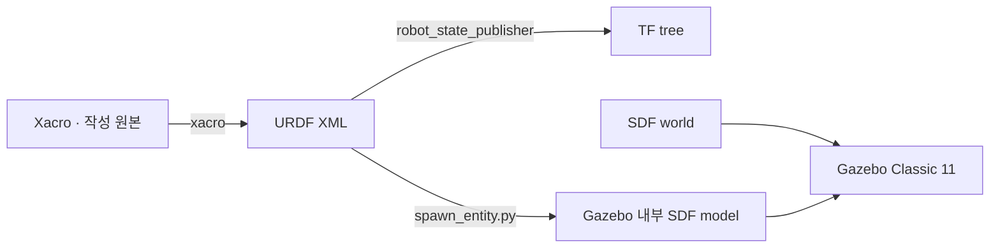

# URDF, Xacro, SDF를 한 번에 이해하기

세 형식은 경쟁 관계가 아니라 서로 다른 문제를 맡습니다. 이 저장소에서는 **Xacro로 URDF를 생성하고**, ROS 2가 그 URDF로 TF를 구성하며, Gazebo Classic이 URDF를 내부 SDF 모델로 변환해 world에 삽입합니다. world 자체는 SDF로 작성합니다.



## 역할 비교

| 형식 | 가장 잘하는 일 | 약점 | 이 과정의 사용처 |
| --- | --- | --- | --- |
| URDF | 하나의 로봇을 link/joint tree로 표현, ROS TF와 도구 연동 | 반복·조건문이 없고, 닫힌 운동학 고리와 world 표현이 제한적 | `robot_description`, TF, RViz RobotModel |
| Xacro | URDF XML에 변수, 수식, 매크로, include, 조건을 추가 | 실행 전에는 완전한 URDF가 아니며 오타가 늦게 드러날 수 있음 | 여러 바퀴·센서 모델의 재사용 가능한 원본 |
| SDF | world, physics, sensor, plugin, 여러 model과 더 풍부한 구조 표현 | ROS의 `robot_state_publisher`가 직접 사용하는 기본 형식이 아님 | `empty.world`, `sensor.world`, Gazebo 센서·플러그인 설정 |

핵심 원칙은 **ROS가 알아야 하는 기구학은 URDF에**, **Gazebo만 알아야 하는 물리·센서·플러그인 세부는 `<gazebo>` 확장 태그에**, **환경은 SDF world에** 두는 것입니다.

## 1. URDF의 `link`: 물체 하나의 세 가지 모습

한 link에는 적어도 시각 형상, 충돌 형상, 관성이 필요합니다.

```xml
<link name="base_link">
  <visual>
    <origin xyz="0 0 0" rpy="0 0 0"/>
    <geometry><box size="0.45 0.30 0.12"/></geometry>
    <material name="blue"><color rgba="0.12 0.35 0.80 1"/></material>
  </visual>

  <collision>
    <origin xyz="0 0 0" rpy="0 0 0"/>
    <geometry><box size="0.45 0.30 0.12"/></geometry>
  </collision>

  <inertial>
    <origin xyz="0 0 0" rpy="0 0 0"/>
    <mass value="5.0"/>
    <inertia ixx="0.0435" ixy="0" ixz="0"
             iyy="0.0904" iyz="0" izz="0.1219"/>
  </inertial>
</link>
```

- `visual`은 RViz/Gazebo에 그려지는 모양입니다.
- `collision`은 접촉 판정에 쓰입니다. 복잡한 mesh 대신 단순한 box/cylinder 조합을 쓰면 시뮬레이션이 안정적이고 빠릅니다.
- `inertial`은 질량, 질량중심, 관성 텐서입니다. 값이 없거나 물리적으로 불가능하면 로봇이 떨거나 날아가거나 바닥을 뚫을 수 있습니다.

질량 (m), 변 길이 (x,y,z)인 균일한 직육면체의 중심 관성은 다음과 같습니다.

\[
I_{xx}=\frac{m}{12}(y^2+z^2),\quad
I_{yy}=\frac{m}{12}(x^2+z^2),\quad
I_{zz}=\frac{m}{12}(x^2+y^2)
\]

이 저장소의 `common.xacro`는 이런 계산을 매크로로 묶습니다. 숫자를 복사해 붙이는 대신 형상과 질량으로부터 일관된 관성을 생성합니다.

!!! danger "관성에 0을 넣지 마세요"
    대각 원소가 0이거나 음수인 관성 텐서는 실제 강체가 될 수 없습니다. “경고를 없애기 위한 아주 작은 값”도 수치적으로 불안정할 수 있습니다. 실제 크기와 질량에서 계산하세요.

## 2. URDF의 `joint`: link 사이의 좌표 관계와 운동

```xml
<joint name="left_wheel_joint" type="continuous">
  <parent link="base_link"/>
  <child link="left_wheel_link"/>
  <origin xyz="0 0.18 -0.06" rpy="-1.5708 0 0"/>
  <axis xyz="0 0 1"/>
  <dynamics damping="0.05" friction="0.02"/>
</joint>
```

`origin`은 **parent frame에서 본 child joint frame의 pose**입니다. `xyz`의 단위는 m, `rpy`의 단위는 rad이며 회전 순서는 fixed-axis roll→pitch→yaw입니다. `axis`는 joint frame에서 표현합니다. 위 예처럼 cylinder를 먼저 돌려 놓았다면, 눈에 보이는 바퀴 축과 joint axis가 실제로 일치하는지 RViz의 Axes와 Gazebo의 joint 시각화로 확인해야 합니다.

주요 joint type은 다음과 같습니다.

| type | 자유도 | 예시 |
| --- | --- | --- |
| `fixed` | 0 | `base_footprint` → `base_link`, 센서 마운트 |
| `continuous` | 회전 1, 각도 제한 없음 | 구동 바퀴 |
| `revolute` | 회전 1, 상·하한 필요 | Ackermann steering |
| `prismatic` | 직선 1, 상·하한 필요 | 리프트, 슬라이더 |

`revolute`에는 반드시 `<limit lower="..." upper="..." effort="..." velocity="..."/>`를 둡니다. `effort`와 `velocity`는 시뮬레이터/제어기가 적용할 수 있는 물리 한계입니다.

## 3. REP-103 좌표 관례

ROS 모바일 로봇은 [REP-103](https://www.ros.org/reps/rep-0103.html)의 right-handed 좌표계를 따릅니다.

- (+x): 전방
- (+y): 좌측
- (+z): 위쪽
- 양의 yaw: 위에서 볼 때 반시계 방향
- 길이: m, 각도: rad, 시간: s

`cmd_vel.linear.x > 0`이면 전진하고 `cmd_vel.angular.z > 0`이면 좌회전하도록 모델의 wheel axis와 플러그인 left/right joint를 배치합니다. 로봇이 뒤로 가거나 반대로 회전하면 teleop을 고치기 전에 joint axis, 좌우 joint 이름, wheel 회전 방향부터 확인하세요.

## 4. Xacro: 반복을 구조로 바꾸기

Xacro 파일도 XML이지만 네임스페이스와 매크로를 사용합니다.

```xml
<?xml version="1.0"?>
<robot xmlns:xacro="http://www.ros.org/wiki/xacro" name="example">
  <xacro:property name="wheel_radius" value="0.09"/>

  <xacro:macro name="wheel" params="name y">
    <link name="${name}_link">
      <visual>
        <origin xyz="0 0 0" rpy="${pi/2} 0 0"/>
        <geometry>
          <cylinder radius="${wheel_radius}" length="0.04"/>
        </geometry>
      </visual>
      <collision>
        <origin xyz="0 0 0" rpy="${pi/2} 0 0"/>
        <geometry>
          <cylinder radius="${wheel_radius}" length="0.04"/>
        </geometry>
      </collision>
    </link>
    <joint name="${name}_joint" type="continuous">
      <parent link="base_link"/>
      <child link="${name}_link"/>
      <origin xyz="0 ${y} 0" rpy="0 0 0"/>
      <axis xyz="0 1 0"/>
    </joint>
  </xacro:macro>

  <xacro:wheel name="left_wheel" y="0.18"/>
  <xacro:wheel name="right_wheel" y="-0.18"/>
</robot>
```

좌·우 wheel joint 축은 모두 로봇 기준 `+y`다. 원통 geometry만 `visual`/`collision`에서
90° 돌려 원통의 대칭축을 바퀴 축과 맞춘다. 완성 모델에서는 앞 절처럼 각 wheel
link에 질량과 원통 관성도 반드시 추가해야 한다.

실제 저장소에서는 다음 기능을 사용합니다.

- `<xacro:property>`: wheel radius, track width처럼 여러 곳에서 공유할 값
- `<xacro:macro>`: wheel, camera link처럼 반복되는 link/joint 묶음
- `<xacro:include>`: 공통 관성·형상 매크로를 별도 파일에서 불러오기
- `<xacro:arg>`와 `$(arg ...)`: launch에서 robot variant나 sensor profile 선택
- `<xacro:if>` / `<xacro:unless>`: 카메라 또는 LiDAR 묶음을 선택적으로 포함

Xacro를 수정한 직후에는 Gazebo를 띄우기 전에 완전한 URDF로 전개해 봅니다.

```bash
source /opt/ros/humble/setup.bash
source ~/gazebo-sim-tutorial-kr/ros2_ws/install/setup.bash

xacro \
  $(ros2 pkg prefix --share gazebo_tutorial_description)/urdf/diffbot.urdf.xacro \
  > /tmp/diffbot.urdf

check_urdf /tmp/diffbot.urdf
```

Xacro는 텍스트 전처리기이므로 “원본 XML이 파싱된다”만으로는 부족합니다. 모든 주요 arg 조합을 전개한 뒤 `check_urdf`까지 통과해야 합니다.

## 5. URDF 안의 Gazebo 확장

표준 URDF에는 마찰, Gazebo material, 센서와 Gazebo plugin을 충분히 표현할 방법이 없습니다. 그래서 `<gazebo>` 확장을 함께 둡니다.

```xml
<gazebo reference="left_wheel_link">
  <mu1>1.0</mu1>
  <mu2>1.0</mu2>
  <kp>1000000.0</kp>
  <kd>10.0</kd>
  <material>Gazebo/Black</material>
</gazebo>

<gazebo>
  <plugin name="diff_drive" filename="libgazebo_ros_diff_drive.so">
    <ros>
      <remapping>cmd_vel:=cmd_vel</remapping>
      <remapping>odom:=odom</remapping>
    </ros>
    <left_joint>left_wheel_joint</left_joint>
    <right_joint>right_wheel_joint</right_joint>
    <wheel_separation>0.36</wheel_separation>
    <wheel_diameter>0.18</wheel_diameter>
    <odometry_frame>odom</odometry_frame>
    <robot_base_frame>base_footprint</robot_base_frame>
    <publish_odom>true</publish_odom>
    <publish_odom_tf>true</publish_odom_tf>
  </plugin>
</gazebo>
```

`reference`가 있으면 특정 link 또는 joint의 물성을 보완합니다. `reference`가 없는 블록은 모델 전체 plugin을 넣는 데 주로 사용합니다. 플러그인 파일명은 Gazebo Classic용 `.so`여야 하며, 새 Gazebo system plugin 이름과 호환되지 않습니다.

## 6. SDF: world와 시뮬레이션 조건

SDF는 하나의 model뿐 아니라 world 전체를 표현합니다. 이 저장소의 world는 지면, 조명, physics step과 센서 확인용 장애물을 명시합니다. 아래의 ROS 초기화 플러그인은 world에 직접 넣을 때의 구성 예이며, 이 저장소의 launch는 같은 기능을 `gazebo_ros/gazebo.launch.py`에서 명령행 옵션으로 로드합니다.

```xml
<?xml version="1.0"?>
<sdf version="1.6">
  <world name="tutorial_world">
    <physics name="ode" type="ode">
      <max_step_size>0.001</max_step_size>
      <real_time_update_rate>1000</real_time_update_rate>
    </physics>

    <plugin name="gazebo_ros_init" filename="libgazebo_ros_init.so"/>
    <plugin name="gazebo_ros_factory" filename="libgazebo_ros_factory.so"/>

    <include><uri>model://sun</uri></include>
    <include><uri>model://ground_plane</uri></include>
  </world>
</sdf>
```

- `max_step_size`는 물리 적분 한 step의 simulation time입니다.
- `real_time_update_rate × max_step_size`가 목표 real-time factor를 결정합니다. 위 값은 이상적으로 1.0입니다.
- `libgazebo_ros_init.so`는 ROS context와 `/clock`을 준비합니다.
- `libgazebo_ros_factory.so`는 `spawn_entity.py`가 사용하는 spawn/delete 서비스를 제공합니다.

launch가 공식 `gazebo_ros/gazebo.launch.py`를 include하면 이 ROS system plugin들이 명령행으로 로드되기도 합니다. 같은 기능을 world와 명령행 양쪽에서 중복 로드하지 않는 것이 좋습니다.

SDF 자체를 검사할 때는 Gazebo Classic에 포함된 도구를 사용합니다.

```bash
gz sdf -k \
  ~/gazebo-sim-tutorial-kr/ros2_ws/src/gazebo_tutorial_bringup/worlds/sensor.world
```

여기서 `gz sdf`는 Gazebo Classic의 SDF 도구입니다. `gz sim`을 실행하라는 뜻이 아닙니다.

## 7. spawn될 때 실제로 일어나는 일

통합 launch의 데이터 흐름은 다음 순서입니다.

1. launch가 Xacro 파일과 arg를 읽어 완전한 URDF 문자열을 만듭니다.
2. `robot_state_publisher`가 그 문자열을 `robot_description` parameter로 받습니다.
3. `spawn_entity.py -topic robot_description`이 같은 XML을 Gazebo factory service로 보냅니다.
4. Gazebo가 URDF를 SDF model로 변환하고 `<gazebo>` 센서·플러그인을 로드합니다.
5. fixed joint는 `/tf_static`에, 움직이는 joint는 `/joint_states` + `robot_state_publisher`를 거쳐 `/tf`에 나타납니다.
6. drive plugin이 `/cmd_vel`을 받아 wheel joint에 힘/속도를 적용하고 `/odom` 및 `odom→base_footprint`를 publish합니다.

따라서 Gazebo에는 모델이 있는데 RViz RobotModel이 비어 있다면 spawn 문제가 아니라 `robot_description` 또는 TF 문제일 수 있습니다. 반대로 RViz 모델은 멀쩡한데 Gazebo에서 바퀴가 빠진다면 collision, inertial, joint 또는 plugin 문제입니다.

## 8. 모델 작성 전 체크리스트

- 모든 link에 고유하고 유효한 관성을 넣었는가?
- 시각 mesh와 단순 collision 형상이 같은 위치/크기인가?
- parent→child `origin`과 joint `axis`가 REP-103 관례에 맞는가?
- 구동 wheel은 `continuous`, steering은 limit가 있는 `revolute`인가?
- 바퀴가 지면에 닿고 chassis는 지면보다 충분히 높은가?
- left/right joint 이름이 플러그인 설정과 한 글자까지 같은가?
- Xacro의 모든 주요 profile을 전개하고 `check_urdf`로 검사했는가?
- TF를 누가 publish하는지 각 edge마다 하나의 소유자가 있는가?

다음 장에서는 이 원칙을 적용해 2륜 + passive caster 로봇을 완성합니다.
