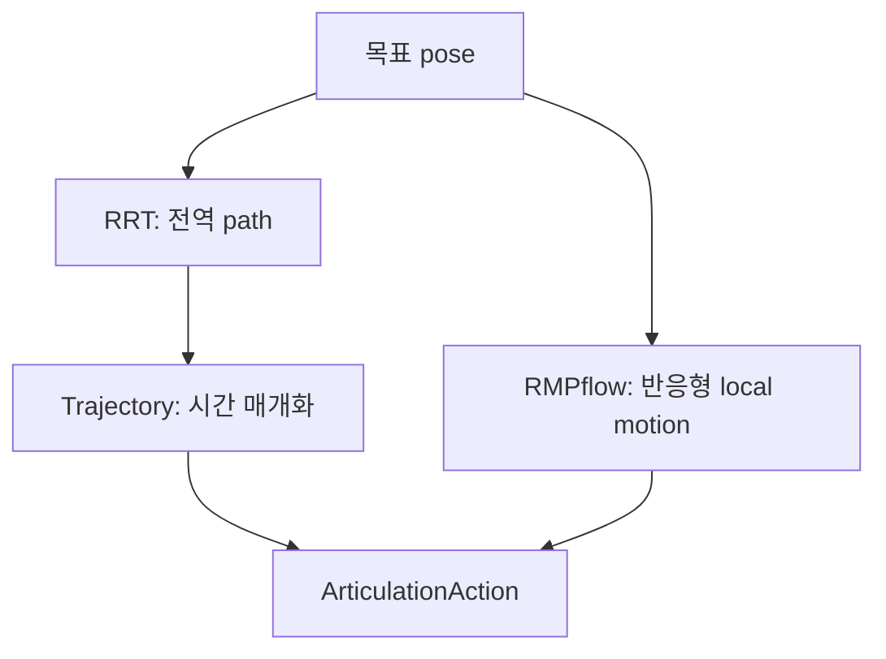

# Lula, RMPflow와 궤적 생성

이 장에서는 “말단을 이 자세로 보내라”라는 요구를 실제 관절 명령으로 바꾸는 계층을 다룬다. Isaac Sim 5.1은 운동학 계산, 궤적 생성, 경로 계획, 반응형 동작 정책과 articulation 연결 기능을 조합해 로봇의 동작을 만든다. 먼저 각 도구의 책임을 구분하고, Franka 예제로 IK와 RMPflow를 실행한 다음 사용자 로봇에 적용한다.

## 1. 문제에 맞는 알고리즘 고르기

| 도구 | 입력 | 출력 | 장애물 | 시간 정보 | 주 용도 |
|---|---|---|---|---|---|
| Lula FK | 관절 위치 | 프레임 자세 | 고려하지 않음 | 없음 | 상태 검증, 시각화 |
| Lula IK | 목표 프레임 자세와 초기 관절 상태 | 관절 위치 | 기본적으로 고려하지 않음 | 없음 | 도달 가능한 자세 찾기 |
| Lula 궤적 생성기 | 관절 공간 또는 작업 공간의 경유점 | 시간에 따른 궤적 | 고려하지 않음 | 있음 | 매끄러운 실행 궤적 만들기 |
| Lula RRT | 시작 상태, 목표 자세, 등록한 장애물 | 충돌을 피하는 성긴 경유점 경로 | 경로 계획 시 반영 | 직접 제공하지 않음 | 복잡한 정적 환경의 전역 경로 찾기 |
| RMPflow | 현재 로봇 상태, 목표 자세, 등록한 장애물 | 다음 관절 위치/속도 목표 | 매 스텝 반응 | 다음 제어 스텝 | 움직이는 목표·장애물에 반응하기 |

IK가 성공했다는 사실은 시작 자세에서 목표 자세까지 충돌 없이 갈 수 있다는 뜻이 아니다. RRT 경로도 그대로 실행하면 시간 최적이거나 매끄럽다는 보장이 없다. 흔히 다음처럼 조합한다.



좁은 통로를 찾아야 하면 RRT 같은 전역 경로 계획기를 먼저 고려한다. 목표나 작업자 위치가 계속 바뀌면 RMPflow가 유리하다. 안전이 중요한 실제 장비에는 어느 쪽도 단독 안전 제어기로 사용하지 않는다.

## 2. 동작 생성에 필요한 데이터와 규칙

### 프레임과 단위

- 위치는 stage 단위이며 이 튜토리얼은 `metersPerUnit=1`, 즉 미터를 사용한다.
- 관절각은 라디안, 각속도는 `rad/s`를 사용한다.
- Isaac Sim Core API의 쿼터니언은 보통 스칼라 우선 `[w, x, y, z]`이다.
- 목표 자세의 프레임과 `end_effector_frame_name`은 URDF에 실제로 존재해야 한다.
- 월드 좌표계의 목표를 사용할 때 로봇 베이스가 움직였다면 솔버에 최신 베이스 자세를 전달한다.

동일한 “도구 끝점”이라도 USD prim 이름, URDF 링크 이름, ROS TF 프레임 이름이 다를 수 있다. 문자열이 비슷하다고 추측하지 말고 솔버가 인식하는 프레임을 출력한다.

```python
print(kinematics_solver.get_all_frame_names())
assert "right_gripper" in kinematics_solver.get_all_frame_names()
```

### 필요한 설정 파일

Lula 기반 알고리즘은 USD articulation만 보고 운동학과 충돌 모델을 자동으로 추론하지 않는다.

| 파일 | 담는 정보 | 사용하는 기능 |
|---|---|---|
| URDF | 링크·관절 트리, 프레임, 관절 제한 | FK, IK, RMPflow, RRT, 궤적 생성 |
| 로봇 설명 YAML 또는 XRDF | 제어할 관절, 기본 자세, 충돌 구 | Lula 계열 |
| RMPflow YAML | 목표 유인력, 감쇠, 충돌 회피 가중치 등 | RMPflow |
| RRT YAML | 스텝 크기, 반복 횟수, 샘플링 영역과 허용 오차 | RRT |

Stage의 로봇에 그리퍼나 도구를 조립했다면 동작 생성용 URDF에도 도구 오프셋과 필요한 관절을 반영한다. Stage만 조립하고 로봇 팔 단독 URDF를 계속 쓰면 화면에 보이는 도구 끝점과 경로 계획기가 사용하는 말단 위치가 어긋난다.

## 3. 제공 설정을 먼저 확인하기

지원 로봇은 이름으로 설정을 불러오는 편이 경로를 직접 조합하는 것보다 안전하다. 다음 코드는 Kit가 이미 실행 중인 Script Editor에서 실행하거나, Standalone의 `SimulationApp` 생성 뒤에 실행한다.

```python
from isaacsim.robot_motion.motion_generation.interface_config_loader import (
    get_supported_robot_policy_pairs,
    get_supported_robots_with_lula_kinematics,
    load_supported_lula_kinematics_solver_config,
    load_supported_motion_policy_config,
)

print(get_supported_robot_policy_pairs())
print(get_supported_robots_with_lula_kinematics())

ik_config = load_supported_lula_kinematics_solver_config("Franka")
rmp_config = load_supported_motion_policy_config("Franka", "RMPflow")
print(ik_config)
print(rmp_config)
```

5.1 문서의 지원 목록은 해당 릴리스에 고정된 값이다. 다른 Isaac Sim 버전의 로봇 이름을 그대로 가져오지 않는다.

## 4. Lula FK와 IK 실습

다음을 `franka_lula_ik.py`로 저장한다. 이 예제는 솔버가 반환한 성공 여부를 확인한 뒤에만 동작을 보낸다.

```python
from isaacsim import SimulationApp

simulation_app = SimulationApp({"headless": False})

import numpy as np

from isaacsim.core.api import World
from isaacsim.core.prims import SingleArticulation as Articulation
from isaacsim.core.utils.numpy.rotations import euler_angles_to_quats
from isaacsim.core.utils.stage import add_reference_to_stage
from isaacsim.robot_motion.motion_generation import (
    ArticulationKinematicsSolver,
    LulaKinematicsSolver,
)
from isaacsim.robot_motion.motion_generation.interface_config_loader import (
    load_supported_lula_kinematics_solver_config,
)
from isaacsim.storage.native import get_assets_root_path

try:
    world = World(
        stage_units_in_meters=1.0,
        physics_dt=1.0 / 60.0,
        rendering_dt=1.0 / 60.0,
    )
    world.scene.add_default_ground_plane()

    assets_root = get_assets_root_path()
    if assets_root is None:
        raise RuntimeError("Isaac Sim asset root를 찾지 못했다")

    robot_path = "/World/Franka"
    add_reference_to_stage(
        assets_root + "/Isaac/Robots/FrankaRobotics/FrankaPanda/franka.usd",
        robot_path,
    )
    robot = world.scene.add(Articulation(robot_path, name="franka"))
    world.reset()

    lula_solver = LulaKinematicsSolver(
        **load_supported_lula_kinematics_solver_config("Franka")
    )
    ee_frame = "right_gripper"
    assert ee_frame in lula_solver.get_all_frame_names()

    ik_solver = ArticulationKinematicsSolver(robot, lula_solver, ee_frame)
    base_position, base_orientation = robot.get_world_pose()
    lula_solver.set_robot_base_pose(base_position, base_orientation)

    target_position = np.array([0.45, 0.15, 0.55])
    target_orientation = euler_angles_to_quats(np.array([0.0, np.pi, 0.0]))
    action, success = ik_solver.compute_inverse_kinematics(
        target_position, target_orientation
    )
    print("IK success:", success)
    if not success:
        raise RuntimeError("IK가 수렴하지 않았다. 목표 pose와 frame을 확인한다")
    print("joint targets:", action.joint_positions)

    robot.apply_action(action)
    for _ in range(240):
        world.step(render=True)

    ee_position, ee_rotation_matrix = ik_solver.compute_end_effector_pose()
    position_error = np.linalg.norm(ee_position - target_position)
    print("EE position:", ee_position, "position error:", position_error)
    assert np.isfinite(position_error)
finally:
    simulation_app.close()
```

```bash
cd ~/isaacsim
./python.sh /절대/경로/franka_lula_ik.py
```

`compute_inverse_kinematics()`는 현재 articulation 관절 상태를 해를 찾기 위한 초기값으로 사용한다. 따라서 같은 목표라도 초기 자세에 따라 다른 해나 실패가 나올 수 있다. FK 결과의 회전은 회전 행렬이지만 목표 방향은 쿼터니언이라는 차이도 주의한다.

### 검증 포인트

- `right_gripper`가 솔버 프레임 목록에 나타나는가?
- 베이스 자세를 바꾼 뒤에도 월드 좌표계의 목표를 정확히 따라가는가?
- 도달 불가능한 목표에서 `success=False`를 처리하는가?
- 위치 오차뿐 아니라 방향 오차도 별도로 측정하는가?

## 5. RMPflow로 움직이는 목표와 장애물 피하기

RMPflow는 목표로 이동하기, 자세 유지하기, 충돌 피하기 등의 Riemannian Motion Policy를 결합해 다음 명령을 계산한다. 모든 Stage 충돌 형상을 자동으로 보는 것은 아니다. `add_obstacle()`로 등록한 Core API 장애물만 환경 모델에 들어가며, 움직인 장애물은 `update_world()`로 갱신한다.

다음을 `franka_rmpflow.py`로 저장한다.

```python
from isaacsim import SimulationApp

simulation_app = SimulationApp({"headless": False})

import numpy as np

from isaacsim.core.api import World
from isaacsim.core.api.objects.cuboid import FixedCuboid, VisualCuboid
from isaacsim.core.prims import SingleArticulation as Articulation
from isaacsim.core.utils.numpy.rotations import euler_angles_to_quats
from isaacsim.core.utils.stage import add_reference_to_stage
from isaacsim.robot_motion.motion_generation import ArticulationMotionPolicy, RmpFlow
from isaacsim.robot_motion.motion_generation.interface_config_loader import (
    load_supported_motion_policy_config,
)
from isaacsim.storage.native import get_assets_root_path

try:
    world = World(
        stage_units_in_meters=1.0,
        physics_dt=1.0 / 60.0,
        rendering_dt=1.0 / 60.0,
    )
    world.scene.add_default_ground_plane()

    assets_root = get_assets_root_path()
    if assets_root is None:
        raise RuntimeError("Isaac Sim asset root를 찾지 못했다")

    robot_path = "/World/Franka"
    add_reference_to_stage(
        assets_root + "/Isaac/Robots/FrankaRobotics/FrankaPanda/franka.usd",
        robot_path,
    )
    robot = world.scene.add(Articulation(robot_path, name="franka"))
    target = world.scene.add(
        VisualCuboid(
            prim_path="/World/Target",
            name="target",
            position=np.array([0.50, 0.20, 0.65]),
            scale=np.array([0.05, 0.05, 0.05]),
            color=np.array([0.1, 0.9, 0.1]),
        )
    )
    obstacle = world.scene.add(
        FixedCuboid(
            prim_path="/World/Obstacle",
            name="obstacle",
            position=np.array([0.42, 0.0, 0.55]),
            scale=np.array([0.12, 0.35, 0.30]),
            color=np.array([0.1, 0.2, 0.9]),
        )
    )
    world.reset()

    rmpflow = RmpFlow(**load_supported_motion_policy_config("Franka", "RMPflow"))
    rmpflow.add_obstacle(obstacle)
    policy = ArticulationMotionPolicy(robot, rmpflow)
    target_orientation = euler_angles_to_quats(np.array([0.0, np.pi, 0.0]))

    initial_joints = robot.get_joint_positions().copy()
    for frame in range(600):
        # 5초 뒤 목표를 옮겨 online replanning을 확인한다.
        if frame == 300:
            target.set_world_pose(position=np.array([0.50, -0.25, 0.60]))

        target_position, _ = target.get_world_pose()
        rmpflow.set_end_effector_target(target_position, target_orientation)
        rmpflow.update_world()

        base_position, base_orientation = robot.get_world_pose()
        rmpflow.set_robot_base_pose(base_position, base_orientation)

        action = policy.get_next_articulation_action(world.get_physics_dt())
        robot.apply_action(action)
        world.step(render=True)

    joint_change = np.linalg.norm(robot.get_joint_positions() - initial_joints)
    print("joint change:", joint_change)
    assert np.isfinite(joint_change) and joint_change > 0.05
finally:
    simulation_app.close()
```

목표 큐브는 위치를 표시하는 시각 형상이므로 장애물로 등록하지 않는다. 파란 큐브만 충돌 장애물이다. 장애물 prim을 GUI에서 움직이면 매 스텝의 `update_world()`가 새 자세를 읽어 경로를 바꾼다.

### 이동 베이스에서의 순서

로봇 팔이 AMR 위에 있다면 매 스텝 다음 순서를 유지한다.

1. 베이스와 장애물의 자세를 시뮬레이션에서 읽는다.
2. `set_robot_base_pose()`를 호출한다.
3. `update_world()`를 호출한다.
4. 목표 자세를 설정하고 동작을 계산한다.
5. 같은 물리 스텝에 동작을 적용한다.

베이스 자세를 최초 한 번만 설정하면 월드 좌표계와 솔버의 좌표계가 점점 어긋난다.

## 6. RMPflow를 분리해서 디버깅하기

RMPflow에는 충돌 모델과 실제 로봇의 목표 추종 문제를 나누는 기능이 있다.

```python
rmpflow.visualize_collision_spheres()
rmpflow.set_ignore_state_updates(True)
```

`visualize_collision_spheres()`로 구가 링크를 충분히 덮는지, 도구와 그리퍼가 빠지지 않았는지 확인한다. `set_ignore_state_updates(True)`는 시뮬레이션의 실제 관절 상태를 무시하고 동작 생성기가 명령을 완벽히 달성했다고 가정해 내부 경로를 전개한다.

- 내부에서 계산한 경로도 잘못된다면 목표 프레임, 충돌 구, URDF 또는 RMPflow 설정 문제이다.
- 내부 경로는 정상인데 실제 로봇만 뒤처진다면 드라이브 게인, 토크·힘 제한, 물리 시간 간격이나 적재물 문제일 가능성이 크다.

진단 뒤에는 원래 모드로 되돌리고 초기화한다.

```python
rmpflow.set_ignore_state_updates(False)
rmpflow.reset()
```

충돌 구 시각화는 화면에 보이는 형상이지 새로운 물리 충돌 형상이 아니다.

## 7. 관절 공간과 작업 공간의 궤적

Lula 궤적 생성기는 경유점을 스플라인으로 연결하고 로봇 설명 파일의 속도, 가속도, 저크 제한을 사용한다.

```python
import numpy as np

from isaacsim.robot_motion.motion_generation import (
    ArticulationTrajectory,
    LulaCSpaceTrajectoryGenerator,
)
from isaacsim.robot_motion.motion_generation.interface_config_loader import (
    load_supported_lula_kinematics_solver_config,
)

config = load_supported_lula_kinematics_solver_config("Franka")
generator = LulaCSpaceTrajectoryGenerator(**config)

# 반드시 active c-space joint 순서와 차원을 맞춘다.
waypoints = np.array(
    [
        [0.00, -0.60, 0.00, -2.10, 0.00, 1.50, 0.70],
        [0.25, -0.40, 0.10, -1.80, 0.10, 1.40, 0.85],
        [-0.20, -0.55, -0.15, -2.00, -0.10, 1.55, 0.60],
    ]
)
timestamps = np.array([0.0, 2.5, 5.0])

fast_trajectory = generator.compute_c_space_trajectory(waypoints)
timed_trajectory = generator.compute_timestamped_c_space_trajectory(
    waypoints, timestamps
)
if timed_trajectory is None:
    raise RuntimeError("joint limit 또는 timestamp 제약을 만족하는 궤적이 없다")

# robot은 초기화된 Articulation, physics_dt는 World와 같은 값이어야 한다.
player = ArticulationTrajectory(robot, timed_trajectory, physics_dt=1.0 / 60.0)
actions = player.get_action_sequence()
for action in actions:
    robot.apply_action(action)
    world.step(render=True)
```

위 조각은 앞선 Standalone 예제에서 `robot`과 `world`를 만든 뒤 넣는다. `ArticulationTrajectory`가 만든 명령열은 지정한 `physics_dt` 간격으로 순서대로 적용해야 한다. 60 Hz용 명령열을 120 Hz에서 한 프레임마다 보내면 전체 동작 시간이 절반이 된다.

작업 공간의 경유점는 다음 API를 사용한다.

```python
from isaacsim.robot_motion.motion_generation import LulaTaskSpaceTrajectoryGenerator

task_generator = LulaTaskSpaceTrajectoryGenerator(**config)
positions = np.array(
    [
        [0.45, -0.20, 0.55],
        [0.50, 0.00, 0.65],
        [0.45, 0.20, 0.55],
    ]
)
orientations = np.tile(np.array([0.0, 1.0, 0.0, 0.0]), (3, 1))
trajectory = task_generator.compute_task_space_trajectory_from_points(
    positions, orientations, "right_gripper"
)
```

작업 공간 선형 보간은 직관적인 EE 경로를 주지만 중간 자세마다 IK가 가능해야 한다. 쿼터니언 부호가 달라도 같은 회전을 뜻할 수 있으므로 경유점 사이 보간에서 불연속이 생기지 않는지도 확인한다.

## 8. Lula RRT와 실행 궤적 연결하기

RRT는 등록한 장애물을 피하는 성긴 관절 공간 경로를 만든다. 지원 로봇의 설정은 설정 로딩 API로 가져온다.

```python
from isaacsim.robot_motion.motion_generation import PathPlannerVisualizer
from isaacsim.robot_motion.motion_generation import interface_config_loader
from isaacsim.robot_motion.motion_generation.lula import RRT

rrt_config = interface_config_loader.load_supported_path_planner_config(
    "Franka", "RRT"
)
rrt = RRT(**rrt_config)
rrt.add_obstacle(obstacle)
rrt.set_max_iterations(5000)

rrt.set_end_effector_target(target_position, target_orientation)
rrt.update_world()
visualizer = PathPlannerVisualizer(robot, rrt)
plan = visualizer.compute_plan_as_articulation_actions(max_cspace_dist=0.01)

if plan is None or len(plan) == 0:
    print("RRT가 path를 찾지 못했다")
else:
    for action in plan:
        robot.apply_action(action)
        world.step(render=True)
```

`PathPlannerVisualizer`의 선형 보간 결과는 빠른 시각 검증용이다. 실제 작업에 사용할 때는 RRT의 경유점을 Lula 궤적 생성기에 넣어 시간에 따른 궤적으로 만들고, 피드백으로 추종 오차를 감시한다. 실행 중 장애물이 움직였다면 기존 경로를 그대로 실행하지 말고 멈춘 뒤 다시 계획한다.

RRT의 주요 조정값은 `step_size`, `max_iterations`, 샘플링 범위, 거리 지표 가중치와 작업 공간 허용 오차이다. 반복 횟수를 무작정 늘리기 전에 목표가 작업 공간 안에 있는지, 충돌 구가 지나치게 큰지, 시작 상태가 이미 충돌인지 확인한다.

## 9. 사용자 로봇 설정 순서

1. Robot Wizard 또는 가져오기 도구로 USD articulation을 완성한다.
2. 관절 이름, 축, 제한과 end-effector 프레임을 URDF와 USD 사이에서 대조한다.
3. **Tools > Robotics > Lula Robot Description Editor** 또는 XRDF Editor에서 제어할 관절을 고른다.
4. 기본 관절 자세와 충돌 구를 만든다.
5. FK로 각 프레임 자세를 USD와 대조한다.
6. 가까운 목표부터 IK 성공 영역을 지도화한다.
7. RMPflow에서 충돌 구를 시각화하고 장애물이 없는 상태를 시험한다.
8. 큰 고정 장애물, 움직이는 장애물 순으로 추가한다.
9. 마지막에 제어기 게인, 토크·힘 제한과 적재물을 포함해 실제 물리 동작의 추종 성능을 조정한다.

직접 설정할 때 `RmpFlow` 생성자는 다음 다섯 값을 받는다.

```python
rmpflow = RmpFlow(
    robot_description_path="/절대/경로/robot_descriptor.yaml",
    urdf_path="/절대/경로/assembled_robot.urdf",
    rmpflow_config_path="/절대/경로/rmpflow.yaml",
    end_effector_frame_name="tool0",
    maximum_substep_size=0.00334,
)
```

`maximum_substep_size`는 RMPflow 내부 오일러 적분의 최대 간격이다. 물리 dt와 독립적이지만 지나치게 크면 내부 적분이 불안정해질 수 있고, 지나치게 작으면 계산량이 늘어난다.

### 충돌 구 설계 원칙

- 링크 메시 표면을 대략 덮되 과도하게 부풀리지 않는다.
- 손목, 도구, 그리퍼 손가락처럼 환경과 먼저 닿는 부분을 빠뜨리지 않는다.
- 인접 링크의 충돌 구의 자기 충돌 관계와 그리퍼 열림 범위를 확인한다.
- 시각 메시가 아니라 실제 작업 중 가능한 모든 링크 자세를 기준으로 검증한다.
- 적재물이 달라지면 충돌 형상과 동역학 설정을 함께 갱신한다.

## 10. 제어 루프를 안정적으로 운영하기

```python
while simulation_app.is_running():
    if world.is_playing():
        # 1. observation을 읽는다.
        # 2. world/base 상태를 planner에 반영한다.
        # 3. 새 목표 또는 기존 trajectory의 다음 action을 구한다.
        # 4. action을 한 번 적용한다.
        pass
    world.step(render=True)
```

- 경로 계획기의 갱신 주기와 물리 주기를 명시한다.
- 목표가 거의 변하지 않으면 RRT를 매 프레임 다시 실행하지 않는다.
- RMPflow가 환경 변화에 반응할 수 있도록 장애물과 목표 자세를 계속 갱신한다.
- 초기화 뒤 솔버의 베이스 자세, 장애물 캐시, 궤적 인덱스와 제어기 상태를 함께 초기화한다.
- IK, RRT 또는 궤적 생성기가 `None` 또는 실패를 반환했을 때 이전 동작을 무기한 계속 보내지 않는다.
- 목표 오차, 장애물까지의 최소 거리, 경로 계산 시간, 관절 제한까지의 여유을 로그로 남긴다.

## 11. cuRobo·cuMotion을 고려할 때

Isaac Sim 5.1은 NVIDIA cuRobo/cuMotion 연동 예제도 제공한다. GPU에서 여러 요청을 병렬 처리하거나 충돌을 고려한 경로 계획의 처리량이 중요할 때 검토할 수 있다. Lula와 API, 설정, 지원 GPU가 다르므로 그대로 교체할 수는 없다. 먼저 로봇 한 대와 장면 하나에서 좌표계와 충돌 모델을 검증한 뒤 실행 규모를 늘린다.

## 12. 실패 진단표

| 증상 | 먼저 확인할 것 | 다음 조치 |
|---|---|---|
| IK가 항상 실패함 | EE 프레임, 목표 단위, 베이스 자세 | 가까운 목표와 다른 초기 관절 상태로 시험 |
| IK는 성공하지만 충돌함 | IK는 경로를 계획하지 않음 | RRT/RMPflow와 충돌 모델 추가 |
| RMPflow가 장애물을 통과함 | `add_obstacle`, `update_world` | 충돌 구와 장애물 형상 시각화 |
| 내부 경로는 정상인데 로봇이 뒤처짐 | 드라이브 게인, 토크·힘 제한, dt | 적재물·감쇠·솔버 반복 횟수 조정 |
| RRT가 오래 멈춤 | 시작·목표의 충돌 상태, 반복 횟수 | 샘플링 범위·거리 지표·허용 오차 조정 |
| 궤적 실행 속도가 틀림 | 명령열의 `physics_dt` | 물리 주기와 명령 적용 주기 일치 |
| 도구 자세에 일정한 오차가 남음 | 조립한 로봇의 URDF, 말단 프레임 | 도구 변환과 로봇 설명 파일 재생성 |

## 13. 검증 체크포인트

- [ ] IK, 궤적 생성, RRT, RMPflow의 책임 차이를 설명할 수 있다.
- [ ] 솔버가 인식하는 EE 프레임을 출력하고 확인했다.
- [ ] IK 실패 여부를 처리하고 FK로 결과 자세를 검증했다.
- [ ] RMPflow에 장애물과 로봇 베이스 자세를 올바르게 갱신했다.
- [ ] 충돌 구와 실제 상태를 무시하는 진단 모드로 경로 계획과 물리 문제를 분리했다.
- [ ] 궤적 명령의 생성 dt와 실행 dt를 일치시켰다.
- [ ] RRT가 만든 성긴 경유점 경로와 바로 실행할 수 있는 궤적을 구분한다.
- [ ] 사용자 로봇의 USD, URDF, 로봇 설명 파일과 도구 오프셋이 일치한다.

## 출처

- [Motion Generation Overview](https://docs.isaacsim.omniverse.nvidia.com/5.1.0/manipulators/motion_generation_overview.html)
- [Lula Kinematics Solver](https://docs.isaacsim.omniverse.nvidia.com/5.1.0/manipulators/manipulators_lula_kinematics.html)
- [Lula RMPflow](https://docs.isaacsim.omniverse.nvidia.com/5.1.0/manipulators/manipulators_rmpflow.html)
- [RMPflow Concepts](https://docs.isaacsim.omniverse.nvidia.com/5.1.0/manipulators/concepts/rmpflow.html)
- [Lula Trajectory Generator](https://docs.isaacsim.omniverse.nvidia.com/5.1.0/manipulators/manipulators_lula_trajectory_generator.html)
- [Lula RRT](https://docs.isaacsim.omniverse.nvidia.com/5.1.0/manipulators/manipulators_lula_rrt.html)
- [Configuring RMPflow for a New Manipulator](https://docs.isaacsim.omniverse.nvidia.com/5.1.0/manipulators/manipulators_configure_rmpflow_denso.html)
- [Lula Robot Description and XRDF Editor](https://docs.isaacsim.omniverse.nvidia.com/5.1.0/manipulators/manipulators_robot_description_editor.html)
- [cuRobo and cuMotion](https://docs.isaacsim.omniverse.nvidia.com/5.1.0/manipulators/manipulators_curobo.html)
