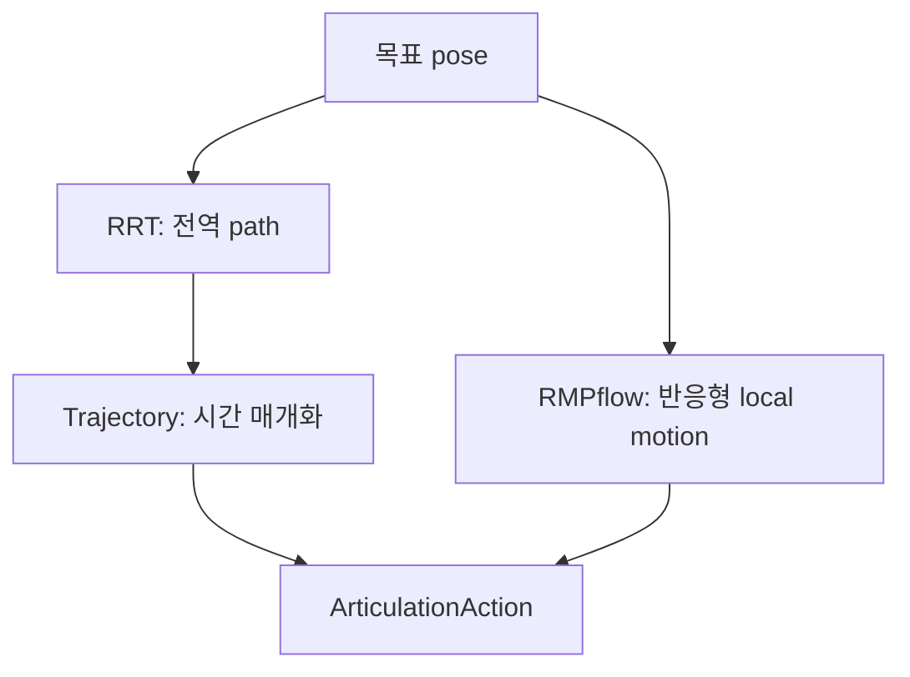

# Lula, RMPflow와 궤적 생성

이 장에서는 “말단을 이 pose로 보내라”라는 요구를 실제 joint 명령으로 바꾸는 계층을 다룬다. Isaac Sim 5.1의 motion generation은 하나의 만능 planner가 아니라 kinematics, trajectory generator, path planner, motion policy와 articulation adapter를 조합하는 구조이다. 먼저 각 도구의 책임을 구분하고, Franka 예제로 IK와 RMPflow를 실행한 다음 custom robot에 적용한다.

## 1. 문제에 맞는 알고리즘 고르기

| 도구 | 입력 | 출력 | 장애물 | 시간 정보 | 주 용도 |
|---|---|---|---|---|---|
| Lula FK | joint position | frame pose | 고려하지 않음 | 없음 | 상태 검증, 시각화 |
| Lula IK | 목표 frame pose와 초기 joint 상태 | joint position | 기본적으로 고려하지 않음 | 없음 | 도달 가능한 자세 찾기 |
| Lula trajectory generator | c-space 또는 task-space waypoint | 시간에 따른 trajectory | 고려하지 않음 | 있음 | 매끄러운 실행 궤적 만들기 |
| Lula RRT | 시작 상태, 목표 pose, 등록한 장애물 | 충돌을 피하는 sparse path | planning 시 반영 | 직접 제공하지 않음 | 복잡한 정적 환경의 전역 경로 찾기 |
| RMPflow | 현재 robot 상태, 목표 pose, 등록한 장애물 | 다음 joint position/velocity target | 매 step 반응 | 다음 제어 step | 움직이는 목표·장애물에 반응하기 |

IK가 성공했다는 사실은 시작 자세에서 목표 자세까지 충돌 없이 갈 수 있다는 뜻이 아니다. RRT path도 그대로 실행하면 시간 최적이거나 매끄럽다는 보장이 없다. 흔히 다음처럼 조합한다.



좁은 통로를 찾아야 하면 RRT 같은 global planner를 먼저 고려한다. 목표나 작업자 위치가 계속 바뀌면 RMPflow가 유리하다. 안전이 중요한 실제 장비에는 어느 쪽도 단독 safety controller로 사용하지 않는다.

## 2. motion generation의 데이터 계약

### frame과 단위

- 위치는 stage 단위이며 이 튜토리얼은 `metersPerUnit=1`, 즉 meter를 사용한다.
- joint angle은 radian, 각속도는 `rad/s`를 사용한다.
- Isaac Sim Core API의 quaternion은 보통 scalar-first `[w, x, y, z]`이다.
- 목표 pose의 frame과 `end_effector_frame_name`은 URDF에 실제로 존재해야 한다.
- world 좌표 목표를 사용할 때 robot base가 움직였다면 solver에 최신 base pose를 전달한다.

동일한 “tool tip”이라도 USD prim 이름, URDF link 이름, ROS TF frame 이름이 다를 수 있다. 문자열이 비슷하다고 추측하지 말고 solver가 인식하는 frame을 출력한다.

```python
print(kinematics_solver.get_all_frame_names())
assert "right_gripper" in kinematics_solver.get_all_frame_names()
```

### 필요한 설정 파일

Lula 기반 알고리즘은 USD articulation만 보고 kinematics와 collision model을 자동 추론하지 않는다.

| 파일 | 담는 정보 | 사용하는 기능 |
|---|---|---|
| URDF | link/joint tree, frame, joint limit | FK, IK, RMPflow, RRT, trajectory |
| robot description YAML 또는 XRDF | active c-space joints, default posture, collision sphere | Lula 계열 |
| RMPflow YAML | attractor, damping, collision avoidance weight 등 | RMPflow |
| RRT YAML | step size, iteration, sampling 영역과 tolerance | RRT |

Stage의 robot에 gripper나 tool을 조립했다면 motion generation용 URDF에도 tool offset과 필요한 joint를 반영한다. Stage만 조립하고 arm 단독 URDF를 계속 쓰면 보이는 tool tip과 planner의 end effector가 어긋난다.

## 3. 제공 설정을 먼저 확인하기

지원 robot은 이름으로 설정을 불러오는 편이 경로를 직접 조합하는 것보다 안전하다. 다음 코드는 Kit이 이미 실행 중인 Script Editor에서 실행하거나, Standalone의 `SimulationApp` 생성 뒤 import한다.

```python
from isaacsim.robot_motion.motion_generation.interface_config_loader import (
    get_supported_robot_policy_pairs,
    get_supported_robots_with_lula_kinematics,
    load_supported_lula_kinematics_solver_config,
    load_supported_motion_policy_config,
)

print(get_supported_robot_policy_pairs())
print(get_supported_robots_with_lula_kinematics())

ik_config = load_supported_lula_kinematics_solver_config("Franka")
rmp_config = load_supported_motion_policy_config("Franka", "RMPflow")
print(ik_config)
print(rmp_config)
```

5.1 문서의 지원 목록은 해당 릴리스에 고정된 값이다. 다른 Isaac Sim 버전의 robot 이름을 그대로 가져오지 않는다.

## 4. Lula FK와 IK 실습

다음을 `franka_lula_ik.py`로 저장한다. 이 예제는 solver가 반환한 성공 flag를 확인한 뒤에만 action을 보낸다.

```python
from isaacsim import SimulationApp

simulation_app = SimulationApp({"headless": False})

import numpy as np

from isaacsim.core.api import World
from isaacsim.core.prims import SingleArticulation as Articulation
from isaacsim.core.utils.numpy.rotations import euler_angles_to_quats
from isaacsim.core.utils.stage import add_reference_to_stage
from isaacsim.robot_motion.motion_generation import (
    ArticulationKinematicsSolver,
    LulaKinematicsSolver,
)
from isaacsim.robot_motion.motion_generation.interface_config_loader import (
    load_supported_lula_kinematics_solver_config,
)
from isaacsim.storage.native import get_assets_root_path

try:
    world = World(
        stage_units_in_meters=1.0,
        physics_dt=1.0 / 60.0,
        rendering_dt=1.0 / 60.0,
    )
    world.scene.add_default_ground_plane()

    assets_root = get_assets_root_path()
    if assets_root is None:
        raise RuntimeError("Isaac Sim asset root를 찾지 못했다")

    robot_path = "/World/Franka"
    add_reference_to_stage(
        assets_root + "/Isaac/Robots/FrankaRobotics/FrankaPanda/franka.usd",
        robot_path,
    )
    robot = world.scene.add(Articulation(robot_path, name="franka"))
    world.reset()

    lula_solver = LulaKinematicsSolver(
        **load_supported_lula_kinematics_solver_config("Franka")
    )
    ee_frame = "right_gripper"
    assert ee_frame in lula_solver.get_all_frame_names()

    ik_solver = ArticulationKinematicsSolver(robot, lula_solver, ee_frame)
    base_position, base_orientation = robot.get_world_pose()
    lula_solver.set_robot_base_pose(base_position, base_orientation)

    target_position = np.array([0.45, 0.15, 0.55])
    target_orientation = euler_angles_to_quats(np.array([0.0, np.pi, 0.0]))
    action, success = ik_solver.compute_inverse_kinematics(
        target_position, target_orientation
    )
    print("IK success:", success)
    if not success:
        raise RuntimeError("IK가 수렴하지 않았다. 목표 pose와 frame을 확인한다")
    print("joint targets:", action.joint_positions)

    robot.apply_action(action)
    for _ in range(240):
        world.step(render=True)

    ee_position, ee_rotation_matrix = ik_solver.compute_end_effector_pose()
    position_error = np.linalg.norm(ee_position - target_position)
    print("EE position:", ee_position, "position error:", position_error)
    assert np.isfinite(position_error)
finally:
    simulation_app.close()
```

```bash
cd ~/isaacsim
./python.sh /절대/경로/franka_lula_ik.py
```

`compute_inverse_kinematics()`는 현재 articulation joint 상태를 warm start로 사용한다. 따라서 같은 목표라도 초기 자세에 따라 다른 해나 실패가 나올 수 있다. FK 결과의 회전은 rotation matrix이지만 target orientation은 quaternion이라는 차이도 주의한다.

### 검증 포인트

- `right_gripper`가 solver frame 목록에 나타나는가?
- base pose를 바꾼 뒤에도 world 목표를 정확히 따라가는가?
- 도달 불가능한 목표에서 `success=False`를 처리하는가?
- position 오차뿐 아니라 orientation 오차도 별도로 측정하는가?

## 5. RMPflow로 움직이는 목표와 장애물 피하기

RMPflow는 목표 attractor, posture policy와 collision avoidance 같은 여러 Riemannian Motion Policy를 결합해 다음 command를 계산한다. 모든 Stage collider를 자동으로 보는 것은 아니다. `add_obstacle()`로 등록한 Core API obstacle만 world model에 들어가며, 움직인 obstacle은 `update_world()`로 갱신한다.

다음을 `franka_rmpflow.py`로 저장한다.

```python
from isaacsim import SimulationApp

simulation_app = SimulationApp({"headless": False})

import numpy as np

from isaacsim.core.api import World
from isaacsim.core.api.objects.cuboid import FixedCuboid, VisualCuboid
from isaacsim.core.prims import SingleArticulation as Articulation
from isaacsim.core.utils.numpy.rotations import euler_angles_to_quats
from isaacsim.core.utils.stage import add_reference_to_stage
from isaacsim.robot_motion.motion_generation import ArticulationMotionPolicy, RmpFlow
from isaacsim.robot_motion.motion_generation.interface_config_loader import (
    load_supported_motion_policy_config,
)
from isaacsim.storage.native import get_assets_root_path

try:
    world = World(
        stage_units_in_meters=1.0,
        physics_dt=1.0 / 60.0,
        rendering_dt=1.0 / 60.0,
    )
    world.scene.add_default_ground_plane()

    assets_root = get_assets_root_path()
    if assets_root is None:
        raise RuntimeError("Isaac Sim asset root를 찾지 못했다")

    robot_path = "/World/Franka"
    add_reference_to_stage(
        assets_root + "/Isaac/Robots/FrankaRobotics/FrankaPanda/franka.usd",
        robot_path,
    )
    robot = world.scene.add(Articulation(robot_path, name="franka"))
    target = world.scene.add(
        VisualCuboid(
            prim_path="/World/Target",
            name="target",
            position=np.array([0.50, 0.20, 0.65]),
            scale=np.array([0.05, 0.05, 0.05]),
            color=np.array([0.1, 0.9, 0.1]),
        )
    )
    obstacle = world.scene.add(
        FixedCuboid(
            prim_path="/World/Obstacle",
            name="obstacle",
            position=np.array([0.42, 0.0, 0.55]),
            scale=np.array([0.12, 0.35, 0.30]),
            color=np.array([0.1, 0.2, 0.9]),
        )
    )
    world.reset()

    rmpflow = RmpFlow(**load_supported_motion_policy_config("Franka", "RMPflow"))
    rmpflow.add_obstacle(obstacle)
    policy = ArticulationMotionPolicy(robot, rmpflow)
    target_orientation = euler_angles_to_quats(np.array([0.0, np.pi, 0.0]))

    initial_joints = robot.get_joint_positions().copy()
    for frame in range(600):
        # 5초 뒤 목표를 옮겨 online replanning을 확인한다.
        if frame == 300:
            target.set_world_pose(position=np.array([0.50, -0.25, 0.60]))

        target_position, _ = target.get_world_pose()
        rmpflow.set_end_effector_target(target_position, target_orientation)
        rmpflow.update_world()

        base_position, base_orientation = robot.get_world_pose()
        rmpflow.set_robot_base_pose(base_position, base_orientation)

        action = policy.get_next_articulation_action(world.get_physics_dt())
        robot.apply_action(action)
        world.step(render=True)

    joint_change = np.linalg.norm(robot.get_joint_positions() - initial_joints)
    print("joint change:", joint_change)
    assert np.isfinite(joint_change) and joint_change > 0.05
finally:
    simulation_app.close()
```

목표 cube는 visual-only라 obstacle로 등록하지 않는다. 파란 cube만 collision obstacle이다. obstacle prim을 GUI에서 움직이면 매 step의 `update_world()`가 새 pose를 읽어 경로를 바꾼다.

### 이동 base에서의 순서

arm이 AMR 위에 있다면 매 step 다음 순서를 유지한다.

1. base와 obstacle pose를 simulation에서 읽는다.
2. `set_robot_base_pose()`를 호출한다.
3. `update_world()`를 호출한다.
4. 목표 pose를 설정하고 action을 계산한다.
5. 같은 physics step에 action을 적용한다.

base pose를 최초 한 번만 설정하면 world와 solver의 좌표계가 점점 어긋난다.

## 6. RMPflow를 분리해서 디버깅하기

RMPflow에는 collision model과 physics tracking 문제를 나누는 기능이 있다.

```python
rmpflow.visualize_collision_spheres()
rmpflow.set_ignore_state_updates(True)
```

`visualize_collision_spheres()`로 sphere가 link를 충분히 덮는지, tool과 gripper가 빠지지 않았는지 확인한다. `set_ignore_state_updates(True)`는 simulation의 실제 joint 상태를 무시하고 planner가 command를 완벽히 달성했다고 가정해 내부 path를 전개한다.

- ghost path도 나쁘면 목표 frame, collision sphere, URDF 또는 RMPflow 설정 문제이다.
- ghost path는 좋은데 실제 robot만 뒤처지면 drive gain, effort limit, physics timestep이나 payload 문제일 가능성이 크다.

진단 뒤에는 원래 모드로 되돌리고 reset한다.

```python
rmpflow.set_ignore_state_updates(False)
rmpflow.reset()
```

collision sphere 시각화는 화면에 보이는 geometry이지 새로운 물리 collider가 아니다.

## 7. c-space와 task-space trajectory

Lula trajectory generator는 waypoint를 spline으로 연결하고 robot description의 velocity, acceleration, jerk limit를 사용한다.

```python
import numpy as np

from isaacsim.robot_motion.motion_generation import (
    ArticulationTrajectory,
    LulaCSpaceTrajectoryGenerator,
)
from isaacsim.robot_motion.motion_generation.interface_config_loader import (
    load_supported_lula_kinematics_solver_config,
)

config = load_supported_lula_kinematics_solver_config("Franka")
generator = LulaCSpaceTrajectoryGenerator(**config)

# 반드시 active c-space joint 순서와 차원을 맞춘다.
waypoints = np.array(
    [
        [0.00, -0.60, 0.00, -2.10, 0.00, 1.50, 0.70],
        [0.25, -0.40, 0.10, -1.80, 0.10, 1.40, 0.85],
        [-0.20, -0.55, -0.15, -2.00, -0.10, 1.55, 0.60],
    ]
)
timestamps = np.array([0.0, 2.5, 5.0])

fast_trajectory = generator.compute_c_space_trajectory(waypoints)
timed_trajectory = generator.compute_timestamped_c_space_trajectory(
    waypoints, timestamps
)
if timed_trajectory is None:
    raise RuntimeError("joint limit 또는 timestamp 제약을 만족하는 궤적이 없다")

# robot은 초기화된 Articulation, physics_dt는 World와 같은 값이어야 한다.
player = ArticulationTrajectory(robot, timed_trajectory, physics_dt=1.0 / 60.0)
actions = player.get_action_sequence()
for action in actions:
    robot.apply_action(action)
    world.step(render=True)
```

위 조각은 앞선 Standalone 예제에서 `robot`과 `world`를 만든 뒤 넣는다. `ArticulationTrajectory`가 만든 action sequence는 지정한 `physics_dt` 간격으로 소비해야 한다. 60 Hz용 sequence를 120 Hz에서 한 frame마다 보내면 전체 동작 시간이 절반이 된다.

task-space waypoint는 다음 API를 사용한다.

```python
from isaacsim.robot_motion.motion_generation import LulaTaskSpaceTrajectoryGenerator

task_generator = LulaTaskSpaceTrajectoryGenerator(**config)
positions = np.array(
    [
        [0.45, -0.20, 0.55],
        [0.50, 0.00, 0.65],
        [0.45, 0.20, 0.55],
    ]
)
orientations = np.tile(np.array([0.0, 1.0, 0.0, 0.0]), (3, 1))
trajectory = task_generator.compute_task_space_trajectory_from_points(
    positions, orientations, "right_gripper"
)
```

task-space 선형 보간은 직관적인 EE path를 주지만 중간 pose마다 IK가 가능해야 한다. quaternion 부호가 달라도 같은 회전을 뜻할 수 있으므로 waypoint 사이 보간에서 불연속이 생기지 않는지도 확인한다.

## 8. Lula RRT와 실행 궤적 연결하기

RRT는 등록한 obstacle을 피하는 sparse c-space path를 만든다. 지원 robot의 설정은 loader로 가져온다.

```python
from isaacsim.robot_motion.motion_generation import PathPlannerVisualizer
from isaacsim.robot_motion.motion_generation import interface_config_loader
from isaacsim.robot_motion.motion_generation.lula import RRT

rrt_config = interface_config_loader.load_supported_path_planner_config(
    "Franka", "RRT"
)
rrt = RRT(**rrt_config)
rrt.add_obstacle(obstacle)
rrt.set_max_iterations(5000)

rrt.set_end_effector_target(target_position, target_orientation)
rrt.update_world()
visualizer = PathPlannerVisualizer(robot, rrt)
plan = visualizer.compute_plan_as_articulation_actions(max_cspace_dist=0.01)

if plan is None or len(plan) == 0:
    print("RRT가 path를 찾지 못했다")
else:
    for action in plan:
        robot.apply_action(action)
        world.step(render=True)
```

`PathPlannerVisualizer`의 선형 보간 결과는 빠른 시각 검증용이다. production 실행에서는 sparse RRT waypoint를 Lula trajectory generator로 시간 매개화하고, feedback으로 tracking 오차를 감시한다. 실행 중 obstacle이 움직였으면 기존 plan이 안전하다고 가정하지 말고 중지·재계획한다.

RRT의 주요 tuning 값은 `step_size`, `max_iterations`, sampling limit, distance metric weight와 task-space tolerance이다. iteration을 무작정 늘리기 전에 목표가 workspace 안에 있는지, collision sphere가 지나치게 큰지, 시작 상태가 이미 충돌인지 확인한다.

## 9. custom robot 설정 순서

1. Robot Wizard 또는 importer로 USD articulation을 완성한다.
2. joint name, axis, limit와 end-effector frame을 URDF와 USD 사이에서 대조한다.
3. **Tools > Robotics > Lula Robot Description Editor** 또는 XRDF Editor에서 active c-space joints를 고른다.
4. default c-space posture와 collision sphere를 만든다.
5. FK로 각 frame pose를 USD와 대조한다.
6. 가까운 목표부터 IK 성공 영역을 지도화한다.
7. RMPflow에서 collision sphere를 시각화하고 obstacle 없는 상태를 시험한다.
8. 큰 고정 obstacle, 움직이는 obstacle 순으로 추가한다.
9. 마지막에 controller gain, effort limit와 payload를 포함해 physics tracking을 튜닝한다.

직접 설정할 때 `RmpFlow` constructor는 다음 다섯 값을 받는다.

```python
rmpflow = RmpFlow(
    robot_description_path="/절대/경로/robot_descriptor.yaml",
    urdf_path="/절대/경로/assembled_robot.urdf",
    rmpflow_config_path="/절대/경로/rmpflow.yaml",
    end_effector_frame_name="tool0",
    maximum_substep_size=0.00334,
)
```

`maximum_substep_size`는 RMPflow 내부 Euler integration의 최대 간격이다. physics dt와 독립적이지만 지나치게 크면 내부 적분이 불안정해질 수 있고, 지나치게 작으면 계산량이 늘어난다.

### collision sphere 설계 원칙

- link mesh 표면을 대략 덮되 과도하게 부풀리지 않는다.
- 손목, tool, gripper finger처럼 환경과 먼저 닿는 부분을 빠뜨리지 않는다.
- 인접 link sphere의 자기 충돌 관계와 gripper 열림 범위를 확인한다.
- visual mesh가 아니라 실제 작업 중 가능한 모든 link pose를 기준으로 검증한다.
- payload가 달라지면 collision geometry와 dynamics 설정을 함께 갱신한다.

## 10. 제어 loop를 안정적으로 운영하기

```python
while simulation_app.is_running():
    if world.is_playing():
        # 1. observation을 읽는다.
        # 2. world/base 상태를 planner에 반영한다.
        # 3. 새 목표 또는 기존 trajectory의 다음 action을 구한다.
        # 4. action을 한 번 적용한다.
        pass
    world.step(render=True)
```

- planner update rate와 physics rate를 명시한다.
- target이 거의 변하지 않으면 RRT를 매 frame 다시 실행하지 않는다.
- RMPflow는 반응형이므로 obstacle과 target update를 누락하지 않는다.
- reset 뒤 solver의 base pose, obstacle cache, trajectory index와 controller state를 함께 초기화한다.
- IK/RRT/trajectory가 `None` 또는 실패를 반환했을 때 이전 action을 무기한 계속 보내지 않는다.
- 목표 오차, minimum obstacle distance, planning time, joint limit margin을 로그로 남긴다.

## 11. cuRobo·cuMotion을 고려할 때

Isaac Sim 5.1은 NVIDIA cuRobo/cuMotion 연동 예제도 제공한다. GPU에서 다수 query를 병렬 처리하거나 collision-aware planning throughput이 중요한 경우 후보가 된다. Lula와 API·설정·지원 GPU 요구가 다르므로 같은 이름의 “planner”로 치환하지 않는다. 먼저 한 robot, 한 scene에서 frame과 collision representation을 검증한 뒤 batch 규모를 늘린다.

## 12. 실패 진단표

| 증상 | 먼저 확인할 것 | 다음 조치 |
|---|---|---|
| IK가 항상 실패함 | EE frame, target 단위, base pose | 가까운 target과 다른 warm start 시험 |
| IK는 성공하지만 충돌함 | IK는 path planner가 아님 | RRT/RMPflow와 collision model 추가 |
| RMPflow가 obstacle을 통과함 | `add_obstacle`, `update_world` | collision sphere와 obstacle shape 시각화 |
| ghost path는 좋은데 robot이 뒤처짐 | drive gain, effort limit, dt | payload·damping·solver iteration 튜닝 |
| RRT가 오래 멈춤 | 시작/목표 collision, iteration | sampling limit·metric·tolerance 조정 |
| trajectory 속도가 틀림 | action sequence의 `physics_dt` | simulation rate와 소비 rate 일치 |
| tool pose가 일정하게 offset됨 | assembled URDF, EE frame | tool transform과 robot description 재생성 |

## 13. 검증 체크포인트

- [ ] IK, trajectory, RRT, RMPflow의 책임 차이를 설명할 수 있다.
- [ ] solver가 인식하는 EE frame을 출력하고 확인했다.
- [ ] IK 실패 flag를 처리하고 FK로 결과 pose를 검증했다.
- [ ] RMPflow에 obstacle과 robot base pose를 올바르게 갱신했다.
- [ ] collision sphere와 ignore-state 모드로 planner와 physics 문제를 분리했다.
- [ ] trajectory action의 생성 dt와 실행 dt를 일치시켰다.
- [ ] RRT sparse path를 production trajectory로 오해하지 않는다.
- [ ] custom robot의 USD, URDF, robot description과 tool offset이 일치한다.

## 출처

- [Motion Generation Overview](https://docs.isaacsim.omniverse.nvidia.com/5.1.0/manipulators/motion_generation_overview.html)
- [Lula Kinematics Solver](https://docs.isaacsim.omniverse.nvidia.com/5.1.0/manipulators/manipulators_lula_kinematics.html)
- [Lula RMPflow](https://docs.isaacsim.omniverse.nvidia.com/5.1.0/manipulators/manipulators_rmpflow.html)
- [RMPflow Concepts](https://docs.isaacsim.omniverse.nvidia.com/5.1.0/manipulators/concepts/rmpflow.html)
- [Lula Trajectory Generator](https://docs.isaacsim.omniverse.nvidia.com/5.1.0/manipulators/manipulators_lula_trajectory_generator.html)
- [Lula RRT](https://docs.isaacsim.omniverse.nvidia.com/5.1.0/manipulators/manipulators_lula_rrt.html)
- [Configuring RMPflow for a New Manipulator](https://docs.isaacsim.omniverse.nvidia.com/5.1.0/manipulators/manipulators_configure_rmpflow_denso.html)
- [Lula Robot Description and XRDF Editor](https://docs.isaacsim.omniverse.nvidia.com/5.1.0/manipulators/manipulators_robot_description_editor.html)
- [cuRobo and cuMotion](https://docs.isaacsim.omniverse.nvidia.com/5.1.0/manipulators/manipulators_curobo.html)
