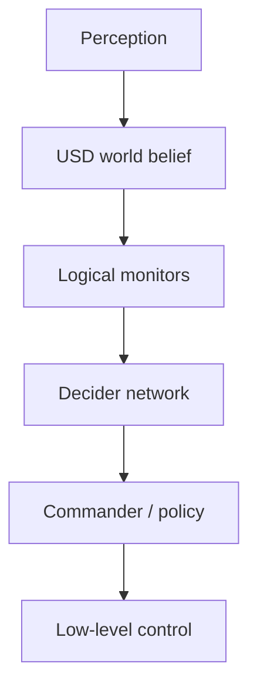

# Cortex behavior, 디버깅과 프로파일링

이 장에서는 motion primitive를 작업 행동으로 엮는 Isaac Cortex와, 행동이 예상과 다를 때 원인을 계층별로 좁히는 방법을 다룬다. 마지막에는 VS Code와 Tracy를 사용해 기능 오류와 성능 병목을 각각 진단한다.

## 1. Cortex가 해결하는 문제

controller는 “이 목표로 이동한다”를 해결하지만, 실제 작업에는 “언제 집고, 언제 놓고, 실패하면 무엇을 하고, 사람이 접근하면 어떤 상태로 전환할지”가 필요하다. Cortex는 다음 계층을 한 physics cycle마다 연결하는 behavior framework이다.



| 계층 | 질문 | 대표 Cortex 개념 |
|---|---|---|
| world model | 무엇이 어디에 있다고 믿는가? | USD Stage, belief world |
| logical state | 작업 관점에서 어떤 상태인가? | context monitor |
| decision | 지금 어떤 skill을 선택하는가? | `DfNetwork`, `DfDecider` |
| command | skill에 어떤 parameter를 보낼 것인가? | robot commander |
| control | joint command를 어떻게 실행하는가? | articulation action, 외부 controller |

Cortex의 world model은 sensor가 보는 실제 세계와 동일하다고 가정하지 않는다. simulation 초기에는 ground truth를 belief에 직접 쓸 수 있지만, 실제 시스템으로 옮길 때는 perception이 belief USD를 갱신하고 control adapter가 command를 실제 robot으로 전달한다. 이 경계를 명확히 해야 sim-to-real에서 오류가 숨지 않는다.

> Cortex는 collaborative behavior를 구성하는 개발 framework이지 사람-robot 협업의 기능 안전 인증을 대신하지 않는다. 실제 장비에는 독립적인 safety PLC, 정지 회로, 속도·힘 제한과 위험 분석이 필요하다.

## 2. Decider network의 실행 규칙

`DfNetwork`는 `DfDecider` node로 만든 directed acyclic graph이다. 매 cycle root에서 시작해 각 node의 `decide()`가 고른 child를 따라 leaf까지 내려가며 decision path를 만든다.

- 이전 cycle과 같은 path에 남은 node에는 `decide()`만 호출한다.
- path에서 빠지는 node에는 leaf 쪽부터 `exit()`를 호출한다.
- 새 path에 들어오는 node에는 root 쪽부터 `enter()`를 호출한다.
- node는 `self.context`로 logical state와 robot command API를 읽는다.
- `DfDecision("child_name", params)`로 branch와 parameter를 선택한다.

```python
class PickOrPlace(DfDecider):
    def __init__(self):
        super().__init__()
        self.add_child("pick", Pick())
        self.add_child("place", Place())

    def enter(self):
        print("dispatch에 진입했다")

    def decide(self):
        if self.context.gripper_has_object:
            return DfDecision("place")
        return DfDecision("pick")

    def exit(self):
        print("dispatch에서 이탈했다")
```

`decide()`에서 오래 걸리는 planner나 blocking I/O를 직접 실행하면 전체 Kit update가 멈춘다. 비동기 작업은 별도 worker/ROS callback에서 처리하고, context에는 완료 여부와 결과만 thread-safe하게 반영한다.

## 3. Context와 monitor

Context는 decider 모두가 공유하는 작업 메모리이며 monitor는 매 cycle world state를 logical state로 바꾼다. monitor는 등록 순서대로 실행되므로 뒤 monitor가 앞 monitor 결과를 사용한다면 그 순서를 문서화한다.

```python
import numpy as np

from isaacsim.cortex.framework.dfb import DfContext


class FollowContext(DfContext):
    def __init__(self, robot):
        super().__init__(robot)
        self.reset()
        self.add_monitors(
            [
                FollowContext.monitor_end_effector,
                FollowContext.monitor_timeout,
                FollowContext.monitor_diagnostics,
            ]
        )

    def reset(self):
        self.cycle = 0
        self.is_target_reached = False
        self.is_timed_out = False

    def monitor_end_effector(self):
        ee_position = self.robot.arm.get_fk_p()
        target_position, _ = self.robot.follow_sphere.get_world_pose()
        self.is_target_reached = (
            np.linalg.norm(target_position - ee_position) < 0.01
        )

    def monitor_timeout(self):
        self.cycle += 1
        self.is_timed_out = self.cycle > 600

    def monitor_diagnostics(self):
        if self.cycle % 60 == 0:
            print(
                "cycle=", self.cycle,
                "reached=", self.is_target_reached,
                "timeout=", self.is_timed_out,
            )
```

monitor가 gripper command까지 직접 보내면 관측과 행동의 책임이 섞인다. 간단한 실험에서는 가능하지만, 중급 프로젝트에서는 monitor는 logical state를 계산하고 decider/state가 commander를 호출하도록 분리하는 편이 추적하기 쉽다.

## 4. 최소 Decider network Standalone 실습

다음을 `cortex_decider_minimal.py`로 저장한다. leaf node는 robot을 움직이지 않고 현재 선택된 branch를 출력하므로 decision lifecycle만 안전하게 확인할 수 있다.

```python
from isaacsim import SimulationApp

simulation_app = SimulationApp({"headless": False})

from isaacsim.cortex.framework.cortex_world import CortexWorld
from isaacsim.cortex.framework.df import DfDecider, DfDecision, DfNetwork
from isaacsim.cortex.framework.dfb import DfContext
from isaacsim.cortex.framework.robot import add_franka_to_stage


class WorkContext(DfContext):
    def __init__(self, robot):
        super().__init__(robot)
        self.reset()
        self.add_monitors([WorkContext.monitor_work])

    def reset(self):
        self.cycle = 0
        self.has_work = False

    def monitor_work(self):
        self.cycle += 1
        # 3초마다 branch를 바꾼다. Cortex 예제의 기본 60 Hz를 가정한다.
        self.has_work = ((self.cycle // 180) % 2) == 1


class Announce(DfDecider):
    def __init__(self, label):
        super().__init__()
        self.label = label

    def enter(self):
        print("ENTER:", self.label)

    def decide(self):
        return None

    def exit(self):
        print("EXIT:", self.label)


class Dispatch(DfDecider):
    def __init__(self):
        super().__init__()
        self.add_child("idle", Announce("idle"))
        self.add_child("work", Announce("work"))

    def decide(self):
        return DfDecision("work" if self.context.has_work else "idle")


try:
    world = CortexWorld()
    robot = world.add_robot(
        add_franka_to_stage(name="franka", prim_path="/World/Franka")
    )
    world.scene.add_default_ground_plane()
    context = WorkContext(robot)
    world.add_decider_network(DfNetwork(Dispatch(), context=context))

    # 창이 열리면 PLAY를 눌러 behavior cycle을 시작한다.
    world.run(simulation_app)
finally:
    simulation_app.close()
```

```bash
cd ~/isaacsim
./python.sh /절대/경로/cortex_decider_minimal.py
```

`SimulationApp`은 반드시 Cortex/Omni/PXR import보다 먼저 생성한다. 공식 개념 예제 일부에는 context constructor 인자가 생략된 축약 표현이 보이지만, `DfContext`가 robot command API를 제공하려면 여기처럼 `WorkContext(robot)`을 전달한다.

### 검증 포인트

- Play 뒤 `idle`과 `work`의 `ENTER`/`EXIT`가 약 3초마다 교대하는가?
- 같은 branch가 유지되는 동안 `ENTER`가 매 frame 반복되지 않는가?
- Stop 후 다시 Play하지 말고 명시적인 reset에서 context가 초기화되는가?

## 5. State machine을 network 안에 넣기

순서가 명확한 skill은 `DfState`로 표현한다.

```python
from isaacsim.cortex.framework.df import (
    DfNetwork,
    DfState,
    DfStateMachineDecider,
    DfStateSequence,
)


class WaitCycles(DfState):
    def __init__(self, count):
        self.count = count

    def enter(self):
        self.remaining = self.count

    def step(self):
        self.remaining -= 1
        return self if self.remaining > 0 else None

    def exit(self):
        pass


sequence = DfStateSequence(
    [WaitCycles(60), WaitCycles(120), WaitCycles(30)],
    loop=True,
)
network = DfNetwork(
    DfStateMachineDecider(sequence),
    context=DfContext(robot),
)
```

`DfState.step()`은 계속 실행하려면 `self`, 종료하려면 `None`, 다른 상태로 전환하려면 그 state object를 반환한다. 상태 수가 늘어나고 모든 예외 전이를 서로 연결하기 시작하면 단일 거대 state machine보다 상위 decider가 상황을 선택하고 leaf에서 작은 sequence를 실행하는 구조가 낫다.

## 6. Commander와 behavior의 경계

Cortex robot은 articulation의 joint subset을 commander로 감싼다. Franka에서는 arm motion commander와 gripper commander가 대표적이다.

```python
# target_pose의 형식은 사용하는 Cortex math/command API 계약을 따른다.
robot.arm.send_end_effector(target_pose)
robot.gripper.close()
```

- behavior는 목표 pose, approach direction, gripper open/close 같은 의미 있는 command를 보낸다.
- commander는 최신 command를 보관하고 policy를 매 cycle 실행한다.
- low-level adapter는 commander의 articulation action을 simulation 또는 실제 robot에 보낸다.

새 command를 한 번 보내도 commander가 최신 목표를 유지할 수 있다. 따라서 branch를 나갈 때 중지·hold·새 command 중 무엇을 보낼지 명시한다. 이전 branch의 command가 남아 robot이 계속 움직이는 현상을 physics 문제로 오해하지 않는다.

## 7. 공식 behavior 예제에서 배울 설계

### Peck games

Peck 예제는 같은 작업을 state machine과 decider network로 비교한다. 고정 순서는 state sequence가 간단하지만 외부 변화에 즉시 반응해야 하는 branch가 많아질수록 decider network가 읽기 쉽다. 다음 명령은 설치 경로의 Cortex standalone example 디렉터리에서 실행한다.

```bash
./python.sh standalone_examples/api/isaacsim.cortex.framework/franka_examples_main.py \
  --behavior=peck_decider_network
```

설치 패키지에 따라 example 상대 경로가 달라질 수 있으므로 `standalone_examples/api/isaacsim.cortex.framework`를 먼저 확인한다.

### Franka block stacking

block stacking의 상위 dispatch는 개념적으로 다음 우선순위를 가진다.

1. 작업이 끝났으면 home으로 간다.
2. gripper가 비어 있고 쌓을 block이 있으면 pick한다.
3. 물체를 잡았으면 다음 target pose에 place한다.
4. 접근·파지·후퇴는 작은 state sequence로 구성한다.

stacking은 grasp 여부, block pose와 target stack state를 monitor로 갱신하고, arm commander와 gripper commander에 command를 보낸다. “pick을 시작했으니 끝날 때까지 무조건 수행한다”가 아니라 block이 사라지거나 grasp가 실패하면 상위 decision이 branch를 다시 선택하게 한다.

### UR10 bin stacking

UR10 예제에는 bin pose와 방향에 따라 flip, pick, place, go-home branch가 추가된다. RMPflow가 작업 cell의 모든 mesh를 자동으로 이해하지 않으므로, 작업 phase에 따라 보수적인 proxy obstacle을 enable/disable하는 패턴도 사용한다.

proxy obstacle을 보이지 않게 만들었다고 collision avoidance에서 자동 제거되는 것은 아니다. planner 등록 상태와 Stage visibility는 별개이다. 반대로 visual mesh가 보인다고 planner obstacle인 것도 아니다.

## 8. Cortex extension workflow

Standalone에서는 `SimulationApp`을 직접 만들고 `CortexWorld.run()`이 loop를 소유한다. GUI extension에서는 Kit가 이미 실행 중이므로 `SimulationApp`을 다시 만들지 않는다. `CortexWorld`를 사용하는 `BaseSample` 계열을 만들고 async lifecycle에 연결한다.

```python
from isaacsim.core.utils.stage import create_new_stage_async
from isaacsim.cortex.framework.cortex_world import CortexWorld


class CortexSampleBase:
    async def load_world_async(self):
        if CortexWorld.instance() is None:
            await create_new_stage_async()
            self._world = CortexWorld(**self._world_settings)
            await self._world.initialize_simulation_context_async()
            self.setup_scene()
        else:
            self._world = CortexWorld.instance()

        await self._world.reset_async()
        await self._world.pause_async()
        await self.setup_post_load()
```

공식 Cortex extension sample은 `BaseSample`을 확장해 Core `World` 대신 `CortexWorld`를 만들고 task callback에서 logical monitor → behavior → commander 순으로 step한다. 실제 extension은 `on_startup()`/`on_shutdown()`에서 callback, UI handle과 subscription을 소유·해제해야 한다.

- **Window > Examples > Robotics Examples > Cortex**에서 Franka/UR10 예제를 찾는다.
- Diagnostic monitor에서 현재 decision stack을 본다.
- behavior hot-swap 뒤 이전 branch의 commander state가 남지 않는지 확인한다.
- Stop→Play만으로 world가 완전히 초기화되지 않을 수 있으므로 sample의 **RESET**을 사용한다.

## 9. 기능 오류를 계층별로 좁히기

다음 순서로 확인하면 “robot이 이상하다”를 구체적인 실패로 바꿀 수 있다.

| 계층 | 기록할 값 | 대표 실패 |
|---|---|---|
| Stage/asset | prim path, unit, transform, schema | 잘못된 reference, scale |
| physics | contact, joint state, residual, dt | collider·mass·gain 불량 |
| world model | object pose와 timestamp | perception 지연, stale belief |
| logical monitor | boolean과 threshold | 경계에서 chatter, 순서 의존 |
| decision | root-to-leaf stack | 잘못된 우선순위, exit 누락 |
| command | commander의 최신 target | 이전 branch command 잔존 |
| control | commanded/actual joint state | limit, saturation, tracking 오차 |

하나의 episode를 재현할 최소 로그에는 다음을 포함한다.

```python
record = {
    "physics_step": physics_step,
    "sim_time": world.current_time,
    "decision_path": decision_path,
    "target_pose": target_pose.tolist(),
    "joint_positions": robot.get_joint_positions().tolist(),
    "joint_velocities": robot.get_joint_velocities().tolist(),
    "logical": {
        "has_object": context.has_object,
        "target_reached": context.is_target_reached,
    },
}
```

random seed, Isaac Sim version, asset URI/hash, physics/render dt, GPU와 launch arguments도 함께 보관한다.

## 10. GUI 진단 도구

### Output Log과 Commands Tool

- **Window > Console** 또는 Output Log에서 Python exception, extension load와 PhysX warning을 확인한다.
- 같은 warning이 수천 번 반복되면 최초 발생 frame과 첫 stack trace를 먼저 찾는다.
- **Omniverse Commands Tool**은 GUI 조작이 실행한 `omni.kit.commands`를 보여 주므로 GUI 작업을 Python으로 옮길 때 유용하다.
- Stage를 저장하기 전에 command가 어느 edit target/layer에 authoring했는지 확인한다.

### Physics Inspector와 visualization

- **Tools > Physics > Physics Inspector**에서 articulation joint를 움직이고 drive 응답을 본다.
- viewport physics visualization으로 collider, joint frame, center of mass를 켠다.
- **Simulation Data Visualizer**에서 simulation state를 시간에 따라 관찰한다.
- Physics Debug Window와 residual reporting으로 constraint가 수렴하지 않는 body/joint를 찾는다.

Residual reporting은 Physics Scene, articulation과 joint에 적용할 수 있다. 큰 residual은 “gain을 더 높이면 해결된다”는 뜻이 아니라 timestep, mass ratio, 충돌 관통, joint limit와 solver iteration을 함께 확인하라는 신호이다.

### Debug Drawing

목표, sensor ray와 planner path를 persistent line/point로 그린다.

```python
from isaacsim.util.debug_draw import _debug_draw

draw = _debug_draw.acquire_debug_draw_interface()

starts = [(0.0, 0.0, 0.05), (0.0, 0.0, 0.05)]
ends = [(1.0, 0.0, 0.05), (0.0, 1.0, 0.05)]
colors = [(1.0, 0.0, 0.0, 1.0), (0.0, 1.0, 0.0, 1.0)]
widths = [4.0, 4.0]
draw.draw_lines(starts, ends, colors, widths)
draw.draw_points([(0.5, 0.5, 0.5)], [(0.1, 0.6, 1.0, 1.0)], [12.0])

# 다음 episode 전에 이전 geometry를 지운다.
draw.clear_lines()
draw.clear_points()
```

debug geometry는 frame을 넘어 남으므로 clear하지 않으면 과거 episode가 현재 결과처럼 보이고 메모리도 증가한다. 이는 물리 collider가 아니다.

## 11. VS Code로 Python 디버깅하기

### Linux Standalone

Isaac Sim 5.1 공식 절차에서 Standalone Python debugging은 Linux를 지원한다.

1. App Selector의 **Open in Terminal**로 설치 디렉터리를 연다.
2. `code .`로 설치 folder를 VS Code에서 연다.
3. `.vscode` 설정이 제공하는 **Current File** 구성을 고른다.
4. breakpoint를 놓고 `F5`로 시작한다. `F10`으로 한 줄씩 실행한다.

system Python이 아니라 Isaac Sim의 Kit Python, environment file과 pre-launch task가 사용되어야 한다. 디버거에서는 시작이 느리므로 shader compilation이나 asset download를 Python deadlock으로 오해하지 않는다.

### 실행 중인 GUI에 attach

1. **Window > Extensions**에서 `omni.kit.debug.vscode`를 enable한다.
2. VS Code에서 제공된 `Python: Attach` 구성을 실행한다.
3. host/port가 Isaac Sim 설정과 `launch.json`에서 같은지 확인한다.

기본 예시 설정은 `127.0.0.1:3000`이다. remote host에 debugger port를 공개하지 않고 SSH tunnel이나 접근 제어된 network를 사용한다.

### Container의 debugpy

container 내부에서도 반드시 `python.sh`를 사용한다.

```bash
./python.sh -m debugpy --wait-for-client --listen 0.0.0.0:5678 \
  standalone_examples/api/isaacsim.core.api/time_stepping.py
```

VS Code의 `pathMappings`에서 local Isaac Sim source와 container의 `/isaac-sim`을 정확히 연결한다. `--wait-for-client` 때문에 attach 전에는 script가 시작되지 않는 것이 정상이다. port publishing은 개발 machine으로 제한한다.

## 12. 성능을 수치로 측정하기

FPS 하나만 보면 physics, rendering과 sensor 중 무엇이 느린지 알 수 없다. 최소한 다음을 분리한다.

- simulation time / wall time인 real-time factor(RTF)
- physics step latency의 median과 p95/p99
- render step latency와 camera별 frame rate
- CPU/GPU utilization과 VRAM/RAM
- contact pair, rigid body, articulation, prim과 sensor 수
- planner/behavior callback별 실행 시간

간단한 RTF 측정은 warm-up 뒤 fixed step으로 한다.

```python
import time

for _ in range(120):
    world.step(render=False)

step_count = 600
sim_start = world.current_time
wall_start = time.perf_counter()
for _ in range(step_count):
    world.step(render=False)
wall_elapsed = time.perf_counter() - wall_start
sim_elapsed = world.current_time - sim_start
rtf = sim_elapsed / wall_elapsed
print(f"sim={sim_elapsed:.3f}s wall={wall_elapsed:.3f}s RTF={rtf:.3f}")
```

`render=False` benchmark는 camera/RTX sensor workload를 제외한다. 실제 workload가 camera image를 필요로 하면 render product와 sensor update를 켠 별도 benchmark를 수행한다.

## 13. Tracy로 CPU/GPU 병목 찾기

GUI에서는 **Window > Extensions**에서 `omni.kit.profiler.tracy`를 enable한 뒤 Profiler 메뉴의 **Launch and Connect**를 사용한다.

Standalone script는 `SimulationApp` 생성 시 backend를 지정하고 extension을 launch argument로 enable한다.

```python
from isaacsim import SimulationApp

simulation_app = SimulationApp(
    {"headless": False, "profiler_backend": ["tracy"]}
)
```

```bash
./python.sh /절대/경로/my_sim.py --enable omni.kit.profiler.tracy
```

관심 있는 Python 함수에는 custom zone을 붙인다.

```python
import carb


@carb.profiler.profile
def update_behavior_and_planner():
    update_logical_state()
    step_decider()
    update_motion_policy()
```

Tracy capture에서는 한 개의 긴 frame만 보지 말고 warm-up 이후 여러 frame의 반복 pattern을 본다. CPU main thread, task worker, PhysX, renderer와 GPU zone의 dependency를 비교한다. profiler 자체 overhead가 있으므로 최종 성능 수치는 profiler를 끈 상태에서도 재확인한다.

## 14. 최적화의 안전한 순서

1. 대표 workload, hardware, launch argument와 acceptance metric을 고정한다.
2. shader/asset warm-up 뒤 baseline trace와 RTF를 저장한다.
3. physics-only, render-only, sensor-enabled workload로 병목을 분리한다.
4. 한 번에 한 변수만 바꾸고 같은 seed/step 수로 반복한다.
5. speed뿐 아니라 contact, controller error와 sensor output의 정확성을 회귀 검사한다.

대표 조정 항목은 다음과 같다.

| 병목 | 우선 검토 | 주의할 trade-off |
|---|---|---|
| physics | collider 단순화, dt, solver iteration, GPU dynamics | 접촉 정확도와 안정성 |
| USD/scene | instanceable asset, prim/mesh 수, authoring 빈도 | instance child 편집 제한 |
| rendering | resolution, ray/path tracing 설정, light 수 | 영상 품질과 sensor domain |
| camera/sensor | sensor 수, render product, update rate | timestamp와 perception 성능 |
| Python | per-step allocation, stage traversal, logging | stale cache와 유지보수성 |
| planner | replan 조건, obstacle 수, iteration | 경로 품질과 반응성 |

headless는 창을 숨기는 설정이지 모든 rendering을 제거한다는 뜻이 아니다. camera/RTX sensor가 있으면 GPU rendering이 계속 필요하다. streaming이 없고 viewport도 필요 없는 workload에만 다음처럼 viewport update 비활성화를 검토한다.

```python
simulation_app = SimulationApp(
    {
        "headless": True,
        "disable_viewport_updates": True,
        "limit_cpu_threads": 16,
    }
)
```

CPU thread 수는 많을수록 항상 빠르지 않다. workload와 hardware별로 측정한다. physics dt를 크게 만들어 빨라졌다면 동일 contact 안정성과 controller error를 유지하는지 반드시 비교한다.

## 15. Cortex와 planner의 성능 anti-pattern

- 매 monitor가 전체 Stage를 `Traverse()`한다.
- 변하지 않은 목표에도 RRT를 매 physics frame 실행한다.
- decision branch마다 같은 asset/extension을 다시 load한다.
- per-step `print()`로 console lock과 거대한 log를 만든다.
- collision sphere/debug line을 clear하지 않고 계속 추가한다.
- camera RGB를 사용하지 않으면서 매 frame CPU로 복사한다.
- reset할 때 subscription/callback을 중복 등록한다.
- behavior hot-swap 뒤 이전 network와 commander가 함께 step된다.

prim handle과 joint index는 setup에서 resolve하고, invalidation 조건을 명시한다. diagnostics는 rate limit하고 numeric log는 buffer에 모아 episode 끝에 저장한다.

## 16. 최종 검증 체크포인트

- [ ] world belief, logical monitor, decider, commander와 control의 경계를 설명할 수 있다.
- [ ] decider path 변화에 따른 `enter`/`exit` 호출을 확인했다.
- [ ] context reset과 monitor 실행 순서를 명시했다.
- [ ] state sequence와 상위 reactive decider를 적절히 나눴다.
- [ ] Standalone과 Cortex extension의 lifecycle을 섞지 않는다.
- [ ] decision stack, command와 actual joint state를 같은 timestamp로 기록한다.
- [ ] physics visualization, residual과 debug drawing을 사용할 수 있다.
- [ ] VS Code launch/attach와 container path mapping 차이를 안다.
- [ ] Tracy trace와 RTF baseline으로 병목을 재현했다.
- [ ] 최적화 뒤 physics·sensor 정확성 회귀 검사를 통과했다.

## 출처

- [Isaac Cortex: Overview](https://docs.isaacsim.omniverse.nvidia.com/5.1.0/cortex_tutorials/tutorial_cortex_1_overview.html)
- [Decider Networks](https://docs.isaacsim.omniverse.nvidia.com/5.1.0/cortex_tutorials/tutorial_cortex_2_decider_networks.html)
- [Behavior Examples: Peck Games](https://docs.isaacsim.omniverse.nvidia.com/5.1.0/cortex_tutorials/tutorial_cortex_3_example_peck_games.html)
- [Walkthrough: Franka Block Stacking](https://docs.isaacsim.omniverse.nvidia.com/5.1.0/cortex_tutorials/tutorial_cortex_4_franka_block_stacking.html)
- [Walkthrough: UR10 Bin Stacking](https://docs.isaacsim.omniverse.nvidia.com/5.1.0/cortex_tutorials/tutorial_cortex_5_ur10_bin_stacking.html)
- [Building Cortex Based Extensions](https://docs.isaacsim.omniverse.nvidia.com/5.1.0/cortex_tutorials/tutorial_cortex_7_cortex_extension.html)
- [Debug Drawing Extension API](https://docs.isaacsim.omniverse.nvidia.com/5.1.0/utilities/debugging/ext_isaacsim_util_debug_draw.html)
- [Omniverse Commands Tool](https://docs.isaacsim.omniverse.nvidia.com/5.1.0/utilities/debugging/ext_omni_kit_commands.html)
- [Debugging With Visual Studio Code](https://docs.isaacsim.omniverse.nvidia.com/5.1.0/utilities/debugging/tutorial_advanced_python_debugging.html)
- [Profiling Performance Using Tracy](https://docs.isaacsim.omniverse.nvidia.com/5.1.0/utilities/debugging/profiling_performance.html)
- [Isaac Sim Performance Optimization Handbook](https://docs.isaacsim.omniverse.nvidia.com/5.1.0/reference_material/sim_performance_optimization_handbook.html)
- [Physics Inspector](https://docs.isaacsim.omniverse.nvidia.com/5.1.0/physics/joint_inspector.html)
- [Simulation Data Visualizer](https://docs.isaacsim.omniverse.nvidia.com/5.1.0/physics/ext_isaacsim_inspect_physics.html)
