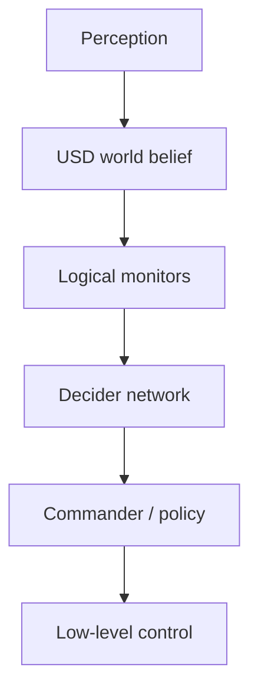

# Cortex 행동 설계, 디버깅과 프로파일링

이 장에서는 기본 동작을 조합해 작업 행동을 만드는 Isaac Cortex와, 행동이 예상과 다를 때 원인을 계층별로 좁히는 방법을 다룬다. 마지막에는 VS Code와 Tracy를 사용해 기능 오류와 성능 병목을 각각 진단한다.

## 1. Cortex가 해결하는 문제

제어기는 “이 목표로 이동한다”를 해결하지만, 실제 작업에는 “언제 집고, 언제 놓고, 실패하면 무엇을 하고, 사람이 접근하면 어떤 상태로 전환할지”가 필요하다. Cortex는 매 물리 스텝마다 다음 계층을 연결하는 행동 프레임워크이다.



| 계층 | 질문 | 대표 Cortex 개념 |
|---|---|---|
| 환경 모델 | 시스템이 파악한 물체의 위치와 상태는 무엇인가? | USD Stage, 추정 환경(belief world) |
| 논리 상태 | 작업 관점에서 어떤 상태인가? | context monitor |
| 행동 선택 | 지금 어떤 동작을 실행할 것인가? | `DfNetwork`, `DfDecider` |
| 명령 | 선택한 동작에 어떤 매개변수를 전달할 것인가? | 로봇 commander |
| 제어 | 관절 명령을 어떻게 실행하는가? | articulation 명령, 외부 제어기 |

Cortex의 환경 모델은 실제 세계와 일치하지 않을 수 있다. 초기 시뮬레이션에서는 참값을 모델에 직접 넣을 수 있지만, 실제 시스템에서는 인지 모듈이 추정한 상태로 USD를 갱신하고 제어 연결 모듈이 명령을 로봇에 전달한다. 각 모듈이 어떤 데이터를 읽고 쓰는지 구분해야 실제 로봇으로 옮길 때 발생하는 오류를 찾을 수 있다.

> Cortex는 협업 행동을 구성하는 개발 프레임워크이며 사람-로봇 협업의 기능 안전 인증을 대신하지 않는다. 실제 장비에는 독립적인 안전 PLC, 정지 회로, 속도·힘 제한과 위험 분석이 필요하다.

## 2. Decider Network의 실행 규칙

`DfNetwork`는 `DfDecider` 노드로 만든 방향성 비순환 그래프(DAG)이다. 매 실행 주기마다 루트에서 시작해 각 노드의 `decide()`가 고른 자식을 따라 말단 노드까지 내려가며 실행할 행동 경로를 정한다.

- 이전 실행 주기와 같은 경로에 남은 노드에는 `decide()`만 호출한다.
- 경로에서 빠지는 노드에는 말단 노드부터 `exit()`를 호출한다.
- 새 경로에 들어오는 노드에는 루트 쪽부터 `enter()`를 호출한다.
- 노드는 `self.context`로 논리 상태와 로봇 명령 API를 읽는다.
- `DfDecision("child_name", params)`로 자식 행동과 매개변수를 선택한다.

```python
class PickOrPlace(DfDecider):
    def __init__(self):
        super().__init__()
        self.add_child("pick", Pick())
        self.add_child("place", Place())

    def enter(self):
        print("dispatch에 진입했다")

    def decide(self):
        if self.context.gripper_has_object:
            return DfDecision("place")
        return DfDecision("pick")

    def exit(self):
        print("dispatch에서 이탈했다")
```

`decide()`에서 오래 걸리는 경로 계획이나 입출력을 직접 수행하면 Kit의 화면 갱신까지 멈출 수 있다. 긴 작업은 별도 작업 스레드나 ROS 콜백에서 처리하고, context에는 완료 여부와 결과를 동시 접근에 문제가 없도록 반영한다.

## 3. Context와 monitor

Context는 모든 decider가 공유하는 작업 상태를 담는다. Monitor는 매 실행 주기마다 환경 정보를 읽어 논리 상태를 갱신한다. Monitor는 등록 순서대로 실행되므로 앞선 계산 결과를 다음 monitor가 사용한다면 그 순서를 문서화한다.

```python
import numpy as np

from isaacsim.cortex.framework.dfb import DfContext


class FollowContext(DfContext):
    def __init__(self, robot):
        super().__init__(robot)
        self.reset()
        self.add_monitors(
            [
                FollowContext.monitor_end_effector,
                FollowContext.monitor_timeout,
                FollowContext.monitor_diagnostics,
            ]
        )

    def reset(self):
        self.cycle = 0
        self.is_target_reached = False
        self.is_timed_out = False

    def monitor_end_effector(self):
        ee_position = self.robot.arm.get_fk_p()
        target_position, _ = self.robot.follow_sphere.get_world_pose()
        self.is_target_reached = (
            np.linalg.norm(target_position - ee_position) < 0.01
        )

    def monitor_timeout(self):
        self.cycle += 1
        self.is_timed_out = self.cycle > 600

    def monitor_diagnostics(self):
        if self.cycle % 60 == 0:
            print(
                "cycle=", self.cycle,
                "reached=", self.is_target_reached,
                "timeout=", self.is_timed_out,
            )
```

monitor가 그리퍼 명령까지 직접 보내면 관측과 행동의 책임이 섞인다. 간단한 실험에서는 가능하지만, 중급 프로젝트에서는 monitor는 논리 상태를 계산하고 decider/상태가 commander를 호출하도록 분리하는 편이 추적하기 쉽다.

## 4. 최소 Decider Network standalone 실습

다음을 `cortex_decider_minimal.py`로 저장한다. 말단 노드는 로봇을 움직이지 않고 선택된 행동 경로만 출력한다. 따라서 행동 경로를 선택하고 전환하는 과정을 독립적으로 확인할 수 있다.

```python
from isaacsim import SimulationApp

simulation_app = SimulationApp({"headless": False})

from isaacsim.cortex.framework.cortex_world import CortexWorld
from isaacsim.cortex.framework.df import DfDecider, DfDecision, DfNetwork
from isaacsim.cortex.framework.dfb import DfContext
from isaacsim.cortex.framework.robot import add_franka_to_stage


class WorkContext(DfContext):
    def __init__(self, robot):
        super().__init__(robot)
        self.reset()
        self.add_monitors([WorkContext.monitor_work])

    def reset(self):
        self.cycle = 0
        self.has_work = False

    def monitor_work(self):
        self.cycle += 1
        # 3초마다 branch를 바꾼다. Cortex 예제의 기본 60 Hz를 가정한다.
        self.has_work = ((self.cycle // 180) % 2) == 1


class Announce(DfDecider):
    def __init__(self, label):
        super().__init__()
        self.label = label

    def enter(self):
        print("ENTER:", self.label)

    def decide(self):
        return None

    def exit(self):
        print("EXIT:", self.label)


class Dispatch(DfDecider):
    def __init__(self):
        super().__init__()
        self.add_child("idle", Announce("idle"))
        self.add_child("work", Announce("work"))

    def decide(self):
        return DfDecision("work" if self.context.has_work else "idle")


try:
    world = CortexWorld()
    robot = world.add_robot(
        add_franka_to_stage(name="franka", prim_path="/World/Franka")
    )
    world.scene.add_default_ground_plane()
    context = WorkContext(robot)
    world.add_decider_network(DfNetwork(Dispatch(), context=context))

    # 창이 열리면 PLAY를 눌러 behavior cycle을 시작한다.
    world.run(simulation_app)
finally:
    simulation_app.close()
```

```bash
cd ~/isaacsim
./python.sh /절대/경로/cortex_decider_minimal.py
```

`SimulationApp`은 반드시 Cortex/Omni/PXR 모듈을 import하기 전에 생성한다. 공식 개념 예제 일부에는 context 생성자의 인자가 생략된 축약 표현이 보이지만, `DfContext`가 로봇 명령 API를 제공하려면 여기처럼 `WorkContext(robot)`을 전달한다.

### 검증 포인트

- Play 뒤 `idle`과 `work`의 `ENTER`/`EXIT`가 약 3초마다 교대하는가?
- 같은 행동 경로가 유지되는 동안 `ENTER`가 매 프레임 반복되지 않는가?
- Stop 후 다시 Play하지 말고 예제의 reset 절차에서 context도 초기화되는가?

## 5. 상태 머신을 행동 구조 안에 넣기

실행 순서가 명확한 동작은 `DfState`로 표현한다.

```python
from isaacsim.cortex.framework.df import (
    DfNetwork,
    DfState,
    DfStateMachineDecider,
    DfStateSequence,
)


class WaitCycles(DfState):
    def __init__(self, count):
        self.count = count

    def enter(self):
        self.remaining = self.count

    def step(self):
        self.remaining -= 1
        return self if self.remaining > 0 else None

    def exit(self):
        pass


sequence = DfStateSequence(
    [WaitCycles(60), WaitCycles(120), WaitCycles(30)],
    loop=True,
)
network = DfNetwork(
    DfStateMachineDecider(sequence),
    context=DfContext(robot),
)
```

`DfState.step()`은 계속 실행하려면 `self`, 종료하려면 `None`, 다른 상태로 전환하려면 그 상태 객체를 반환한다. 상태 수가 늘어나고 모든 예외 전이를 서로 연결하기 시작하면 상위 decider가 상황을 판단하고 말단에서 짧은 상태 전이 순서를 실행하도록 나누는 편이 관리하기 쉽다.

## 6. Commander와 행동 제어의 역할

Cortex 로봇은 articulation의 일부 관절을 묶어 commander로 제어한다. Franka에서는 로봇팔의 동작을 제어하는 commander와 그리퍼 commander가 대표적이다.

```python
# target_pose의 형식은 사용하는 Cortex math/command API 계약을 따른다.
robot.arm.send_end_effector(target_pose)
robot.gripper.close()
```

- 행동 제어 코드는 목표 자세, 접근 방향, 그리퍼 열기·닫기 같은 명령을 보낸다.
- commander는 최신 명령을 보관하고 동작 정책을 매 실행 주기마다 계산한다.
- 하위 연결 모듈은 commander가 만든 articulation 명령을 시뮬레이션 또는 실제 로봇에 전달한다.

새 명령을 한 번 보내도 commander가 최신 목표를 유지할 수 있다. 따라서 행동 경로를 벗어날 때 중지, 자세 유지, 새 명령 중 무엇을 보낼지 정한다. 이전 경로의 명령이 남아 로봇이 계속 움직이는 현상을 물리 문제로 오해하지 않는다.

## 7. 공식 행동 예제에서 배울 설계

### Peck games

Peck 예제는 같은 작업을 상태 머신과 decider network로 구현해 비교한다. 순서가 고정된 작업은 상태 머신이 간단하지만, 외부 변화에 따라 행동을 자주 바꿔야 한다면 decider network로 정리하기 쉽다. 다음 명령은 설치 경로의 Cortex standalone 예제 디렉터리에서 실행한다.

```bash
./python.sh standalone_examples/api/isaacsim.cortex.framework/franka_examples_main.py \
  --behavior=peck_decider_network
```

설치 패키지에 따라 예제의 상대 경로가 달라질 수 있으므로 `standalone_examples/api/isaacsim.cortex.framework`를 먼저 확인한다.

### Franka block stacking

블록 쌓기의 상위 행동 선택부는 개념적으로 다음 우선순위를 가진다.

1. 작업이 끝났으면 기본 자세로 돌아간다.
2. 그리퍼가 비어 있고 쌓을 블록이 있으면 집는다.
3. 물체를 잡았으면 다음 목표 위치와 방향에 맞춰 놓는다.
4. 접근·파지·후퇴는 짧은 상태 전이 순서로 구성한다.

블록 쌓기에서는 집기 성공 여부, 블록의 자세와 목표 적재 상태를 monitor로 갱신하고, 로봇팔과 그리퍼 commander에 명령을 보낸다. 블록이 사라지거나 집기에 실패하면 상위 decider가 상태를 다시 판단해 다음 행동을 선택한다.

### UR10 bin stacking

UR10 예제는 상자의 자세와 방향에 따라 뒤집기, 집기, 놓기, 기본 자세로 복귀하기를 선택한다. RMPflow가 작업 공간의 모든 메시를 자동으로 장애물로 인식하지는 않는다. 따라서 충돌 위험 영역을 단순한 대리 장애물로 표현하고 작업 단계에 따라 활성화하거나 비활성화하기도 한다.

대리 장애물을 화면에서 숨겨도 충돌 회피 계산에서 자동으로 제거되지는 않는다. 경로 계획기에 등록한 상태와 Stage의 표시 여부는 별개이다. 시각 메시가 보인다는 이유만으로 경로 계획기의 장애물인 것도 아니다.

## 8. Cortex Extension 실행 방식

Standalone에서는 `SimulationApp`을 직접 만들고 `CortexWorld.run()`이 실행 루프를 관리한다. GUI Extension에서는 Kit가 이미 실행 중이므로 `SimulationApp`을 다시 만들지 않는다. `CortexWorld`를 사용하는 `BaseSample` 계열을 만들고 비동기 초기화와 종료 과정에 연결한다.

```python
from isaacsim.core.utils.stage import create_new_stage_async
from isaacsim.cortex.framework.cortex_world import CortexWorld


class CortexSampleBase:
    async def load_world_async(self):
        if CortexWorld.instance() is None:
            await create_new_stage_async()
            self._world = CortexWorld(**self._world_settings)
            await self._world.initialize_simulation_context_async()
            self.setup_scene()
        else:
            self._world = CortexWorld.instance()

        await self._world.reset_async()
        await self._world.pause_async()
        await self.setup_post_load()
```

공식 Cortex Extension 예제는 `BaseSample`을 확장해 Core `World` 대신 `CortexWorld`를 만들고 작업 콜백에서 논리 상태 monitor → 행동 제어 → commander 순으로 실행한다. 실제 Extension은 `on_startup()`/`on_shutdown()`에서 자신이 만든 콜백, UI 객체와 구독을 등록하고 해제해야 한다.

- **Window > Examples > Robotics Examples > Cortex**에서 Franka/UR10 예제를 찾는다.
- 진단용 monitor에서 현재 선택된 행동 경로를 확인한다.
- 실행 중 행동을 교체한 뒤 이전 경로의 commander 상태가 남지 않는지 확인한다.
- Stop→Play만으로 World가 완전히 초기화되지 않을 수 있으므로 예제의 **Reset** 기능을 사용한다.

## 9. 기능 오류를 계층별로 좁히기

다음 순서로 확인하면 로봇에서 발생한 문제의 원인을 구체적으로 좁힐 수 있다.

| 계층 | 기록할 값 | 대표 실패 |
|---|---|---|
| Stage/자산 | prim 경로, 단위, 변환, 스키마 | 잘못된 참조, 크기 |
| 물리 | 접촉, 관절 상태, residual, dt | 충돌 형상·질량·게인 불량 |
| 환경 모델 | 물체 자세와 타임스탬프 | 인지 지연, 오래된 추정 상태 |
| 논리 상태 monitor | 논리값과 임곗값 | 임곗값 근처의 빈번한 상태 전환, 계산 순서 의존 |
| 행동 선택 | 루트부터 말단까지의 선택 경로 | 잘못된 우선순위, exit 누락 |
| 명령 | commander의 최신 목표 | 이전 행동의 명령이 남음 |
| 제어 | 명령한 관절 상태와 실제 상태 | 제한, 포화, 추종 오차 |

한 번의 실행를 재현할 최소 로그에는 다음을 포함한다.

```python
record = {
    "physics_step": physics_step,
    "sim_time": world.current_time,
    "decision_path": decision_path,
    "target_pose": target_pose.tolist(),
    "joint_positions": robot.get_joint_positions().tolist(),
    "joint_velocities": robot.get_joint_velocities().tolist(),
    "logical": {
        "has_object": context.has_object,
        "target_reached": context.is_target_reached,
    },
}
```

난수 시드, Isaac Sim 버전, 자산 URI/해시, 물리·렌더링 시간 간격, GPU와 실행 인자도 함께 보관한다.

## 10. GUI 진단 도구

### Output Log와 Commands Tool

- **Window > Console** 또는 Output Log에서 Python 예외, Extension 불러오기와 PhysX 경고를 확인한다.
- 같은 경고가 수천 번 반복되면 최초 발생 프레임과 첫 스택 트레이스를 먼저 찾는다.
- **Omniverse Commands Tool**은 GUI 조작이 실행한 `omni.kit.commands`를 보여 주므로 GUI 작업을 Python으로 옮길 때 유용하다.
- Stage를 저장하기 전에 명령이 어느 편집 대상 레이어에 기록했는지 확인한다.

### Physics Inspector와 물리 시각화

- **Tools > Physics > Physics Inspector**에서 articulation 관절을 움직이고 드라이브 응답을 본다.
- Viewport의 물리 시각화에서 충돌 형상, 관절 프레임, 질량 중심을 표시한다.
- **Simulation Data Visualizer**에서 시뮬레이션 상태를 시간에 따라 관찰한다.
- Physics Debug Window와 물리 잔차 보고 기능으로 구속 조건이 수렴하지 않는 물체나 관절을 찾는다.

물리 잔차 보고 기능은 물리 장면, articulation과 관절에 적용할 수 있다. 큰 잔차는 “게인을 더 높이면 해결된다”는 뜻이 아니라 물리 시간 간격, 질량비, 충돌 관통, 관절 제한과 솔버 반복 횟수를 함께 확인하라는 신호이다.

### 디버그 도형 그리기

목표, 센서 광선과 경로 계획 결과를 화면에 남는 선과 점으로 그린다.

```python
from isaacsim.util.debug_draw import _debug_draw

draw = _debug_draw.acquire_debug_draw_interface()

starts = [(0.0, 0.0, 0.05), (0.0, 0.0, 0.05)]
ends = [(1.0, 0.0, 0.05), (0.0, 1.0, 0.05)]
colors = [(1.0, 0.0, 0.0, 1.0), (0.0, 1.0, 0.0, 1.0)]
widths = [4.0, 4.0]
draw.draw_lines(starts, ends, colors, widths)
draw.draw_points([(0.5, 0.5, 0.5)], [(0.1, 0.6, 1.0, 1.0)], [12.0])

# 다음 episode 전에 이전 geometry를 지운다.
draw.clear_lines()
draw.clear_points()
```

디버그 형상은 프레임을 넘어 남으므로 지우지 않으면 이전 실행의 도형이 현재 결과처럼 보이고 메모리도 증가한다. 이는 물리 충돌 형상이 아니다.

## 11. VS Code로 Python 디버깅하기

### Linux Standalone

Isaac Sim 5.1 공식 절차에서 Standalone Python 디버깅은 Linux를 지원한다.

1. App Selector의 **Open in Terminal**로 설치 디렉터리를 연다.
2. `code .`로 설치 폴더를 VS Code에서 연다.
3. `.vscode` 설정이 제공하는 **Current File** 구성을 고른다.
4. 중단점을 설정하고 `F5`로 시작한다. `F10`으로 한 줄씩 실행한다.

디버거에는 Isaac Sim의 Kit Python, 환경 설정 파일과 실행 전 준비 작업이 연결되어 있어야 한다. 디버깅 중에는 시작이 느릴 수 있으므로 셰이더 컴파일이나 자산 다운로드가 진행 중인지 먼저 확인한다.

### 실행 중인 GUI에 디버거 연결하기

1. **Window > Extensions**에서 `vscode`를 검색하고 **VS Code Debugger**를 활성화한다. 공식 5.1 문서에는 `omni.kit.debug.vscode_debugger`와 `omni.kit.debug.vscode` 표기가 함께 있으므로 설치본의 검색 결과와 상태 표시를 확인한다.
2. VS Code에서 제공된 `Python: Attach` 구성을 실행한다.
3. 호스트와 포트가 Isaac Sim 설정과 `launch.json`에서 같은지 확인한다.

기본 예시 설정은 `127.0.0.1:3000`이다. 원격 호스트의 디버거 포트를 공개하지 않고 SSH 터널이나 접근이 제한된 네트워크를 사용한다.

### 컨테이너의 debugpy

컨테이너 내부에서도 반드시 `python.sh`를 사용한다.

```bash
./python.sh -m debugpy --wait-for-client --listen 0.0.0.0:5678 \
  standalone_examples/api/isaacsim.core.api/time_stepping.py
```

VS Code의 `pathMappings`에서 로컬 Isaac Sim 소스 경로와 컨테이너의 `/isaac-sim`을 정확히 연결한다. `--wait-for-client` 때문에 디버거 연결 전에는 스크립트가 시작되지 않는 것이 정상이다. 포트에 접근할 수 있는 대상을 개발용 컴퓨터로 제한한다.

## 12. 성능을 수치로 측정하기

FPS 하나만 보면 물리, 렌더링과 센서 중 무엇이 느린지 알 수 없다. 최소한 다음을 분리한다.

- 시뮬레이션 시간 / 실제 경과 시간으로 계산한 RTF
- 물리 스텝 지연의 중앙값과 p95/p99
- 렌더링 스텝 지연과 카메라별 프레임 주기
- CPU/GPU 사용률과 VRAM/RAM
- 접촉 쌍, 강체, articulation, prim과 센서 수
- 경로 계획과 행동 제어 콜백별 실행 시간

간단한 RTF 측정은 초기 준비가 끝난 뒤 정해진 스텝 수로 수행한다.

```python
import time

for _ in range(120):
    world.step(render=False)

step_count = 600
sim_start = world.current_time
wall_start = time.perf_counter()
for _ in range(step_count):
    world.step(render=False)
wall_elapsed = time.perf_counter() - wall_start
sim_elapsed = world.current_time - sim_start
rtf = sim_elapsed / wall_elapsed
print(f"sim={sim_elapsed:.3f}s wall={wall_elapsed:.3f}s RTF={rtf:.3f}")
```

`render=False` 성능 시험은 카메라·RTX 센서의 작업을 제외한다. 실제 작업에 카메라 영상이 필요하다면 렌더 출력(Render Product)과 센서 갱신을 켠 별도 성능 시험을 수행한다.

## 13. Tracy로 CPU/GPU 병목 찾기

GUI에서는 **Window > Extensions**에서 `omni.kit.profiler.tracy`를 활성화한 뒤 Profiler 메뉴의 **Launch and Connect**를 사용한다.

Standalone 스크립트는 `SimulationApp` 생성 시 프로파일러 백엔드를 지정하고, 실행 인자로 Tracy Extension을 활성화한다.

```python
from isaacsim import SimulationApp

simulation_app = SimulationApp(
    {"headless": False, "profiler_backend": ["tracy"]}
)
```

```bash
./python.sh /절대/경로/my_sim.py --enable omni.kit.profiler.tracy
```

관심 있는 Python 함수에는 측정할 구간(zone)을 붙인다.

```python
import carb


@carb.profiler.profile
def update_behavior_and_planner():
    update_logical_state()
    step_decider()
    update_motion_policy()
```

Tracy로 기록한 결과에서는 한 개의 긴 프레임만 보지 말고 초기 준비 이후 여러 프레임의 반복 패턴을 본다. CPU 메인 스레드, 작업 스레드, PhysX, 렌더러와 GPU 측정 구간의 실행 관계를 비교한다. 프로파일러 자체의 처리 비용도 있으므로 최종 성능 수치는 프로파일러를 끈 상태에서 다시 확인한다.

## 14. 최적화의 안전한 순서

1. 대표 작업, 하드웨어, 실행 인자와 통과 기준을 고정한다.
2. 셰이더와 자산의 초기 준비가 끝난 뒤 기준 성능 기록과 RTF를 저장한다.
3. 물리만 실행할 때, 렌더링만 실행할 때, 센서까지 켰을 때를 비교해 병목을 분리한다.
4. 한 번에 한 변수만 바꾸고 같은 난수 시드/스텝 수로 반복한다.
5. 속도뿐 아니라 접촉, 제어기 오차와 센서 출력의 정확성을 회귀 검사한다.

대표 조정 항목은 다음과 같다.

| 병목 | 우선 검토 | 함께 확인할 영향 |
|---|---|---|
| 물리 | 충돌 형상 단순화, dt, 솔버 반복 횟수, GPU 물리 계산 | 접촉 정확도와 안정성 |
| USD/장면 | instanceable 자산, prim/메시 수, 작성 빈도 | 인스턴스 내부의 개별 편집 제한 |
| 렌더링 | 해상도, 광선·경로 추적 설정, 조명 수 | 영상 품질과 센서 데이터 특성 |
| 카메라/센서 | 센서 수, 렌더 출력(Render Product), 갱신 주기 | 타임스탬프와 인지 성능 |
| Python | 스텝마다 발생하는 메모리 할당, Stage 순회, 로그 기록 | 오래된 캐시와 유지보수성 |
| 경로 계획 | 재계획 조건, 장애물 수, 반복 횟수 | 경로 품질과 반응성 |

Headless 모드는 창 없이 실행하는 방식이다. 이 모드에서도 렌더링할 수 있다. 카메라/RTX 센서가 있으면 GPU 렌더링이 계속 필요하다. 화면 스트리밍과 Viewport가 모두 필요 없는 작업에서만 다음처럼 Viewport 갱신 비활성화를 검토한다.

```python
simulation_app = SimulationApp(
    {
        "headless": True,
        "disable_viewport_updates": True,
        "limit_cpu_threads": 16,
    }
)
```

CPU 스레드 수는 많을수록 항상 빠르지 않다. 작업과 하드웨어별로 측정한다. 물리 dt를 크게 만들어 빨라졌다면 접촉 안정성과 제어 오차가 허용 범위 안에 있는지 반드시 비교한다.

## 15. Cortex와 경로 계획의 성능을 떨어뜨리는 패턴

- 매 monitor가 전체 Stage를 `Traverse()`한다.
- 변하지 않은 목표에도 RRT를 매 물리 프레임 실행한다.
- 행동을 선택할 때마다 같은 자산이나 Extension을 다시 불러온다.
- 매 스텝의 `print()`가 콘솔 출력을 점유하고 큰 로그 파일을 만든다.
- 충돌 구와 디버그 선을 지우지 않고 계속 추가한다.
- 카메라 RGB를 사용하지 않으면서 매 프레임 CPU로 복사한다.
- 초기화할 때 구독/콜백을 중복 등록한다.
- 실행 중 행동을 교체한 뒤에도 이전 network와 commander가 함께 실행된다.

prim 핸들과 관절 인덱스는 초기 설정 때 찾고, 어떤 상황에서 다시 찾아야 하는지 정한다. 진단 출력의 주기를 제한하고 수치 로그는 버퍼에 모았다가 실행이 끝난 뒤 저장한다.

## 16. 최종 검증 체크포인트

- [ ] 추정 환경 모델, monitor, decider, commander와 제어기의 역할를 설명할 수 있다.
- [ ] decider 경로 변화에 따른 `enter`/`exit` 호출을 확인했다.
- [ ] context 초기화와 monitor 실행 순서를 명시했다.
- [ ] 순차 상태 머신과 상황 변화에 반응하는 상위 decider를 적절히 나눴다.
- [ ] Standalone과 Cortex Extension의 수명 주기를 혼동하지 않는다.
- [ ] 선택된 행동 경로, 제어 명령과 실제 관절 상태를 같은 타임스탬프로 기록한다.
- [ ] 물리 시각화, 잔차와 디버그 도형을 사용할 수 있다.
- [ ] VS Code에서 프로그램을 시작하는 방식, 실행 중인 앱에 연결하는 방식과 컨테이너 경로 대응의 차이를 안다.
- [ ] Tracy 기록과 기준 RTF으로 병목을 재현했다.
- [ ] 최적화 뒤 물리·센서 정확성 회귀 검사를 통과했다.

## 출처

- [Isaac Cortex: Overview](https://docs.isaacsim.omniverse.nvidia.com/5.1.0/cortex_tutorials/tutorial_cortex_1_overview.html)
- [Decider Networks](https://docs.isaacsim.omniverse.nvidia.com/5.1.0/cortex_tutorials/tutorial_cortex_2_decider_networks.html)
- [Behavior Examples: Peck Games](https://docs.isaacsim.omniverse.nvidia.com/5.1.0/cortex_tutorials/tutorial_cortex_3_example_peck_games.html)
- [Walkthrough: Franka Block Stacking](https://docs.isaacsim.omniverse.nvidia.com/5.1.0/cortex_tutorials/tutorial_cortex_4_franka_block_stacking.html)
- [Walkthrough: UR10 Bin Stacking](https://docs.isaacsim.omniverse.nvidia.com/5.1.0/cortex_tutorials/tutorial_cortex_5_ur10_bin_stacking.html)
- [Building Cortex Based Extensions](https://docs.isaacsim.omniverse.nvidia.com/5.1.0/cortex_tutorials/tutorial_cortex_7_cortex_extension.html)
- [Debug Drawing Extension API](https://docs.isaacsim.omniverse.nvidia.com/5.1.0/utilities/debugging/ext_isaacsim_util_debug_draw.html)
- [Omniverse Commands Tool](https://docs.isaacsim.omniverse.nvidia.com/5.1.0/utilities/debugging/ext_omni_kit_commands.html)
- [Debugging With Visual Studio Code](https://docs.isaacsim.omniverse.nvidia.com/5.1.0/utilities/debugging/tutorial_advanced_python_debugging.html)
- [Profiling Performance Using Tracy](https://docs.isaacsim.omniverse.nvidia.com/5.1.0/utilities/debugging/profiling_performance.html)
- [Isaac Sim Performance Optimization Handbook](https://docs.isaacsim.omniverse.nvidia.com/5.1.0/reference_material/sim_performance_optimization_handbook.html)
- [Physics Inspector](https://docs.isaacsim.omniverse.nvidia.com/5.1.0/physics/joint_inspector.html)
- [Simulation Data Visualizer](https://docs.isaacsim.omniverse.nvidia.com/5.1.0/physics/ext_isaacsim_inspect_physics.html)
