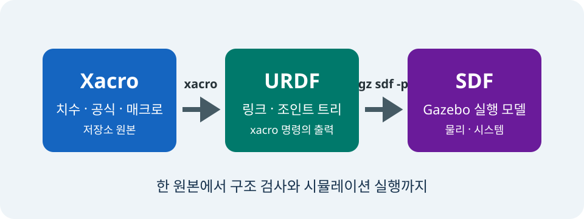

# Xacro로 `tutorial_bot` 만들기

> **난이도:** 초급  
> **Gazebo:** Harmonic  
> **ROS 2:** Jazzy  
> **선행 학습:** [첫 World](04-first-world.md)

## 학습 목표

- URDF, Xacro, SDF가 맡는 범위를 코드로 비교한다.
- Xacro include와 macro 호출이 최종 URDF로 전개되는 과정을 확인한다.
- `base_link`의 visual, collision, inertial을 직접 읽는다.
- 질량과 크기에서 직육면체 관성 모멘트를 계산한다.

## 하나의 로봇, 세 가지 표현

<figure markdown="span">
  
  <figcaption>그림 1. Xacro 하나를 원본으로 유지하고 도구가 URDF와 SDF를 차례로 생성한다.</figcaption>
</figure>

| 형식 | 주된 역할 | 이 저장소의 예 |
|---|---|---|
| URDF | ROS 로봇의 link·joint 트리를 표현한다. | `xacro` 명령이 만든 `/tmp/tutorial_bot-stage-01.urdf` |
| Xacro | 변수, 수식, include, macro로 URDF 재사용성을 높인다. | `urdf/stages/01-base.xacro`와 `urdf/macros/stage_components.xacro` |
| SDF | Gazebo world, physics, sensor, System plugin까지 표현한다. | `first-world.sdf`와 URDF에서 변환한 model SDF |

세 형식을 따로 유지하는 것이 아니다. 이 과정에서는 Xacro를 원본으로 두고, `xacro`가 URDF를 생성하며, Gazebo가 URDF를 SDF model로 변환한다.

## 1단계 Xacro의 실제 구조

첫번째로 우리가 사용할 1단계 파일은 include와 macro 호출만 가진다.

```xml
<!-- urdf/stages/01-base.xacro -->
<?xml version="1.0"?>
<robot xmlns:xacro="http://www.ros.org/wiki/xacro" name="tutorial_bot">
  <xacro:include filename="../macros/stage_components.xacro"/>
  <xacro:stage_base/>
</robot>
```

`xacro:include`가 재사용 가능한 정의를 불러오고, `xacro:stage_base`가 다음 macro를 호출한다.

```xml
<!-- urdf/macros/stage_components.xacro -->
<xacro:macro name="stage_base">
  <link name="base_link">
    <xacro:stage_box_inertia mass="5.0" x="0.45" y="0.32" z="0.12"/>
    <visual>
      <geometry><box size="0.45 0.32 0.12"/></geometry>
      <material name="tutorial_blue">
        <color rgba="0.10 0.35 0.80 1.0"/>
      </material>
    </visual>
    <collision>
      <geometry><box size="0.45 0.32 0.12"/></geometry>
    </collision>
  </link>
</xacro:macro>
```

macro를 사용하면 차체의 크기와 질량을 관성 계산에도 같은 값으로 전달할 수 있다. 수식을 한번만 정의하고, 값만 전달해서 재사용 가능하기 때문에 수동으로 값을 일일히 고칠 때 발생할 수 있는 휴먼 에러를 최소화 할 수 있다.

## 관성 macro 읽기

직육면체의 관성(Inertia)은 다음 Xacro 수식으로 계산한다.

```xml
<xacro:macro name="stage_box_inertia" params="mass x y z">
  <inertial>
    <mass value="${mass}"/>
    <inertia ixx="${mass * (y * y + z * z) / 12.0}"
             ixy="0.0" ixz="0.0"
             iyy="${mass * (x * x + z * z) / 12.0}"
             iyz="0.0"
             izz="${mass * (x * x + y * y) / 12.0}"/>
  </inertial>
</xacro:macro>
```

질량 $m=5.0\,\mathrm{kg}$, 크기 $x=0.45\,\mathrm{m}$, $y=0.32\,\mathrm{m}$, $z=0.12\,\mathrm{m}$를 대입하면 다음 값을 얻는다.

\[
I_{xx}=\frac{m(y^2+z^2)}{12}=0.0487
\]

\[
I_{yy}=\frac{m(x^2+z^2)}{12}=0.0904
\]

\[
I_{zz}=\frac{m(x^2+y^2)}{12}=0.1270\;\mathrm{kg\,m^2}
\]

??? note "수치가 어떻게 나오는가"
    예를 들어 $I_{xx}=5.0(0.32^2+0.12^2)/12=0.048666\ldots$이다. Xacro는 같은 식을 계산하고, 본문은 소수 넷째 자리로 반올림한다.

관성이 없거나 실제 형상과 크게 다르면 가속과 충돌 반응이 부자연스러워진다. visual은 보이는 모양, collision은 접촉 형상, inertial은 힘에 대한 반응을 맡는다.

## Xacro를 URDF로 전개하기

먼저 description package를 빌드하고 설치 공간을 source한다.

```bash
source /opt/ros/jazzy/setup.bash
cd examples/ros2_ws
colcon build --packages-select tutorial_bot_description --symlink-install
source install/setup.bash
cd ../..
```

설치된 1단계 파일을 URDF로 전개한다.

```bash
stage="$(ros2 pkg prefix --share tutorial_bot_description)/urdf/stages/01-base.xacro"
xacro "$stage" > /tmp/tutorial_bot-stage-01.urdf
check_urdf /tmp/tutorial_bot-stage-01.urdf
```

전개 결과에는 Xacro 태그가 사라지고 실제 URDF 값이 들어간다.

```bash
grep -nE '<link|<mass|<inertia|<box' /tmp/tutorial_bot-stage-01.urdf
```

핵심 결과는 다음 형태이다.

```xml
<link name="base_link">
  <inertial>
    <mass value="5.0"/>
    <inertia ixx="0.04866666666666667"
             ixy="0.0" ixz="0.0"
             iyy="0.090375"
             iyz="0.0"
             izz="0.12704166666666666"/>
  </inertial>
  <visual>
    <geometry><box size="0.45 0.32 0.12"/></geometry>
  </visual>
  <collision>
    <geometry><box size="0.45 0.32 0.12"/></geometry>
  </collision>
</link>
```

`check_urdf`가 `root Link: base_link`를 출력하면 link 트리가 유효하다.

## URDF를 Gazebo SDF로 변환하기

같은 URDF를 Gazebo가 읽는 model SDF로 변환하고 검사한다.

```bash
gz sdf -p /tmp/tutorial_bot-stage-01.urdf > /tmp/tutorial_bot-stage-01.sdf
gz sdf -k /tmp/tutorial_bot-stage-01.sdf
grep -nE '<model|<link|<visual|<collision|<inertial' \
  /tmp/tutorial_bot-stage-01.sdf
```

URDF의 `<robot name="tutorial_bot">`은 SDF의 `<model name="tutorial_bot">`로, `base_link`는 같은 이름의 SDF link로 변환된다. 1단계 inventory에는 `base_link` 하나만 있으며 wheel, sensor, DiffDrive plugin은 아직 없어야 한다.

## 문제 해결

- `package 'tutorial_bot_description' not found`가 나오면 workspace를 빌드한 뒤 `install/setup.bash`를 source한다.
- `xacro: command not found`가 나오면 `sudo apt install ros-jazzy-xacro`로 설치한다.
- `check_urdf`가 XML 오류를 내면 먼저 `xacro "$stage"`의 stderr에서 include 경로와 macro 이름을 확인한다.
- 1단계 결과에 wheel이나 sensor가 보이면 최종 Xacro가 아니라 `01-base.xacro`를 사용했는지 확인한다.

[다음: 바퀴와 Joint](06-joints.md)
