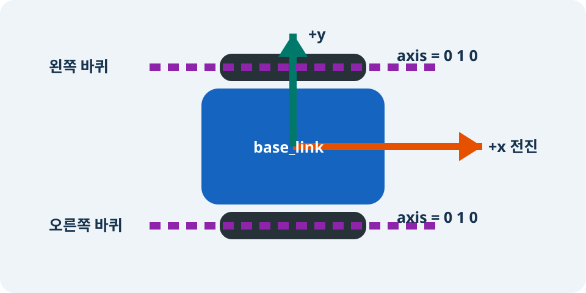

# 바퀴와 Joint 추가하기

> **난이도:** 초급  
> **Gazebo:** Harmonic  
> **ROS 2:** Jazzy  
> **선행 학습:** [첫 `tutorial_bot`](05-first-robot.md)

## 학습 목표

- link의 parent/child 관계와 joint의 자유도(DOF)를 설명합니다.
- 바퀴 원통과 joint axis가 같은 물리 축을 나타내도록 배치합니다.
- 설치된 2단계 모델에 센서가 섞이지 않았는지 확인합니다.

## link를 잇는 joint

<pre class="course-mermaid">
flowchart TD
  B[base_link - parent] --> LJ[left_wheel_joint]
  B --> RJ[right_wheel_joint]
  LJ --> LT[continuous - 1 DOF]
  RJ --> RT[continuous - 1 DOF]
  LT --> L[left_wheel_link - child]
  RT --> R[right_wheel_link - child]
</pre>

URDF 트리는 한 root link에서 시작합니다. 각 joint는 기준이 되는 **parent link**, 움직이는 **child link**, 허용할 운동을 정합니다.

| joint 종류 | 허용 운동 | 자유도 | 이 로봇에서의 용도 |
|---|---|---:|---|
| `fixed` | 없음 | 0 | 센서를 몸체에 고정할 때 |
| `revolute` | 제한된 축 회전 | 1 | 회전 각도 범위가 있는 관절 |
| <code class="course-nowrap">continuous</code> | 제한 없는 축 회전 | 1 | 좌우 바퀴 |

## 축을 눈으로 읽기

<figure markdown="span">
  
  <figcaption>그림 2. 두 바퀴의 joint axis는 y축과 나란하고, 바퀴는 그&nbsp;축을 중심으로 굴러 x방향으로 이동합니다.</figcaption>
</figure>

두 joint의 `<axis xyz="0 1 0"/>`은 회전축이 +y 방향임을 뜻합니다. URDF cylinder의 기본 길이 축은 z축이므로 visual과 collision을 x축으로 $90^\circ$ 회전해 원통의 길이 축도 y축에 맞춥니다. 축과 원통 방향이 다르면 바퀴가 옆으로 도는 것처럼 보이거나 접촉 운동이 잘못됩니다.

## 설치된 2단계 모델 검사

```bash
source /opt/ros/jazzy/setup.zsh
stage="$(ros2 pkg prefix --share tutorial_bot_description)/urdf/stages/02-wheels-and-joints.xacro"
xacro "$stage" > /tmp/tutorial_bot-stage-02.urdf
check_urdf /tmp/tutorial_bot-stage-02.urdf
gz sdf -p /tmp/tutorial_bot-stage-02.urdf > /tmp/tutorial_bot-stage-02.sdf
gz sdf -k /tmp/tutorial_bot-stage-02.sdf
```

정상 inventory는 link 3개(`base_link`, 좌우 wheel), joint 2개뿐입니다. DiffDrive plugin과 LiDAR, camera, IMU는 아직 없어야 합니다.

```text
root Link: base_link has 2 child(ren)
    child(1): left_wheel_link
    child(2): right_wheel_link
```

## 원통 바퀴의 관성

바퀴 하나는 질량 $m=0.3\,\mathrm{kg}$, 반지름 $r=0.06\,\mathrm{m}$, 폭 $w=0.04\,\mathrm{m}$인 실린더입니다. y축이 회전축이므로

\[
I_{yy}=\frac{mr^2}{2}=0.000540\,\mathrm{kg\,m^2}
\]

이고, 나머지 두 축은

\[
I_{xx}=I_{zz}=\frac{m(3r^2+w^2)}{12}=0.000310\,\mathrm{kg\,m^2}
\]

입니다. 이 값은 `stage_wheel_inertia` 매크로의 계산과 같습니다.

??? note "왜 회전축의 식이 다른가요?"
    질량이 회전축에서 얼마나 멀리 분포하는지가 관성을 결정합니다. 실린더 중심축 둘레 회전에는 반지름만 관여하지만, 옆으로 넘어뜨리는 두 축에는 반지름과 폭이 모두 관여합니다. 더 긴 유도는 중급 물리 장에서 다룹니다.

## 문제 해결

- `joint xml is not initialized correctly`: parent와 child link 이름이 실제 link 이름과 같은지 확인합니다.
- 바퀴가 차체 안쪽에 있음: joint origin의 y 값이 왼쪽 `+0.19`, 오른쪽 `-0.19`인지 확인합니다.
- 바퀴가 다른 축으로 회전함: cylinder origin의 `rpy`와 joint axis를 함께 확인합니다.

## 다음 단계

[DiffDrive](07-diff-drive.md)에서 두 바퀴 속도와 로봇 속도의 관계를 계산합니다.
