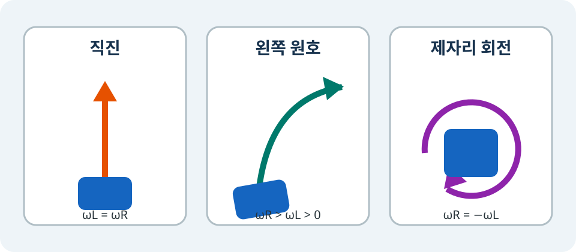

# DiffDrive로 `tutorial_bot` 움직이기

> **난이도:** 초급  
> **Gazebo:** Harmonic  
> **ROS 2:** Jazzy  
> **선행 학습:** [바퀴와 Joint](06-joints.md)

## 학습 목표

- 좌우 바퀴 각속도에서 로봇의 선속도와 각속도를 계산합니다.
- 원하는 직진, 원호, 제자리 회전에 필요한 바퀴 속도를 역으로 계산합니다.
- Gazebo Transport 명령 뒤 실제 odometry의 방향과 궤적을 확인합니다.

## 설치된 3단계와 plugin 연결

```bash
source /opt/ros/jazzy/setup.zsh
stage="$(ros2 pkg prefix --share tutorial_bot_description)/urdf/stages/03-diff-drive.xacro"
xacro "$stage" > /tmp/tutorial_bot-stage-03.urdf
check_urdf /tmp/tutorial_bot-stage-03.urdf
./scripts/check_diff_drive.sh --scenarios straight,arc,spin --evidence /tmp/tutorial-diff-drive-evidence
```

3단계 inventory는 2단계의 link 3개와 joint 2개에 `gz::sim::systems::DiffDrive` plugin만 더합니다. 센서는 4단계 전까지 없어야 합니다. plugin은 `left_wheel_joint`, `right_wheel_joint`, 바퀴 반지름 $r=0.06\,\mathrm{m}$, 바퀴 중심 간격 $L=0.38\,\mathrm{m}$를 사용합니다.

<figure markdown="span">
  
  <figcaption>그림 3. 같은 속도는 직진, 서로 다른 양의 속도는 원호, 반&#x2060;대&nbsp;속도는 제자리 회전을 만듭니다.</figcaption>
</figure>

## 바퀴 속도에서 로봇 속도로

왼쪽과 오른쪽 바퀴 각속도를 각각 $\omega_L$, $\omega_R$라 하면 로봇 중심의 선속도 $v$와 반시계 방향 각속도 $\omega$는

\[
v=\frac{r}{2}(\omega_R+\omega_L),\qquad
\omega=\frac{r}{L}(\omega_R-\omega_L)
\]

입니다. 오른쪽 바퀴가 더 빠르면 $\omega>0$이므로 왼쪽으로 돕니다.

반대로 원하는 $v,\omega$를 바퀴 명령으로 바꾸면

\[
\omega_R=\frac{v+L\omega/2}{r},\qquad
\omega_L=\frac{v-L\omega/2}{r}
\]

입니다.

??? note "역기구학 식 유도"
    첫 두 식에서 $2v/r=\omega_R+\omega_L$, $L\omega/r=\omega_R-\omega_L$를 얻습니다. 두 식을 더하면 $2\omega_R=(2v+L\omega)/r$, 빼면 $2\omega_L=(2v-L\omega)/r$가 되어 위 식을 얻습니다. 초급 핵심에서는 행렬을 쓰지 않습니다.

## 세 가지 계산 예제

### 1. 직진

$v=0.24\,\mathrm{m/s}$, $\omega=0$이면

\[
\omega_R=\omega_L=\frac{0.24}{0.06}=4.00\,\mathrm{rad/s}
\]

입니다. 두 바퀴가 같으므로 y 위치와 heading은 거의 변하지 않고 x가 증가합니다.

### 2. 왼쪽 원호

$v=0.18\,\mathrm{m/s}$, $\omega=0.60\,\mathrm{rad/s}$이면

\[
\omega_R=\frac{0.18+0.38(0.60)/2}{0.06}=4.90\,\mathrm{rad/s}
\]

\[
\omega_L=\frac{0.18-0.38(0.60)/2}{0.06}=1.10\,\mathrm{rad/s}
\]

입니다. 오른쪽 바퀴가 더 빠르므로 x와 y가 함께 증가하고 heading이 양수가 됩니다. 순간 회전 반지름은 $R=v/\omega=0.30\,\mathrm{m}$입니다.

### 3. 제자리 회전

$v=0$, $\omega=1.00\,\mathrm{rad/s}$이면

\[
\omega_R=+3.17\,\mathrm{rad/s},\qquad
\omega_L=-3.17\,\mathrm{rad/s}
\]

입니다. x와 y 변화는 작고 heading만 양의 방향으로 변합니다.

## Gazebo Transport에서 직접 관찰

GUI를 실행한 상태라면 다음과 같이 왼쪽 원호 명령을 보낼 수 있습니다.

```bash
gz topic -t /model/tutorial_bot/cmd_vel -m gz.msgs.Twist \
  -p 'linear: {x: 0.18} angular: {z: 0.60}'
gz topic -e -t /model/tutorial_bot/odometry
```

검증 스크립트는 각 scenario를 새 world에서 시작하고 pose와 twist를 읽습니다. `straight`는 양의 x와 거의 0인 y/yaw, `arc`는 양의 x/y/yaw, `spin`은 작은 이동과 양의 yaw를 요구합니다. 출력 문자열만이 아니라 odometry 수치가 조건을 만족해야 PASS입니다.

## 문제 해결

- 토픽이 없음: 3단계 파일에 DiffDrive plugin이 있고 `gz sim` server가 완전히 준비됐는지 확인합니다.
- 직진 명령인데 회전함: wheel separation/radius뿐 아니라 left/right joint 매핑이 바뀌지 않았는지 확인합니다.
- 왼쪽 원호가 오른쪽으로 감: `left_joint`와 `right_joint`가 뒤바뀐 전형적인 증상입니다.
- odometry가 0으로만 나옴: 명령 토픽이 `/model/tutorial_bot/cmd_vel`인지 확인하고 bounded checker를 다시 실행합니다.

## 다음 단계

[센서](08-sensors.md)에서 4단계 모델에 LiDAR, camera, IMU를 추가합니다.
