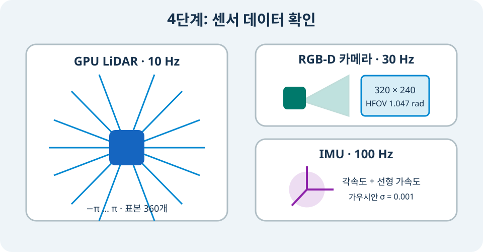

# 센서를 Xacro로 모듈화하고 관측하기

> **난이도:** 초급
> **Gazebo:** Harmonic
> **ROS 2:** Jazzy
> **선행 학습:** DiffDrive

## 학습 목표

- 센서의 물리 mount와 Gazebo 센서 설정을 서로 다른 Xacro로 분리한다.
- wheel odom, IMU, mono·stereo·RGB-D·fisheye camera, 2D·3D LiDAR의 주요 파라미터를 읽는다.
- Gazebo Transport 메시지를 먼저 확인한 뒤 ROS 2로 bridge하고 RViz에서 시각화한다.
- 높은 해상도와 갱신률이 simulation 성능에 미치는 영향을 설명한다.

## 1. 센서는 세 층으로 구성한다

센서 실습에서는 다음 세 층을 분리한다. link와 fixed joint는 센서 좌표계를 만들고, `<sensor>`는 관측 모델을 정의하며, world System은 센서를 실제로 갱신한다. 어느 한 층이라도 빠지면 topic 또는 TF가 생기지 않는다.

| 층 | 파일 | 책임 |
|---|---|---|
| mount | `urdf/sensors/sensor_mounts.xacro` | `*_link`, optical frame, fixed joint |
| 관측 모델 | `urdf/sensors/lidar.xacro`, `cameras.xacro`, `imu.xacro` | 형식, 해상도, 범위, noise, topic |
| 실행 System | `worlds/sensor-test.sdf` | Sensors(`ogre2`), Imu System, physics |

world에는 렌더링 센서를 갱신하는 Sensors System과 IMU를 갱신하는 Imu System을 둔다.

```xml
<plugin filename="gz-sim-sensors-system"
        name="gz::sim::systems::Sensors">
  <render_engine>ogre2</render_engine>
</plugin>
<plugin filename="gz-sim-imu-system"
        name="gz::sim::systems::Imu"/>
```

Camera와 GPU LiDAR는 visual을 렌더링하므로 `ogre2`가 필요하다. IMU는 별도 System이 필요하다. headless 실행도 센서 렌더링을 완전히 생략한다는 뜻은 아니다.

`sensor-test.sdf`에는 조명과 빨간 `sensor_target` 상자를 둔다. Camera에서는 색과 윤곽을, depth·3D LiDAR에서는 거리를, 2D LiDAR에서는 전방 반환점을 같은 물체로 교차 확인할 수 있다.

<figure class="course-figure" markdown="span">
  
  <figcaption>그림 4. 센서마다 관측량과 갱신률이 다르므로 topic 형식과 timestamp를 함께 확인한다.</figcaption>
</figure>

## 2. 센서 Xacro를 include하고 호출한다

최종 로봇 파일은 센서 구현을 복사하지 않고 네 파일을 include한다.

```xml
<robot xmlns:xacro="http://www.ros.org/wiki/xacro" name="tutorial_bot">
  <xacro:include filename="sensors/sensor_mounts.xacro"/>
  <xacro:include filename="sensors/lidar.xacro"/>
  <xacro:include filename="sensors/cameras.xacro"/>
  <xacro:include filename="sensors/imu.xacro"/>

  <!-- base_link와 두 구동 바퀴, caster를 정의한 뒤 mount를 붙인다. -->
  <xacro:tutorial_sensor_mounts/>

  <xacro:gpu_lidar_2d reference="lidar_link" sensor_name="lidar"
                       topic="$(arg lidar_topic)"
                       frame_id="$(arg tf_prefix)lidar_link"/>
  <xacro:rgbd_camera_sensor reference="camera_link" sensor_name="camera"
                             topic="$(arg camera_topic)"
                             frame_id="$(arg tf_prefix)camera_optical_frame"/>
  <xacro:imu_sensor reference="imu_link" sensor_name="imu"
                    topic="$(arg imu_topic)"
                    frame_id="$(arg tf_prefix)imu_link"/>
</robot>
```

재사용의 핵심은 macro의 `topic`, `frame_id`, `update_rate`, `samples`를 인자로 만드는 것이다. 같은 sensor macro를 다른 로봇에서 호출할 때 topic과 mount만 바꾸면 된다. `04-sensors-final.xacro`는 기본 2D LiDAR·RGB-D·IMU 구성을, `05-sensor-gallery.xacro`는 모든 센서 구성을 조립한다.

## 3. wheel odom은 주행 System의 관측값이다

wheel odom은 별도의 `<sensor>`가 아니라 바퀴 회전과 기구학을 사용하는 DiffDrive System의 출력이다.

```xml
<plugin filename="gz-sim-diff-drive-system"
        name="gz::sim::systems::DiffDrive">
  <left_joint>left_wheel_joint</left_joint>
  <right_joint>right_wheel_joint</right_joint>
  <wheel_separation>0.38</wheel_separation>
  <wheel_radius>0.06</wheel_radius>
  <odom_publish_frequency>30</odom_publish_frequency>
  <frame_id>odom</frame_id>
  <child_frame_id>base_link</child_frame_id>
</plugin>
```

`wheel_separation`과 `wheel_radius`가 실제 URDF 치수와 다르면 로봇은 움직여도 odometry scale과 회전량이 틀어진다. Gazebo topic `/model/tutorial_bot/odometry`를 ROS `/odom`으로 bridge한 뒤 `nav_msgs/msg/Odometry`의 pose와 twist를 확인한다.

## 4. 2D LiDAR를 구성한다

기본 macro의 핵심은 다음과 같다.

```xml
<sensor name="${sensor_name}" type="gpu_lidar">
  <topic>${topic}</topic>
  <gz_frame_id>${frame_id}</gz_frame_id>
  <always_on>true</always_on>
  <update_rate>${update_rate}</update_rate>
  <lidar>
    <scan>
      <horizontal>
        <samples>${samples}</samples>
        <resolution>1</resolution>
        <min_angle>${min_angle}</min_angle>
        <max_angle>${max_angle}</max_angle>
      </horizontal>
    </scan>
    <range>
      <min>${min_range}</min>
      <max>${max_range}</max>
      <resolution>${range_resolution}</resolution>
    </range>
    <noise>
      <type>gaussian</type><mean>0.0</mean>
      <stddev>${noise_stddev}</stddev>
    </noise>
  </lidar>
</sensor>
```

기본값은 10 Hz, 360 sample, `-π..π`, `0.12..10.0 m`, 거리 해상도 0.01 m, Gaussian noise 표준편차 0.01 m이다. 두 끝 각도를 모두 sample에 포함하므로 각도 간격은 다음과 같다.

\[
\Delta\theta=\frac{\pi-(-\pi)}{360 - 1}=\frac{2\pi}{359}\approx1.0028^\circ
\]

반환점이 범위 안에 없으면 `ranges`에 `inf`가 들어갈 수 있다. `inf`는 10 m 물체가 아니라 유효 반환점이 없다는 뜻이다.

## 5. 3D LiDAR는 vertical scan을 추가한다

3D LiDAR도 `type="gpu_lidar"`와 `<lidar>`를 사용한다. 차이는 수직 광선이 하나보다 많다는 점이다.

```xml
<scan>
  <horizontal>
    <samples>640</samples>
    <min_angle>-3.14159265359</min_angle>
    <max_angle>3.14159265359</max_angle>
  </horizontal>
  <vertical>
    <samples>16</samples>
    <min_angle>-0.261799</min_angle>  <!-- -15 deg -->
    <max_angle>0.261799</max_angle>   <!-- +15 deg -->
  </vertical>
</scan>
```

한 frame은 최대 `640 × 16 = 10,240` point를 만든다. 10 Hz라면 렌더링과 bridge가 처리할 양도 커지므로 처음에는 sample과 update rate를 낮게 둔다. Gazebo의 `/tutorial_bot/lidar_3d/points`(`gz.msgs.PointCloudPacked`)를 ROS `sensor_msgs/msg/PointCloud2`로 변환해 RViz의 PointCloud2 display로 본다.

## 6. IMU의 noise를 축마다 정의한다

IMU는 angular velocity와 linear acceleration의 세 축을 발행한다. 예제는 각 축에 같은 표준편차를 적용한다.

```xml
<sensor name="${sensor_name}" type="imu">
  <topic>${topic}</topic>
  <gz_frame_id>${frame_id}</gz_frame_id>
  <update_rate>100</update_rate>
  <imu>
    <angular_velocity>
      <x><noise type="gaussian"><mean>0.0</mean><stddev>0.001</stddev></noise></x>
      <y><noise type="gaussian"><mean>0.0</mean><stddev>0.001</stddev></noise></y>
      <z><noise type="gaussian"><mean>0.0</mean><stddev>0.001</stddev></noise></z>
    </angular_velocity>
    <linear_acceleration>
      <!-- y, z도 같은 구조로 정의한다. -->
      <x><noise type="gaussian"><mean>0.0</mean><stddev>0.001</stddev></noise></x>
    </linear_acceleration>
  </imu>
</sensor>
```

정지 상태에서도 값이 정확히 0일 필요는 없다. `imu_link`의 축 방향, 중력에 따른 가속도, timestamp 증가, 표준편차 범위를 함께 확인한다. RViz 기본 배포에는 IMU display가 없으므로 `ros-jazzy-rviz-imu-plugin`을 설치해야 한다.

## 7. Camera 네 종류를 구성한다

### 7.1 Mono camera

Mono camera는 `type="camera"`와 grayscale `L8` format을 사용한다.

```xml
<sensor name="mono_camera" type="camera">
  <topic>/tutorial_bot/mono/image</topic>
  <update_rate>30</update_rate>
  <camera>
    <horizontal_fov>1.047</horizontal_fov>
    <image><width>640</width><height>480</height><format>L8</format></image>
    <clip><near>0.10</near><far>30.0</far></clip>
  </camera>
</sensor>
```

일반 Camera와 wide-angle Camera는 image topic의 마지막 `/image`를 기준으로 같은 base 아래에 `/camera_info`를 만든다. 따라서 위 mono 예제의 정보 topic은 `/tutorial_bot/mono/camera_info`이다. 반면 RGB-D macro에는 `/tutorial_bot/camera`라는 base만 넘긴다. RGB-D System이 그 아래에 `/image`, `/depth_image`, `/points`, `/camera_info`를 각각 붙이기 때문이다.

### 7.2 Stereo camera

Harmonic에서 별도의 표준 `stereo` sensor type을 가정하지 않는다. 동일한 해상도·시야각·갱신률을 가진 left/right camera 두 개를 0.10 m baseline으로 배치한다.

```xml
<xacro:stereo_camera_pair
    left_reference="stereo_left_link"
    right_reference="stereo_right_link"
    topic_prefix="/tutorial_bot/stereo"
    left_frame_id="stereo_left_optical_frame"
    right_frame_id="stereo_right_optical_frame"
    update_rate="20" width="640" height="480"/>
```

`sensor_gallery_mounts`가 left/right link를 y축 `+0.05 m`, `-0.05 m`에 둔다. 두 image의 timestamp와 camera info를 짝지어 사용하는 것은 이후 stereo 처리 node의 책임이다.

### 7.3 RGB-D camera

`rgbd_camera`는 RGB image, depth image, camera info, point cloud를 한 설정에서 만든다. 예제는 네 출력의 기준 frame을 `camera_optical_frame`으로 맞추고 30 Hz로 갱신한다.

```xml
<sensor name="camera" type="rgbd_camera">
  <topic>/tutorial_bot/camera</topic>
  <update_rate>30</update_rate>
  <camera>
    <horizontal_fov>1.047</horizontal_fov>
    <image><width>320</width><height>240</height><format>R8G8B8</format></image>
    <clip><near>0.1</near><far>10.0</far></clip>
    <optical_frame_id>camera_optical_frame</optical_frame_id>
  </camera>
</sensor>
```

RGB는 `/tutorial_bot/camera/image`, depth는 `/tutorial_bot/camera/depth_image`, point cloud는 `/tutorial_bot/camera/points`에 나타난다.

### 7.4 Fisheye camera

Harmonic의 wide-angle camera는 `type="wideanglecamera"`와 `<lens>`를 함께 사용한다. 예제는 equisolid-angle 투영, 약 160° HFOV, 512 cubemap texture를 사용한다.

```xml
<sensor name="fisheye_camera" type="wideanglecamera">
  <topic>/tutorial_bot/fisheye/image</topic>
  <camera>
    <horizontal_fov>2.792527</horizontal_fov>
    <image><width>640</width><height>480</height><format>R8G8B8</format></image>
    <lens>
      <type>equisolid_angle</type>
      <scale_to_hfov>true</scale_to_hfov>
      <cutoff_angle>1.57079632679</cutoff_angle>
      <env_texture_size>512</env_texture_size>
    </lens>
  </camera>
</sensor>
```

`env_texture_size`를 높이면 선명도가 좋아지지만 GPU 비용이 증가한다. custom lens가 필요하면 `<type>custom</type>`과 `<custom_function>`의 `c1`, `c2`, `c3`, `f`, `fun`을 명시한다.

## 8. 기본 센서를 자동 검증한다

저장소 루트에서 다음을 실행한다.

```bash
source /opt/ros/jazzy/setup.bash
stage="$(ros2 pkg prefix --share tutorial_bot_description)/urdf/stages/04-sensors-final.xacro"
xacro "$stage" > /tmp/tutorial_bot.urdf
check_urdf /tmp/tutorial_bot.urdf
./scripts/check_sensors.sh
```

checker는 `04-sensors-final.xacro`를 확장하고 실제 Gazebo 메시지를 검사한다. LiDAR 360개 range, 320×240 RGB-D image, 100 Hz IMU를 설정값과 비교한다.

```text
LiDAR scan verified: 360 ranges, ... obstacle readings.
Camera image verified: 320x240.
```

## 9. sensor gallery를 실행한다

터미널 1에서 world를 연다.

```bash
source /opt/ros/jazzy/setup.bash
source examples/ros2_ws/install/setup.bash
world="$(ros2 pkg prefix --share tutorial_bot_gazebo)/worlds/sensor-test.sdf"
gz sim -r "$world"
```

터미널 2에서 gallery Xacro를 확장해 spawn한다.

```bash
source /opt/ros/jazzy/setup.bash
source examples/ros2_ws/install/setup.bash
gallery="$(ros2 pkg prefix --share tutorial_bot_description)/urdf/stages/05-sensor-gallery.xacro"
xacro "$gallery" > /tmp/tutorial_bot_sensor_gallery.urdf
ros2 run ros_gz_sim create -world sensor_test \
  -name tutorial_bot_sensor_gallery \
  -file /tmp/tutorial_bot_sensor_gallery.urdf -z 0.12
```

Gazebo Transport에서 실제 topic과 type을 확인한다.

```bash
gz topic -l | rg '/tutorial_bot/(lidar|lidar_3d|imu|mono|stereo|camera|fisheye)'
gz topic -i -t /tutorial_bot/lidar
gz topic -i -t /tutorial_bot/lidar_3d/points
gz topic -e -t /tutorial_bot/imu -n 1
```

topic 이름을 추측하지 말고 `gz topic -l` 결과를 먼저 사용한다. 센서 생성에 실패하면 `gz sim -v 4`로 다시 실행해 Sensors System과 render engine 오류를 확인한다.

## 10. ROS 2와 RViz에서 시각화한다

다음 장의 gallery bridge를 실행한 뒤 RViz 설정을 연다.
이 RViz 시각화 튜토리얼은 뒤에 나올 `ros-gz-bridge` 튜토리얼을 끝내고 다시 해보는 것을 추천한다.

```bash
sudo apt install ros-jazzy-rviz-imu-plugin
rviz2 -d "$(ros2 pkg prefix --share tutorial_bot_bringup)/rviz/tutorial_bot.rviz"
```

Fixed Frame은 `odom`으로 둔다. 기본 display는 `/scan`, `/imu`, `/camera/image`, `/camera/points`, `/odom`, `/wheel_odom_path`를 사용한다. gallery의 Mono·Stereo·Fisheye·3D LiDAR display는 필요할 때 체크해 활성화한다.

| 센서 | ROS topic | RViz display |
|---|---|---|
| wheel odom | `/odom`, `/wheel_odom_path` | Odometry, Path |
| IMU | `/imu` | `rviz_imu_plugin/Imu` |
| mono·stereo·fisheye | `/mono/image`, `/stereo/*/image`, `/fisheye/image` | Image |
| RGB-D | `/camera/image`, `/camera/points` | Camera, PointCloud2 |
| 2D LiDAR | `/scan` | LaserScan |
| 3D LiDAR | `/lidar_3d/points` | PointCloud2 |

## 자주 발생하는 문제

### Gazebo topic이 없다

world에 Sensors System과 Imu System이 있는지, simulation이 재생 중인지, sensor가 달린 모델이 spawn됐는지 확인한다.

### RViz에 데이터가 있지만 보이지 않는다

`header.frame_id`에서 Fixed Frame까지 TF가 연결되는지 확인한다. image만 보는 Image display는 TF가 없어도 보이지만 LaserScan과 PointCloud2는 올바른 TF가 필요하다.

### 실제 시간보다 topic rate가 낮다

Camera 수, image 크기, LiDAR sample 수, update rate를 한 번에 높였는지 확인한다. 먼저 `640×480`, 10~20 Hz로 시작하고 `gz stats`의 real-time factor를 보면서 늘린다.

## 정리

센서 mount, 센서 macro, world System을 분리하면 같은 관측 모델을 다른 로봇에도 재사용할 수 있다. 다음 장에서는 Gazebo와 ROS 2의 서로 다른 transport를 YAML bridge로 연결한다.

[이전: DiffDrive](07-diff-drive.md) · [다음: Gazebo Fuel](09-gazebo-fuel.md)
