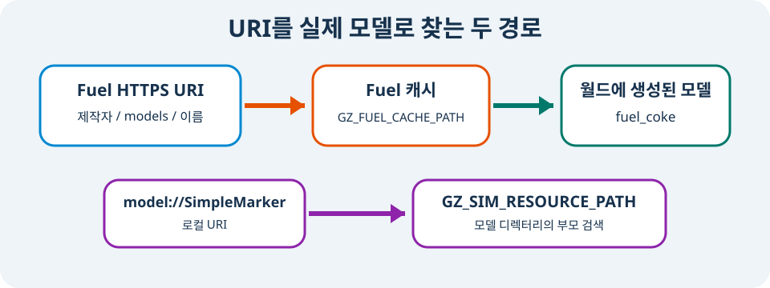

# Fuel model 추가하기

> **난이도:** 초급  
> **Gazebo:** Harmonic  
> **ROS 2:** Jazzy  
> **선행 학습:** 센서

## 학습 목표

- Gazebo Fuel URI의 owner, resource 종류, model 이름을 읽는다.
- Fuel model을 SDF world의 `<include>`로 배치한다.
- Fuel download cache와 로컬 `GZ_SIM_RESOURCE_PATH`의 책임을 구분한다.
- 외부 model을 사용하기 전에 라이선스와 재현 조건을 기록한다.

## Fuel URI 읽기

Gazebo Fuel은 Gazebo용 model과 world를 제공하는 온라인 자산 저장소이다. 이 장은 OpenRobotics의 `Coke` model을 사용한다.

```text
https://fuel.gazebosim.org/1.0/OpenRobotics/models/Coke
                                └ owner ┘ └종류┘ └이름┘
```

Gazebo가 이 URI를 읽으면 필요한 파일을 내려받아 Fuel cache에 보관하고 다음 실행에서 재사용한다. 처음 실행할 때는 네트워크 연결이 필요하다. 저장소에는 다운로드 cache를 commit하지 않고 URI와 사용 조건만 기록한다.

<figure class="course-figure" markdown="span">
  
  <figcaption>그림 5. Fuel HTTPS URI는 download cache를 거치고, <code>model://</code> URI는 resource path를 검색한다.</figcaption>
</figure>

## 실제 world의 `<include>`

`examples/gazebo/worlds/fuel-world.sdf`는 Fuel model을 다음처럼 포함한다.

```xml
<include>
  <name>fuel_coke</name>
  <pose>0 0 0 0 0 0</pose>
  <static>true</static>
  <uri>https://fuel.gazebosim.org/1.0/OpenRobotics/models/Coke</uri>
</include>
```

각 태그의 역할은 다음과 같다.

| 태그 | 이 예제 값 | 역할 |
|---|---|---|
| `uri` | Fuel HTTPS 주소 | 어떤 원본 model을 가져올지 정한다. |
| `name` | `fuel_coke` | 현재 world 안에서 사용할 instance 이름을 정한다. |
| `pose` | `0 0 0 0 0 0` | world frame 기준 배치를 정한다. |
| `static` | `true` | 이 instance를 물리적으로 고정한다. |

같은 원본 model도 이름과 pose를 바꿔 여러 번 배치할 수 있다.

```xml
<include>
  <name>fuel_coke_left</name>
  <pose>1.0 0.6 0 0 0 0</pose>
  <uri>https://fuel.gazebosim.org/1.0/OpenRobotics/models/Coke</uri>
</include>
<include>
  <name>fuel_coke_right</name>
  <pose>1.0 -0.6 0 0 0 0</pose>
  <uri>https://fuel.gazebosim.org/1.0/OpenRobotics/models/Coke</uri>
</include>
```

두 instance는 cache의 같은 자산을 재사용하지만 world 안에서는 서로 다른 entity이다.

## 실습 1: 다운로드와 cache 확인하기

world 실행과 다운로드 문제를 분리하려면 model을 먼저 내려받는다.

```bash
gz fuel download \
  -u 'https://fuel.gazebosim.org/1.0/OpenRobotics/models/Coke'
```

기본 cache는 보통 `~/.gz/fuel`이다. 실습 cache를 저장소 작업 파일과 분리하려면 환경 변수를 명시한다.

```bash
mkdir -p .fuel-cache/
export GZ_FUEL_CACHE_PATH="$PWD/.fuel-cache"
gz fuel download \
  -u 'https://fuel.gazebosim.org/1.0/OpenRobotics/models/Coke'
find "$GZ_FUEL_CACHE_PATH" -type f \
  \( -name model.config -o -name model.sdf \) -print
```

성공 문구만 확인하지 않고 실제 `model.config`와 `model.sdf`가 생겼는지 검사한다. `.fuel-cache`는 실행 환경에서 다시 만들 수 있는 파일이므로 Git에 추가하지 않는다.

## 실습 2: world 검사와 실행

온라인 include가 있는 SDF도 실행 전에 구조를 검사한다.

```bash
gz sdf -k examples/gazebo/worlds/fuel-world.sdf
```

headless 검증 스크립트는 임시 cache를 만들고, model을 다운로드하고, 실행 중인 world의 entity까지 확인한다.

```bash
./scripts/check_fuel_world.sh
```

정상 출력은 다음 형태이다.

```text
Requesting state for world [fuel_world]...

Available models:
    - ground
    - fuel_coke
Fuel model include verified.
```

GUI에서 직접 관찰하려면 다음 명령을 실행한다. 최초 실행은 다운로드 때문에 시간이 더 걸릴 수 있다.

```bash
gz sim -r examples/gazebo/worlds/fuel-world.sdf
```

다른 terminal에서 instance 이름을 확인한다.

```bash
gz model --list | grep -Eq '^[[:space:]]*-[[:space:]]+fuel_coke$'
```

URI가 cache 자산으로 해석되고, 그 자산이 `fuel_coke` entity로 만들어져야 이 명령이 성공한다.

## 로컬 model의 두 필수 파일

Fuel 자산을 직접 관리하거나 사내 model을 사용할 때는 보통 model 디렉터리에 `model.config`와 `model.sdf`를 둔다.

```text
local_models/
└── SimpleMarker/
    ├── model.config
    └── model.sdf
```

`model.config`는 이름과 실제 SDF 파일을 연결한다.

```xml
<?xml version="1.0"?>
<model>
  <name>SimpleMarker</name>
  <version>1.0</version>
  <sdf version="1.10">model.sdf</sdf>
  <author>
    <name>Tutorial Author</name>
    <email>author@example.com</email>
  </author>
  <description>재사용 가능한 정적 표식이다.</description>
</model>
```

`model.sdf`는 실제 geometry를 정의한다.

```xml
<?xml version="1.0"?>
<sdf version="1.10">
  <model name="SimpleMarker">
    <static>true</static>
    <link name="link">
      <visual name="visual">
        <geometry>
          <cylinder><radius>0.1</radius><length>0.5</length></cylinder>
        </geometry>
        <material><diffuse>1 0.6 0 1</diffuse></material>
      </visual>
    </link>
  </model>
</sdf>
```

Gazebo가 `model://SimpleMarker`를 찾도록 model 디렉터리의 부모를 resource path에 추가한다.

```bash
export GZ_SIM_RESOURCE_PATH="$PWD/local_models${GZ_SIM_RESOURCE_PATH:+:${GZ_SIM_RESOURCE_PATH}}"
```

world에서는 HTTPS URI 대신 다음처럼 쓴다.

```xml
<include>
  <name>training_marker</name>
  <pose>2 0 0.25 0 0 0</pose>
  <uri>model://SimpleMarker</uri>
</include>
```

`GZ_FUEL_CACHE_PATH`는 Fuel downloader가 온라인 자산을 보관할 위치이다. `GZ_SIM_RESOURCE_PATH`는 `model://`과 mesh URI를 로컬에서 검색할 디렉터리 목록이다. 둘을 같은 용도로 사용하지 않는다.

## 재현성과 라이선스 확인

외부 model을 tutorial이나 프로젝트에 넣기 전에는 다음 항목을 기록한다.

- 정확한 Fuel URI와 가능하면 사용한 resource version
- model 작성자와 라이선스
- 원본을 수정했는지 여부와 수정 파일의 라이선스 고지
- 최초 실행에 네트워크가 필요한지 여부
- offline 환경에서 사용할 대체 경로

Fuel page에 보인다는 사실만으로 임의 재배포가 허용되는 것은 아니다. 자산 파일을 저장소에 복사하기 전에는 해당 model의 라이선스를 확인해야 한다.

## 자주 발생하는 문제

### 다운로드가 실패한다

네트워크 연결과 Fuel URI의 owner·model 이름을 확인한다. `gz fuel download -u <URI>`를 먼저 실행하면 URI·인증·cache 문제를 world 실행과 분리할 수 있다.

### `model://` URI를 찾지 못한다

`GZ_SIM_RESOURCE_PATH`가 `SimpleMarker` 자체가 아니라 그 부모인 `local_models`를 가리키는지 확인한다. 다음 명령으로 현재 값을 확인한다.

```bash
printf '%s\n' "$GZ_SIM_RESOURCE_PATH" | tr ':' '\n'
```

### 이전 model이 계속 보인다

같은 URI의 cache를 재사용하고 있을 수 있다. 먼저 사용 중인 `GZ_FUEL_CACHE_PATH`를 확인하고, 삭제가 필요하면 실행 중인 Gazebo를 종료한 뒤 정확한 model cache 경로만 정리한다. 프로젝트 전체나 홈 디렉터리를 재귀 삭제하지 않는다.

### cache를 Git에 넣어도 되는가

넣지 않는다. cache는 사용자 환경에 속하고 URI에서 다시 만들 수 있어야 한다. offline 배포가 필요하다면 라이선스를 확인한 뒤 별도의 명시적 자산 디렉터리와 manifest를 사용한다.

## 정리

Fuel HTTPS URI는 온라인 model을 cache로 가져오고, `<include>`는 그 model의 world instance를 만든다. 로컬 `model://` URI는 `GZ_SIM_RESOURCE_PATH`에서 model을 찾는다. 다음 장에서는 Gazebo Transport와 ROS 2 DDS 사이의 메시지 bridge를 구성한다.

[이전: 센서](08-sensors.md) · [다음: ROS 2와 연결](10-ros-gz-bridge.md)
