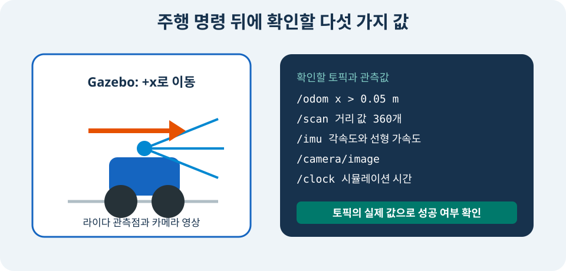

# 프로젝트: ROS 2로 주행하고 RViz에서 관측하기

> **난이도:** 초급 프로젝트
> **Gazebo:** Harmonic
> **ROS 2:** Jazzy
> **선행 학습:** `ros_gz_bridge`

## 프로젝트 목표

지금까지 만든 `tutorial_bot`을 하나의 ROS 2 launch로 실행한다. keyboard teleop으로 주행하고, Gazebo와 ROS 양쪽에서 odometry를 확인하며, RViz에서 robot TF·2D LiDAR·RGB-D point cloud·IMU·wheel odom trajectory를 동시에 관측한다.

```text
tutorial_bot
├── base_link
├── left/right drive wheel + fixed caster
├── DiffDrive 또는 gz_ros2_control
├── 2D LiDAR + RGB-D camera + IMU
├── ros_gz_bridge + ros_gz_image
└── robot_state_publisher + odom_to_path + RViz
```

<figure class="course-figure" markdown="span">
  
  <figcaption>그림 7. 완료 기준은 process 실행 여부가 아니라 이동량, sensor message, TF, trajectory를 실제로 확인하는 것이다.</figcaption>
</figure>

## 1. 소스와 runtime 역할을 연결한다

| 역할 | 실제 파일 |
|---|---|
| canonical robot | `tutorial_bot_description/urdf/tutorial_bot.urdf.xacro` |
| sensor macro | `tutorial_bot_description/urdf/sensors/*.xacro` |
| training world | `tutorial_bot_gazebo/worlds/training.sdf` |
| controller | `tutorial_bot_control/config/controllers.yaml` |
| bridge | `tutorial_bot_bringup/config/bridge-intermediate.yaml` |
| launch | `tutorial_bot_bringup/launch/simulation.launch.py` |
| RViz | `tutorial_bot_bringup/rviz/tutorial_bot.rviz` |

canonical Xacro는 beginner용 Gazebo DiffDrive와 ROS 통합용 `gz_ros2_control`을 argument로 선택한다.

```xml
<xacro:arg name="control_backend" default="gazebo_diff_drive"/>

<xacro:if value="${control_backend == 'gazebo_diff_drive'}">
  <gazebo>
    <plugin filename="gz-sim-diff-drive-system"
            name="gz::sim::systems::DiffDrive">
      <left_joint>left_wheel_joint</left_joint>
      <right_joint>right_wheel_joint</right_joint>
      <wheel_separation>0.38</wheel_separation>
      <wheel_radius>0.06</wheel_radius>
    </plugin>
  </gazebo>
</xacro:if>

<xacro:if value="${control_backend == 'gz_ros2_control'}">
  <ros2_control name="GazeboSimSystem" type="system">
    <hardware><plugin>gz_ros2_control/GazeboSimSystem</plugin></hardware>
    <joint name="left_wheel_joint">
      <command_interface name="velocity"/>
      <state_interface name="position"/>
      <state_interface name="velocity"/>
    </joint>
    <!-- right_wheel_joint도 같은 interface를 정의한다. -->
  </ros2_control>
  <gazebo>
    <plugin filename="gz_ros2_control-system"
            name="gz_ros2_control::GazeboSimROS2ControlPlugin">
      <parameters>$(arg controller_parameters_file)</parameters>
    </plugin>
  </gazebo>
</xacro:if>
```

같은 joint에 두 backend를 동시에 붙이지 않는다. beginner checker는 native DiffDrive를, 통합 launch는 `gz_ros2_control`을 선택한다.

## 2. workspace를 빌드한다

저장소 루트에서 dependency를 설치하고 workspace를 빌드한다.

```bash
source /opt/ros/jazzy/setup.bash
cd examples/ros2_ws
rosdep install --from-paths src --ignore-src -r -y
colcon build --symlink-install
source install/setup.bash
cd ../..
```

IMU RViz display와 keyboard teleop이 없다면 설치한다.

```bash
sudo apt update
sudo apt install ros-jazzy-rviz-imu-plugin ros-jazzy-teleop-twist-keyboard
```

## 3. 먼저 자동 통합 검증을 실행한다

GUI를 열기 전에 native DiffDrive와 bridge의 최소 경로를 검증한다.

```bash
./scripts/check_ros_gz_bridge.sh --preflight-only
./scripts/check_ros_gz_bridge.sh
```

checker는 다음 순서로 실행한다.

```text
ROS /cmd_vel
  → ros_gz_bridge
  → Gazebo DiffDrive
  → /model/tutorial_bot/odometry
  → ros_gz_bridge
  → ROS /odom
```

동시에 `/scan`, `/imu`, RGB image, `/clock`도 수신한다. 다음 두 줄은 각 message field를 파싱한 뒤에만 출력된다.

```text
ROS cmd_vel to Gazebo verified: odom x=0.40..., linear.x=0.20...
Gazebo sensors to ROS verified: scan=360, image=320x240, IMU and clock received.
```

## 4. interactive stack을 실행한다

터미널 1에서 launch를 시작한다.

```bash
source /opt/ros/jazzy/setup.bash
source examples/ros2_ws/install/setup.bash
ros2 launch tutorial_bot_bringup simulation.launch.py \
  world:=training gui:=true rviz:=true nav2:=false
```

launch는 다음 작업을 함께 수행한다.

1. installed `training.sdf`를 Gazebo에서 연다.
2. Xacro를 `control_backend:=gz_ros2_control`로 확장한다.
3. `robot_state_publisher`와 robot spawn을 시작한다.
4. joint state와 diff drive controller를 순서대로 활성화한다.
5. sensor bridge와 image bridge를 시작한다.
6. `/odom`을 `/wheel_odom_path`로 누적한다.
7. RViz 설정을 연다.

launch 코드에서 Xacro argument를 만드는 부분은 다음과 같다.

```python
robot_description = ParameterValue(
    Command([
        "xacro ", str(xacro_path),
        " control_backend:=gz_ros2_control",
        " controller_parameters_file:=", str(controller_config),
    ]),
    value_type=str,
)
```

source-tree 상대 경로가 아니라 `get_package_share_directory`로 installed asset을 찾으므로 build 뒤 setup을 source해야 한다.

## 5. keyboard teleop을 연결한다

`controllers.yaml`의 `use_stamped_vel: true` 때문에 controller는 `TwistStamped`를 받는다. 터미널 2에서 `stamped` parameter를 켜고 controller topic으로 remap한다.

```bash
source /opt/ros/jazzy/setup.bash
source examples/ros2_ws/install/setup.bash
ros2 run teleop_twist_keyboard teleop_twist_keyboard --ros-args \
  -p stamped:=true \
  -p frame_id:=base_link \
  -r cmd_vel:=/diff_drive_controller/cmd_vel
```

`i`로 직진하고 `j`, `l`로 회전하며 `k`로 멈춘다. 한국어 입력기가 켜져 있으면 key가 전달되지 않을 수 있으므로 영문 입력 상태를 사용한다.

명령 type과 subscriber를 확인한다.

```bash
ros2 topic type /diff_drive_controller/cmd_vel
ros2 topic info -v /diff_drive_controller/cmd_vel
```

예상 type은 `geometry_msgs/msg/TwistStamped`이고 active controller subscriber가 하나 이상 있어야 한다.

## 6. wheel odom과 trajectory를 확인한다

통합 launch는 다음 설정으로 `odom_to_path`를 실행한다.

```python
wheel_odom_path = Node(
    package="tutorial_bot_bringup",
    executable="odom_to_path",
    parameters=[{
        "use_sim_time": True,
        "odom_topic": "/odom",
        "path_topic": "/wheel_odom_path",
        "max_poses": 2000,
        "minimum_translation": 0.01,
    }],
)
```

직진과 회전을 수행한 뒤 message를 확인한다.

```bash
ros2 topic echo --once /odom
ros2 topic echo --once /wheel_odom_path
ros2 topic hz /odom
```

`/odom.pose.pose`가 이동하고 Path의 `poses`가 누적되면 wheel rotation → odometry → trajectory 경로가 정상이다. Path는 wheel odom을 그대로 누적하므로 ground truth가 아니다. 미끄러짐이나 잘못된 wheel radius가 있으면 실제 위치와 오차가 생긴다.

## 7. TF를 확인한다

동적 `odom → base_link`는 diff drive controller가, URDF 기반 `base_link → sensor_link`는 `robot_state_publisher`가 담당한다.

```bash
ros2 run tf2_ros tf2_echo odom base_link
ros2 run tf2_ros tf2_echo base_link lidar_link
ros2 run tf2_ros tf2_echo base_link camera_optical_frame
```

첫 transform은 주행할 때 바뀌고 sensor transform은 고정돼야 한다. sensor message의 `header.frame_id`와 TF child 이름도 일치해야 한다.

## 8. RViz에서 sensor를 확인한다

RViz Fixed Frame을 `odom`으로 둔다. 저장된 설정에는 다음 display가 들어 있다.

| Display | Topic | 성공 기준 |
|---|---|---|
| RobotModel | `/robot_description` | chassis, drive wheel, caster, sensor mount가 보인다 |
| TF | `/tf`, `/tf_static` | 모든 sensor frame이 한 tree에 연결된다 |
| Odometry | `/odom` | pose arrow가 로봇을 따라간다 |
| Path | `/wheel_odom_path` | 주행 궤적이 선으로 누적된다 |
| LaserScan | `/scan` | 벽과 장애물 윤곽이 보인다 |
| Camera | `/camera/image` | RGB image가 갱신된다 |
| PointCloud2 | `/camera/points` | RGB-D point cloud가 3차원으로 보인다 |
| IMU | `/imu` | IMU orientation 축이 갱신된다 |

topic 자체도 독립적으로 확인한다.

```bash
ros2 topic echo --once /scan
ros2 topic echo --once /imu
ros2 topic echo --once /camera/camera_info
ros2 topic echo --once /camera/depth/image
ros2 topic echo --once /camera/points
```

## 9. 완료 조건

다음 항목을 모두 확인하면 초급 프로젝트를 완료한 것이다.

- keyboard teleop 명령에 따라 로봇이 직진하고 회전한다.
- `/odom`이 약 30 Hz로 발행되고 pose가 이동한다.
- `/wheel_odom_path`의 pose 수가 늘고 RViz에 trajectory가 보인다.
- `odom → base_link → lidar_link/camera_optical_frame/imu_link` TF가 이어진다.
- `/scan`은 360개 range를 포함한다.
- RGB image는 320×240이고 depth image와 point cloud도 갱신된다.
- `/imu`와 `/clock`이 simulation time 기준으로 갱신된다.

## 10. 고장 진단 순서

### 로봇이 움직이지 않는다

`/diff_drive_controller/cmd_vel` type이 `TwistStamped`인지, teleop의 `stamped:=true`가 적용됐는지, controller가 active인지 확인한다.

```bash
ros2 control list_controllers
ros2 topic info -v /diff_drive_controller/cmd_vel
```

### RViz sensor가 모두 오류 상태이다

Fixed Frame을 `odom`으로 설정하고 TF를 먼저 확인한다. sensor마다 따로 고치기 전에 공통 parent인 `base_link`까지의 transform을 확인한다.

### Camera만 보이지 않는다

`ros_gz_image` process, `/tutorial_bot/camera/image` Gazebo topic, `/camera/image` ROS topic 순서로 확인한다. server의 `ogre2` 초기화 오류도 함께 확인한다.

### Path가 생기지 않는다

`/odom`에 message가 있는지, `odom_to_path` node가 실행 중인지, `minimum_translation`보다 충분히 이동했는지 확인한다.

## 확장 과제

- `05-sensor-gallery.xacro`와 `bridge-sensor-gallery.yaml`로 mono·stereo·fisheye·3D LiDAR를 동시에 관측한다.
- wheel radius를 의도적으로 10% 바꾸고 같은 명령에서 trajectory scale이 어떻게 달라지는지 비교한다.
- 중급 과정에서 `map → odom`과 Nav2 path를 wheel odom trajectory와 겹쳐 본다.

## 정리

초급 프로젝트는 model, controller, sensor, bridge, TF, teleop, RViz를 하나의 관측 가능한 data flow로 연결한다. 다음 단계에서는 launch와 TF의 소유권, `gz_ros2_control`, Nav2를 더 엄격하게 다룬다.

[이전: ROS 2와 연결](10-ros-gz-bridge.md) · [다음: 중급 과정](../04_intermediate/index.md)
