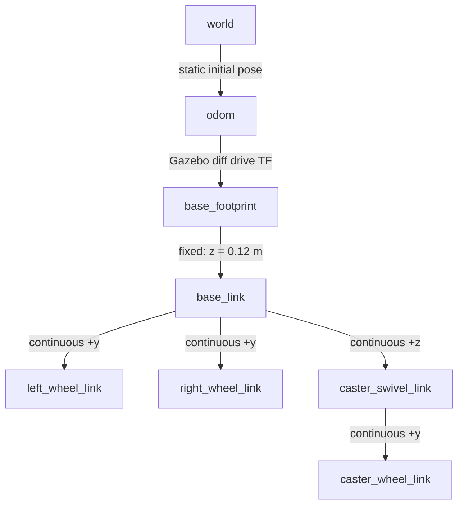

# 2륜 차동구동 로봇: 모델링부터 wheel odom 궤적까지

이번 장에서는 두 개의 구동 바퀴와 수동 caster로 이루어진 `diffbot`을 직접 살펴보고 Gazebo Classic 11에서 움직인다. 키보드로 `/cmd_vel`을 보내고, 바퀴 회전량을 적분한 `/odom`과 TF를 검증한 뒤 RViz에서 이동 궤적을 확인하는 것이 목표다.

이 장을 마치면 다음을 할 수 있다.

- 링크의 `visual`, `collision`, `inertial`이 각각 왜 필요한지 설명한다.
- 바퀴의 크기와 간격을 `libgazebo_ros_diff_drive.so` 설정에 일치시킨다.
- `/cmd_vel` → 바퀴 조인트 → `/odom` → TF/Path로 이어지는 데이터 흐름을 진단한다.
- Gazebo에서 측정한 실제 조인트 각도를 `/joint_states`와 RViz에서 확인한다.

> 이 저장소의 `Humble` 브랜치는 Ubuntu 22.04, ROS 2 Humble, Gazebo Classic 11을 대상으로 한다. Gazebo Classic은 지원이 종료된 소프트웨어이므로 새 프로젝트에는 최신 Gazebo도 검토하되, 이 장에서는 Humble의 검증 가능한 기준 환경을 그대로 사용한다.

## 1. 준비와 빌드

[환경 구성](01_setup.md)을 먼저 마치고, 새 터미널에서 다음을 실행한다.

```bash
source /opt/ros/humble/setup.bash
cd ~/gazebo-sim-tutorial-kr/ros2_ws
rosdep install --from-paths src --ignore-src -r -y
colcon build --symlink-install
source install/setup.bash
```

필요한 핵심 패키지는 `gazebo_ros_pkgs`, `xacro`, `robot_state_publisher`, `teleop_twist_keyboard`, `rviz2`다. 패키지를 찾지 못한다면 다음과 같이 설치한다.

```bash
sudo apt update
sudo apt install \
  ros-humble-gazebo-ros-pkgs \
  ros-humble-robot-state-publisher \
  ros-humble-teleop-twist-keyboard \
  ros-humble-tf2-tools \
  ros-humble-xacro \
  ros-humble-rviz2
```

모든 새 터미널에서 `/opt/ros/humble/setup.bash`와 이 워크스페이스의 `install/setup.bash`를 다시 source해야 한다.

## 2. 모델 구조 읽기

모델 원본은 다음 두 파일이다.

- `ros2_ws/src/gazebo_tutorial_description/urdf/common.xacro`: 재사용할 색상, 관성, 접촉, 바퀴 매크로
- `ros2_ws/src/gazebo_tutorial_description/urdf/diffbot.urdf.xacro`: 차체, 바퀴, caster, Gazebo 플러그인

좌표축은 REP-103을 따른다. `+x`는 전방, `+y`는 좌측, `+z`는 위쪽이며 길이는 m, 질량은 kg, 각도는 rad 단위다.

### 링크와 조인트



`base_footprint`는 바닥에 투영된 2D 기준 프레임이다. 질량과 충돌 형상을 가진 실제 차체 프레임 `base_link`는 그보다 0.12 m 위에 있다. 내비게이션과 wheel odometry는 차체의 roll/pitch가 아니라 평면 위치를 표현하는 `base_footprint`를 기준으로 삼는다.

두 구동 바퀴의 중심 간격은 0.36 m이고 반지름은 0.09 m다. 바퀴 실린더의 기본 축은 `z`이므로 visual, collision, inertial을 x축으로 90도 회전하고, 조인트 회전축은 로봇의 `+y`로 둔다. 세 요소 중 하나만 다른 방향으로 두면 화면은 맞아 보여도 접촉이나 회전 관성이 잘못된다.

뒤쪽 caster는 단순한 구가 아니라 두 자유도를 갖는다.

- `caster_swivel_joint`: 수직축을 중심으로 자유롭게 방향을 바꾼다.
- `caster_wheel_joint`: 수평축을 중심으로 굴러간다.
- 바퀴 중심은 swivel 축보다 0.035 m 뒤에 있어 주행 중 접촉력이 방향을 정렬한다.

### visual, collision, inertial

한 링크에는 목적이 다른 세 정보가 들어간다.

| 요소 | 역할 | 빠졌거나 틀렸을 때의 증상 |
|---|---|---|
| `visual` | Gazebo와 RViz에 보이는 모양 | 보이지 않거나 축척/방향이 이상함 |
| `collision` | 물리 엔진이 접촉을 계산할 모양 | 바닥을 뚫거나 보이지 않는 곳에 부딪힘 |
| `inertial` | 질량, 무게중심, 관성 텐서 | 흔들림, 발산, 비현실적인 가속 |

`common.xacro`의 `box_inertial`, `cylinder_inertial`, `sphere_inertial`은 기본 입체의 관성 텐서를 실제 치수로 계산한다. 예를 들어 직육면체의 x축 관성은 다음과 같다.

\[
I_{xx}=\frac{m}{12}(y^2+z^2)
\]

관성값을 임의의 매우 큰 수로 넣으면 모델이 당장은 덜 흔들릴 수 있지만, 제어 응답과 접촉력이 왜곡된다. 먼저 질량과 형상에서 올바른 값을 계산하고, 그 다음 마찰과 감쇠를 조정하는 습관이 좋다.

### Xacro를 URDF로 펼쳐 보기

Xacro는 매크로와 수식을 포함한 작성용 형식이고, `robot_state_publisher`와 Gazebo가 최종적으로 받는 것은 펼쳐진 URDF XML이다.

```bash
cd ~/gazebo-sim-tutorial-kr/ros2_ws
xacro src/gazebo_tutorial_description/urdf/diffbot.urdf.xacro \
  > /tmp/diffbot.urdf
check_urdf /tmp/diffbot.urdf
```

`check_urdf`가 없다면 `sudo apt install liburdfdom-tools`로 설치한다. 출력의 루트가 `base_footprint`이고 네 개의 continuous joint가 보이면 구조가 정상이다.

```bash
grep -E '<(link|joint) name=' /tmp/diffbot.urdf
```

## 3. Differential Drive 플러그인 이해

`libgazebo_ros_diff_drive.so`는 `geometry_msgs/msg/Twist` 명령을 좌우 바퀴 속도로 변환한다. 선속도 \(v\), 각속도 \(\omega\), 바퀴 간격 \(L\), 반지름 \(r\)일 때 목표 회전 속도는 다음과 같다.

\[
\dot{\phi}_L=\frac{v-\omega L/2}{r}, \qquad
\dot{\phi}_R=\frac{v+\omega L/2}{r}
\]

따라서 직진할 때는 두 바퀴가 같은 속도로 돌고, 제자리에서 좌회전할 때는 왼쪽이 뒤로, 오른쪽이 앞으로 돈다.

모델의 플러그인 설정과 ROS 인터페이스는 다음과 같이 대응한다.

| 설정 | 값 | 의미 |
|---|---:|---|
| `left_joint`, `right_joint` | `left_wheel_joint`, `right_wheel_joint` | Gazebo가 속도를 줄 구동 조인트 |
| `wheel_separation` | 0.36 m | 두 바퀴 중심 사이 거리 |
| `wheel_diameter` | 0.18 m | URDF collision과 같은 바퀴 지름 |
| ROS remapping `cmd_vel:=cmd_vel` | `/cmd_vel` | `Twist` 명령 입력 |
| `odometry_source` | 0 | world pose가 아닌 바퀴 회전량 적분 |
| ROS remapping `odom:=odom` | `/odom` | `nav_msgs/msg/Odometry` 출력 |
| `odometry_frame` | `odom` | odometry 기준 프레임 |
| `robot_base_frame` | `base_footprint` | odometry의 child frame |
| `publish_odom_tf` | true | `odom → base_footprint` 동적 TF 발행 |
| `publish_wheel_tf` | false | 바퀴 TF 중복 발행 방지 |

`publish_wheel_tf`를 끈 이유가 중요하다. 바퀴와 caster의 TF는 `/joint_states`를 구독하는 `robot_state_publisher`가 URDF 관절 구조에 따라 발행한다. diff-drive 플러그인까지 같은 TF를 발행하면 동일 child frame에 두 발행자가 생겨 RViz가 흔들리거나 TF 경고가 발생할 수 있다.

Humble 플러그인의 실제 구현은 입력과 출력의 기본 ROS 이름 `cmd_vel`, `odom`을 만들고 `<ros>` 블록의 remapping을 적용한다. 토픽 이름을 바꿀 때는 오래된 예제의 `command_topic` 또는 `odometry_topic` 태그에 의존하지 말고 remapping을 사용한다.

별도의 `libgazebo_ros_joint_state_publisher.so`는 다음 네 조인트의 **Gazebo 물리 상태**를 `/joint_states`로 발행한다.

```text
left_wheel_joint
right_wheel_joint
caster_swivel_joint
caster_wheel_joint
```

즉, 데스크톱용 `joint_state_publisher`가 임의의 값을 만드는 것이 아니라 시뮬레이터에서 실제로 회전한 값을 RViz가 받는다.

## 4. Gazebo와 RViz 실행

터미널 1에서 통합 launch를 실행한다.

```bash
source /opt/ros/humble/setup.bash
source ~/gazebo-sim-tutorial-kr/ros2_ws/install/setup.bash
ros2 launch gazebo_tutorial_bringup diffbot.launch.py
```

기본값은 Gazebo GUI와 RViz를 모두 열고, 빈 world에 `diffbot`을 spawn하며, `robot_state_publisher`와 odometry-to-path 노드도 시작한다. 창을 열 수 없는 환경에서는 다음처럼 서버만 검사한다.

```bash
ros2 launch gazebo_tutorial_bringup diffbot.launch.py \
  gui:=false rviz:=false
```

시뮬레이션을 일시 정지한 상태로 시작하고 싶다면 `pause:=true`를 추가한다. 멈춘 동안에는 `/clock`, `/odom`, `/joint_states`가 갱신되지 않는 것이 정상이다.

### 인터페이스 계약 확인

터미널 2를 열어 source한 뒤 확인한다.

```bash
ros2 topic list | sort
ros2 topic info /cmd_vel --verbose
ros2 topic info /odom --verbose
ros2 topic hz /joint_states
```

최소한 다음 토픽이 보여야 한다.

```text
/clock
/cmd_vel
/ground_truth_path
/joint_states
/odom
/robot_description
/tf
/tf_static
/wheel_odom_path
```

`/cmd_vel`에는 diff-drive 플러그인 구독자가 하나 이상, `/odom`에는 플러그인 발행자가 하나 있어야 한다. 타입은 각각 `geometry_msgs/msg/Twist`, `nav_msgs/msg/Odometry`다.

초기 odometry 한 메시지를 확인한다.

```bash
ros2 topic echo /odom --once
```

다음 필드가 핵심이다.

- `header.frame_id: odom`
- `child_frame_id: base_footprint`
- `pose.pose.position`: 바퀴 회전량을 적분한 평면 위치
- `twist.twist.linear.x`, `twist.twist.angular.z`: 추정 차체 속도

## 5. 키보드로 주행하기

터미널 3에서 teleop을 실행한다. 입력기가 한글이면 키가 명령으로 인식되지 않으므로 영문 자판으로 전환한다.

```bash
source /opt/ros/humble/setup.bash
source ~/gazebo-sim-tutorial-kr/ros2_ws/install/setup.bash
ros2 run teleop_twist_keyboard teleop_twist_keyboard \
  --ros-args --remap cmd_vel:=/cmd_vel
```

주요 키는 다음과 같다.

| 키 | 동작 |
|---|---|
| `i` | 전진 |
| `,` | 후진 |
| `j`, `l` | 제자리 좌회전, 우회전 |
| `u`, `o` | 전진하며 좌회전, 우회전 |
| `m`, `.` | 후진하며 회전 |
| `k` | 정지 |
| `q`/`z` | 선속도와 각속도를 함께 증가/감소 |

키를 누를 때 Gazebo의 좌우 바퀴뿐 아니라 caster가 진행 방향으로 돌아가는지 관찰한다. 다른 터미널에서는 명령과 조인트 상태를 동시에 확인할 수 있다.

```bash
ros2 topic echo /cmd_vel
ros2 topic echo /joint_states
```

직진 명령에서는 좌우 구동 바퀴의 velocity 부호가 같아야 한다. 제자리 회전에서는 부호가 반대여야 한다. caster 각도는 접촉력에 따라 수동으로 정렬되므로 명령값과 즉시 일치할 필요가 없다.

## 6. TF 검증

TF는 보이는 로봇 모델과 odometry 궤적을 한 좌표계에 결합한다. 각 구간을 따로 검사하면 문제 지점을 빠르게 찾을 수 있다.

```bash
# bringup이 ground-truth 비교를 위해 발행하는 기준 TF
ros2 run tf2_ros tf2_echo world odom

# Gazebo diff-drive 플러그인이 발행하는 동적 TF
ros2 run tf2_ros tf2_echo odom base_footprint

# URDF의 fixed joint를 robot_state_publisher가 발행하는 정적 TF
ros2 run tf2_ros tf2_echo base_footprint base_link

# /joint_states와 URDF로 계산하는 바퀴 TF
ros2 run tf2_ros tf2_echo base_link left_wheel_link
```

기본 spawn pose에서는 `world → odom`이 항등 변환이며 주행 중에도 고정이다. launch의 `x`, `y`, `yaw`를 바꾸면 bringup이 encoder odom의 초기 원점을 그 spawn pose에 맞춘다. `odom → base_footprint`의 x, y, yaw는 주행에 따라 변해야 한다. `base_footprint → base_link`의 translation z는 항상 약 0.12 m이고, 바퀴 TF의 quaternion은 회전에 따라 변한다.

전체 TF 트리를 파일로 만들 수도 있다.

```bash
cd /tmp
ros2 run tf2_tools view_frames
```

생성된 `frames.pdf`에서 각 프레임의 부모가 앞의 다이어그램과 같은지 확인한다. 특히 `base_footprint`의 부모는 `odom` 하나뿐이어야 한다.

## 7. RViz에서 wheel odom trajectory 보기

launch가 시작하는 `odom_to_path` 노드는 `/odom`의 pose를 누적해 `/wheel_odom_path`를 발행한다. 기본 RViz 설정은 다음을 표시한다.

- Fixed Frame: `odom`
- RobotModel: URDF와 `/joint_states` 기반 로봇 자세
- TF: 좌표축과 부모-자식 관계
- Path: `/wheel_odom_path`
- Path: `/ground_truth_path` (Gazebo world pose 비교용)

RViz를 별도로 열었거나 Path가 보이지 않으면 왼쪽 아래 **Add → By topic → `/wheel_odom_path` → Path**를 선택하고 Fixed Frame을 `odom`으로 설정한다. Path의 Line Style은 `Billboards`, Line Width는 `0.03` 정도가 알아보기 쉽다.

경로 토픽 자체도 확인한다.

```bash
ros2 topic info /wheel_odom_path
ros2 topic echo /wheel_odom_path --once
```

`/wheel_odom_path`의 `header.frame_id`가 `odom`이고, 주행할수록 `poses` 배열이 늘어나면 정상이다. 기본 최대 점 수는 2,000개라 장시간 실행해도 메모리가 끝없이 증가하지 않는다.

`diffbot`에는 이 과정에서 직접 개발하는 `libground_truth_path_plugin.so`도 연결되어 있다. 이 플러그인은 바퀴 회전량을 적분하지 않고 Gazebo가 가진 실제 world pose를 `/ground_truth_path`로 발행한다. RViz에서는 world와 odom 사이의 기준 변환을 적용해 wheel odom 경로와 함께 표시한다.

```bash
ros2 topic info /ground_truth_path
ros2 topic echo /ground_truth_path --once
```

초기에는 두 경로가 거의 겹치지만, 미끄러짐이 누적되면 `/wheel_odom_path`와 `/ground_truth_path`가 벌어질 수 있다. 전자는 로봇이 encoder로 **추정한 경로**, 후자는 시뮬레이터만 알 수 있는 **비교 기준 경로**다. 실제 로봇에는 완전한 ground truth 토픽이 없다는 차이도 기억한다.

### 사각형 궤적 실습

1. `i`로 약 1 m 전진하고 `k`로 멈춘다.
2. `j`로 약 90도 제자리 회전하고 `k`로 멈춘다.
3. 위 동작을 네 번 반복한다.
4. Gazebo의 실제 시작 위치와 RViz Path의 마지막 위치를 비교한다.

완벽한 정사각형으로 닫히지 않아도 오류라고 단정하지 않는다. 이번 모델은 `odometry_source=0`으로 바퀴 회전량을 적분한다. 접촉 미끄러짐, caster 전환 저항, 키를 누른 시간의 차이는 wheel odom에 누적 오차를 만든다. 바로 이 차이가 실제 로봇에서 encoder odometry만으로 절대 위치를 알 수 없는 이유다.

좀 더 긴 궤적을 보관하려면 launch 인자를 바꾼다.

```bash
ros2 launch gazebo_tutorial_bringup diffbot.launch.py max_points:=5000
```

## 8. 완료 기준

아래 항목을 모두 확인하면 실습이 끝난다.

- Gazebo에 차체, 구동 바퀴 두 개, swivel caster가 바닥을 뚫지 않고 나타난다.
- `/cmd_vel`에 `Twist`를 보내면 전진과 제자리 회전이 모두 가능하다.
- `/odom`의 `frame_id`는 `odom`, `child_frame_id`는 `base_footprint`다.
- `odom → base_footprint → base_link → wheels/caster` TF가 끊기지 않는다.
- `/joint_states`에 네 continuous joint의 실제 각도가 포함된다.
- RViz의 `/wheel_odom_path`가 주행에 따라 늘어나고 RobotModel과 같은 위치에서 움직인다.
- RViz의 `/ground_truth_path`와 wheel odom 경로를 비교해 누적 오차를 설명할 수 있다.

재현 가능한 간단한 통합 검사는 다음처럼 GUI 없이 실행할 수 있다.

```bash
timeout --signal=INT 20s \
  ros2 launch gazebo_tutorial_bringup diffbot.launch.py \
  gui:=false rviz:=false
```

실행 중 다른 터미널에서 다음 명령이 모두 데이터를 반환해야 한다.

```bash
ros2 topic hz /odom
ros2 topic hz /joint_states
ros2 topic echo /wheel_odom_path --once
ros2 run tf2_ros tf2_echo odom base_footprint
```

## 문제 해결

### `/cmd_vel`은 보이지만 로봇이 움직이지 않는다

```bash
ros2 topic info /cmd_vel --verbose
```

Subscription count가 0이면 diff-drive 플러그인이 로드되지 않았다. Gazebo를 실행한 터미널에서 `libgazebo_ros_diff_drive.so` 오류를 먼저 찾고, Humble 환경과 `gazebo_ros_pkgs` 설치를 확인한다. 시뮬레이션이 pause 상태인지도 확인한다.

### 로봇이 반대로 가거나 회전 방향이 틀리다

두 바퀴 joint의 axis가 모두 `0 1 0`인지, `left_joint`와 `right_joint` 이름을 뒤바꾸지 않았는지 확인한다. 한쪽 바퀴만 축 부호를 반대로 두는 방식으로 보정하면 직진과 odometry 중 하나가 다시 틀어진다.

### 직진 중 한쪽으로 휘거나 심하게 미끄러진다

URDF의 실제 바퀴 중심 간격/지름과 플러그인의 `wheel_separation`/`wheel_diameter`가 같은지 먼저 확인한다. 그 다음 좌우 collision과 관성이 대칭인지, 바퀴가 바닥과 겹쳐 spawn되지 않았는지, `mu1`/`mu2`가 양수인지 살핀다. 물리 문제를 odometry 숫자만 바꿔 숨기지 않는다.

### RViz에서 차체는 움직이지만 바퀴나 caster가 멈춰 있다

```bash
ros2 topic echo /joint_states --once
ros2 topic info /joint_states --verbose
```

네 joint 이름이 모두 있는지 확인한다. `/joint_states`를 발행하는 데스크톱 `joint_state_publisher`를 별도로 실행했다면 종료한다. 이 실습에서는 Gazebo 플러그인만 실제 관절 상태를 발행해야 한다.

### RViz의 RobotModel 또는 Path가 보이지 않는다

RViz Fixed Frame을 `odom`으로 맞추고 다음을 순서대로 확인한다.

```bash
ros2 topic echo /robot_description --once
ros2 topic echo /odom --once
ros2 topic echo /wheel_odom_path --once
ros2 run tf2_ros tf2_echo odom base_link
```

어느 단계에서 처음 끊기는지가 원인이다. `/odom`은 오지만 Path가 없다면 `odom_to_path` 노드, Path는 있지만 표시가 안 되면 RViz Fixed Frame/Display 설정을 살핀다.

### TF에 `multiple authority` 또는 반복 경고가 나온다

`odom → base_footprint`는 diff-drive 플러그인 하나가, `base_footprint` 아래 URDF TF는 `robot_state_publisher` 하나가 맡아야 한다. 별도의 static transform publisher나 두 번째 robot_state_publisher를 실행하지 않았는지 확인한다. 모델의 `publish_wheel_tf`는 `false`로 유지한다.

## 정리

이번 실습의 핵심은 로봇을 한 번 움직이는 데 그치지 않고 명령, 물리 조인트, wheel odometry, TF, RViz Path가 같은 치수와 프레임 계약을 공유하게 만드는 것이다. 다음 4륜 로버 실습에서는 같은 계약을 여러 바퀴의 differential drive와 Ackermann 조향으로 확장한다.
