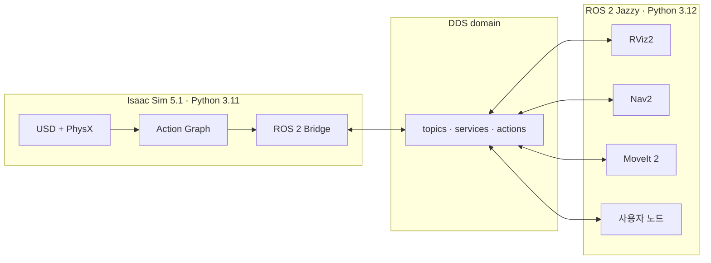

# ROS 2 Jazzy 연동 학습 경로

이 장에서는 Isaac Sim 5.1의 Stage를 ROS 2 Jazzy 그래프에 연결한다. 목표는 토픽 하나를 보이게 만드는 데 그치지 않고 시간, 좌표계, QoS와 제어 주기를 일관되게 설계하는 것이다.

## 최종 구성



두 Python 버전이 다르더라도 서로 다른 프로세스가 DDS로 직렬화된 메시지를 교환하는 것은 정상이다. 문제는 Python 3.12용 `rclpy` 바이너리를 Isaac Sim의 Python 3.11 프로세스에 직접 import할 때 생긴다. 이 경계를 학습 내내 유지한다.

## 문서 순서와 산출물

| 순서 | 문서 | 산출물 |
|---:|---|---|
| 1 | `01-bridge-and-qos` | `/clock`을 주고받는 동일 DDS 도메인 |
| 2 | `02-time-tf-and-motion` | `map → odom → base_link → sensor` TF 트리와 이동 명령 |
| 3 | `03-sensors-and-action-graph` | 카메라, LiDAR, IMU, 관절 상태 토픽 |
| 4 | `04-nav2-moveit-and-sim-control` | Nav2 또는 MoveIt 2 시나리오와 자동 초기화 |
| 5 | `05-custom-messages-and-debugging` | 사용자 정의 인터페이스의 이중 빌드와 재현 가능한 진단 기록 |

## 세 터미널을 계속 분리한다

```text
[SIM] Isaac Sim 실행과 python.sh       Python 3.11
[ROS] /opt/ros/jazzy와 외부 ROS 노드  Python 3.12
[DBG] ros2 topic/TF/QoS 진단           Python 3.12
```

`[SIM]`에 시스템 Jazzy를 무조건 불러오거나, `[ROS]`에서 Isaac Sim의 `python.sh`를 사용하는 식으로 섞지 않는다. 커스텀 메시지를 Isaac Sim 내부에서 import해야 할 때만 공식 Python 3.11 워크스페이스 절차를 따른다.

## 연동 전에 고정할 연동 규칙

다음 표를 프로젝트의 `ros_contract.md`에 적어 두면 대부분의 통합 오류를 조기에 찾을 수 있다.

| 항목 | 예시 | 확인 방법 |
|---|---|---|
| Domain | `ROS_DOMAIN_ID=17` | 양쪽 `printenv` |
| RMW | `rmw_fastrtps_cpp` | `echo $RMW_IMPLEMENTATION` |
| 시간 | 시뮬레이션 시간 | `/clock`, `use_sim_time` |
| 기준 좌표 | REP-103, Z-up | `view_frames`, RViz 좌표축 |
| TF 소유권 | 위치 추정이 `map→odom`, 시뮬레이터가 `odom→base_link` | `/tf` 발행 노드 수 검사 |
| 명령 토픽 | `/cmd_vel`, `geometry_msgs/msg/Twist` | `ros2 topic info -v` |
| 센서 QoS | Sensor Data, Best Effort | 발행 노드와 구독 노드 QoS 비교 |
| 초기화 의미 | 동일 Stage, 시간 0, 로봇 위치·자세 초기화 | 초기화 뒤 `/clock`, 위치·자세 검사 |

## 수료 조건

- [ ] 내장 Jazzy와 외부 Jazzy의 역할을 설명한다.
- [ ] `/clock`을 기준으로 모든 ROS 노드가 시뮬레이션 시간을 사용하게 한다.
- [ ] TF의 각 연결에 발행 노드가 정확히 하나만 존재하게 한다.
- [ ] `cmd_vel`, 관절 명령과 센서 토픽의 QoS를 검사한다.
- [ ] RViz2에서 카메라, LaserScan/PointCloud2, IMU와 로봇 모델을 검증한다.
- [ ] Nav2 또는 MoveIt 2를 실행하고 정지·초기화 후 다시 성공시킨다.
- [ ] 사용자 정의 메시지와 사용자 정의 OmniGraph 노드의 ABI 경계를 설명한다.
- [ ] 통합 실패를 도메인, 참여자 탐색, 타입, QoS, 시간, 프레임, 주기 순으로 진단한다.

## 출처

- [Isaac Sim 5.1 — ROS 2](https://docs.isaacsim.omniverse.nvidia.com/5.1.0/ros2_tutorials/ros2_landing_page.html)
- [Isaac Sim 5.1 — ROS 2 Installation](https://docs.isaacsim.omniverse.nvidia.com/5.1.0/installation/install_ros.html)
- [Isaac Sim 5.1 — ROS 2 Reference Architecture](https://docs.isaacsim.omniverse.nvidia.com/5.1.0/ros2_tutorials/ros2_reference_architecture.html)
- [Isaac Sim 5.1 — ROS 2 Troubleshooting](https://docs.isaacsim.omniverse.nvidia.com/5.1.0/ros2_tutorials/troubleshooting.html)
