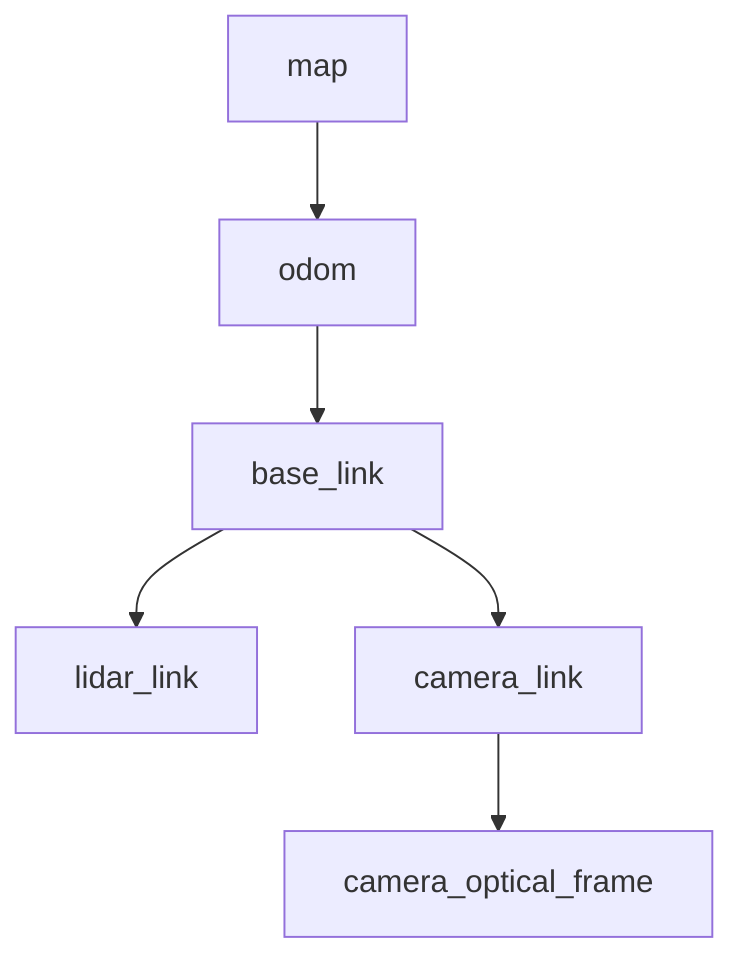

# 시간, TF, odometry와 로봇 명령

로봇이 움직이는데 RViz에서 튀거나 Nav2가 멈추는 문제는 대개 물리보다 시간과 좌표계 연동 규칙에서 시작한다. 이 튜토리얼에서는 `/clock`, TF, 정답 위치·자세·속도 데이터(odometry), `joint_states`와 `cmd_vel`을 하나의 일관된 처리 흐름으로 만든다.

## 1. 시뮬레이션 시간을 기준으로 정한다

Isaac Sim에는 최소 세 종류의 시간이 있다.

| 시간 | 의미 | 사용 위치 |
|---|---|---|
| Simulation Time | 물리 스텝이 전진한 누적 시간 | 센서, TF, odometry의 기본 타임스탬프 |
| System Time | 운영체제의 실제 시각 | 실기와 시뮬레이션을 실제 시각으로 맞출 특수한 경우 |
| Monotonic Time | 프로세스 내부 경과 시간 | profiling과 타임아웃 측정 |

재현 가능한 시뮬레이션에서는 `Isaac Read Simulation Time → ROS 2 Publish Clock`으로 `/clock`을 발행하고 외부 노드에 `use_sim_time:=true`를 적용한다.

```bash
# [ROS]
source /opt/ros/jazzy/setup.bash
export ROS_DOMAIN_ID=17

ros2 topic echo /clock --once
ros2 param set /my_controller use_sim_time true
ros2 param get /my_controller use_sim_time
```

launch 파일에서는 노드마다 명시한다.

```python
from launch import LaunchDescription
from launch_ros.actions import Node


def generate_launch_description():
    common = {"use_sim_time": True}
    return LaunchDescription([
        Node(
            package="robot_state_publisher",
            executable="robot_state_publisher",
            parameters=[common, {"robot_description": "<robot name='demo'/>"}],
        ),
        Node(
            package="rviz2",
            executable="rviz2",
            parameters=[common],
        ),
    ])
```

`ros2 param set /node use_sim_time true`를 실행했는데 노드가 `/clock`보다 먼저 타임아웃을 계산했다면 노드를 다시 시작한다. 센서 helper에서 `useSystemTime=True`를 켜면 다른 시뮬레이션 시간을 사용하는 발행 노드와 타임스탬프 기준이 달라지므로 목적 없이 켜지 않는다.

### 일시 정지, Stop과 초기화

- Pause 중에는 시뮬레이션 시간과 물리 상태가 전진하지 않아야 한다.
- 다시 Play하면 같은 시간에서 이어서 전진한다.
- Stop 또는 월드 초기화 뒤 시간이 0 근처로 돌아갈 수 있으므로 외부 필터가 과거 타임스탬프로 판단할 수 있다.
- 자동 시험에서는 초기화 직후 위치 추정/필터의 수명 주기을 함께 재시작하거나 `/clock`이 다시 전진한 뒤 데이터를 처리한다.

```bash
# [DBG] 시간이 실제로 멈추고 다시 전진하는지 관찰하다.
ros2 topic hz /clock
```

## 2. TF 트리의 소유권을 먼저 그린다

이동 로봇의 최소 트리를 다음처럼 정한다.



각 연결은 발행 노드가 정확히 하나여야 한다.

| 연결 | 일반적인 소유자 | 비고 |
|---|---|---|
| `map → odom` | AMCL, SLAM 또는 위치 추정 | 시뮬레이터가 동시에 발행하지 않는다. |
| `odom → base_link` | odometry 처리 흐름 또는 시뮬레이터 정답 데이터 | 둘 중 하나만 선택한다. |
| `base_link → 각 link` | Isaac Sim의 Transform Tree 또는 `robot_state_publisher` | 중복 발행하지 않는다. |
| `camera_link → camera_optical_frame` | 정적 TF 또는 로봇 구조 설명 | ROS 광학 좌표계 규칙을 확인한다. |

Isaac Sim의 `ROS 2 Publish Transform Tree` 노드에서 articulation 루트를 `targetPrims`에 넣으면 하위 링크를 함께 발행할 수 있다. 센서 prim을 별도로 넣어도 된다. 잘못된 링크가 루트로 선택되면 articulation 루트를 실제 루트 링크에 명시적으로 적용한다.

Action Graph의 기본 연결은 다음과 같다.

```text
On Playback Tick.tick             → ROS 2 Publish Transform Tree.execIn
ROS 2 Context.context             → ROS 2 Publish Transform Tree.context
Isaac Read Simulation Time.time   → ROS 2 Publish Transform Tree.timeStamp
robot articulation root           → targetPrims
```

외부의 `robot_state_publisher`로 링크 TF를 발행하기로 했다면 Isaac 쪽에서는 같은 링크 트리 발행 노드를 끄고 `joint_states`만 제공한다.

```bash
# [DBG]
ros2 run tf2_tools view_frames
ros2 run tf2_ros tf2_echo odom base_link
ros2 topic info /tf -v
ros2 topic info /tf_static -v
```

`view_frames`가 만든 PDF에서 끊긴 하위 트리, 순환 경로와 오래된 타임스탬프를 찾는다. RViz Fixed Frame을 `map`, `odom`, `base_link`로 바꾸어 어느 연결에서 깨지는지 좁힌다.

## 3. 정답 위치·자세·속도 데이터(odometry)를 발행한다

초기 통합에서는 `Isaac Compute Odometry`를 이용한 정확한 위치·자세와 속도(twist)를 발행하고, 이후 바퀴 엔코더·IMU 기반 추정으로 바꾸면 오류 원인을 분리하기 쉽다.

```text
On Playback Tick
  └─> Isaac Compute Odometry
        ├─ position/orientation ─> ROS 2 Publish Odometry
        ├─ linearVelocity       ─> ROS 2 Publish Odometry
        └─ angularVelocity      ─> ROS 2 Publish Odometry
Read Simulation Time.time ──────> ROS 2 Publish Odometry.timeStamp
ROS 2 Context.context ──────────> ROS 2 Publish Odometry.context
```

설정 예시는 다음과 같다.

```text
chassisPrim     = /World/Robot/base_link
topicName       = /ground_truth/odom
odomFrameId     = odom
chassisFrameId  = base_link
```

토픽과 TF가 같은 위치·자세를 가리키는지 검사한다.

```bash
# [DBG]
ros2 topic echo /ground_truth/odom --once
ros2 run tf2_ros tf2_echo odom base_link
```

odometry 메시지의 `header.frame_id`는 위치·자세의 기준 프레임이고 `child_frame_id`는 twist가 표현된 로봇 프레임이다. 이름만 바꿔 좌표를 변환했다고 가정하지 않는다.

## 4. articulation의 관절 상태를 발행한다

`ROS 2 Publish Joint State` 노드에 articulation 루트를 지정하고 시뮬레이션 타임스탬프를 연결한다. 토픽은 보통 `/joint_states`를 사용한다.

```text
On Playback Tick.tick             → ROS 2 Publish Joint State.execIn
ROS 2 Context.context             → ROS 2 Publish Joint State.context
Read Simulation Time.time         → ROS 2 Publish Joint State.timeStamp
/World/Robot articulation root    → targetPrim
```

```bash
# [DBG]
ros2 topic echo /joint_states --once
ros2 topic hz /joint_states
```

다음을 확인한다.

- `name`, `position`, `velocity`, `effort` 배열 길이가 일치한다.
- 관절 이름이 URDF/MoveIt 설정과 정확히 일치한다.
- 회전 관절의 rad 단위와 직동 관절의 m 단위를 섞지 않는다.
- 고정 관절은 명령 가능한 DOF가 아니므로 배열에 없을 수 있다.

USD prim 이름과 ROS 관절 이름을 다르게 유지해야 한다면 prim에 `isaac:nameOverride`를 설정한다. 이름 변경 뒤 `/joint_states`와 TF 양쪽을 다시 확인한다.

## 5. `JointState` 명령을 받는다

간단한 position/velocity 관절 명령은 다음 그래프로 만든다.

```text
On Playback Tick.tick              → ROS 2 Subscribe Joint State.execIn
ROS 2 Context.context              → ROS 2 Subscribe Joint State.context
Subscribe.position/velocity/effort → Articulation Controller 해당 입력
Subscribe.jointNames               → Articulation Controller.jointNames
/World/Robot                       → Articulation Controller.targetPrim
```

사용하지 않는 명령 배열은 빈 배열로 유지한다. 하나의 관절에 position drive와 외부 effort 명령을 동시에 의미 없이 적용하지 않는다. effort 제어라면 importer/Property에서 drive stiffness와 damping이 의도에 맞는지 먼저 검증한다.

```bash
# [ROS] 첫 관절 하나를 0.3 rad로 명령하다.
ros2 topic pub --once /joint_command sensor_msgs/msg/JointState \
  "{name: ['joint1'], position: [0.3]}"
```

실제 매니퓰레이터 소프트웨어 구성에는 임시 `JointState` 명령보다 궤적 제어기와 MoveIt 2 액션을 사용한다. 이 단계는 이름·방향·drive를 검증하기 위한 기본 동작 확인이다.

## 6. 차동 구동 이동 로봇에 `cmd_vel`을 연결한다

Action Graph에서 다음 노드를 사용한다.

```text
ROS 2 Context
On Playback Tick
ROS 2 Subscribe Twist       topicName=/cmd_vel
Break 3-Vector              linear, angular 분해
Differential Controller     wheelRadius, wheelDistance
Articulation Controller     left/right wheel joint
```

의미상 연결은 다음과 같다.

```text
Twist.linear.x  → Differential Controller.linearVelocity
Twist.angular.z → Differential Controller.angularVelocity
Differential Controller.velocityCommand → Articulation Controller.velocityCommand
```

`wheelRadius`는 meter, `wheelDistance`는 좌우 바퀴 접촉 중심 사이 거리이다. 바퀴 관절 순서와 제어기 출력 순서가 반대면 회전 방향이 뒤집힌다.

```bash
# [ROS] 0.5 m/s로 2초 전진하다.
ros2 topic pub -r 20 /cmd_vel geometry_msgs/msg/Twist \
  '{linear: {x: 0.5}, angular: {z: 0.0}}'
```

2초 뒤 `Ctrl-C`하고 명시적으로 0을 한 번 보낸다.

```bash
ros2 topic pub --once /cmd_vel geometry_msgs/msg/Twist \
  '{linear: {x: 0.0}, angular: {z: 0.0}}'
```

### 명령 수신 타임아웃을 반드시 넣는다

발행 노드가 죽었는데 마지막 속도를 계속 적용하면 위험하다. 실제 운용 그래프에서는 마지막 메시지 타임스탬프를 저장하고 예를 들어 `0.25 s` 동안 새 명령이 없으면 속도 0 명령으로 바꾸는 watchdog을 별도 ROS 노드 또는 사용자 정의 OmniGraph 노드에 구현한다.

```python
# [ROS] 핵심 로직 예시이다.
if (node.get_clock().now() - last_cmd_time).nanoseconds > 250_000_000:
    safe_cmd.linear.x = 0.0
    safe_cmd.angular.z = 0.0
```

Ackermann 로봇은 `ROS 2 Subscribe AckermannDriveStamped`와 Ackermann 제어기를 사용하거나 Twist를 `ackermann_msgs`로 변환한다. 차동 구동 수식을 억지로 적용하지 않는다.

## 7. 갱신 주기를 분리한다

물리 시뮬레이션은 120 Hz, 제어는 60 Hz, TF/odometry는 30~60 Hz, 카메라는 15~30 Hz처럼 요구가 다르다. 모든 발행 노드를 렌더링 프레임마다 실행하지 않는다. `Isaac Simulation Gate.step=N`으로 입력 주기의 정수 배에 해당하는 간격으로 실행한다.

```text
publish_rate ≈ simulation_rate / N
```

물리 시뮬레이션이 120 Hz이고 `step=4`라면 약 30 Hz이다. 실제 시간 기준 주기는 렌더링 부하와 실시간 비율(RTF)에 따라 달라지므로 시뮬레이션 타임스탬프 간격과 `ros2 topic hz`를 함께 기록한다.

## 8. 통합 체크포인트

```bash
# [DBG]
ros2 topic echo /clock --once
ros2 topic echo /joint_states --once
ros2 topic echo /ground_truth/odom --once
ros2 run tf2_ros tf2_echo odom base_link
ros2 topic info /cmd_vel -v
```

- [ ] 모든 동적 메시지의 타임스탬프가 `/clock` 기준이다.
- [ ] `map→odom`, `odom→base_link`, 링크/센서 TF의 발행 노드가 각각 하나이다.
- [ ] `joint_states` 이름과 URDF/SRDF 이름이 일치한다.
- [ ] 양의 `linear.x`, `angular.z` 명령의 실제 방향이 REP-103과 일치한다.
- [ ] 명령 발행 노드 종료 후 watchdog이 로봇을 정지시킨다.
- [ ] Stop·초기화 뒤 시간과 외부 필터를 함께 다시 초기화한다.

## 출처

- [Isaac Sim 5.1 — ROS 2 Clock](https://docs.isaacsim.omniverse.nvidia.com/5.1.0/ros2_tutorials/tutorial_ros2_clock.html)
- [Isaac Sim 5.1 — ROS2 Transform Trees and Odometry](https://docs.isaacsim.omniverse.nvidia.com/5.1.0/ros2_tutorials/tutorial_ros2_tf.html)
- [Isaac Sim 5.1 — Driving TurtleBot using ROS 2 Messages](https://docs.isaacsim.omniverse.nvidia.com/5.1.0/ros2_tutorials/tutorial_ros2_drive_turtlebot.html)
- [Isaac Sim 5.1 — ROS2 Joint Control](https://docs.isaacsim.omniverse.nvidia.com/5.1.0/ros2_tutorials/tutorial_ros2_manipulation.html)
- [Isaac Sim 5.1 — NameOverride Attribute](https://docs.isaacsim.omniverse.nvidia.com/5.1.0/ros2_tutorials/tutorial_ros2_name_override.html)
- [Isaac Sim 5.1 — ROS 2 Ackermann Controller](https://docs.isaacsim.omniverse.nvidia.com/5.1.0/ros2_tutorials/tutorial_ros2_ackermann_controller.html)
- [Isaac Sim 5.1 — Setting Publish Rates](https://docs.isaacsim.omniverse.nvidia.com/5.1.0/ros2_tutorials/tutorial_ros2_publish_rate.html)
