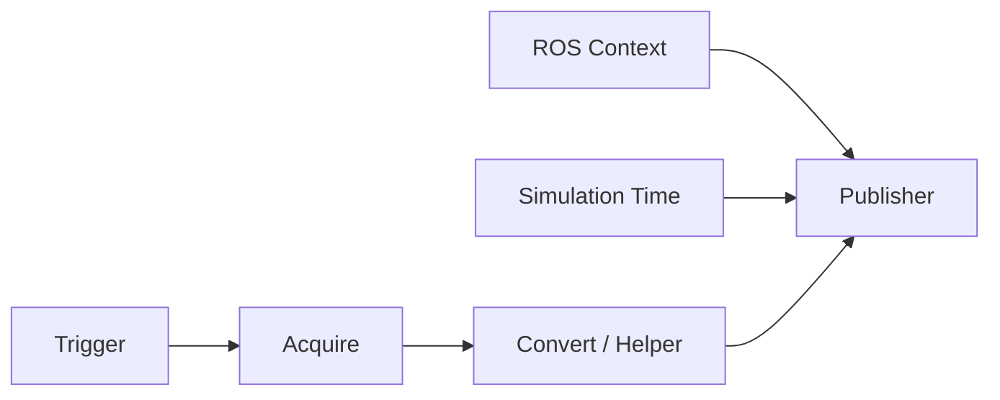

# Action Graph로 카메라, RTX LiDAR와 IMU 발행

이 튜토리얼에서는 센서 prim에서 ROS 메시지까지 이어지는 Action Graph를 직접 만든다. 그래프를 자동 생성하는 메뉴도 사용하지만, 생성된 노드와 실행 주기를 읽고 수정할 수 있어야 완료한 것으로 본다.

## 1. ROS 센서 그래프의 공통 구조

모든 그래프를 다음 다섯 부분으로 나누어 읽는다.



| 층 | 대표 노드 | 질문 |
|---|---|---|
| Trigger | On Playback Tick, Isaac Simulation Gate | 몇 시뮬레이션 프레임마다 실행하는가? |
| Context | ROS 2 Context | 어느 도메인과 네임스페이스를 쓰는가? |
| 시간 | Isaac Read Simulation Time | 모든 메시지가 같은 시간 기준을 쓰는가? |
| Acquire | Read IMU, Create Render Product | 어느 센서 prim을 읽는가? |
| Convert/Publish | Camera Helper, RTX Lidar Helper, Publish Imu | 타입, 토픽, 프레임 ID와 QoS는 무엇인가? |

그래프를 만든 뒤 **Play하기 전에 Stage를 저장**한다. 5.1에서는 일부 ROS OmniGraph 값이 저장 전 첫 실행에서 제대로 반영되지 않는 알려진 문제가 있다. 그래프 prim을 로봇/센서 계층 아래 배치하면 자동 네임스페이스 생성의 영향을 받으므로 최종 토픽 이름을 CLI로 확인한다.

## 2. 카메라 prim을 준비한다

1. `Create > Camera`로 `/World/Robot/base_link/front_camera`를 만들거나 센서 자산을 reference한다.
2. 카메라를 로봇 링크의 자식으로 두고 로컬 변환을 설정한다.
3. Viewport 왼쪽 위 카메라 선택 메뉴에서 해당 카메라를 골라 시야를 확인한다.
4. 클리핑 범위, 초점 거리, 수평 aperture와 해상도를 기록한다.
5. `camera_link`와 ROS 광학 프레임의 축 차이를 TF로 명시한다.

카메라 내부 파라미터는 해상도와 USD 카메라 파라미터로 계산된다. pinhole 근사에서 다음 관계를 사용한다.

\[
f_x = \frac{W f}{A_h},\qquad
f_y = \frac{H f}{A_v},\qquad
c_x=\frac{W}{2},\quad c_y=\frac{H}{2}
\]

`f`는 초점 거리, `A_h`, `A_v`는 aperture이다. ROS `CameraInfo`의 `K`, `P`, 왜곡 모델을 실제 보정 처리 노드가 기대하는 값과 비교한다.

## 3. RGB와 CameraInfo 그래프를 만든다

빠른 경로는 `Tools > Robotics > ROS 2 OmniGraphs > Camera`이다. 그래프 경로, 카메라 prim, 프레임 ID, 네임스페이스와 RGB/Depth/CameraInfo 선택을 입력하면 필요한 노드가 생성된다.

수동으로 만들 때 RGB 처리 흐름은 다음 노드를 포함한다.

```text
On Playback Tick
ROS 2 Context
Isaac Run One Simulation Frame
Isaac Create Render Product
ROS 2 Camera Helper        type=rgb
ROS 2 Camera Info Helper
```

Property를 다음처럼 설정한다.

```text
cameraPrim       = /World/Robot/base_link/front_camera
resolution       = 640 × 480
Camera Helper:
  type           = rgb
  topicName      = /front_camera/image_raw
  frameId        = front_camera_optical_frame
Camera Info:
  topicName      = /front_camera/camera_info
  frameId        = front_camera_optical_frame
```

`Isaac Create Render Product.renderProductPath`를 두 helper에 연결한다. Camera Helper는 실행 중 `/Render/PostProcessing/SDGPipeline`을 세션 그래프로 생성한다. 이 내부 그래프는 Stage에 저장되는 편집용 그래프와 다르다.

각 Camera Helper는 한 종류의 데이터만 처리한다. RGB, 깊이, 점군, semantic/instance label 또는 bounding box가 각각 필요하면 helper를 나눈다. 한 번 활성화하여 SDG 처리 흐름을 생성한 helper의 `type`을 실행 중 바꿔 재사용하지 말고 새 노드를 만들거나 Stage를 다시 불러온다.

```bash
# [ROS]
sudo apt install -y ros-jazzy-rqt-image-view
ros2 topic list -t | grep front_camera
ros2 topic echo /front_camera/camera_info --once
ros2 run rqt_image_view rqt_image_view /front_camera/image_raw
```

RViz2의 Image 표시 항목에서 영상이 보이지 않으면 Reliability를 Best Effort로 바꾼다. 색이 이상하면 인코딩과 채널 순서를, 깊이가 흑백 극단값만 보이면 무한대 깊이가 포함되는 시야와 표시 범위를 확인한다.

## 4. 깊이와 점군을 분리한다

Depth helper와 깊이 점군 helper를 별도로 만들고 동일 Render Product를 입력한다. 대역폭부터 계산한다.

```text
640 × 480 × 4 byte × 30 Hz ≈ 36.9 MB/s
```

여기에 DDS 직렬화와 PointCloud2가 추가되므로 실제 사용량은 더 크다. 처음에는 320×240, 10 Hz로 검증한 뒤 올린다.

```bash
# [DBG]
ros2 topic hz /front_camera/depth
ros2 topic bw /front_camera/depth
ros2 topic info /front_camera/depth -v
```

semantic/instance/bounding-box 토픽을 쓰려면 환경 prim에 semantic label을 먼저 authoring하고 `vision_msgs` 의존성을 설치한다.

```bash
# [ROS]
sudo apt install -y ros-jazzy-vision-msgs
```

## 5. Isaac Sim 5.1 RTX LiDAR를 만든다

5.1에서는 `Create > Sensors > RTX Lidar`에서 예를 들어 다음을 고른다.

- 2D: `NVIDIA > Example Rotary 2D`
- 3D: `NVIDIA > Example Rotary`

센서 prim을 `/World/Robot/base_link/lidar_link` 아래로 이동하고 로컬 변환을 0으로 맞춘다. 5.0 이전의 Camera prim 기반 RTX LiDAR 방식은 deprecated이므로 새 사용자 정의 센서는 `OmniLidar`와 해당 스키마를 사용한다.

빠른 그래프 생성은 `Tools > Robotics > ROS 2 OmniGraphs > RTX Lidar`를 사용한다. 수동 그래프에는 다음이 들어간다.

```text
On Playback Tick
ROS 2 Context
Isaac Run One Simulation Frame
Isaac Create Render Product       cameraPrim=<OmniLidar prim>
ROS 2 RTX Lidar Helper            type=laser_scan
ROS 2 RTX Lidar Helper            type=point_cloud
```

```text
LaserScan Helper:
  topicName       = /scan
  frameId         = lidar_link
  type            = laser_scan
PointCloud Helper:
  topicName       = /points
  frameId         = lidar_link
  type            = point_cloud
  publishFullScan = 요구에 맞게 선택
```

회전형 LiDAR의 `LaserScan`은 한 바퀴가 완성되어야 발행된다. 60 FPS에서 10 Hz 회전이면 약 6 프레임이 한 스캔을 구성하므로 `/scan`이 렌더링 프레임마다 나오지 않는 것이 정상이다. PointCloud2는 `Publish Full Scan` 설정에 따라 프레임별 또는 누적 전체 스캔으로 나온다.

```bash
# [DBG]
ros2 topic echo /scan --once \
  --qos-reliability best_effort
ros2 topic hz /scan
ros2 topic echo /points --once \
  --qos-reliability best_effort
```

RViz2 Fixed Frame을 `lidar_link` 또는 연결된 `base_link`로 두고 LaserScan과 PointCloud2 표시 항목를 추가한다. 점군이 로봇과 함께 움직이지 않으면 센서 TF가 없거나 `frame_id`가 틀린 것이다.

RTX LiDAR가 실행 중일 때 UI 창의 도킹 위치를 바꾸면 5.1 공식 튜토리얼이 비정상 종료 가능성을 경고한다. 창 배치를 바꾸기 전에 Pause한다.

## 6. IMU 센서를 발행한다

1. `/World/Robot/base_link/imu_link`를 선택한다.
2. `Create > Sensors > Imu Sensor`를 실행한다.
3. `/World/Robot/base_link/imu_link/Imu_Sensor`가 생겼는지 확인한다.
4. 센서 주기와 필터 폭를 물리 시간 간격에 맞춘다.

Action Graph는 다음처럼 구성한다.

```text
On Playback Tick.tick
  → Isaac Simulation Gate.execIn       step=2
  → Isaac Read IMU.execIn              imuPrim=/.../Imu_Sensor
  → ROS 2 Publish Imu.execIn           topicName=/imu/data

ROS 2 Context.context  → Publish Imu.context
Simulation Time.time   → Publish Imu.timeStamp
Read IMU outputs       → Publish Imu orientation/angularVelocity/linearAcceleration
```

발행 노드의 `frameId`는 TF에 실제 존재하는 `imu_link`로 한다. `base_link`라고 적는 것만으로 측정값이 차체 기준 프레임으로 회전되는 것은 아니다.

```bash
# [DBG]
ros2 topic echo /imu/data --once \
  --qos-reliability best_effort
ros2 topic hz /imu/data
ros2 run tf2_ros tf2_echo base_link imu_link
```

정지 상태에서 방향 쿼터니언 norm이 약 1인지, 각속도가 0 근처인지, 선형 가속도에 중력이 포함되는지 후속 상태 추정기가 기대하는 값과 비교한다. 공분산이 알려지지 않은 경우를 구독 노드가 어떻게 해석하는지도 확인한다.

## 7. 발행 주기를 설계한다

일반 OmniGraph 발행 노드는 `Isaac Simulation Gate.step`을 사용한다. 카메라/RTX LiDAR helper는 생성한 SDG 처리 흐름의 `frameSkipCount`를 쓴다.

| 설정 | 의미 |
|---|---|
| Gate `step=2` | 두 시뮬레이션 프레임마다 한 번 실행한다. |
| Helper `frameSkipCount=3` | 세 프레임을 건너뛰고 네 번째 프레임에 발행한다. |
| Helper `enabled=false` | 필요 없는 렌더링·발행 처리 흐름을 끈다. |

목표 주기가 60 Hz일 때 예시는 다음과 같다.

| 토픽 | 설정 | 목표 시뮬레이션 시간 기준 주기 |
|---|---:|---:|
| `/clock` | 매 프레임 | 60 Hz |
| `/imu/data` | gate 스텝 2 | 30 Hz |
| `/scan` | helper skip 11 | 약 5 Hz, 스캔 완성 주기 영향 |
| RGB | helper skip 3 | 약 15 Hz |
| CameraInfo | helper skip 5 | 약 10 Hz |

실제 시간 기준 주기는 GPU/CPU 부하와 실시간 비율(RTF)의 영향을 받는다. `Isaac Real Time Factor`를 발행하고 시뮬레이션 타임스탬프 간격도 함께 비교한다.

```bash
# [DBG]
for topic in /clock /imu/data /scan /front_camera/image_raw; do
  echo "=== $topic ==="
  timeout 8 ros2 topic hz "$topic" || true
done
```

카메라가 느리면 먼저 해상도와 불필요한 helper를 줄인다. 대역폭이 큰 PointCloud2와 깊이를 사용하지 않는데 계속 발행하지 않는다.

## 8. Python으로 작은 그래프를 재현한다

GUI에서 검증한 그래프는 Script Editor 또는 Extension에서 코드로 생성할 수 있다. 다음은 `/clock` 그래프의 최소 패턴이다.

```python
import omni.graph.core as og

keys = og.Controller.Keys
og.Controller.edit(
    {"graph_path": "/World/ROS2Clock", "evaluator_name": "execution"},
    {
        keys.CREATE_NODES: [
            ("tick", "omni.graph.action.OnPlaybackTick"),
            ("context", "isaacsim.ros2.bridge.ROS2Context"),
            ("time", "isaacsim.core.nodes.IsaacReadSimulationTime"),
            ("pub", "isaacsim.ros2.bridge.ROS2PublishClock"),
        ],
        keys.SET_VALUES: [
            ("context.inputs:useDomainIDEnvVar", True),
        ],
        keys.CONNECT: [
            ("tick.outputs:tick", "pub.inputs:execIn"),
            ("context.outputs:context", "pub.inputs:context"),
            ("time.outputs:simulationTime", "pub.inputs:timeStamp"),
        ],
    },
)
```

노드 타입 문자열은 Isaac Sim 5.1 확장의 노드 등록 정보에 종속된다. 최신 릴리스 예제를 섞지 말고 Action Graph 검색 결과와 공식 5.1 OGN API에서 확인한다.

## 9. 전체 검증 체크포인트

- [ ] RGB와 CameraInfo의 타임스탬프와 프레임 ID가 일치한다.
- [ ] 카메라 광학 TF가 존재하고 RViz 영상이 정상 방향이다.
- [ ] `/scan`과 `/points`가 실제 LiDAR 스캔 모드에 맞는 주기로 발행된다.
- [ ] IMU 측정 프레임이 TF의 `imu_link`와 일치한다.
- [ ] RViz 센서 표시 항목의 QoS가 발행 노드와 호환된다.
- [ ] 사용하지 않는 깊이/점군/helper를 비활성화했다.
- [ ] Stop→Play와 Stage 다시 열기 뒤 그래프가 다시 동작한다.

## 출처

- [Isaac Sim 5.1 — ROS 2 Cameras](https://docs.isaacsim.omniverse.nvidia.com/5.1.0/ros2_tutorials/tutorial_ros2_camera.html)
- [Isaac Sim 5.1 — Publishing Camera Data](https://docs.isaacsim.omniverse.nvidia.com/5.1.0/ros2_tutorials/tutorial_ros2_camera_publishing.html)
- [Isaac Sim 5.1 — RTX Lidar Sensors with ROS 2](https://docs.isaacsim.omniverse.nvidia.com/5.1.0/ros2_tutorials/tutorial_ros2_rtx_lidar.html)
- [Isaac Sim 5.1 — RTX Lidar Sensor](https://docs.isaacsim.omniverse.nvidia.com/5.1.0/sensors/isaacsim_sensors_rtx_lidar.html)
- [Isaac Sim 5.1 — IMU Sensor](https://docs.isaacsim.omniverse.nvidia.com/5.1.0/sensors/isaacsim_sensors_physics_imu.html)
- [Isaac Sim 5.1 — Setting Publish Rates](https://docs.isaacsim.omniverse.nvidia.com/5.1.0/ros2_tutorials/tutorial_ros2_publish_rate.html)
- [Isaac Sim 5.1 — Automatic ROS 2 Namespace Generation](https://docs.isaacsim.omniverse.nvidia.com/5.1.0/ros2_tutorials/tutorial_ros2_auto_namespace.html)
- [Isaac Sim 5.1 — OmniGraph via Python](https://docs.isaacsim.omniverse.nvidia.com/5.1.0/omnigraph/omnigraph_scripting.html)
- [Isaac Sim 5.1 — ROS 2 Troubleshooting](https://docs.isaacsim.omniverse.nvidia.com/5.1.0/ros2_tutorials/troubleshooting.html)
