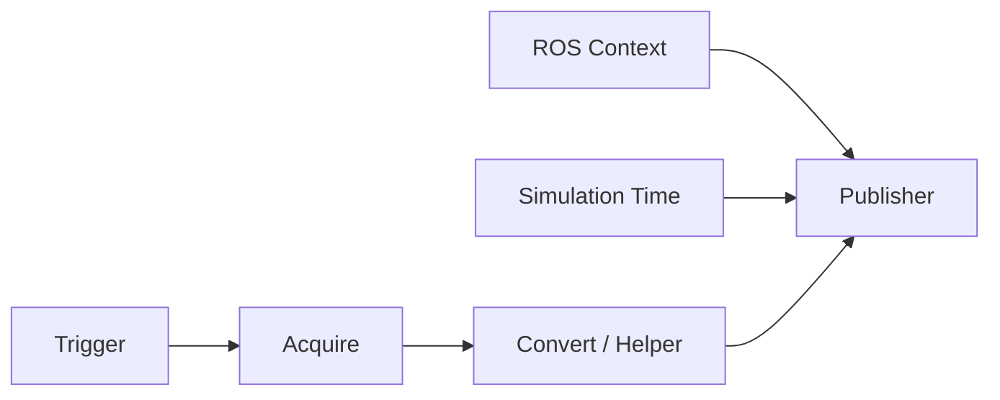

# Action Graph로 camera, RTX LiDAR와 IMU 발행

이 튜토리얼에서는 sensor prim에서 ROS message까지 이어지는 Action Graph를 직접 만들다. 그래프를 자동 생성하는 메뉴도 사용하지만, 생성된 node와 실행 주기를 읽고 수정할 수 있어야 완료한 것으로 본다.

## 1. ROS sensor graph의 공통 구조

모든 graph를 다음 다섯 층으로 읽다.



| 층 | 대표 node | 질문 |
|---|---|---|
| Trigger | On Playback Tick, Isaac Simulation Gate | 몇 simulation frame마다 실행하는가? |
| Context | ROS 2 Context | 어느 domain과 namespace를 쓰는가? |
| Time | Isaac Read Simulation Time | 모든 message가 같은 clock인가? |
| Acquire | Read IMU, Create Render Product | 어느 sensor prim을 읽는가? |
| Convert/Publish | Camera Helper, RTX Lidar Helper, Publish Imu | type, topic, frame ID와 QoS는 무엇인가? |

그래프를 만든 뒤 **Play하기 전에 Stage를 저장**하다. 5.1에서는 일부 ROS OmniGraph 값이 저장 전 첫 실행에서 제대로 반영되지 않는 known issue가 있다. graph prim을 robot/sensor hierarchy 아래 배치하면 automatic namespace generation의 영향을 받으므로 최종 topic 이름을 CLI로 확인하다.

## 2. camera prim을 준비하다

1. `Create > Camera`로 `/World/Robot/base_link/front_camera`를 만들거나 sensor asset을 reference하다.
2. camera를 robot link의 자식으로 두고 local transform을 설정하다.
3. Viewport 왼쪽 위 camera selector에서 해당 camera를 골라 시야를 확인하다.
4. clipping range, focal length, horizontal aperture와 해상도를 기록하다.
5. `camera_link`와 ROS optical frame의 축 차이를 TF로 명시하다.

camera intrinsic은 해상도와 USD camera parameter로 계산되다. pinhole 근사에서 다음 관계를 사용하다.

\[
f_x = \frac{W f}{A_h},\qquad
f_y = \frac{H f}{A_v},\qquad
c_x=\frac{W}{2},\quad c_y=\frac{H}{2}
\]

`f`는 focal length, `A_h`, `A_v`는 aperture이다. ROS `CameraInfo`의 `K`, `P`, distortion model을 실제 calibration 소비자가 기대하는 값과 비교하다.

## 3. RGB와 CameraInfo graph를 만들다

빠른 경로는 `Tools > Robotics > ROS 2 OmniGraphs > Camera`이다. graph path, camera prim, frame ID, namespace와 RGB/Depth/CameraInfo 선택을 입력하면 필요한 node가 생성되다.

수동으로 만들 때 RGB pipeline은 다음 node를 포함하다.

```text
On Playback Tick
ROS 2 Context
Isaac Run One Simulation Frame
Isaac Create Render Product
ROS 2 Camera Helper        type=rgb
ROS 2 Camera Info Helper
```

Property를 다음처럼 설정하다.

```text
cameraPrim       = /World/Robot/base_link/front_camera
resolution       = 640 × 480
Camera Helper:
  type           = rgb
  topicName      = /front_camera/image_raw
  frameId        = front_camera_optical_frame
Camera Info:
  topicName      = /front_camera/camera_info
  frameId        = front_camera_optical_frame
```

`Isaac Create Render Product.renderProductPath`를 두 helper에 연결하다. Camera Helper는 실행 중 `/Render/PostProcessing/SDGPipeline`을 session graph로 생성하다. 이 내부 graph는 Stage에 저장되는 authoring graph와 다르다.

각 Camera Helper는 한 종류의 데이터만 처리하다. RGB, depth, point cloud, semantic/instance label 또는 bounding box가 각각 필요하면 helper를 나누다. 한 번 활성화하여 SDG pipeline을 생성한 helper의 `type`을 실행 중 바꿔 재사용하지 말고 새 node를 만들거나 Stage를 reload하다.

```bash
# [ROS]
sudo apt install -y ros-jazzy-rqt-image-view
ros2 topic list -t | grep front_camera
ros2 topic echo /front_camera/camera_info --once
ros2 run rqt_image_view rqt_image_view /front_camera/image_raw
```

RViz2의 Image display에서 영상이 보이지 않으면 Reliability를 Best Effort로 바꾸다. 색이 이상하면 encoding과 channel ordering을, depth가 흑백 극단값만 보이면 무한대 depth가 포함되는 시야와 display range를 확인하다.

## 4. depth와 point cloud를 분리하다

Depth helper와 depth point-cloud helper를 별도로 만들고 동일 render product를 입력하다. 대역폭부터 계산하다.

```text
640 × 480 × 4 byte × 30 Hz ≈ 36.9 MB/s
```

여기에 DDS serialization과 PointCloud2가 추가되므로 실제 사용량은 더 크다. 처음에는 320×240, 10 Hz로 검증한 뒤 올리다.

```bash
# [DBG]
ros2 topic hz /front_camera/depth
ros2 topic bw /front_camera/depth
ros2 topic info /front_camera/depth -v
```

semantic/instance/bounding-box 토픽을 쓰려면 environment prim에 semantic label을 먼저 authoring하고 `vision_msgs` 의존성을 설치하다.

```bash
# [ROS]
sudo apt install -y ros-jazzy-vision-msgs
```

## 5. Isaac Sim 5.1 RTX LiDAR를 만들다

5.1에서는 `Create > Sensors > RTX Lidar`에서 예를 들어 다음을 고르다.

- 2D: `NVIDIA > Example Rotary 2D`
- 3D: `NVIDIA > Example Rotary`

sensor prim을 `/World/Robot/base_link/lidar_link` 아래로 이동하고 local transform을 0으로 맞추다. 5.0 이전의 Camera prim 기반 RTX LiDAR 방식은 deprecated이므로 새 custom sensor는 `OmniLidar`와 해당 schema를 사용하다.

빠른 graph 생성은 `Tools > Robotics > ROS 2 OmniGraphs > RTX Lidar`를 사용하다. 수동 graph에는 다음이 들어가다.

```text
On Playback Tick
ROS 2 Context
Isaac Run One Simulation Frame
Isaac Create Render Product       cameraPrim=<OmniLidar prim>
ROS 2 RTX Lidar Helper            type=laser_scan
ROS 2 RTX Lidar Helper            type=point_cloud
```

```text
LaserScan Helper:
  topicName       = /scan
  frameId         = lidar_link
  type            = laser_scan
PointCloud Helper:
  topicName       = /points
  frameId         = lidar_link
  type            = point_cloud
  publishFullScan = 요구에 맞게 선택
```

rotary LiDAR의 `LaserScan`은 한 바퀴가 완성되어야 발행되다. 60 FPS에서 10 Hz 회전이면 약 6 frame이 한 scan을 구성하므로 `/scan`이 render frame마다 나오지 않는 것이 정상이다. PointCloud2는 `Publish Full Scan` 설정에 따라 frame별 또는 누적 full scan으로 나오다.

```bash
# [DBG]
ros2 topic echo /scan --once \
  --qos-reliability best_effort
ros2 topic hz /scan
ros2 topic echo /points --once \
  --qos-reliability best_effort
```

RViz2 Fixed Frame을 `lidar_link` 또는 연결된 `base_link`로 두고 LaserScan과 PointCloud2 display를 추가하다. 점군이 robot과 함께 움직이지 않으면 sensor TF가 없거나 `frame_id`가 틀린 것이다.

RTX LiDAR가 실행 중일 때 UI window를 redock하면 5.1 공식 튜토리얼이 crash 가능성을 경고하다. layout을 바꾸기 전에 Pause하다.

## 6. IMU sensor를 발행하다

1. `/World/Robot/base_link/imu_link`를 선택하다.
2. `Create > Sensors > Imu Sensor`를 실행하다.
3. `/World/Robot/base_link/imu_link/Imu_Sensor`가 생겼는지 확인하다.
4. sensor period와 filter width를 물리 timestep에 맞추다.

Action Graph는 다음처럼 구성하다.

```text
On Playback Tick.tick
  → Isaac Simulation Gate.execIn       step=2
  → Isaac Read IMU.execIn              imuPrim=/.../Imu_Sensor
  → ROS 2 Publish Imu.execIn           topicName=/imu/data

ROS 2 Context.context  → Publish Imu.context
Simulation Time.time   → Publish Imu.timeStamp
Read IMU outputs       → Publish Imu orientation/angularVelocity/linearAcceleration
```

publisher의 `frameId`는 TF에 실제 존재하는 `imu_link`로 하다. `base_link`라고 적는 것만으로 측정값이 base frame으로 회전되는 것은 아니다.

```bash
# [DBG]
ros2 topic echo /imu/data --once \
  --qos-reliability best_effort
ros2 topic hz /imu/data
ros2 run tf2_ros tf2_echo base_link imu_link
```

정지 상태에서 orientation quaternion norm이 약 1인지, angular velocity가 0 근처인지, linear acceleration에 중력이 포함되는지 downstream estimator의 기대와 함께 검증하다. covariance가 알려지지 않은 경우를 소비자가 어떻게 해석하는지도 확인하다.

## 7. 발행 주기를 설계하다

일반 OmniGraph publisher는 `Isaac Simulation Gate.step`을 사용하다. camera/RTX LiDAR helper는 생성한 SDG pipeline의 `frameSkipCount`를 쓰다.

| 설정 | 의미 |
|---|---|
| Gate `step=2` | 두 simulation frame마다 한 번 실행하다. |
| Helper `frameSkipCount=3` | 세 frame을 건너뛰고 네 번째 frame에 발행하다. |
| Helper `enabled=false` | 필요 없는 render/publish pipeline을 끄다. |

60 Hz target에서 예시는 다음과 같다.

| topic | 설정 | 목표 simulation-time rate |
|---|---:|---:|
| `/clock` | 매 frame | 60 Hz |
| `/imu/data` | gate step 2 | 30 Hz |
| `/scan` | helper skip 11 | 약 5 Hz, scan 완성 주기 영향 |
| RGB | helper skip 3 | 약 15 Hz |
| CameraInfo | helper skip 5 | 약 10 Hz |

실제 wall-clock rate는 GPU/CPU 부하와 real-time factor의 영향을 받다. `Isaac Real Time Factor`를 발행하고 simulation timestamp 간격도 함께 비교하다.

```bash
# [DBG]
for topic in /clock /imu/data /scan /front_camera/image_raw; do
  echo "=== $topic ==="
  timeout 8 ros2 topic hz "$topic" || true
done
```

camera가 느리면 먼저 해상도와 불필요한 helper를 줄이다. high-bandwidth PointCloud2와 depth를 사용하지 않는데 계속 발행하지 않다.

## 8. Python으로 작은 graph를 재현하다

GUI에서 검증한 graph는 Script Editor 또는 Extension에서 코드로 생성할 수 있다. 다음은 `/clock` graph의 최소 패턴이다.

```python
import omni.graph.core as og

keys = og.Controller.Keys
og.Controller.edit(
    {"graph_path": "/World/ROS2Clock", "evaluator_name": "execution"},
    {
        keys.CREATE_NODES: [
            ("tick", "omni.graph.action.OnPlaybackTick"),
            ("context", "isaacsim.ros2.bridge.ROS2Context"),
            ("time", "isaacsim.core.nodes.IsaacReadSimulationTime"),
            ("pub", "isaacsim.ros2.bridge.ROS2PublishClock"),
        ],
        keys.SET_VALUES: [
            ("context.inputs:useDomainIDEnvVar", True),
        ],
        keys.CONNECT: [
            ("tick.outputs:tick", "pub.inputs:execIn"),
            ("context.outputs:context", "pub.inputs:context"),
            ("time.outputs:simulationTime", "pub.inputs:timeStamp"),
        ],
    },
)
```

node type 문자열은 Isaac Sim 5.1 extension의 node registry에 종속되다. 최신 릴리스 예제를 섞지 말고 Action Graph 검색 결과와 공식 5.1 OGN API에서 확인하다.

## 9. 전체 검증 체크포인트

- [ ] RGB와 CameraInfo의 timestamp와 frame ID가 일치하다.
- [ ] camera optical TF가 존재하고 RViz 영상이 정상 방향이다.
- [ ] `/scan`과 `/points`가 실제 LiDAR scan mode에 맞는 주기로 발행되다.
- [ ] IMU 측정 frame이 TF의 `imu_link`와 일치하다.
- [ ] RViz sensor display의 QoS가 publisher와 호환되다.
- [ ] 사용하지 않는 depth/point cloud/helper를 비활성화했다.
- [ ] Stop→Play와 Stage reopen 뒤 graph가 다시 동작하다.

## 출처

- [Isaac Sim 5.1 — ROS 2 Cameras](https://docs.isaacsim.omniverse.nvidia.com/5.1.0/ros2_tutorials/tutorial_ros2_camera.html)
- [Isaac Sim 5.1 — Publishing Camera Data](https://docs.isaacsim.omniverse.nvidia.com/5.1.0/ros2_tutorials/tutorial_ros2_camera_publishing.html)
- [Isaac Sim 5.1 — RTX Lidar Sensors with ROS 2](https://docs.isaacsim.omniverse.nvidia.com/5.1.0/ros2_tutorials/tutorial_ros2_rtx_lidar.html)
- [Isaac Sim 5.1 — RTX Lidar Sensor](https://docs.isaacsim.omniverse.nvidia.com/5.1.0/sensors/isaacsim_sensors_rtx_lidar.html)
- [Isaac Sim 5.1 — IMU Sensor](https://docs.isaacsim.omniverse.nvidia.com/5.1.0/sensors/isaacsim_sensors_physics_imu.html)
- [Isaac Sim 5.1 — Setting Publish Rates](https://docs.isaacsim.omniverse.nvidia.com/5.1.0/ros2_tutorials/tutorial_ros2_publish_rate.html)
- [Isaac Sim 5.1 — Automatic ROS 2 Namespace Generation](https://docs.isaacsim.omniverse.nvidia.com/5.1.0/ros2_tutorials/tutorial_ros2_auto_namespace.html)
- [Isaac Sim 5.1 — OmniGraph via Python](https://docs.isaacsim.omniverse.nvidia.com/5.1.0/omnigraph/omnigraph_scripting.html)
- [Isaac Sim 5.1 — ROS 2 Troubleshooting](https://docs.isaacsim.omniverse.nvidia.com/5.1.0/ros2_tutorials/troubleshooting.html)
