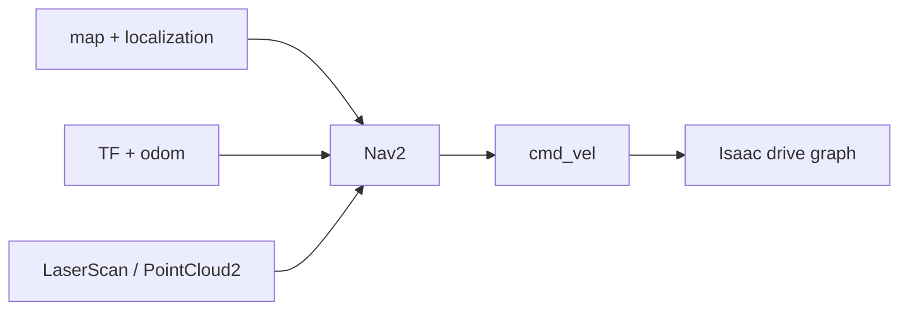

# Nav2, MoveIt 2와 ROS 2 Simulation Control

이 튜토리얼에서는 센서·TF·command pipeline을 실제 ROS 2 application에 연결하다. 먼저 NVIDIA sample로 기준 동작을 재현하고, 같은 계약을 custom robot에 옮기다. 마지막에는 ROS service/action으로 Stage를 reset하고 frame 단위로 진행하다.

## 1. application을 붙이기 전 interface 시험

Nav2나 MoveIt 2를 먼저 실행하면 여러 오류가 한꺼번에 나타나다. 다음 gate를 순서대로 통과하다.

| Gate | Nav2 | MoveIt 2 |
|---|---|---|
| Time | `/clock`, 모든 node `use_sim_time=true` | 동일 |
| Model | `base_link`, footprint/radius | URDF, SRDF, planning groups |
| State | TF, `/odom`, `/scan` 또는 point cloud | TF, `/joint_states` |
| Command | `/cmd_vel` smoke test | 단일 joint command smoke test |
| QoS/rate | scan과 odom 동기화 | joint state와 trajectory feedback |
| Safety | command timeout | joint limits, collision model |

## 2. Nav2 기준 예제를 실행하다

NVIDIA ROS workspace를 시스템 Jazzy로 빌드하고 source하다.

```bash
# [ROS]
source /opt/ros/jazzy/setup.bash
source ~/IsaacSim-ros_workspaces/jazzy_ws/install/local_setup.bash
export ROS_DOMAIN_ID=17
```

Isaac Sim에서 `Window > Examples > Robotics Examples > ROS2 > Navigation > Nova Carter`를 열고 Play하다. 별도 `[ROS]` 터미널에서 실행하다.

```bash
ros2 launch carter_navigation carter_navigation.launch.py
```

RViz2에서 occupancy map이 나타나면 초기 pose를 확인하고 **Nav2 Goal**을 지정하다. robot이 goal로 이동하면 다음 항목을 저장하다.

```bash
# [DBG]
ros2 node list > /tmp/nav2_nodes.txt
ros2 topic list -t > /tmp/nav2_topics.txt
ros2 action list -t > /tmp/nav2_actions.txt
ros2 run tf2_tools view_frames
```

공식 example은 기준선이다. 이 상태가 동작하지 않으면 custom robot configuration을 바꾸기 전에 workspace source, domain, QoS와 sample asset을 먼저 고치다.

## 3. Nav2가 요구하는 data contract

일반적인 pipeline은 다음과 같다.



| topic/edge | type | 책임 |
|---|---|---|
| `/map` | `nav_msgs/msg/OccupancyGrid` | map server 또는 SLAM |
| `/tf`, `/tf_static` | `tf2_msgs/msg/TFMessage` | localization, odometry, robot model |
| `/odom` | `nav_msgs/msg/Odometry` | simulator ground truth 또는 estimator |
| `/scan` | `sensor_msgs/msg/LaserScan` | 2D RTX LiDAR 또는 pointcloud conversion |
| `/cmd_vel` | `geometry_msgs/msg/Twist` | Nav2 controller → Isaac Sim |

`map→odom`은 AMCL/SLAM이, `odom→base_link`는 odometry source가 담당하게 하다. Isaac Sim과 localization이 같은 edge를 동시에 발행하지 않다.

### occupancy map을 만들다

`Tools > Robotics > Occupancy Map`을 열다.

1. environment root를 선택하고 **BOUND SELECTION**으로 범위를 정하다.
2. lower/upper Z를 LiDAR가 보는 장애물 높이에 맞추다. Nova Carter 공식 예시는 lower `0.1 m`, upper `0.62 m`를 사용하다.
3. **CALCULATE**, **VISUALIZE IMAGE**를 실행하다.
4. coordinate type을 ROS occupancy map YAML로 고르다.
5. image와 YAML을 Nav2 package의 `maps/`에 함께 저장하다.

```yaml
# maps/my_warehouse.yaml
image: my_warehouse.png
mode: trinary
resolution: 0.05
origin: [-10.0, -10.0, 0.0]
negate: 0
occupied_thresh: 0.65
free_thresh: 0.196
```

image 회전과 YAML `origin`을 임의로 보정하지 말고 known landmark의 world 좌표가 map 좌표와 일치하는지 확인하다.

### custom robot Nav2 porting 순서

1. `cmd_vel`로 전진·회전을 검증하다.
2. `odom→base_link`를 고정한 뒤 TF tree를 검증하다.
3. `/scan`의 `frame_id`, range, angle direction과 QoS를 검증하다.
4. footprint 또는 robot radius를 실제 collision 외곽보다 작지 않게 하다.
5. max velocity/acceleration을 Isaac drive와 Nav2 controller 양쪽에서 일치시키다.
6. AMCL initial pose와 map origin을 맞추다.
7. goal을 가까운 자유 공간부터 늘려 가다.

```bash
# [DBG]
ros2 topic hz /scan
ros2 topic hz /odom
ros2 run tf2_ros tf2_echo map base_link
ros2 action info /navigate_to_pose
```

고율 PointCloud2가 CPU를 압박하면 필요한 2D scan으로 변환하거나 full-scan 설정과 publish rate를 낮추다. Nav2가 sensor message를 놓치면 real-time factor, timestamp와 queue부터 확인하다.

## 4. 목표를 자동으로 보내다

공식 workspace의 `isaac_ros_navigation_goal` package는 임의 또는 파일 기반 goal을 보내다.

```bash
# [ROS] Nav2가 먼저 준비된 뒤 실행하다.
ros2 launch isaac_ros_navigation_goal isaac_ros_navigation_goal.launch.py
```

launch parameter에서 generator type, map YAML, 반복 횟수, action server, 장애물 여유 거리와 initial pose를 고정하다. 파일 기반 goal은 각 줄에 pose와 quaternion을 기록하다.

```text
1.0 2.0 0.0 0.0 0.0 1.0
-2.0 1.5 0.0 0.0 0.7071 0.7071
```

Action Graph waypoint follower는 in-process Nav2 package를 요구할 수 있다. Ubuntu 24.04의 Python 3.12 시스템 workspace를 Isaac Sim에 직접 source하지 않다. 이 기능을 Isaac 내부에서 써야 한다면 Python 3.11로 빌드한 공식 workspace를 `[SIM]`에 source하고, 외부 Nav2는 시스템 Jazzy에서 실행하다.

## 5. MoveIt 2 기준 예제를 실행하다

Isaac Sim에서 `Window > Examples > Robotics Examples > ROS2 > MoveIt > Franka MoveIt`을 열고 Play하다. 시스템 Jazzy workspace 터미널에서 실행하다.

```bash
# [ROS]
source /opt/ros/jazzy/setup.bash
source ~/IsaacSim-ros_workspaces/jazzy_ws/install/local_setup.bash
export ROS_DOMAIN_ID=17
ros2 launch isaac_moveit isaac_moveit.launch.py
```

RViz MotionPlanning panel에서 다음을 수행하다.

1. `hand` planning group과 `open` goal state를 선택하다.
2. **Plan**으로 trajectory만 확인하다.
3. collision과 joint limits가 정상일 때 **Execute**하다.
4. `panda_arm`으로 바꾸고 interactive marker 또는 `<random_valid>` goal을 계획하다.
5. 실행 중 `/joint_states`와 controller action 상태를 기록하다.

공식 문서는 일부 머신에서 hand `close` 실행이 지연되거나 abort될 수 있다고 알리다. 반복 실행으로 숨기지 말고 action result, joint feedback와 controller 상태를 기록하다.

## 6. custom manipulator를 MoveIt 2에 연결하다

MoveIt configuration과 Isaac asset은 같은 kinematic contract를 가져야 하다.

| 항목 | 검사 |
|---|---|
| Joint names | `/joint_states`와 URDF/SRDF가 byte 단위로 일치하다. |
| Joint limits | position/velocity/effort가 URDF, USD와 controller에 일치하다. |
| Base/tool frames | `planning_frame`, base link, end effector가 TF에 존재하다. |
| Mimic joints | MoveIt과 PhysX가 같은 master/multiplier/offset을 사용하다. |
| Collision | SRDF disable-collision pair를 실제 자기 충돌과 검증하다. |
| Command path | trajectory action 또는 adapter가 Isaac articulation command로 변환하다. |

porting 순서는 다음과 같다.

1. MoveIt Setup Assistant로 URDF/SRDF, groups, end effector와 virtual joint를 준비하다.
2. Isaac Sim은 `/joint_states`, TF와 `/clock`을 발행하다.
3. trajectory controller/adapter는 FollowJointTrajectory goal을 position/velocity command로 변환하다.
4. 한 관절, home pose, 짧은 Cartesian motion 순으로 실행하다.
5. Plan 결과를 먼저 시각화하고 collision-free임을 확인한 뒤 Execute하다.

```bash
# [DBG]
ros2 topic echo /joint_states --once
ros2 action list -t | grep -i trajectory
ros2 param get /move_group use_sim_time
ros2 run tf2_ros tf2_echo world panda_link0
```

MoveIt의 planned state가 움직이지만 Isaac robot은 정지한다면 planning이 아니라 execution adapter/action name 문제이다. robot이 움직이지만 RViz state가 따라오지 않으면 `/joint_states`, timestamp 또는 joint 이름 문제이다.

## 7. Simulation Control extension을 활성화하다

Ubuntu 24.04 Jazzy에 표준 interface를 설치하다.

```bash
# [ROS]
sudo apt install -y ros-jazzy-simulation-interfaces
```

Isaac Sim을 시작할 때 extension을 켜다.

```bash
# [SIM]
cd ~/isaacsim
./isaac-sim.sh --/isaac/startup/ros_sim_control_extension=True
```

또는 Extension Manager에서 `isaacsim.ros2.sim_control`을 활성화하다. 지원 기능은 추측하지 말고 질의하다.

```bash
# [ROS]
ros2 service call /get_simulator_features \
  simulation_interfaces/srv/GetSimulatorFeatures
ros2 service list -t | grep simulation_interfaces
ros2 action list -t
```

## 8. play, pause, stop과 frame step을 제어하다

```bash
# play
ros2 service call /set_simulation_state \
  simulation_interfaces/srv/SetSimulationState \
  "{state: {state: 1}}"

# pause
ros2 service call /set_simulation_state \
  simulation_interfaces/srv/SetSimulationState \
  "{state: {state: 2}}"

# current state
ros2 service call /get_simulation_state \
  simulation_interfaces/srv/GetSimulationState

# paused 상태에서 10 frame 진행하고 다시 pause하다.
ros2 service call /step_simulation \
  simulation_interfaces/srv/StepSimulation "{steps: 10}"

# feedback가 필요한 action 버전이다.
ros2 action send_goal /simulate_steps \
  simulation_interfaces/action/SimulateSteps \
  "{steps: 20}" --feedback
```

`step_simulation`은 paused 상태에서만 성공하고 완료 때까지 block하다. service의 `steps: 1`은 5.1 구현 내부에서 두 step을 사용할 수 있다는 공식 주석이 있으므로, 결정적 시험에서는 `/clock` 변화량과 실제 physics 결과를 함께 측정하다.

## 9. entity와 world를 시험 fixture처럼 다루다

```bash
# prim 목록
ros2 service call /get_entities \
  simulation_interfaces/srv/GetEntities \
  "{filters: {filter: '^/World/Robot'}}"

# state 조회
ros2 service call /get_entity_state \
  simulation_interfaces/srv/GetEntityState \
  "{entity: '/World/Robot'}"

# USD reference spawn
ros2 service call /spawn_entity \
  simulation_interfaces/srv/SpawnEntity \
  "{name: 'Obstacle', allow_renaming: false, uri: '/abs/box.usd', initial_pose: {pose: {position: {x: 2.0, y: 0.0, z: 0.5}, orientation: {w: 1.0}}}}"

# spawn된 entity를 제거하고 초기 상태로 reset하다.
ros2 service call /reset_simulation \
  simulation_interfaces/srv/ResetSimulation
```

`spawn_entity`의 URI는 USD이고 새 prim에는 reset 때 추적할 attribute가 붙다. `set_entity_state`는 현재 world frame만 지원하고 rigid body가 아니면 velocity가 무시되다. `get_entity_state`의 acceleration은 5.1 구현에서 0으로 반환되므로 측정값으로 해석하지 않다.

world load는 현재 Stage를 지우는 상태 변경이다. 저장하지 않은 GUI 편집을 잃을 수 있으므로 자동 시험 전용 Stage에서 실행하다.

```bash
# 먼저 pause하다.
ros2 service call /load_world \
  simulation_interfaces/srv/LoadWorld \
  "{uri: '/abs/test_world.usd'}"

ros2 service call /get_current_world \
  simulation_interfaces/srv/GetCurrentWorld
```

## 10. 재현 가능한 Nav2 시험 순서

1. world를 load하고 simulation을 pause하다.
2. robot pose와 obstacle을 설정하다.
3. Nav2 lifecycle node를 활성화하고 TF·sensor 준비를 기다리다.
4. simulation을 play하고 goal action을 보내다.
5. `/clock` 기준 timeout과 path result를 기록하다.
6. pause 후 final entity state와 collision/contact를 수집하다.
7. reset하고 같은 seed/goal로 반복하다.

wall-clock `sleep`만으로 준비 상태를 가정하지 말고 service/action readiness와 topic timestamp를 조건으로 기다리다.

## 완료 체크포인트

- [ ] NVIDIA Nova Carter Nav2 sample에서 goal을 한 번 성공했다.
- [ ] custom map origin, LiDAR 높이와 robot footprint를 기록했다.
- [ ] Franka MoveIt sample에서 Plan과 Execute를 구분해 성공했다.
- [ ] custom manipulator의 joint name/limit/TF/controller 계약을 검사했다.
- [ ] ROS service로 pause→10 step→pause를 수행했다.
- [ ] reset 후 같은 scenario를 다시 실행할 수 있다.

## 출처

- [Isaac Sim 5.1 — ROS 2 Navigation](https://docs.isaacsim.omniverse.nvidia.com/5.1.0/ros2_tutorials/tutorial_ros2_navigation.html)
- [Isaac Sim 5.1 — Multiple Robot Navigation](https://docs.isaacsim.omniverse.nvidia.com/5.1.0/ros2_tutorials/tutorial_ros2_multi_navigation.html)
- [Isaac Sim 5.1 — MoveIt 2](https://docs.isaacsim.omniverse.nvidia.com/5.1.0/ros2_tutorials/tutorial_ros2_moveit.html)
- [Isaac Sim 5.1 — ROS2 Joint Control](https://docs.isaacsim.omniverse.nvidia.com/5.1.0/ros2_tutorials/tutorial_ros2_manipulation.html)
- [Isaac Sim 5.1 — ROS2 Simulation Control](https://docs.isaacsim.omniverse.nvidia.com/5.1.0/ros2_tutorials/tutorial_ros2_simulation_control.html)
- [Isaac Sim 5.1 — ROS 2 Launch](https://docs.isaacsim.omniverse.nvidia.com/5.1.0/ros2_tutorials/tutorial_ros2_launch.html)
- [Isaac Sim 5.1 — ROS 2 Troubleshooting](https://docs.isaacsim.omniverse.nvidia.com/5.1.0/ros2_tutorials/troubleshooting.html)
