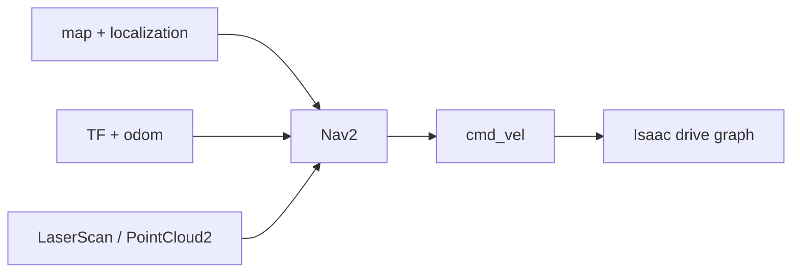

# Nav2, MoveIt 2와 ROS 2 Simulation Control

이 튜토리얼에서는 센서·TF·명령 처리 흐름을 실제 ROS 2 애플리케이션에 연결한다. 먼저 NVIDIA 예제로 기준 동작을 재현하고, 같은 연동 규칙을 사용자 정의 로봇에 옮긴다. 마지막에는 ROS 서비스/액션으로 Stage를 초기화하고 프레임 단위로 진행한다.

## 1. 애플리케이션을 연결하기 전 인터페이스 시험

Nav2나 MoveIt 2를 먼저 실행하면 여러 오류가 한꺼번에 나타난다. 다음 항목을 순서대로 확인한다.

| 확인 항목 | Nav2 | MoveIt 2 |
|---|---|---|
| 시간 | `/clock`, 모든 노드 `use_sim_time=true` | 동일 |
| 모델 | `base_link`, footprint/반지름 | URDF, SRDF, 계획 그룹 |
| 상태 | TF, `/odom`, `/scan` 또는 점군 | TF, `/joint_states` |
| 명령 | `/cmd_vel` 기본 동작 확인 | 단일 관절 명령 기본 동작 확인 |
| QoS/주기 | 스캔과 odom 동기화 | 관절 상태와 궤적 피드백 |
| 안전 | 명령 수신 타임아웃 | 관절 한계, 충돌 모델 |

## 2. Nav2 기준 예제를 실행한다

NVIDIA ROS 워크스페이스를 시스템 Jazzy로 빌드하고 불러온다.

```bash
# [ROS]
source /opt/ros/jazzy/setup.bash
source ~/IsaacSim-ros_workspaces/jazzy_ws/install/local_setup.bash
export ROS_DOMAIN_ID=17
```

Isaac Sim에서 `Window > Examples > Robotics Examples > ROS2 > Navigation > Nova Carter`를 열고 Play한다. 별도 `[ROS]` 터미널에서 실행한다.

```bash
ros2 launch carter_navigation carter_navigation.launch.py
```

RViz2에서 점유 지도가 나타나면 초기 위치·자세를 확인하고 **Nav2 Goal**을 지정한다. 로봇이 목표로 이동하면 다음 항목을 저장한다.

```bash
# [DBG]
ros2 node list > /tmp/nav2_nodes.txt
ros2 topic list -t > /tmp/nav2_topics.txt
ros2 action list -t > /tmp/nav2_actions.txt
ros2 run tf2_tools view_frames
```

공식 예제에서는 odometry가 `/chassis/odom`, 전방 점군이 `/front_3d_lidar/lidar_points`이다. 아래 일반 구조의 `/odom`과 구분한다. 실제 연결은 [Nav2 워크숍](12-nav2-workshop.md)에서 확인한다.

공식 예제는 기준 실험이다. 이 상태가 동작하지 않으면 사용자 정의 로봇 설정을 바꾸기 전에 워크스페이스 환경 로드, 도메인, QoS와 예제 자산을 먼저 고친다.

## 3. Nav2가 요구하는 데이터 연동 규칙

일반적인 처리 흐름은 다음과 같다.



| 토픽/연결 | 타입 | 책임 |
|---|---|---|
| `/map` | `nav_msgs/msg/OccupancyGrid` | 지도 서버 또는 SLAM |
| `/tf`, `/tf_static` | `tf2_msgs/msg/TFMessage` | 위치 추정, odometry, 로봇 모델 |
| `/odom` | `nav_msgs/msg/Odometry` | 시뮬레이터 정답 데이터 또는 추정기 |
| `/scan` | `sensor_msgs/msg/LaserScan` | 2D RTX LiDAR 또는 점군 변환 |
| `/cmd_vel` | `geometry_msgs/msg/Twist` | Nav2 제어기 → Isaac Sim |

`map→odom`은 AMCL/SLAM이, `odom→base_link`는 odometry 발행 주체가 담당하게 한다. Isaac Sim과 위치 추정이 같은 연결을 동시에 발행하지 않는다.

### 점유 지도를 만든다

`Tools > Robotics > Occupancy Map`을 연다.

1. 환경 루트를 선택하고 **BOUND SELECTION**으로 범위를 정한다.
2. Z축 하한·상한를 LiDAR가 보는 장애물 높이에 맞춘다. Nova Carter 공식 예시는 lower `0.1 m`, upper `0.62 m`를 사용한다.
3. **CALCULATE**, **VISUALIZE IMAGE**를 실행한다.
4. 좌표계 형식을 ROS 점유 지도 YAML로 고른다.
5. 영상과 YAML을 Nav2 패키지의 `maps/`에 함께 저장한다.

```yaml
# maps/my_warehouse.yaml
image: my_warehouse.png
mode: trinary
resolution: 0.05
origin: [-10.0, -10.0, 0.0]
negate: 0
occupied_thresh: 0.65
free_thresh: 0.196
```

영상 회전과 YAML `origin`을 임의로 보정하지 말고 위치를 알고 있는 기준점의 월드 좌표가 지도 좌표와 일치하는지 확인한다.

### 사용자 정의 로봇 Nav2 이식 순서

1. `cmd_vel`로 전진·회전을 검증한다.
2. `odom→base_link`를 고정한 뒤 TF 트리를 검증한다.
3. `/scan`의 `frame_id`, 거리 범위, 각도 증가 방향과 QoS를 검증한다.
4. footprint 또는 로봇 반지름을 실제 충돌 외곽보다 작지 않게 설정한다.
5. 최대 속도·가속도을 Isaac drive와 Nav2 제어기 양쪽에서 일치시킨다.
6. AMCL 초기 위치·자세와 지도 원점을 맞춘다.
7. 목표를 가까운 자유 공간부터 늘려 간다.

```bash
# [DBG]
ros2 topic hz /scan
ros2 topic hz /odom
ros2 run tf2_ros tf2_echo map base_link
ros2 action info /navigate_to_pose
```

고율 PointCloud2가 CPU를 압박하면 필요한 2D 스캔으로 변환하거나 전체 스캔 설정과 발행 주기를 낮춘다. Nav2가 센서 메시지를 놓치면 실시간 비율(RTF), 타임스탬프와 큐부터 확인한다.

## 4. 목표를 자동으로 보낸다

공식 워크스페이스의 `isaac_ros_navigation_goal` 패키지는 임의 또는 파일 기반 목표를 보낸다.

```bash
# [ROS] Nav2가 먼저 준비된 뒤 실행하다.
ros2 launch isaac_ros_navigation_goal isaac_ros_navigation_goal.launch.py
```

launch 파라미터에서 목표 생성 방식, 지도 YAML, 반복 횟수, 액션 서버, 장애물 여유 거리와 초기 위치·자세를 고정한다. 파일 기반 목표는 각 줄에 위치·자세와 쿼터니언을 기록한다.

```text
1.0 2.0 0.0 0.0 0.0 1.0
-2.0 1.5 0.0 0.0 0.7071 0.7071
```

Action Graph waypoint follower는 in-process Nav2 패키지를 요구할 수 있다. Ubuntu 24.04의 Python 3.12 시스템 워크스페이스를 Isaac Sim에 직접 불러오지 않는다. 이 기능을 Isaac 내부에서 써야 한다면 Python 3.11로 빌드한 공식 워크스페이스를 `[SIM]`에 불러오고, 외부 Nav2는 시스템 Jazzy에서 실행한다.

## 5. MoveIt 2 기준 예제를 실행한다

Isaac Sim에서 `Window > Examples > Robotics Examples > ROS2 > MoveIt > Franka MoveIt`을 열고 Play한다. 시스템 Jazzy 워크스페이스 터미널에서 실행한다.

```bash
# [ROS]
source /opt/ros/jazzy/setup.bash
source ~/IsaacSim-ros_workspaces/jazzy_ws/install/local_setup.bash
export ROS_DOMAIN_ID=17
ros2 launch isaac_moveit isaac_moveit.launch.py
```

RViz MotionPlanning 패널에서 다음을 수행한다.

1. `hand` 계획 그룹과 `open` 목표 상태를 선택한다.
2. **Plan**으로 궤적만 확인한다.
3. 충돌과 관절 한계가 정상일 때 **Execute**를 누른다.
4. `panda_arm`으로 바꾸고 interactive marker 또는 `<random_valid>` 목표를 계획한다.
5. 실행 중 `/joint_states`와 제어기 액션 상태를 기록한다.

공식 문서는 일부 머신에서 그리퍼 `close` 실행이 지연되거나 중단될 수 있다고 알린다. 반복 실행으로 숨기지 말고 액션 결과, 관절 피드백과 제어기 상태를 기록한다.

## 6. 사용자 정의 매니퓰레이터를 MoveIt 2에 연결한다

MoveIt 설정과 Isaac 자산은 같은 관절 구조와 좌표계가 일치해야 한다.

| 항목 | 검사 |
|---|---|
| Joint names | `/joint_states`와 URDF/SRDF가 철자까지 정확히 일치한다. |
| Joint limits | position/velocity/effort가 URDF, USD와 제어기에 일치한다. |
| Base/tool frames | `planning_frame`, base 링크, 말단 장치가 TF에 존재한다. |
| Mimic joints | MoveIt과 PhysX가 같은 master/multiplier/offset을 사용한다. |
| Collision | SRDF에서 충돌 검사를 끈 링크 쌍이 실제 자기 충돌을 놓치지 않는지 검증한다. |
| Command path | 궤적 액션 또는 어댑터가 Isaac articulation 명령으로 변환한다. |

이식 순서는 다음과 같다.

1. MoveIt Setup Assistant로 URDF/SRDF, 그룹, 말단 장치와 가상 관절을 준비한다.
2. Isaac Sim은 `/joint_states`, TF와 `/clock`을 발행한다.
3. 궤적 제어기/어댑터는 FollowJointTrajectory 목표를 position/velocity 명령으로 변환한다.
4. 한 관절, 초기 위치·자세, 짧은 직교 좌표계 이동 순으로 실행한다.
5. Plan 결과를 먼저 시각화하고 충돌이 없음을 확인한 뒤 Execute한다.

```bash
# [DBG]
ros2 topic echo /joint_states --once
ros2 action list -t | grep -i trajectory
ros2 param get /move_group use_sim_time
ros2 run tf2_ros tf2_echo world panda_link0
```

MoveIt의 계획된 상태가 움직이지만 Isaac 로봇은 정지한다면 계획이 아니라 실행 어댑터 또는 액션 이름 문제이다. 로봇이 움직이지만 RViz 상태가 따라오지 않으면 `/joint_states`, 타임스탬프 또는 관절 이름 문제이다.

## 7. Simulation Control 확장을 활성화한다

Ubuntu 24.04 Jazzy에 표준 인터페이스를 설치한다.

```bash
# [ROS]
sudo apt install -y ros-jazzy-simulation-interfaces
```

Isaac Sim을 시작할 때 확장을 켠다.

```bash
# [SIM]
cd ~/isaacsim
./isaac-sim.sh --/isaac/startup/ros_sim_control_extension=True
```

또는 Extension Manager에서 `isaacsim.ros2.sim_control`을 활성화한다. 지원 기능은 추측하지 말고 질의한다.

```bash
# [ROS]
ros2 service call /get_simulator_features \
  simulation_interfaces/srv/GetSimulatorFeatures
ros2 service list -t | grep simulation_interfaces
ros2 action list -t
```

## 8. 재생·일시 정지·정지과 프레임 스텝을 제어한다

```bash
# play
ros2 service call /set_simulation_state \
  simulation_interfaces/srv/SetSimulationState \
  "{state: {state: 1}}"

# pause
ros2 service call /set_simulation_state \
  simulation_interfaces/srv/SetSimulationState \
  "{state: {state: 2}}"

# current state
ros2 service call /get_simulation_state \
  simulation_interfaces/srv/GetSimulationState

# paused 상태에서 10 frame 진행하고 다시 pause한다.
ros2 service call /step_simulation \
  simulation_interfaces/srv/StepSimulation "{steps: 10}"

# feedback가 필요한 action 버전이다.
ros2 action send_goal /simulate_steps \
  simulation_interfaces/action/SimulateSteps \
  "{steps: 20}" --feedback
```

`step_simulation`은 일시 정지 상태에서만 성공하고 완료 때까지 대기한다. 서비스의 `steps: 1`은 5.1 구현 내부에서 두 스텝을 사용할 수 있다는 공식 주석이 있으므로, 결정적 시험에서는 `/clock` 변화량과 실제 물리 시뮬레이션 결과를 함께 측정한다.

## 9. 엔티티와 월드를 시험 fixture처럼 다룬다

```bash
# prim 목록
ros2 service call /get_entities \
  simulation_interfaces/srv/GetEntities \
  "{filters: {filter: '^/World/Robot'}}"

# state 조회
ros2 service call /get_entity_state \
  simulation_interfaces/srv/GetEntityState \
  "{entity: '/World/Robot'}"

# USD reference spawn
ros2 service call /spawn_entity \
  simulation_interfaces/srv/SpawnEntity \
  "{name: 'Obstacle', allow_renaming: false, uri: '/abs/box.usd', initial_pose: {pose: {position: {x: 2.0, y: 0.0, z: 0.5}, orientation: {w: 1.0}}}}"

# spawn된 entity를 제거하고 초기 상태로 reset한다.
ros2 service call /reset_simulation \
  simulation_interfaces/srv/ResetSimulation
```

`spawn_entity`의 URI는 USD이고 새 prim에는 초기화 때 추적할 속성이 붙는다. `set_entity_state`는 현재 월드 프레임만 지원하고 rigid body가 아니면 velocity가 무시된다. `get_entity_state`의 acceleration은 5.1 구현에서 0으로 반환되므로 측정값으로 해석하지 않는다.

월드 load는 현재 Stage를 지우는 상태 변경이다. 저장하지 않은 GUI 편집을 잃을 수 있으므로 자동 시험 전용 Stage에서 실행한다.

```bash
# 먼저 pause한다.
ros2 service call /load_world \
  simulation_interfaces/srv/LoadWorld \
  "{uri: '/abs/test_world.usd'}"

ros2 service call /get_current_world \
  simulation_interfaces/srv/GetCurrentWorld
```

## 10. 재현 가능한 Nav2 시험 순서

1. 월드를 load하고 시뮬레이션을 일시 정지한다.
2. 로봇 위치·자세와 장애물을 설정한다.
3. Nav2 수명 주기(lifecycle) 노드를 활성화하고 TF·센서 준비를 기다린다.
4. 시뮬레이션을 재생하고 목표 액션을 보낸다.
5. `/clock` 기준 타임아웃과 경로 실행 결과를 기록한다.
6. 일시 정지 후 최종 엔티티 상태와 충돌·접촉 정보를 수집한다.
7. 초기화하고 같은 시드/목표로 반복한다.

실제 시간 기준 `sleep`만으로 준비 상태를 가정하지 말고 서비스/액션 readiness와 토픽 타임스탬프를 조건으로 기다린다.

## 완료 체크포인트

- [ ] NVIDIA Nova Carter Nav2 예제에서 목표에 한 번 도달했다.
- [ ] 사용자 정의 지도 원점, LiDAR 높이와 로봇 footprint를 기록했다.
- [ ] Franka MoveIt 예제에서 Plan과 Execute를 구분해 성공했다.
- [ ] 사용자 정의 매니퓰레이터의 관절 이름/한계/TF/제어기 연동 규칙을 검사했다.
- [ ] ROS 서비스로 일시 정지→10 스텝→일시 정지를 수행했다.
- [ ] 초기화 후 같은 시나리오를 다시 실행할 수 있다.

## 출처

- [Isaac Sim 5.1 — ROS 2 Navigation](https://docs.isaacsim.omniverse.nvidia.com/5.1.0/ros2_tutorials/tutorial_ros2_navigation.html)
- [Isaac Sim 5.1 — Multiple Robot Navigation](https://docs.isaacsim.omniverse.nvidia.com/5.1.0/ros2_tutorials/tutorial_ros2_multi_navigation.html)
- [Isaac Sim 5.1 — MoveIt 2](https://docs.isaacsim.omniverse.nvidia.com/5.1.0/ros2_tutorials/tutorial_ros2_moveit.html)
- [Isaac Sim 5.1 — ROS2 Joint Control](https://docs.isaacsim.omniverse.nvidia.com/5.1.0/ros2_tutorials/tutorial_ros2_manipulation.html)
- [Isaac Sim 5.1 — ROS2 Simulation Control](https://docs.isaacsim.omniverse.nvidia.com/5.1.0/ros2_tutorials/tutorial_ros2_simulation_control.html)
- [Isaac Sim 5.1 — ROS 2 Launch](https://docs.isaacsim.omniverse.nvidia.com/5.1.0/ros2_tutorials/tutorial_ros2_launch.html)
- [Isaac Sim 5.1 — ROS 2 Troubleshooting](https://docs.isaacsim.omniverse.nvidia.com/5.1.0/ros2_tutorials/troubleshooting.html)
