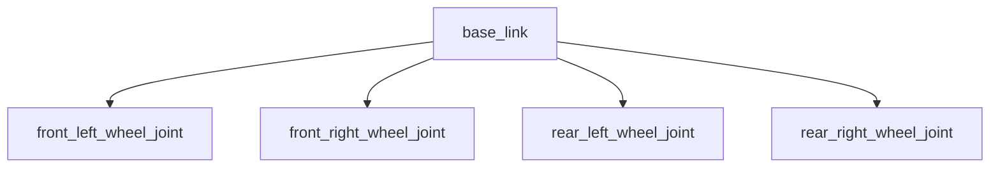
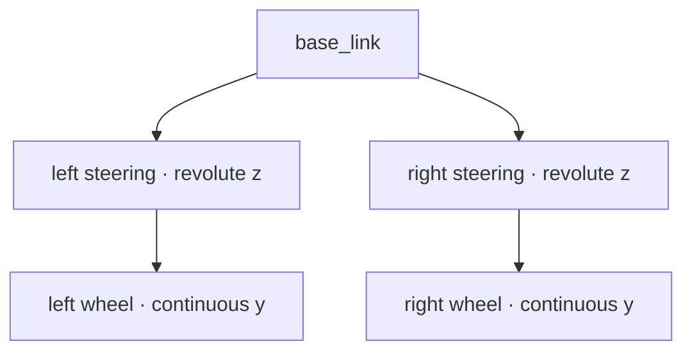

# 4륜 rover: skid steering과 Ackermann steering

이 장에서는 같은 차체와 바퀴 치수를 사용하는 4륜 rover 두 대를 비교합니다.

- `rover_diff`: 네 바퀴의 축 방향은 고정하고, 왼쪽 두 바퀴와 오른쪽 두 바퀴의 속도 차이로 회전합니다.
- `rover_ackermann`: 앞바퀴 두 개가 각각 조향하고, 뒷바퀴 두 개가 차체를 밀어 움직입니다.

두 모델 모두 `geometry_msgs/msg/Twist` 형식의 `/cmd_vel`을 받고 `/odom`과
`odom → base_footprint` TF를 냅니다. bringup launch는 `/odom`의 pose를 누적하는
`gazebo_tutorial_tools/odom_to_path`도 함께 실행하므로 RViz의
`/wheel_odom_path`에서 주행 궤적을 바로 비교할 수 있습니다.

!!! important "두 모델 모두 실제 wheel odometry를 냅니다"
    `rover_diff`는 `odometry_source=0`으로 설정되어 첫 wheel pair(이 모델에서는
    앞바퀴)의 회전량을 적분한 **encoder wheel odometry**를 냅니다. 반면 Humble의
    `libgazebo_ros_ackermann_drive.so`에는 encoder 선택 항목이 없습니다. 그래서
    Ackermann launch는 `gazebo_tutorial_tools/ackermann_odom`을 함께 실행해 뒷바퀴
    회전량과 앞바퀴 조향각을 적분한 `/odom`과 TF를 만듭니다. 내장 플러그인의 world
    pose는 `/ground_truth/odom`으로 분리해 추정값과 비교합니다.

## 1. 모델 파일을 먼저 읽어 보기

공통 형상과 관성은 다음 파일에 있습니다.

```text
gazebo_tutorial_description/urdf/
├── macros/rover_macros.xacro
├── rover_diff.urdf.xacro
└── rover_ackermann.urdf.xacro
```

두 모델의 공통 치수는 다음과 같습니다.

| 항목 | 값 | Xacro property |
| --- | ---: | --- |
| 바퀴 반지름 | 0.16 m | `rover_wheel_radius` |
| 바퀴 폭 | 0.08 m | `rover_wheel_width` |
| 좌우 윤거(track width) | 0.62 m | `rover_track_width` |
| 앞뒤 축간거리(wheelbase) | 0.56 m | `rover_wheelbase` |

`base_footprint`는 바닥에 투영한 질량 없는 기준 frame이고, `base_link`는 관성·visual·
collision을 가진 실제 차체입니다. 두 link 사이의 fixed joint가 차체 중심을 바닥에서
0.24 m 위로 올립니다.

전개된 URDF가 XML과 URDF 규칙을 만족하는지 Gazebo를 켜기 전에 확인합니다.

```bash
cd ~/gazebo-sim-tutorial-kr/ros2_ws
source /opt/ros/humble/setup.bash
source install/setup.bash

xacro src/gazebo_tutorial_description/urdf/rover_diff.urdf.xacro \
  > /tmp/rover_diff.urdf
xacro src/gazebo_tutorial_description/urdf/rover_ackermann.urdf.xacro \
  > /tmp/rover_ackermann.urdf

check_urdf /tmp/rover_diff.urdf
check_urdf /tmp/rover_ackermann.urdf
```

두 명령의 마지막에 `Successfully Parsed XML`이 보이면 link/joint tree가 유효합니다.
`check_urdf`가 없다면 `sudo apt install liburdfdom-tools`로 설치할 수 있습니다.

## 2. 4륜 differential/skid 모델의 구조

`rover_diff.urdf.xacro`의 모든 wheel joint는 `base_link`를 parent로 하는
`continuous` joint이고 축은 `0 1 0`, 즉 로봇의 좌우 방향입니다.



Gazebo 플러그인의 이름은 differential drive이지만, 이처럼 앞뒤 바퀴의 조향축이
고정된 4륜 차체에 적용하면 물리적인 움직임은 **skid steering**입니다. 회전할 때
바퀴가 옆으로 조금 미끄러져야 하며, 제자리 회전도 가능합니다.

### 왜 joint 태그를 네 개 모두 써야 하나

Humble의 `libgazebo_ros_diff_drive.so`는 `<num_wheel_pairs>`만큼
`<left_joint>`와 `<right_joint>`를 반복해서 읽습니다. 이 예제에는 wheel pair가
앞·뒤 두 쌍이므로 다음 구성이 필요합니다.

```xml
<num_wheel_pairs>2</num_wheel_pairs>
<left_joint>front_left_wheel_joint</left_joint>
<right_joint>front_right_wheel_joint</right_joint>
<left_joint>rear_left_wheel_joint</left_joint>
<right_joint>rear_right_wheel_joint</right_joint>
<wheel_separation>0.62</wheel_separation>
<wheel_separation>0.62</wheel_separation>
<wheel_diameter>0.32</wheel_diameter>
<wheel_diameter>0.32</wheel_diameter>
```

joint를 두 쌍 쓰고 `num_wheel_pairs`를 생략하면 기본값 1과 실제 joint 개수가 맞지 않아
플러그인이 중단됩니다. separation과 diameter도 pair별 vector이므로 두 번 적어
앞축과 뒤축에 같은 값을 명시했습니다.

네 바퀴 encoder를 모두 쓰는 4륜 odometry를 직접 만든다면 양쪽 바퀴 각속도의 앞·뒤
평균을 각각 $\bar{\omega}_L$, $\bar{\omega}_R$로 두고 다음 이상적인 평면 운동학을
적용할 수 있습니다.

$$
v = \frac{r}{2}(\bar{\omega}_R + \bar{\omega}_L), \qquad
\dot{\theta} = \frac{r}{b}(\bar{\omega}_R - \bar{\omega}_L)
$$

여기서 $r$은 바퀴 반지름, $b$는 좌우 윤거입니다. 다만 Humble의
`gazebo_ros_diff_drive` 구현은 여러 pair의 평균을 odometry에 사용하지 않습니다.
`UpdateWheelVelocities()`는 두 pair를 모두 구동하지만 `UpdateOdometryEncoder()`는
joint 배열의 첫 left/right와 `wheel_separation[0]`, `wheel_diameter[0]`만 읽습니다.
이 모델은 앞바퀴 pair를 먼저 적었으므로 실제 `/odom`은
`front_left_wheel_joint`와 `front_right_wheel_joint`의 회전량만 적분합니다. 뒤 pair는
구동에는 참여하지만 odometry 계산에는 참여하지 않습니다.

이 구현 제한과 별개로 실제 Gazebo에서는 접촉 마찰과 옆 미끄러짐 때문에 ground
truth와 encoder 적분 결과가 조금씩 달라질 수 있습니다. 또한 Humble 구현은
`twist.twist.linear.x`를 이동량의 크기로 계산하므로 후진 중에도 해당 값이 양수로
표시될 수 있습니다. 전·후진 궤적은 `/odom.pose.pose`와 RViz Path로 판단하세요.

## 3. differential rover 실행과 키보드 조종

첫 번째 터미널에서 launch합니다.

```bash
cd ~/gazebo-sim-tutorial-kr/ros2_ws
source /opt/ros/humble/setup.bash
source install/setup.bash

ros2 launch gazebo_tutorial_bringup rover_diff.launch.py
```

Gazebo와 RViz가 함께 열리고 로봇이 바닥에 안정적으로 놓일 때까지 잠시 기다립니다.
launch 인자는 다음처럼 확인할 수 있습니다.

```bash
ros2 launch gazebo_tutorial_bringup rover_diff.launch.py --show-args
```

두 번째 터미널에서 키보드 teleop을 실행합니다.

```bash
source /opt/ros/humble/setup.bash
source ~/gazebo-sim-tutorial-kr/ros2_ws/install/setup.bash

ros2 run teleop_twist_keyboard teleop_twist_keyboard \
  --ros-args --remap cmd_vel:=/cmd_vel
```

teleop 터미널에 포커스를 둔 상태에서 사용합니다.

| 키 | 동작 |
| --- | --- |
| `i`, `,` | 직진, 후진 |
| `j`, `l` | 제자리 좌회전, 우회전 |
| `u`, `o`, `m`, `.` | 전진/후진하며 곡선 주행 |
| `k` 또는 space | 정지 |
| `q` / `z` | 선속도와 각속도 배율을 함께 증가 / 감소 |
| `w` / `x` | 선속도 배율만 증가 / 감소 |
| `e` / `c` | 각속도 배율만 증가 / 감소 |

먼저 `i`로 약 2 m 직진하고, `j`로 약 90도 회전하는 동작을 네 번 반복해 사각형을
그려 보세요. skid steering 특성 때문에 네 모서리가 정확한 직각이나 한 점 회전으로
보이지 않을 수 있습니다.

명령 수신과 odometry를 별도 터미널에서 확인합니다.

```bash
ros2 topic hz /cmd_vel
ros2 topic hz /odom
ros2 topic echo /odom --once
ros2 run tf2_ros tf2_echo odom base_footprint
```

`/cmd_vel`은 키를 누르는 동안에만 측정해야 주기가 표시됩니다. `/odom`의
`header.frame_id`는 `odom`, `child_frame_id`는 `base_footprint`여야 합니다.

## 4. RViz에서 wheel odometry Path 확인

launch가 불러오는 `odom.rviz`에는 다음 구성이 포함됩니다.

- Fixed Frame: `odom`
- RobotModel: `/robot_description`
- TF
- Odometry: `/odom`
- Path: `/wheel_odom_path`
- Ground Truth Path: `/ground_truth_path`(해당 launch에서 제공할 때)

Path가 보이지 않으면 RViz 왼쪽 아래 **Add → By topic → `/wheel_odom_path` → Path**를
선택하고, Global Options의 Fixed Frame을 `odom`으로 설정합니다. 경로 생성 상태는
다음 명령으로도 확인할 수 있습니다.

```bash
ros2 node info /odom_to_path
ros2 topic info /wheel_odom_path --verbose
ros2 topic echo /wheel_odom_path --once
```

Path는 최대 2,000점을 보관합니다. Gazebo에서 simulation reset을 눌러 시간이 뒤로
가면 변환 노드가 이전 궤적을 자동으로 지웁니다. 경로만 즉시 비우고 싶다면 launch를
종료한 뒤 다시 실행하는 것이 가장 간단합니다.

Ackermann launch에서는 wheel odometry를 누적한 초록색 `/wheel_odom_path`와 내장
플러그인의 world pose를 누적한 빨간색 `/ground_truth_path`를 함께 표시합니다. 두
경로는 처음에는 거의 겹치지만 미끄러짐과 bicycle 근사 오차가 누적되면 벌어집니다.

RViz를 별도로 켜야 하는 환경에서는 다음처럼 실행할 수 있습니다.

```bash
rviz2 -d $(ros2 pkg prefix --share gazebo_tutorial_bringup)/rviz/odom.rviz
```

GUI 없는 환경에서 spawn과 토픽만 검사하려면 다음을 사용합니다.

```bash
timeout --signal=INT 20s \
  ros2 launch gazebo_tutorial_bringup rover_diff.launch.py \
  gui:=false rviz:=false
```

## 5. Ackermann 모델의 joint tree

자동차형 로봇의 앞바퀴는 방향을 바꾸면서 동시에 굴러야 합니다. URDF에는 두 축을
가진 `universal` joint가 없으므로 각 앞바퀴를 두 joint로 분리합니다.



- `front_left_steering_joint`, `front_right_steering_joint`: z축을 중심으로 조향
- `front_left_wheel_joint`, `front_right_wheel_joint`: 조향 knuckle 아래에서 자유롭게 구름
- `rear_left_wheel_joint`, `rear_right_wheel_joint`: base에 연결된 구동 바퀴

Humble의 Ackermann 플러그인은 앞바퀴 spin joint의 child link에 있는 첫 번째
collision으로 바퀴 중심을 구하고, 뒤 오른쪽 바퀴의 첫 번째 collision으로 반지름을
구합니다. 따라서 이 예제는 각 wheel link에 정확히 하나의 원통 collision을 두고,
wheel link가 반드시 해당 spin joint의 child가 되도록 구성했습니다.

### 플러그인이 실제로 읽는 Humble 태그

ROS 1 Ackermann 예제나 새 Gazebo용 플러그인과 섞지 않도록 태그 이름을 대조합니다.

| 역할 | Humble Gazebo Classic 태그 | 이 모델의 값 |
| --- | --- | --- |
| 앞바퀴 구름 joint | `front_left_joint`, `front_right_joint` | `front_*_wheel_joint` |
| 뒷바퀴 구동 joint | `rear_left_joint`, `rear_right_joint` | `rear_*_wheel_joint` |
| 앞바퀴 조향 joint | `left_steering_joint`, `right_steering_joint` | `front_*_steering_joint` |
| 선택 조향 핸들 | `steering_wheel_joint` | `steering_wheel_joint` |
| 속도/타이어 조향 한계 | `max_speed`, `max_steer` | 2.0 m/s, 0.60 rad |
| 핸들 최대각 | `max_steering_angle` | 7.85 rad |
| 조향 PID | `left_steering_pid_gain`, `right_steering_pid_gain` | `80 0 2` |
| 구동 PID | `linear_velocity_pid_gain` | `20 0 0.5` |
| 출력 | `publish_odom`, `publish_distance` | `true` |
| world pose 토픽 | ROS remapping `odom:=ground_truth/odom` | `/ground_truth/odom` |
| 내장 odom TF | `publish_odom_tf` | `false` |
| world pose frame | `odometry_frame` | `world` |

`wheel_separation`, `wheel_diameter`, `odometry_source`는 diff-drive 플러그인의 태그이며
Ackermann 플러그인이 읽지 않습니다. Ackermann 플러그인은 wheel collision의 위치와
크기로 윤거·wheelbase·반지름을 직접 계산합니다.

중앙 타이어 조향 명령을 $\delta$, 윤거를 $b$, wheelbase를 $L$이라 하면 플러그인은
안쪽과 바깥쪽 앞바퀴의 목표각을 서로 다르게 계산합니다.

$$
\delta_L = \tan^{-1}\!\left(\frac{\tan\delta}
{1-\frac{b}{2L}\tan\delta}\right), \qquad
\delta_R = \tan^{-1}\!\left(\frac{\tan\delta}
{1+\frac{b}{2L}\tan\delta}\right)
$$

왼쪽으로 돌 때 안쪽인 왼쪽 앞바퀴의 조향각이 더 커지는 것이 정상입니다.
`max_steer=0.60` rad에서는 안쪽 바퀴가 약 0.833 rad까지 커질 수 있어, 실제 steering
joint limit은 여유를 두고 ±1.0 rad로 설정했습니다. 중앙 조향 한계보다 안쪽 wheel joint
한계가 더 크게 필요한 점을 놓치면 최대 회전에서 바퀴가 limit에 계속 부딪힙니다.

### Ackermann wheel odometry는 누가 계산하나

내장 Ackermann 플러그인의 기본 odometry는 wheel encoder 적분값이 아니라 Gazebo
world pose입니다. 이를 `/odom`이라는 같은 이름으로 wheel odometry처럼 사용하거나
이 플러그인이 odom TF까지
발행하게 두면 추정값과 ground truth를 구분할 수 없고 TF 소유자도 충돌합니다. 그래서
Xacro는 내장 출력을 다음처럼 분리합니다.

```xml
<remapping>odom:=ground_truth/odom</remapping>
<publish_odom>true</publish_odom>
<publish_odom_tf>false</publish_odom_tf>
<odometry_frame>world</odometry_frame>
```

bringup이 실행하는 `/ackermann_odom` 노드는 `/joint_states`에서 다음 네 값을 읽습니다.

- `rear_left_wheel_joint`, `rear_right_wheel_joint`: 뒷바퀴 회전 위치
- `front_left_steering_joint`, `front_right_steering_joint`: 앞바퀴 조향각

샘플 사이의 뒷바퀴 회전 변화량을 $\Delta\phi_L$, $\Delta\phi_R$, 왼·오른쪽 앞바퀴
조향각을 $\delta_L$, $\delta_R$라 하자. Ackermann pair의 등가 중앙 조향각 $\delta$는
단순 산술평균이 아니라 다음 관계로 복원합니다.

$$
\tan\delta = \frac{2}{\cot\delta_L + \cot\delta_R}
$$

이제 bicycle 모델의 증분은 다음과 같습니다.

$$
\Delta s = \frac{r}{2}(\Delta\phi_L + \Delta\phi_R), \qquad
\Delta\theta = \frac{\Delta s}{L}\tan\delta
$$

노드는 이 값을 적분해 `/odom`과 `odom → base_footprint`를 발행합니다. 기본
$r=0.16$ m, $L=0.56$ m는 Xacro와 같습니다. wheel joint가 $\pm\pi$ 경계를 넘을 때의
각도 차이를 보정하며, Gazebo reset으로 JointState 시간이 뒤로 가면 적분 상태도
초기화합니다. 등가 조향각 공식은 이상적인 Ackermann pair에서 정확하며, 두 조향
actuator가 과도 상태에서 서로 반대 방향을 보고하면 노드는 안전하게 두 각의 평균으로
일시 fallback합니다. 이 계산은 센서 노이즈가 없는 joint 상태를 사용하지만 접촉 미끄러짐을
직접 알 수 없으므로 `/ground_truth/odom`과 차이가 나는 것이 정상입니다.

## 6. Ackermann rover 실행과 조종

diff rover launch를 실행 중이라면 먼저 `Ctrl-C`로 종료합니다. 두 모델은 기본적으로
같은 `/cmd_vel`, `/odom`, TF frame 이름을 사용하므로 동시에 실행하지 않습니다.

```bash
source /opt/ros/humble/setup.bash
source ~/gazebo-sim-tutorial-kr/ros2_ws/install/setup.bash

ros2 launch gazebo_tutorial_bringup rover_ackermann.launch.py
```

두 번째 터미널에서 같은 teleop 명령을 실행합니다.

```bash
ros2 run teleop_twist_keyboard teleop_twist_keyboard \
  --ros-args --remap cmd_vel:=/cmd_vel
```

Ackermann 모델에서는 `j`나 `l`만 눌러 선속도 0인 제자리 회전을 시도하지 마세요.
자동차형 기구는 회전반경 0으로 움직일 수 없습니다. `u`와 `o`로 전진 곡선, `m`과
`.`로 후진 곡선을 만들고 `i`와 `,`로 직선 구간을 만듭니다.

!!! note "이 플러그인에서 `angular.z`의 의미"
    일반적인 `Twist`에서 `angular.z`는 yaw rate(rad/s)를 뜻하지만, Humble의
    `gazebo_ros_ackermann_drive` 구현은 이 값을 중앙 타이어의 목표 조향각(rad)으로
    직접 사용하고 `max_steer`로 제한합니다. 이 예제의 teleop은 교육용으로 그대로
    연결했습니다. 표준 yaw-rate 명령을 정확히 따르는 상위 제어기를 붙일 때는 속도와
    wheelbase로 조향각을 계산하는 변환 노드를 사이에 두세요.

원하는 값을 한 번 보내는 재현 가능한 시험은 다음과 같습니다.

```bash
ros2 topic pub --once /cmd_vel geometry_msgs/msg/Twist \
  "{linear: {x: 0.8}, angular: {z: 0.35}}"

sleep 3

ros2 topic pub --once /cmd_vel geometry_msgs/msg/Twist \
  "{linear: {x: 0.0}, angular: {z: 0.0}}"
```

첫 명령은 0.8 m/s와 약 20도의 중앙 조향각을 요청합니다. 플러그인의 이동 거리와
joint-state publisher가 보고하는 실제 조향각을 함께 확인할 수 있습니다. Humble Ackermann
플러그인은 별도의 `/steerangle` 토픽을 내보내지 않으므로 조향각은 `/joint_states`를
기준으로 검증합니다.

```bash
ros2 topic echo /distance --once
ros2 topic echo /joint_states --once
ros2 node info /ackermann_odom
ros2 topic echo /odom --once
ros2 topic echo /ground_truth/odom --once
ros2 run tf2_ros tf2_echo base_link front_left_steering_link
ros2 run tf2_ros tf2_echo odom base_footprint
```

Gazebo에서 회전 중인 앞바퀴를 위에서 보면 안쪽/바깥쪽 각도가 다르고, RViz의
`/wheel_odom_path`는 제자리 모서리 없이 연속적인 원호를 그려야 합니다.

## 7. 같은 조건으로 두 궤적 비교하기

두 launch를 차례로 실행해 다음 관찰표를 채워 보세요. 매번 3초 직진, 5초 좌회전,
3초 직진 순서로 같은 속도 배율을 사용합니다.

| 관찰 항목 | 4륜 diff/skid | Ackermann |
| --- | --- | --- |
| 선속도 0에서 회전 | 가능 | 불가능 |
| 회전 중 앞바퀴 방향 | 차체와 평행 | 안쪽/바깥쪽 각도가 다름 |
| 모서리 궤적 | 급하게 꺾이거나 제자리 회전 | 연속적인 원호 |
| 지면에서 필요한 현상 | 횡방향 skid | 이상적으로 pure rolling에 가까움 |
| 이 예제 `/odom`의 근거 | 첫 pair(앞바퀴) encoder 적분 | 뒤 wheel + 앞 steering 적분 |
| 별도 ground truth | 기본 launch에는 없음 | `/ground_truth/odom` → `/ground_truth_path` |

wheel odometry 오차를 직접 보고 싶다면 rover를 낮은 마찰 world나 무거운 차체로
실험해 보세요. 바퀴는 회전하지만 차체가 덜 움직일 때 초록색 wheel odometry 궤적과
빨간색 ground-truth 궤적이 달라집니다. 이 차이가 실제 로봇에서 IMU·LiDAR·visual
odometry를 함께 사용하는 이유입니다.

## 8. 자주 생기는 문제

### 네 바퀴 중 앞이나 뒤만 돈다

`rover_diff.urdf.xacro`에서 `num_wheel_pairs`가 2인지, left/right joint 태그가 각각
두 개인지 확인합니다. Gazebo 로그에 `Inconsistent number of joints specified`가
보이면 pair 수와 joint 수가 맞지 않는 것입니다.

```bash
ros2 topic echo /joint_states --once
```

네 wheel joint 이름과 velocity가 모두 들어오는지도 함께 확인합니다.

### Ackermann 플러그인이 시작하자마자 종료된다

터미널에서 `wheel joint ... not found` 또는 `steering joint ... not found`를 찾습니다.
플러그인 태그의 문자열은 URDF joint 이름과 글자 하나까지 같아야 합니다. 특히
`front_left_joint`에는 steering joint가 아니라 **wheel spin joint**를 지정하고,
`left_steering_joint`에 steering joint를 지정해야 합니다.

### Ackermann에서 `/ground_truth/odom`만 나오고 `/odom`이 없다

내장 drive 플러그인은 정상이고 wheel odometry 노드가 입력을 받지 못한 상태입니다.
필수 joint 네 개와 노드를 확인합니다.

```bash
ros2 topic echo /joint_states --once
ros2 node info /ackermann_odom
ros2 topic info /odom --verbose
```

JointState의 `name` 배열에 두 rear wheel joint와 두 front steering joint가 모두 있어야
합니다. 이름은 `ackermann_odom` 파라미터와 글자 하나까지 일치해야 합니다.

### 앞바퀴가 차체 가운데로 이동하거나 반지름이 0으로 계산된다

Ackermann 플러그인은 wheel joint child의 첫 collision을 검사합니다. wheel link가
joint의 parent로 뒤집혀 있거나 collision이 없으면 기하 계산이 실패합니다. 이
저장소의 `steered_wheel` 매크로처럼 `steering link → wheel joint → wheel link` 순서를
유지하고 wheel link에 하나의 cylinder/sphere collision을 두세요.

### 조향이 심하게 떨린다

시뮬레이션을 실시간에 가깝게 실행한 상태에서 조향 PID를 조정합니다.

- 반응이 너무 느리면 `*_steering_pid_gain`의 P를 조금 올립니다.
- 목표각 주변에서 계속 진동하면 P를 낮추거나 D를 올립니다.
- 큰 I 값은 정지 마찰 오차를 줄일 수 있지만 wind-up을 만들기 쉬우므로 처음에는 0으로 둡니다.
- 실시간 계수가 매우 낮을 때 생기는 떨림은 PID보다 렌더링/physics 부하 문제일 수 있으므로 `gui:=false`로 비교합니다.

### `/odom`은 나오지만 RViz Path가 없다

frame과 변환 노드를 순서대로 확인합니다.

```bash
ros2 topic echo /odom --once
ros2 node list | grep odom_to_path
ros2 topic hz /wheel_odom_path
ros2 run tf2_ros tf2_echo odom base_footprint
```

RViz Fixed Frame이 `odom`인지, Path display의 topic이 `/wheel_odom_path`인지 확인합니다.
`path_frame` launch 인자를 `/odom`과 다른 frame으로 바꾸면 단순 재라벨링으로 잘못된
궤적을 만들지 않도록 변환 노드가 입력을 거부합니다.

### 로봇이 전혀 움직이지 않는다

Gazebo가 pause 상태인지 먼저 확인하고, `/cmd_vel` publisher와 subscriber 수를 봅니다.

```bash
ros2 topic info /cmd_vel --verbose
ros2 topic pub --once /cmd_vel geometry_msgs/msg/Twist \
  "{linear: {x: 0.5}, angular: {z: 0.0}}"
```

subscriber가 0이면 플러그인이 로드되지 않은 것입니다. `gazebo_ros_pkgs` 설치, plugin
파일명, joint 이름을 Gazebo 터미널의 첫 오류부터 확인하세요.

## 완료 기준

- 두 Xacro를 `xacro`와 `check_urdf`로 전개·검사할 수 있다.
- diff rover의 네 wheel joint가 모두 움직이고 제자리 회전이 가능하다.
- Ackermann rover의 조향 joint와 wheel spin joint를 구분해 설명할 수 있다.
- teleop으로 두 모델에 직선과 곡선 명령을 보낼 수 있다.
- `/odom`, `odom → base_footprint`, `/wheel_odom_path`를 각각 토픽과 RViz에서 확인한다.
- diff의 첫 wheel pair와 Ackermann의 rear-wheel/steering 적분이 각각 `/odom`을 만드는 방식을 설명한다.
- Ackermann의 `/odom`과 `/ground_truth/odom` 및 두 Path의 차이를 RViz에서 확인한다.

구현 세부 사항은 ROS 2 브랜치의
[`gazebo_ros_diff_drive.cpp`](https://github.com/ros-simulation/gazebo_ros_pkgs/blob/3.9.0/gazebo_plugins/src/gazebo_ros_diff_drive.cpp)와
[`gazebo_ros_ackermann_drive.cpp`](https://github.com/ros-simulation/gazebo_ros_pkgs/blob/3.9.0/gazebo_plugins/src/gazebo_ros_ackermann_drive.cpp),
공식
[`gazebo_ros_ackermann_drive_demo.world`](https://github.com/ros-simulation/gazebo_ros_pkgs/blob/3.9.0/gazebo_plugins/worlds/gazebo_ros_ackermann_drive_demo.world)를 기준으로 했습니다.
