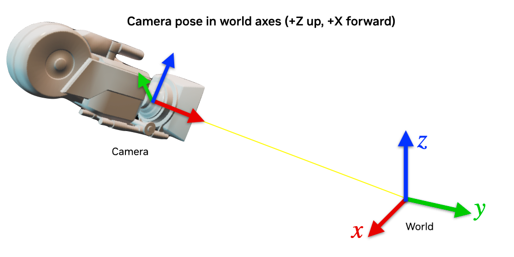
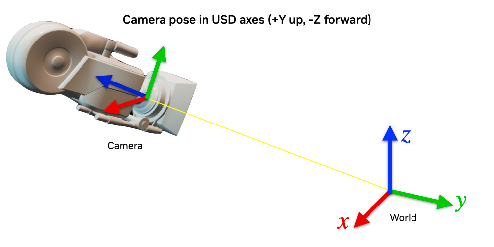
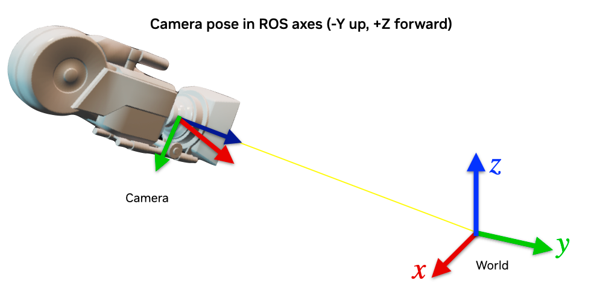

# Convention
Isaac Sim에서 사용하는 좌표계, Convention에 대해서 정리하는 문서이다.  
자세한 정보는 [다음 링크](https://docs.isaacsim.omniverse.nvidia.com/5.1.0/reference_material/reference_conventions.html?utm_source=chatgpt.com)에서 제공한다.

## Default Units
| Measurement | Units | Notes |
| -- | -- | -- |
| Length | Meter | -- |
| Mass | Kilogram | -- |
| Time | | Seconds | -- |
| Physics Time Step | Seconds | Configurable by User. Default is 1/60. |
| Force | Newton | -- |
| Frequency | Hertz | -- |
| Linera Drive Stiffenss | kg/$s^2$ | -- |
| Angular Drive Stiffness | (kg*$m^2$)/($s^2$*angle) | -- |
| Linear Drive Damping | kg/s | -- |
| Angular Drive Damping | (kg*$m^2$)/(s*angle) | -- |
| Diagonal of Inertia | (kg*$m^2$) | -- |

## Default Rotation Representations
### Quaternions
| API | Representation |
| -- | -- |
| Isaac Sim Core | (QW, QX, QY, QZ) |
| USD | (QW, QX, QY, QZ) |
| PhysX | (QX, QY, QZ, QW) |
| Dynamic Control | (QX, QY, QZ, QW) |

### Angles
| API | Representations |
| -- | -- |
| Isaac Sim Core | Radians |
| USD | Degrees |
| PhysX | Radians |
| Dyanmic Control | Radians |

### Matrix Order
NVIDIA Isaac Sim follows the right-handed cordinates conventions.
| Direction | Axis | Notes |
| -- | -- | -- |
| Up | +Z | -- |
| Forward | +X | -- |

### Default Camera Axes
| Direction | Axis |
| -- | -- |
| Up | +Y |
| Forward | -Z |
비슷하게, Image Frame의 경우
| Coordinate | Corner |
| -- | -- |
| (0,0) | Top Left |
이다.

## Sensor Axes Representation (LiDAR, Camera)
Isaac Sim에서는 서로 다른 상황에서 사용하는 3개의 좌표계 규칙이 존재한다.
### World Axes

### USD Axes
Computer Graphics에서는 USD Convention을 주로 사용한다. USD axes는 **+Y up, -Z forward convention**을 사용한다. Isaac Sim 안에서는 Property Panel이 USD stage 내에 있는 Prim들의 Pose를 보여주게 된다. USD axes에 따라서 나타는 Camear Prim은 다음과 같다.

### ROS Axes
ROS는 **-Y up, +Z forward convention**을 사용하게 된다. 따라서 카메라 데이터는 반드시 변환을 통해서 사용되어야만 한다. ROS 축에 따라서 표시되는 Camera Prim은 다음과 같다.
