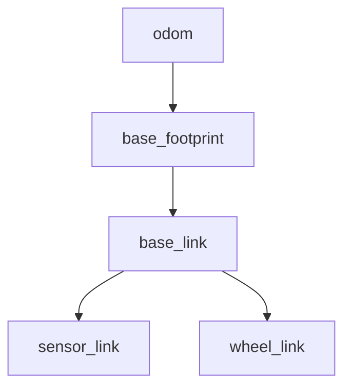

# URDF로 이해하는 TF와 RViz

로봇을 Gazebo에 띄웠는데 RViz에서는 바퀴가 몸체에서 떨어져 보이거나, 센서 데이터가
`No transform` 오류와 함께 사라지는 경우가 있다. 이럴 때는 **어떤 노드가 어느 TF를
발행하는지**와 센서 메시지의 프레임·시각을 함께 확인해야 한다. 이 장에서는 URDF의 관절이 TF로 바뀌는
과정부터 휠 오도메트리 궤적을 RViz에서 확인하는 과정까지 연결한다.

## 시작 전 준비

[설치와 첫 실행](01_setup.md)을 마쳤다면 **터미널 A**에서 로봇을 실행한다.

```bash
source /opt/ros/humble/setup.bash
source ~/robotics-sim-tutorial-kr/ros2_ws/install/setup.bash
ros2 launch gazebo_tutorial_bringup diffbot.launch.py
```

Gazebo에 로봇이 나타나면 이 터미널을 그대로 두고 **터미널 B**를 연다.

```bash
source /opt/ros/humble/setup.bash
source ~/robotics-sim-tutorial-kr/ros2_ws/install/setup.bash
```

이 장의 조회 명령은 터미널 B에서 실행한다. `timeout 10s`는 계속 출력하는 명령을 10초 뒤 종료한다. 이때 종료 코드 124는 관찰 시간이 끝났다는 뜻이다. XML·Python·YAML은 원본 파일의 관련 부분을 보여 주는 **발췌 코드**이므로 그대로 독립 파일로 실행하지 않는다.

## 1. TF는 좌표계 사이의 관계다

TF는 각 링크의 절대 위치 목록이 아니라, 부모 좌표계에서 자식 좌표계를 바라본 변환을
시간과 함께 관리하는 트리다. 이 튜토리얼 로봇의 중심 줄기는 보통 다음과 같다.



- `odom`: 휠 오도메트리가 시작된 연속적인 로컬 기준 좌표계
- `base_footprint`: 지면에 투영한 로봇 기준점
- `base_link`: 관성, 충돌 형상, 시각 형상이 붙는 본체 좌표계
- `*_link`: 바퀴와 센서의 장착 좌표계

TF는 트리이므로 한 자식 좌표계에는 부모가 하나만 있어야 한다. 같은 자식 프레임을 두 노드가
동시에 발행하면 RViz에서 로봇이 떨리거나 위치가 순간이동한다. 프레임 이름에는 선행
슬래시를 붙이지 않는 것이 ROS 2 관례다. 즉 `/base_link`가 아니라 `base_link`를 쓴다.

## 2. URDF 관절이 만드는 두 종류의 TF

URDF의 `<joint>`는 부모 링크와 자식 링크의 좌표 관계를 정의한다.

| 관절 종류 | 예 | TF 발행 방식 |
|---|---|---|
| `fixed` | `base_footprint → base_link`, `base_link → camera_link` | 시작할 때 `/tf_static`으로 한 번 발행 |
| `revolute`, `continuous`, `prismatic` | 바퀴, 조향부 | `/joint_states` 값이 올 때마다 `/tf`로 갱신 |

### 부모 좌표계에서 자식 좌표계로 가는 변환

`<origin>`은 부모 좌표계에서 자식 좌표계 원점까지의 평행 이동 `xyz`와 회전 `rpy`를
나타낸다. 따라서 URDF에 적힌 관절 하나는 개념적으로 다음 변환을 만든다.

```text
T_parent_child = T_origin(xyz, rpy) × T_joint(q, axis)
```

고정 관절은 움직임 값 `q`가 없으므로 `T_origin`만 사용한다. 움직이는 관절은
`/joint_states`로 받은 현재 위치 `q`만큼 `<axis>` 방향으로 회전하거나 이동한 변환을
곱한다.

### 예제: 저장소의 고정 관절

다음 코드는 `gazebo_tutorial_description/urdf/diffbot.urdf.xacro`에서 발췌한 실제
Xacro이다. `base_z`를 한 곳에 선언하고 고정 관절의 높이에 재사용한다.

```xml
<xacro:property name="base_z" value="0.12"/>

<link name="base_footprint"/>

<joint name="base_footprint_joint" type="fixed">
  <parent link="base_footprint"/>
  <child link="base_link"/>
  <origin xyz="0 0 ${base_z}" rpy="0 0 0"/>
</joint>
```

이 코드는 `base_footprint → base_link`를 z축으로 0.12 m 올린 고정 TF로 만든다.

### 예제: 재사용하는 연속 회전 바퀴 관절

바퀴처럼 움직이는 관절은 축과 현재 관절 위치이 모두 필요하다. 저장소는
`common.xacro`에 바퀴 링크와 관절을 매크로로 정의한다. 다음 발췌에서 바퀴의 원통 형상은
x축으로 90도 회전하지만 관절 회전축은 관절 좌표계의 좌우 방향인 `+y`로 둔다.

```xml
<xacro:macro name="simple_wheel"
             params="name parent xyz radius width mass material:=tutorial_dark mu1:=1.2 mu2:=1.2">
  <link name="${name}_link">
    <visual>
      <origin xyz="0 0 0" rpy="${PI / 2.0} 0 0"/>
      <geometry>
        <cylinder radius="${radius}" length="${width}"/>
      </geometry>
      <material name="${material}"/>
    </visual>
    <collision>
      <origin xyz="0 0 0" rpy="${PI / 2.0} 0 0"/>
      <geometry>
        <cylinder radius="${radius}" length="${width}"/>
      </geometry>
    </collision>
    <xacro:cylinder_inertial
      mass="${mass}"
      radius="${radius}"
      length="${width}"
      origin_rpy="${PI / 2.0} 0 0"/>
  </link>

  <joint name="${name}_joint" type="continuous">
    <parent link="${parent}"/>
    <child link="${name}_link"/>
    <origin xyz="${xyz}" rpy="0 0 0"/>
    <axis xyz="0 1 0"/>
    <limit effort="20.0" velocity="30.0"/>
    <dynamics damping="0.05" 마찰="0.0"/>
  </joint>

  <gazebo reference="${name}_link">
    <material>Gazebo/Black</material>
    <mu1>${mu1}</mu1>
    <mu2>${mu2}</mu2>
    <kp>1000000.0</kp>
    <kd>10.0</kd>
    <minDepth>0.001</minDepth>
    <maxVel>0.1</maxVel>
  </gazebo>
</xacro:macro>
```

`diffbot.urdf.xacro`는 같은 매크로를 좌우에 호출한다. Xacro를 확장하면
`left_wheel_joint`, `left_wheel_link`, `right_wheel_joint`, `right_wheel_link`가 각각
생성된다.

```xml
<xacro:simple_wheel
  name="left_wheel"
  parent="base_link"
  xyz="${wheel_x} ${wheel_separation / 2.0} ${wheel_z}"
  radius="${wheel_radius}"
  width="${wheel_width}"
  mass="${wheel_mass}"/>
```

### 확인

Xacro를 실제 URDF로 확장하고 parent, child, origin, axis가 의도대로 남았는지 확인한다.

```bash
xacro "$(ros2 pkg prefix gazebo_tutorial_description)/share/gazebo_tutorial_description/urdf/diffbot.urdf.xacro" \
  > /tmp/diffbot.urdf
check_urdf /tmp/diffbot.urdf
rg -n 'base_footprint_joint|left_wheel_joint|axis xyz' /tmp/diffbot.urdf
```

`<origin>`은 장착 위치이고 `<axis>`는 회전축이다. 바퀴가 엉뚱한 방향으로 돌면 시각 형상의
회전만 고치기보다 관절 축이 바퀴의 실제 회전축과 일치하는지 먼저 확인한다.

## 3. `robot_state_publisher`의 역할

실행 파일은 Xacro를 확장한 URDF 문자열을 `robot_description` 파라미터로
`robot_state_publisher`에 전달한다. 이 노드는 다음 일을 한다.

1. URDF 트리를 읽고 고정 관절을 `/tf_static`에 발행한다.
2. `/joint_states`를 구독한다.
3. 각 움직이는 관절의 현재 값으로 계산한 변환을 `/tf`에 발행한다.

### 예제: Xacro 확장 결과를 실행에서 전달하기

공통 실행 함수가 있는 `gazebo_tutorial_bringup/launch_api.py`는 다음과 같이 Xacro 명령의 결과를
문자열 파라미터로 만든다. `ParameterValue(..., value_type=str)`를 사용하면 긴 XML이
YAML 값으로 잘못 해석되는 문제를 피할 수 있다.

```python
model_path = PathJoinSubstitution([
    FindPackageShare(description_package),
    'urdf',
    xacro_file,
])
xacro_command = [FindExecutable(name='xacro'), ' ', model_path]
robot_description = ParameterValue(
    Command(xacro_command),
    value_type=str,
)

state_publisher = Node(
    package='robot_state_publisher',
    executable='robot_state_publisher',
    name='robot_state_publisher',
    output='screen',
    parameters=[{
        'robot_description': robot_description,
        'use_sim_time': ParameterValue(use_sim_time, value_type=bool),
    }],
)
```

실제 소스는 센서 모델일 때 `xacro_command`에 `sensor_profile` 인자를 추가한다. 위
발췌는 그 조건 분기만 생략하고 나머지 줄은 실제 실행과 같은 구조로 유지한다.

Gazebo 안에서 관절이 움직인다는 사실만으로 ROS의 `/joint_states`가 생기지는 않는다.
모델에 Gazebo ROS 관절 상태 발행 플러그인을 넣거나 제어기가
`sensor_msgs/msg/JointState`를 발행해야 한다. `diffbot.urdf.xacro`는 실제 관절값을
다음 플러그인으로 발행한다.

```xml
<plugin name="diffbot_joint_states" filename="libgazebo_ros_joint_state_publisher.so">
  <ros>
    <namespace>/</namespace>
    <remapping>joint_states:=joint_states</remapping>
  </ros>
  <update_rate>50.0</update_rate>
  <joint_name>left_wheel_joint</joint_name>
  <joint_name>right_wheel_joint</joint_name>
  <joint_name>caster_swivel_joint</joint_name>
  <joint_name>caster_wheel_joint</joint_name>
</plugin>
```

같은 관절 상태를 두 플러그인이 발행하지 않도록 하나의 소유자만 정한다.

### 확인

노드가 실제로 `robot_description`을 가지고 있고 `/joint_states`를 구독하는지 확인한다.

```bash
ros2 node info /robot_state_publisher
ros2 param get /robot_state_publisher robot_description
timeout 10s ros2 topic echo --once /joint_states
ros2 topic info /joint_states --verbose
ros2 topic info /tf_static --verbose
```

`/tf_static`의 Durability는 Transient Local이다. 늦게 시작한 RViz도 이미 발행된 고정
좌표 변환을 받을 수 있어야 하기 때문이다.

## 4. Gazebo 휠 오도메트리와 `odom → base_footprint`

URDF는 로봇 내부의 기구학 트리를 설명하지만 `odom`에서 로봇이 어디에 있는지는 알지
못한다. 차동 구동 플러그인은 바퀴 회전량을 적분해 이 변환을 계산한다.
이 튜토리얼의 차동 구동 플러그인은 다음 두 출력을 소유한다.

- `/odom`: `nav_msgs/msg/Odometry`, 보통 `header.frame_id: odom`,
  `child_frame_id: base_footprint`
- `/tf`: `odom → base_footprint` 동적 transform

따라서 완전한 트리는 구동 플러그인의 `odom → base_footprint`와
`robot_state_publisher`의 `base_footprint → ...`가 이어져 만들어진다.

### 예제: TF 소유권을 코드에 명시하기

다음 코드는 `diffbot.urdf.xacro`의 실제 설정이다. `odometry_source`의 `0`은 바퀴
엔코더 적분을 선택한다. 플러그인이 `odom → base_footprint`를 발행하지만 바퀴 관절
TF는 `robot_state_publisher`에 맡긴다.

```xml
<plugin name="diffbot_diff_drive" filename="libgazebo_ros_diff_drive.so">
  <left_joint>left_wheel_joint</left_joint>
  <right_joint>right_wheel_joint</right_joint>
  <wheel_separation>${wheel_separation}</wheel_separation>
  <wheel_diameter>${2.0 * wheel_radius}</wheel_diameter>

  <odometry_source>0</odometry_source>
  <odometry_frame>odom</odometry_frame>
  <robot_base_frame>base_footprint</robot_base_frame>
  <publish_odom>true</publish_odom>
  <publish_odom_tf>true</publish_odom_tf>
  <publish_wheel_tf>false</publish_wheel_tf>
</plugin>
```

TF 소유권을 표로 정리하면 다음과 같다.

| 변환 | 발행 주체 | 입력 | 설정 근거 |
|---|---|---|---|
| `world → odom` | `static_transform_publisher` | 실행의 생성 `x`, `y`, `yaw` | `publish_world_odom_tf:=true` |
| `odom → base_footprint` | 구동 플러그인 또는 휠 오도메트리 노드 | 바퀴 회전량과 구동 기하 | `publish_odom_tf` 또는 `ackermann_publish_tf` |
| `base_footprint → base_link` | `robot_state_publisher` | URDF 고정 관절 | `/tf_static` |
| `base_link → *_wheel_link` | `robot_state_publisher` | URDF 관절와 `/joint_states` | 구동 플러그인의 `publish_wheel_tf=false` |

Humble의 `gazebo_ros_ackermann_drive`는 이름과 달리 바퀴 엔코더를 적분하지 않고
Gazebo 월드 기준 위치와 자세를 Odometry로 내보낸다. 이를 휠 오도메트리로 오해하지 않도록
Ackermann Xacro는 내장 출력 토픽을 `/ground_truth/odom`으로 바꾸고 TF 발행을 끈다.
대신 `ackermann_odom` 노드가 다음 순서로 `/odom`과 `odom → base_footprint`를 만든다.

1. 좌우 뒷바퀴 회전량의 평균으로 뒤 차축 중심의 이동 거리를 구한다.
2. 좌우 앞바퀴 조향각과 차량 치수로 중앙 조향각을 구한다.
3. 자전거 모델의 원호를 적분해 뒤 차축의 위치와 방향을 갱신한다.
4. 뒤 차축에서 차체 기준점까지의 거리인 `rear_axle_offset`을 적용해 `base_footprint` 위치로 변환한다.

이 차량의 뒤 차축은 차체 중심보다 0.28 m 뒤에 있으므로 `rear_axle_offset=0.28`이다. 회전 중에는 뒤 차축과 차체 중심이 서로 다른 원호를 그린다. 차체 중심을 발행한다고 해 놓고 뒤 차축 좌표를 그대로 쓰면 RViz의 로봇과 궤적이 어긋난다. 속도도 같은 기준점에 맞춰 `linear.y = rear_axle_offset × angular.z`를 포함한다. 내장 플러그인의 월드 기준 위치는 별도 Path로 바꿔 비교한다.

중복을 피하기 위한 원칙은 간단하다.

- 구동 플러그인이 `odom → base_footprint`를 발행하면 EKF나 별도 오도메트리 노드는 같은
  좌표 변환을 발행하지 않는다.
- `robot_state_publisher`가 바퀴 좌표 변환을 만들고 있다면 구동 플러그인의
  `publish_wheel_tf`는 끈다.
- 위치 추정을 추가해도 보통 위치 추정은 `map → odom`, 구동 플러그인은
  `odom → base_footprint`를 각각 소유한다.

### 확인

각 자식 프레임의 발행자가 한 곳인지 설정에서 확인한다. `tf2_echo`가 출력하는 프레임 관계와
`/odom` 메시지의 두 프레임 이름도 서로 일치해야 한다.

```bash
timeout 10s ros2 topic echo --once /odom --field header
timeout 10s ros2 topic echo --once /odom --field child_frame_id
ros2 topic info /tf --verbose
timeout 10s ros2 run tf2_ros tf2_echo odom base_footprint
```

## 5. TF를 눈으로 확인하기

먼저 작업 공간를 빌드하고 한 로봇을 실행한다.

```bash
cd ~/robotics-sim-tutorial-kr/ros2_ws
source /opt/ros/humble/setup.bash
colcon build --symlink-install
source install/setup.bash
ros2 launch gazebo_tutorial_bringup diffbot.launch.py
```

터미널 B에서 두 프레임 사이의 변환이 계속 들어오는지 확인한다.

```bash
timeout 10s ros2 run tf2_ros tf2_echo odom base_footprint
timeout 10s ros2 run tf2_ros tf2_echo base_link left_wheel_link
```

전체 트리와 발행 주기를 확인할 때는 다음 명령이 유용하다.

```bash
ros2 run tf2_tools view_frames
timeout 10s ros2 run tf2_ros tf2_monitor odom base_link
```

`view_frames`는 현재 디렉터리에 TF 트리 PDF를 만든다. 종료 로그에 표시된 `frames*.pdf` 파일을 연다. `odom`부터 바퀴까지 연결되어 있는지 확인한다. 이 PDF는 수집한 TF의 상태를 보여 주므로, 같은 자식 프레임을 여러 발행자가 번갈아 갱신하는 문제까지 PDF만으로 판정할 수는 없다.

RViz의 `TF` 디스플레이에서 이름과 축을 켜면 부모-자식 관계를 3차원으로 볼 수 있다.
`Fixed Frame`은 이 실습에서 `odom`으로 둔다. `base_link`로 두면 로봇이 화면 중앙에
고정되어 주행 궤적이 움직이는 것처럼 보여 오도메트리 검증에 적합하지 않다.

## 6. 바퀴 주행 궤적 실습

각 bringup 실행은 `gazebo_tutorial_tools/odom_to_path`를 함께 실행한다. 이 노드는
`/odom`의 위치와 자세를 누적해 `/wheel_odom_path`라는 `nav_msgs/msg/Path`를 발행한다. 기본
RViz 설정에는 초록색 `Wheel Odom Trajectory` 디스플레이가 이미 들어 있다.

### 예제: 실행과 Path 생성 코드

공통 실행은 입력·출력 토픽과 메모리 한도를 노드 파라미터로 연결한다.

```python
odom_path = Node(
    package='gazebo_tutorial_tools',
    executable='odom_to_path',
    name='odom_to_path',
    output='screen',
    parameters=[{
        'use_sim_time': ParameterValue(use_sim_time, value_type=bool),
        'odom_topic': odom_topic,
        'path_topic': path_topic,
        'path_frame': path_frame,
        'max_points': ParameterValue(max_points, value_type=int),
    }],
)
```

`odom_to_path.py`의 콜백은 Odometry 위치와 자세를 `PoseStamped`로 복사하고 최대 길이를 정한 deque를
`Path`로 발행한다. 단순히 프레임 이름을 바꾸는 코드는 좌표 변환이 아니므로 입력과
요청 프레임이 다르면 메시지를 거부한다.

```python
output_frame = self._path_frame or source_frame
if output_frame != source_frame:
    # Relabelling a pose is not a TF transform. Refuse it so RViz never
    # displays a geometrically incorrect trajectory.
    if not self._reported_frame_mismatch:
        self.get_logger().error(
            'path_frame differs from odometry header.frame_id '
            f'({output_frame!r} != {source_frame!r}). '
            'This node does not transform poses; use the odometry frame '
            'or transform the input first.'
        )
        self._reported_frame_mismatch = True
    return
```

프레임 변경과 시뮬레이션 시간 초기화 검사를 통과하면 다음 실제 코드가 위치와 자세를 누적해
발행한다.

```python
# message.pose.pose is copied by ROS serialization when Path is published.
pose = PoseStamped()
pose.header = message.header
pose.pose = message.pose.pose
self._poses.append(pose)
self._last_stamp_ns = stamp_ns

path = Path()
path.header.stamp = message.header.stamp
path.header.frame_id = output_frame
path.poses = list(self._poses)
self._publisher.publish(path)
```

기본 `odom.rviz`도 실제 토픽의 QoS에 맞춰 다음과 같이 구성한다.

```yaml
Visualization Manager:
  Displays:
    - Alpha: 1
      Buffer Length: 1
      Class: rviz_default_plugins/Path
      Color: 25; 255; 0
      Enabled: true
      Line Style: Lines
      Line Width: 0.03
      Name: Wheel Odom Trajectory
      Pose Style: None
      Topic:
        Depth: 1
        Durability Policy: Transient Local
        History Policy: Keep Last
        Reliability Policy: Reliable
        Value: /wheel_odom_path
  Global Options:
    Fixed Frame: odom
```

### 실행

터미널 A는 그대로 두고 **터미널 C**에서 키보드 조종을 시작한다.

```bash
source /opt/ros/humble/setup.bash
source ~/robotics-sim-tutorial-kr/ros2_ws/install/setup.bash
ros2 run teleop_twist_keyboard teleop_twist_keyboard \
  --ros-args --remap cmd_vel:=/cmd_vel
```

diffbot에서 `i`로 전진하고 `k`로 정지한 뒤, `j`로 제자리 회전을 해 본다. 이어 `u`로 왼쪽 원호를 주행하고 다시 `k`로 멈춘다. 차동 구동에서는
좌우 바퀴 속도 차이가 곡률로 나타나며 Ackermann 모델에서는 조향각 때문에
회전 반경을 가진 곡선이 나타나야 한다.

### 확인

토픽 구성과 실제 발행률을 직접 확인한다.

```bash
timeout 10s ros2 topic hz /odom
timeout 10s ros2 topic echo --once /odom
ros2 topic info /wheel_odom_path --verbose
timeout 10s ros2 topic echo --once /wheel_odom_path --field header
```

RViz를 닫았다가 다시 열어도 마지막 Path가 즉시 보인다. Path 발행자가 Reliable +
Transient Local QoS를 사용하기 때문이다. Gazebo 계열 발행자와 폭넓게 맞도록 Odometry
입력은 Best Effort + Volatile로 구독한다.

기존 실행을 종료한 뒤 다시 시작할 때 토픽과 보관할 점 수를 바꿀 수 있다.

```bash
ros2 launch gazebo_tutorial_bringup rover_diff.launch.py \
  odom_topic:=/odom path_topic:=/wheel_odom_path max_points:=5000
```

`path_frame`을 비워 두면 Odometry의 `header.frame_id`를 그대로 사용한다. 이 노드는 TF
좌표 변환기가 아니므로 `path_frame:=map`처럼 입력과 다른 프레임 이름을 주면 위치와 자세를
프레임 이름만 바꾸지 않고 메시지를 버린다. `map` 궤적이 필요하다면 먼저 실제 TF로
위치와 자세를 변환해야 한다.

Gazebo를 초기화해 시뮬레이션 시간이 뒤로 가거나 입력 프레임이 바뀌면 초기화 전후의 궤적이
한 선으로 이어지지 않도록 Path를 자동으로 비운다. `max_points` 기본값은 2,000으로,
장시간 실습의 메모리 사용량을 제한한다.

## 7. RViz에서 센서 프레임 확인하기

키보드 터미널에서 `k`로 정지한 뒤 `Ctrl+C`로 종료한다. 터미널 A의 diffbot 실행도 `Ctrl+C`로 끝낸 뒤 센서 모델을 실행한다. 이때 불러오는 `sensors.rviz`는 IMU의 월드 기준 자세를 표시하기 위해 Fixed Frame을 `world`로 둔다. 앞의 주행용 `odom.rviz`는 `odom`을 사용한다.

```bash
ros2 launch gazebo_tutorial_bringup sensors.launch.py sensor_profile:=all
```

`sensors.rviz`에는 IMU, 흑백·스테레오·RGBD·어안 영상, 2D LaserScan, 3D PointCloud2,
RGBD 점군가 준비되어 있다. 센서 데이터가 발행되는데 보이지 않는다면 먼저
메시지의 프레임을 확인한다.

```bash
timeout 10s ros2 topic echo --once /scan --field header
timeout 10s ros2 topic echo --once /points --field header
timeout 10s ros2 run tf2_ros tf2_echo base_link lidar_3d_link
```

RViz가 데이터를 그리려면 메시지의 `header.frame_id`에서 `Fixed Frame`까지 이어지는 TF가
같은 타임스탬프에 존재해야 한다. 센서 링크를 URDF에 고정 관절로 달았는지, 플러그인의
`frame_name`이 실제 메시지 좌표계와 같은지 확인한다. 카메라는 장착 링크와 별도의 광학 프레임을 사용하므로 [센서 장](05_sensors.md)의 프레임 표와 비교한다.

## 8. 중복 TF를 진단하는 순서

RViz에서 로봇이 떨리거나 `TF_OLD_DATA`, `extrapolation` 경고가 보이면 다음 순서로
범위를 줄인다.

1. `ros2 topic info /tf --verbose`로 발행 노드를 확인한다. 구동 플러그인과 `robot_state_publisher`가 함께 있으므로 두 개 이상이어도 정상일 수 있다.
2. `view_frames`에서 각 자식 프레임의 부모가 예상과 같은지 확인한다.
3. 문제가 있는 자식 프레임을 정하고, 구동 플러그인·EKF·고정 TF 노드 중 어느 설정에서 발행하는지 찾는다. 두 곳에서 같은 변환을 발행한다면 하나만 남긴다.
4. 관련 노드의 `use_sim_time`이 모두 `true`인지, `/clock` 발행자가 하나인지 확인한다.
5. 바퀴 TF가 문제라면 `/joint_states`에 해당 관절이 들어 있는지 확인하고, 구동 플러그인의 `publish_wheel_tf`는 `false`로 둔다. 바퀴 TF는 `robot_state_publisher`가 맡는다.

```bash
ros2 param get /robot_state_publisher use_sim_time
ros2 param get /odom_to_path use_sim_time
timeout 10s ros2 topic echo --once /clock
```

TF 오류는 이름만 맞춘다고 해결되지 않는다. **발행 주체, 부모-자식 방향, 타임스탬프,
QoS** 네 가지를 함께 확인하면 원인을 빠르게 찾을 수 있다.

## 9. 휠 오도메트리를 해석할 때의 한계

RViz의 Path는 플러그인이 계산한 휠 오도메트리이며 Gazebo 시뮬레이터 기준 위치와는 다른 값이다.
바닥 마찰, 바퀴 미끄러짐, 잘못된 바퀴 반지름·간격, Ackermann 조향 치수 오차가
모두 누적된다. 따라서 매끄러운 궤적이 보이는 것만으로 파라미터가 정확하다고 판단하지 않는다.

- 직진 명령에서 yaw가 꾸준히 틀어지면 좌우 바퀴 반지름와 마찰을 확인한다.
- 회전 각도가 계속 작거나 크면 차동 구동 모델의 좌우 바퀴 간격을 확인한다.
- Ackermann 회전 반경이 명령과 다르면 앞뒤 차축 간격, 좌우 바퀴 간격, 조향 한계를 확인한다.
- 실제 이동과 오도메트리를 비교하려면 직접 만든 기준 위치 플러그인 또는 Gazebo 모델의 위치와 자세를
  별도 프레임·토픽으로 기록한다. 시뮬레이터 기준 위치가 `odom → base_footprint`를 대신 발행하게
  해서는 안 된다.

이 저장소에서 직접 만든 플러그인은 `world` 프레임의 `/ground_truth_path`를 발행하고 RViz는 이를
빨간 선으로 표시한다. 공통 실행은 모든 엔코더 기반 오도메트리 모델의 생성 `x`, `y`,
`yaw`를 `world → odom` 고정 TF에 반영한다. 따라서 원점에서 떨어진 위치에 생성해도 0에서 시작하는
휠 오도메트리와 월드 좌표 시뮬레이터 기준 위치의 원점이 맞는다. Ackermann 내장 월드 기준 위치와 자세도
`/ground_truth/odom`에서 `/ground_truth_path`로 변환해 같은 방법으로 비교한다. 이미 다른
노드가 `world → odom`을 소유하면
`publish_world_odom_tf:=false`로 중복 발행을 막는다.

TF 트리의 책임을 분리해 두면 센서를 추가하거나 위치 추정을 연결해도 같은 원칙을
그대로 적용할 수 있다.

실습이 끝나면 조종 터미널에서 `k`로 정지하고, 키보드 노드와 터미널 A의 실행을 각각 `Ctrl+C`로 종료한다.
