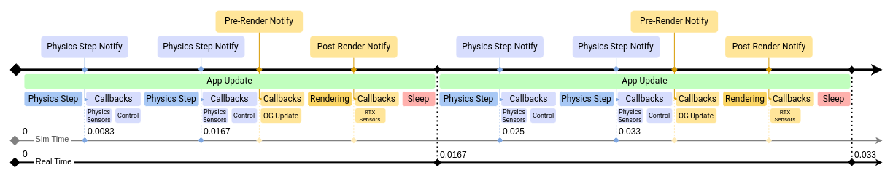
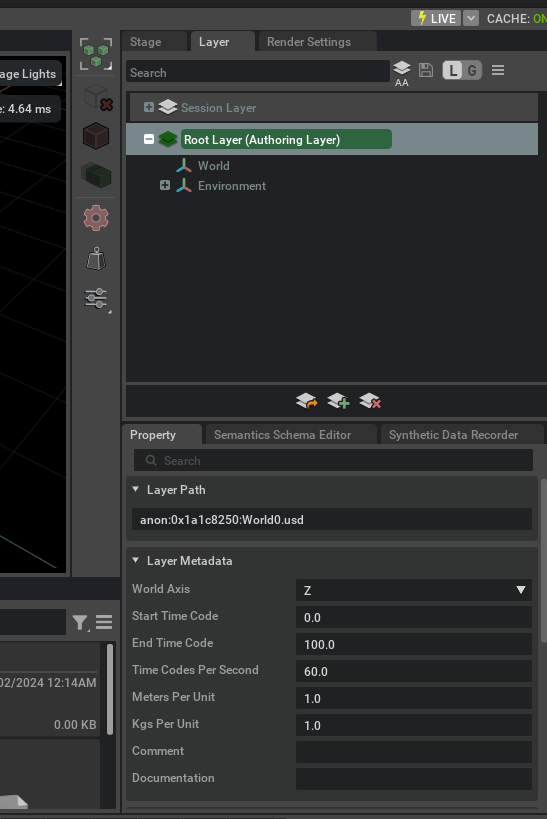
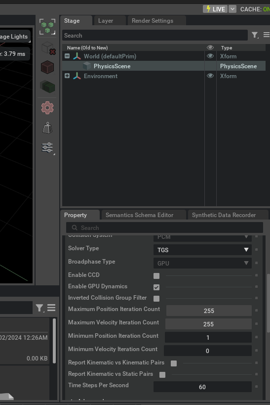
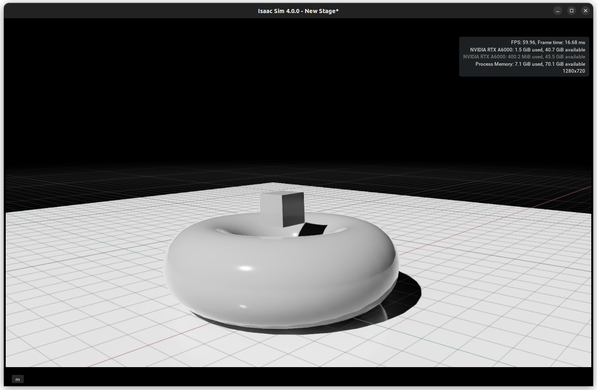
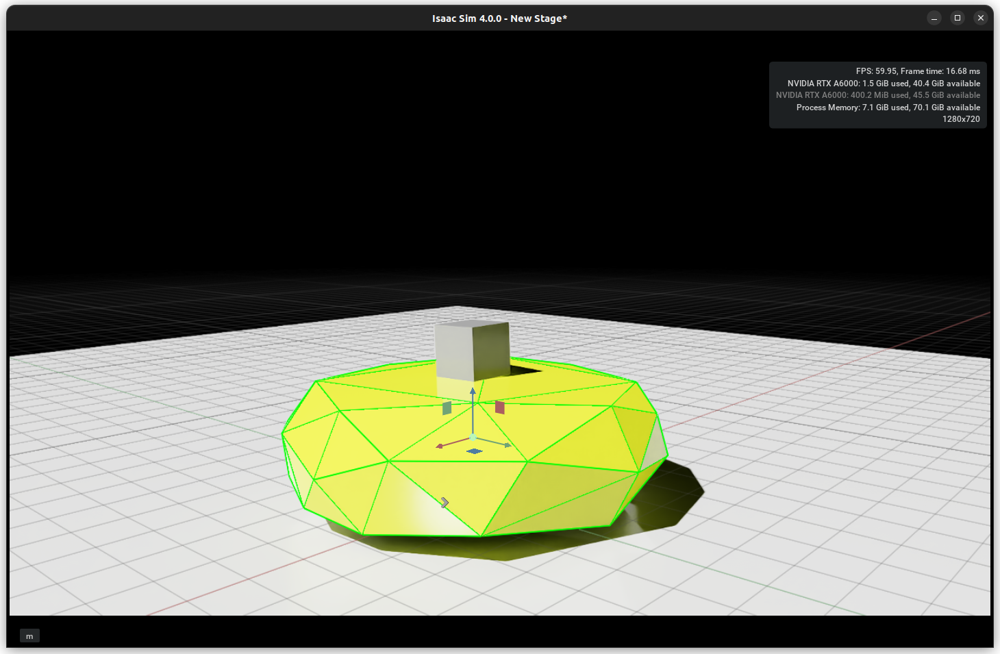
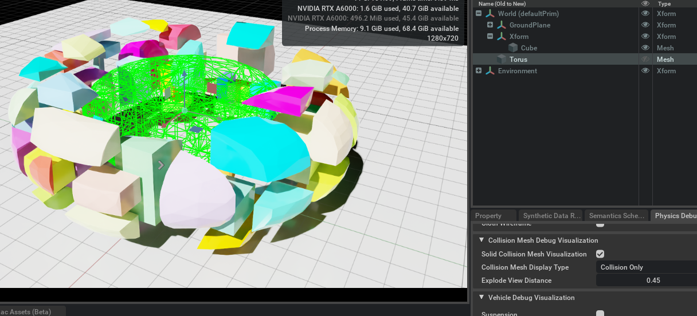
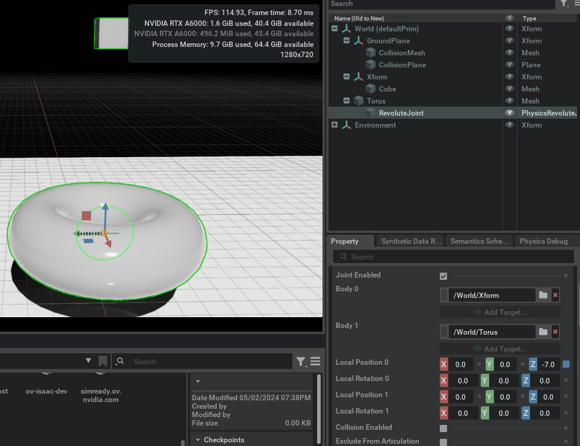
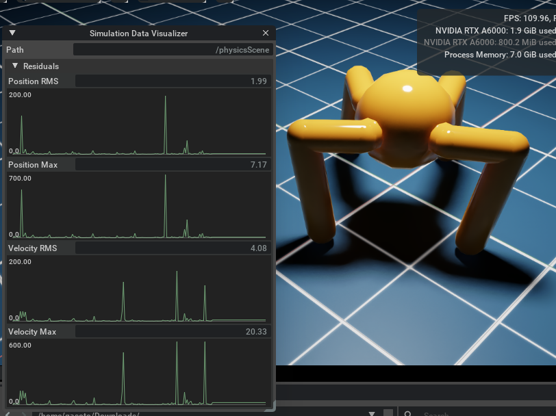

# Physics Simulation Fundamentals
> 출처 : [**Physics Simulation Fundamentals**](https://docs.isaacsim.omniverse.nvidia.com/5.1.0/physics/simulation_fundamentals.html)
## Physics in USD Schema
우리는 이미 이전 강의에서, **Schema란 USD의 데이터 구조와 해석 규칙을 규정해놓은 것**이라고 학습을 했다. 이 중에서 [**USD Physics Schema**](https://openusd.org/release/api/usd_physics_page_front.html) 같은 경우, USD의 여러 Schema 중에서 물리법칙과 관련된 Schema들을 지정해놓으며, 일반적으로 **UsdPhysics** API를 사용해서 활용이 되는 타입들이다. 한편, 엔비디아에서 PhysX 엔진을 개발하면서 기존 USD Physics Schema에 더해서 PhysX 엔진에 특화되도록 Schema를 확장할 필요가 있었고, 그에 따라서 개발된 **PhysX Schemas**가 있다. 이런 Schema들 같은 경우 기본적으로 C++을 통한 Access 방식을 취하지만, 파이썬 API로도 개발이 되어서 파이썬에서도 쉽게 접근할 수 있다. 예를 들어서:
```
from pxr import Usd, UsdGeom, UsdPhysics, PhysxSchema
import omni.usd

stage = omni.usd.get_context().get_stage()
prim = stage.GetPrimAtPath("/Path/To/Prim")
physics_api_prim = UsdPhysics.SomePhysicsAPI(prim)
physx_api_prim = PhysxSchema.AnotherPhysxAPI(prim)

# Check if the API is Applied, if not, Apply it.
if not physics_api_prim:
    physics_api_prim = UsdPhysics.SomePhysicsAPI.Apply(prim)

physics_attr = physics_api_prim.GetSomePhysicsAttr()
physx_attr = physx_api_prim.GetPhysxAttr()

# Check if Attribute is authored, otherwise create it
if not physics_attr:
    physics_attr = physics_api_prim.CreateSomePhysicsAttr(1.0)
print(physics_attr.Get())
physics_attr.Set(10.0)
```

## Simulation Timeline
통상적으로 시뮬레이션 시간과 실제 시간(real time)은 당연히 다르다. 시스템 설정과, 시뮬레이션 환경의 크기(그리고 그거에 드는 리소스에 따라) 각 time step을 계산하는데 걸리는 실제 시간은 그 time step이 나타내는 시뮬레이션 시간보다 더 짧을 수도, 더 길 수도 있다. 따라서 시뮬레잇녀 결과를 순서대로 그대로 보여주게 된다면 실제보다 더 빠르거나, 혹은 더 느리게 재생될수도 있다. 이러한 문제를 방지하기 위해서 Isaac Sim 내부에는 기본적으로 시뮬레ㅣ션 속도를 실제 시간과 맞추기 위한 **Limiter**를 사용하도록 설정이 되어있다.  
  
그리고 시뮬레이션은 당연히 렌더링보다 더 빠른 주기로 실행이 될 수 있다 (화면이 한 프레임 렌더링 되는 동안, 백그라운드에서는 여러 번의 Physics simulation time step이 돌아갈 수 있다는 뜻).  
아래 예시는 물리 시뮬레이션은 초당 120 step으로 설정되어 있고, 렌더링은 초당 60 frame인 예제이다. 따라서 렌더링 프레임 하나당 물리 시뮬레이션이 2번 수행된다.

- Physics simulation : 120 step/s
- Rendering : 60 frames/s
- 결과 : 2 physics step / 1 rendered frame

이상적인 경우라면 simulation frequency와 rendering frequency가 서로 같거나, 정수배 관계를 가지는 것이 좋다.  
  
이렇듯 Isaac Sim의 Timeline에는 여러 종류의 event stream이 존재하며, 그 중에서 가장 중요하게 취급되는 것들을 사용자는 쉽게 subscribe해서 이벤트를 확인할 수 있다.
- Simulation Events
- Frame Update Events
  - pre-render
  - post-render

Omnigraph Node의 경우 일반적으로 **pre-render event**가 발생할 때 업데이트가 이루어진다. 다만 필요하다면, Omnigraph node가 다른 종류의 event에서도 업데이트 되도록 설정할 수 있ㄷ. 예를 들어서 화면이 렌더링 될때가 아니라 Physics simulation step마다 업데이트를 한다거나.

### Configuring Frame Rate
시뮬레이션의 Rendering Frame Rate는 현재 Stage의 메타데이터를 조정해서 설정할 수 있다. Isaac Sim GUI에서의 경우, **Layer** 탭의 **Root Layer**를 선택한 다음에 **Properties** 패널에서 **Timecodes per second** 속성을 수정하면 된다 (이거 동작 원리를 정확히 이해하지 못했다면 USD에 대해서 다시 공부를 하고 오길 추천한다).


### Configuring Simulation Timesteps
**Simulation Steps per Second** 값은 **Physics Scene**에서 결정이 된다. 현재 Stage 내부에 Physics Scene이 존재하지 않는다면, 기본값으로 초당 60 step이 사용이 된다. 만약 사용자가 Simulation Scene 요소를 추가하고 싶다면 다음과 같은 절차를 따르면 된다.
1. Create > Physics > Simulation Scene을 클릭
2. 생성된 Simulation Scene을 선택
3. Properties 패널에서 Simulation Steps per Second 항목을 확인



## Simulation Components
(아주 당연한 말이지만) USD stage 내부에 있는 Prim들은 그 자체적으로 무슨 디폴트 물리 옵션 이런 것을 가지지 못한다. 사용자가 GUI 혹은 파이썬 스크립트를 통해서 물리 효과를 부여해줘야 한다. 간단한 예시는 [**해당 링크**](https://docs.isaacsim.omniverse.nvidia.com/5.1.0/physics/simulation_fundamentals.html)의 **Simulation Components** 항목에서 확인하고 따라하면 된다.  
예제의 내용은 별로 어려울게 없지만 특기할만한 부분은 다음 2가지이다.
1. 시뮬레이션 시간은 당연히 Discrete 하게 흐르기 때문에, 물체가 너무 빠르게 움직이면 어떤 timestep에서는 물리 엔진이 충돌하는 등의 물리 효과를 관측하고 연산하기 전에 이미 지나가버릴 수 있다. 물리 엔진이 매 순간 연속적으로 확인하는게 아니라, 이산적인 시점들의 state를 계산하기 때문에 벌어지는 일이다. 이러한 현상을 **tunneling**이라고 부른다.
2. 이를 해결하기 위해서 Isaac Sim 공식 문서는 **CCD(Continuous Collision Deteciton)**을 사용하기를 권장한다. CCD는 두 pose 사이의 이동 경로 전체를 sweep 해서 검사하기 때문에, 중간에 충돌이 일어난다면 이를 감지할 수 있다.
   1. 단 CCD는 `Physics Scene`과 `Rigid body` 양쪽에서 CCD를 모두 enable하게 만들어야 한다.
### Isaac Sim의 핵심
> **Collision has nothing to do with what you see on screen.**  
  
**Isaac Sim에서 Visual Geometry와 Collision Geometry는 서로 독립적으로 작동한다.**  
따라서 USD stage 내부에 Visual Prim 하나를 추가한다고 해서 뭐 자동으로 충돌이 생기고, 그런거 없다.  
따라서 `Xform` 아래에 `Collision API`를 반드시 적용해야 내가 의도한 물리 연산이 작동한다.  
또한 하나의 Rigid Body 아래에 여러 Collider를 붙일 수 있는 기능도 제공한다. 예를 들어서 복잡한 로봇 링크의 경우 하나의 collider로 표현하기 어려울 수 있다 (예를 들어서 다수의 DOF를 가진 manipulator). 이런 경우 다음과 같이 적용할 수 있다:
```
Rigid Body
│
├── Collider Box 1
├── Collider Box 2
├── Collider Sphere
└── Collider Mesh
```
이러한 Collision API 적용이 같은 Rigid Body Prim의 children 등으로 선언이 되어있다면 PhysX 엔진에서는 하나의 Rigid body로 적용해서 동작하며, 이를 **compound collider**라고 얘기하기도 한다.

## Collision Approximation -- Convex Hull
Isaac Sim에서 복잡한 형상의 mesh를 사용할 경우, 아주 정확한 형상에 맞춰 아주 정확한 물리 연산을 하는 것은 매우 큰 연산 비용 및 시간을 필요로 한다. 그렇기 때문에 Isaac Sim에서는 mesh geometry에 대해서 적절한 트레이드 오프를 적용하는데, 가장 대표적인 것이 collision에 대해서 **convex hull** 처리를 하고 연산을 하는 것이다.
> **Convex란?**  
> Convex는 볼록한 형상을 의미하며, 정확하게는 형상 내부의 임의 두 점을 잡아서 직선으로 연결했을 때 그 선분이 형상 내부에 있으면 convex 그렇지 않으면 non-convex  
  
그러면 **convex hull**이란?  
> **Convex Hull**  
> 복잡한 물체 전체를 감싸는, 최소한의 크기를 가지는 convex 껍질(?)을 생각하면 편함  
  
공식 doc에서는 이것을 가장 잘보여주는 예시로, 도넛 형상의 mesh의 중앙(구멍 부분)에 큐브를 rigid body + collision을 부여한 다음에 떨어뜨렸는데 구멍에 들어가는 것이 아니라 구멍 위에 멈춰서는 것을 예시로 든다. 왜냐고? mesh 연산할 때 도넛 형상에다 convex hull을 때려넣으면 다음과 같이 보여지니까.


  
이렇게 하는 이유는 아주 단순한데, 계산 비용 때문이다. PhysX 엔진은 매 timestep마다:
```
Collider A와 Collider B가 겹쳤나?
↓
어디서 접촉했나?
↓
contact point는?
↓
normal은?
↓
penetration depth는?
↓
어떤 힘을 발생시킬까?
```
게속 연산해야 하는데, convex shape들 간의 충돌은 매우 효율적으로 계산할 수 있기 때문에 성능적으로 매우 유리하다. 그렇기 때문에 Isaac Sim의 PhysX 엔진은 기본 연산으로 **convex hull을 채택하고 있다**.

### Convex Decomposition
그런데 사용자가 보는 visual mesh랑 연산이 다르면 그게 제대로 된 시뮬레이션임?? 하고 질문할 수 있다. 그렇기에 Isaac Sim에서는 이러한 문제를 해결하기 위해서 **Convex Decomposition**이라는 방법도 제공한다. 해당 방법론은 복잡한 물체에 대해서 하나의 convex hull로 퉁치는게 비현실적이라면, 작은 convex hull 여러개를 적용해서 convex hull 연산을 하자는 아이디어에서 출발한다. Isaac Sim 공식 doc은
- 사람이 직접 이러한 작업을 수행하거나(manually created by adding multiple shapes)
- Physics Convex Decomposition에 의해서 자동 연산될 수 있다고 안내한다.

이걸 위해서는 Properties 패널에서 Collision Section을 찾고, 그 안에서 **Convex Decomposition**을 찾아 수행하면 된다고 안내하고 있다.
> **Note**  
> Fewer convex hulls typically results in higher performance.  
  

좀 더 자세한 내용에 대해서는 [**Omni Physics**](https://docs.omniverse.nvidia.com/kit/docs/omni_physics/latest/index.html)의 [**Rigid Bodies**](https://docs.omniverse.nvidia.com/kit/docs/omni_physics/latest/dev_guide/rigid_bodies_articulations/rigid_bodies.html), 그리고 [**Colliders**](https://docs.omniverse.nvidia.com/kit/docs/omni_physics/latest/dev_guide/rigid_bodies_articulations/collision.html)를 참고하면 된다. USD Stage와 Prim에 대햇 제대로 공부했다면 솔직히 이해 못할건 아니고 그냥 읽으면 된다.

### Contact and Reset Offset
Collider의 **Advanced** 탭에는 충돌 문제가 발생했을 때 조정에 사용 가능한 2가지 추가 파라미터가 있다. 이런 파라미터들을 Isaac Sim 공식 doc에서는 작거나 얇은 물체에 유리하다고 적고 있다.  
- **Rest Offset** : collision geometry를 실제보다 좀 더 inflate하거나 혹은 shrink 하는 파라미터. Visual mesh가 collision geometry보다 크거나 작은 경우, 실제 충돌이 발생하는 위치가 화면에 보이는 형상과 일치하도록 보정
- **Contact Offset** : collision geometry로부터 어느정도 거리까지 접근했을 때 PhysX 엔진이 contact constraints를 생성할지 결정

Contact offset을 조절할 때는 trade-off 관계가 존재하는데, 크게 설정하게 되면 더 많은 구속 조건이 생성되므로 계산 비용이 증가한다. 반대로 너무 작게 설정하면 접촉을 너무 늦게 감지해 비현실적인 충돌 시뮬레이션이 일어날 수 있다. Isaac Sim 공식 doc에서는 다음과 같은 문제가 발생할 수 있다고 한다.
1. 물체의 떨리는 현상 (jittering)
2. contact 누락 현상
3. tunneling 현상

## Contacts and Friction
Collision API는 tunneling 현상 등만 방지하는 것이 아니라 restitution(반발)과 friction을 통해서 에너지를 전달하거나 소산시킬 수도 있다. 이러한 contact model 파라미터는 **Physics material**에서 설정 가능하며 **Create > Physics > Physics Material**로 이동해 **Rigid Body Material**을 선택해서 진행하면 된다 (일반적으로 Physics Material은 Collider Geometry에 할당이 된다).  
앞서 공부한 것처럼, 만약 하나의 rigid body에 여러 개의 collision geometry가 있다면, 각각에 서로 다른 physics material을 할당 할 수 있다. 또한 Rigid Body Prim 자체에 Physics Material 을 할당한 다음, 그 Material이 자식 Collider에 개별적으로 설정된 material보다 우선시 되도록 override도 가능하다. Physics Material 할당 방법은:
1. collider prim 선택
2. collider 설정 영역까지 스크롤
3. **Physics Materials on Selected Models**에서 원하는 material 선택

또한 Render Material에 **Add > Physics > Rigid Body Material**을 사용해서 property 추가도 가능하다.

### Compliant Contacts
Rigid Material의 **Advanced** 탭에서는 contact가 **compliant contact (spring-damper와 같은 동역학이 포함된 접촉)**을 설정할 수 있다. 이는 Rigid body를 사용해 deformable body의 거동을 근사적으로 시뮬레이션 할 때 유용하다.

### Combie Modes
Contact 같은 경우 두 물체의 상호작용이기 때문에, 각 물체의 contact parameter 하나만으로 두 물체가 실제로 어떻게 상호작용할지에 대해서 정확하게 시뮬레이션 할 수 없다. 따라서 USD (정확히는 UsdPhysics와 Isaac Sim의 PhysX 엔진이겠지만) 에서는 **Combine Mode**를 설정 가능하다.
- Friction
- Restitution
- Compliant-Contact Damping

양쪽 물체의 combine mode가 다를 경우, 어떤 모드에 우선순위를 높게 줬는지에 따라서 combine mode가 결정되어 적용된다. Isaac Sim 공식 doc에서는 Drop-down 메뉴에서 아래쪽에 위치한 mode일수록 더 높은 우선순위를 가진다고 알리고 있으며, 우선순위 순서는 `average < min < multiply < max` 라고 하고 있다.  
  
예를 들어, Collider A의 friction combine mode가 average고 Collider B의 friction combine mode가 min이면 Collider B의 방식으로 진행된다.

## Joints
로봇은 일반적으로 Rigid Body를 기본으로 깔고, 여기에 Joint가 연결된 구조로 이루어져 있다. Joint는 두 Body 사이에 제약 조건(constraint)을 생성한다고 할 수도 있을 것이다.  
아래 예제에서는 **Revolute Joint**를 사용해서 설명을 진행하지만, [**Joint 문서**](https://docs.omniverse.nvidia.com/kit/docs/omni_physics/latest/dev_guide/rigid_bodies_articulations/joints.html#joints) 문서에 나와있는 다른 Joint들 역시 마찬가지로 진행된다. Isaac Sim에서 제공되는 기본적인 Joint 목록은 다음과 같다.
| Joint Type | Description | Joint Support (CPU/GPU) | Articulation Joint Support (CPU/GPU) |
|---|---|---|---|
| **D6 Joint** | 상대 운동에 대해 **0~6 DOF**를 설정할 수 있음. 3개의 병진축 + 3개의 회전축을 각각 자유롭게 하거나 제한할 수 있음 | yes / yes | yes / yes *(단, 모든 linear axis가 locked인 경우)* |
| **Distance Joint** | 두 Rigid Body 사이의 상대 운동은 허용하지만, **두 물체 사이의 거리**를 제한함 | yes / no | no / no |
| **Fixed Joint** | 두 Body 사이의 **모든 상대 운동을 허용하지 않음**. Fixed-base articulation 구성에 유용함 | yes / yes | yes / yes |
| **Prismatic Joint** | 하나의 축을 따라 **직선 운동**만 허용함 | yes / yes | yes / yes |
| **Revolute Joint** | 하나의 축을 중심으로 **회전 운동**만 허용함 | yes / yes | yes / yes |
| **Spherical Joint** | 세 회전축에 대한 **회전 운동**을 허용함. Ball-and-socket joint와 동일한 개념 | yes / yes | yes / yes |
먼저, Joint로 연결할 각 Body에 대해서 Joint Frame의 상대적인 pose를 설정해야 한다. 특히 Joint Frame의 local scaling 관련 내용은 [**Joint Frames Section**](https://docs.omniverse.nvidia.com/kit/docs/omni_physics/latest/dev_guide/rigid_bodies_articulations/joints.html#jointframes)을 참고하면 된다.  
  
UI를 통해서 Joint를 생성할 경우, Joint 프레임은 **Joint 생성 과정에서 2번째로 선택한 Rigid Body의 pose와 일치**하도록 생성이 된다. 이제 다음과 같이 Joint를 생성해보자.
1. 먼저 `Xform Rigid Body`를 선택하고, 그 다음 `Torus Rigid Body`를 선택한다.
2. `Create > Physics > Joints > (Joint Type)` 으로 이동한다.
이 튜토리얼에서는 **Revolute Joint**를 활용하며, Torus를 2번째로 선택했기 때문에 Joint는 Torus의 중심에 생성된다.

Properties Panel에서 다음 속성들을 확인 가능하다.
1. Body 0: `/World/XForm`
2. Body 1: `/World/Torus`
아래 값ㄷ르은 각 Body를 기준으로 표현된 Joint Frame의 Pose이다. Position 0의 Z값이 -7.0인 것을 확인 가능하다.
1. Position 0: [0, 0, -7.0]
2. Rotation 0: [0, 0, 0.0]
3. Position 1: [0, 0, 0.0]
4. Rotation 1: [0, 0, 0.0]
> **Note!**  
> Articulation의 일부가 되는 Joint를 설정할 때에는 Body 0이 Articulation Tree 계층 구조에서 Body 1의 Parent가 되도록 설정해야함  
> 이렇게 설정하면 link의 incoming joint force나 joint drive target 같은 joint 관련 값이 PhysX SDK와 USD 사이에서 일대일 대응된다.

### Joint Axis
Revolute Joint는 1개의 DOF를 제공한다. 그리고 Joint Frame의 어느 축을 자유롭게 회전할 수 있는 축으로 사용할지 선택할 수 있다 (기본값은 X축으로 지정되어있다). 이 값은 Properties의 **Revolute Joint** 섹션에서 수정이 가능하다.

### Joint Limits
Joint Limits는 Joint가 초기 위치에서 얼마나 멀리 움직일 수 있는지 결정한다. 기본적으로 Joint를 새로 생성하면 Limit는 설정되어 있지 않은데, Joint를 선택한 상태에서 Properties Panel을 아래로 스크롤 하여 **Revolute Joint** 섹션의 다음 값을 수정할 수 있다.
- Lower Limit
- Upper Limit
USD에서는 각을 표현할 때 라디안이 아니라 degree를 사용하는 것을 기억해야 한다.

### Adding a Joint Drive
Joint가 추가한 DOF의 position과 velocity를 Joint Drive를 통해서 제어 가능하다. Joint Drive를 추가하려면 `Add Button > Physics > Angular Drive`를 선택해서 진행하면 된다. 보다 자세한 내용은 [**Tutorial 11: Tuning Joint Drvie Gains**](https://docs.isaacsim.omniverse.nvidia.com/5.1.0/robot_setup_tutorials/joint_tuning.html#isaac-sim-app-tutorial-advanced-joint-tuning)을 참고하면 된다.

## Articulation
**Articulation**은 Joint로 연결된 Body들을 효율적으로 시뮬레이션 하기 위해 최적화된 구조이다. Articulation을 사용하면 더 우수한 성능, 더 뛰어난 정확도(fidelity), 그리고 로봇 관련 여러 기능(feature)을 제공할 수 있다. 다만 **topology (loop-closing)과 joint surpport**에서는 일부 제한 사항이 존재한다. 이러한 제한 사항은 [**Articulation**](https://docs.omniverse.nvidia.com/kit/docs/omni_physics/latest/dev_guide/rigid_bodies_articulations/articulations.html#articulations) 문서를 참고하면 된다.

## Simulation Residual
Physics 시뮬레이션에서는 solver가 계산한 해가 얼마나 잘 수렴했는지 확인할 수 있는 metric을 제공한다. 이를 통해서 Simulation이 여러 제약 조건을 얼마나 잘 만족했는지 확인할 수 있다. 이 Residual을 확인하려면:
1. 확인하려는 Physics Element 선택
2. `Add > Physics > Residual Reporting` 선택
3. Viewport에서 다음 경로로 이동 : `(eye icon on viewport) > Show by Type > Physics > Simulation Data Visualizer`
