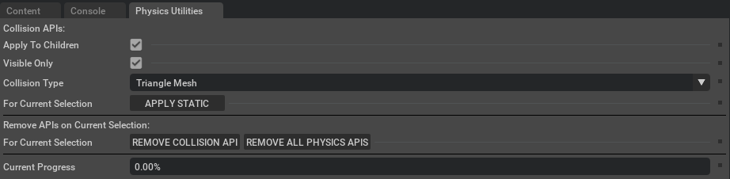
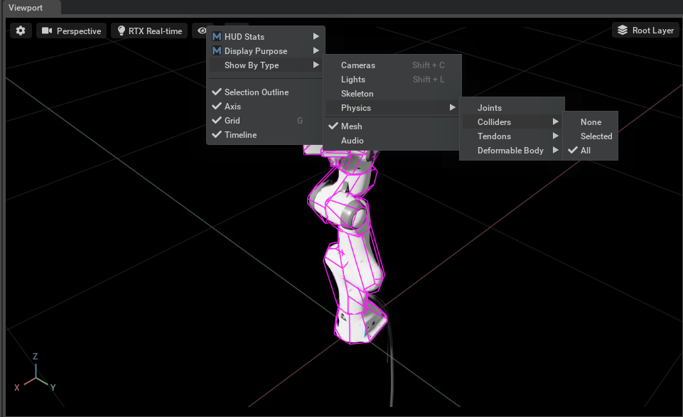
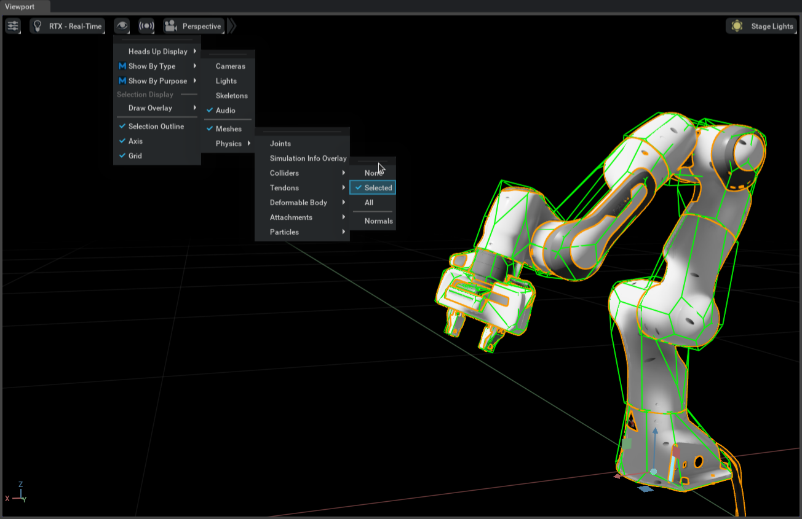

# Physics Static Collision Extension
출처 : [**Physics Static Collision Extension**](https://docs.isaacsim.omniverse.nvidia.com/5.1.0/physics/physics_static_collision.html#isaac-static-collision-utils)
다음 기능을 위해서 사용되는 Extension이다.
1. Collision Mesh 시각화
2. 전체 Stage에 static collision API 추가
3. 마찬가지로 all physics-related API 제거도 가능
이 Extension을 사용하고 싶다면 **Tools > Physics API Editor**를 사용할 것.

## User Interface

### Configuration Options
- **Apply to Children** : Recursively create collision on all selected children; otherwise, create collision for just the selected object
- **Visible only** : Ensure the prim is visible before creating collision. (Ignores hidden prims)
- **Collision Type** : Type of Collision approximation to use
- **Apply Static** : Applies collision to the current selection
- **Remove Collision API** : Clears the collision from the current selection
- **Remove All Physics APIs** : Remove all Physics-related APIs (including collision) from the current selection

## Enable Visualization

1. Select the  eye icon.
2. Select : Show by Type
3. Select : Physics Mesh
4. Check all