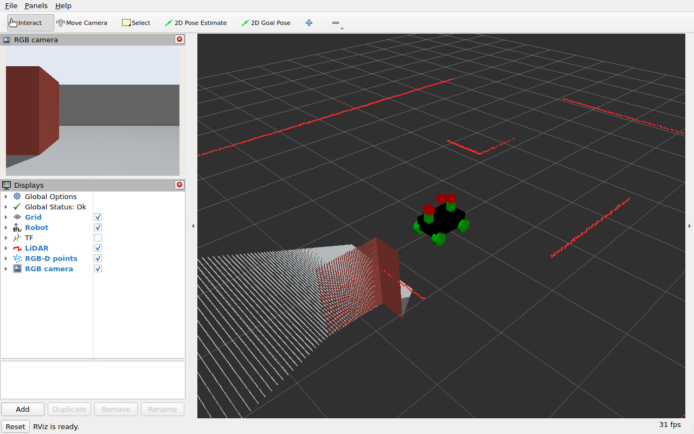

# 2. 센서 데이터와 RViz를 함께 확인하기

RViz는 Gazebo 화면을 복사해 보여주는 도구가 아닙니다. ROS 메시지의 값, `header.frame_id`,
TF와 시간을 이용해 로봇과 센서를 그립니다. 따라서 이미지가 나오거나 점이 보인다는 사실만으로
설정이 맞다고 판단하면 안 됩니다. 이번에는 **토픽 → 메시지 → TF → 실제 장애물 위치** 순서로 확인합니다.

## 2-1. 기본 센서 구성으로 실행

다른 시뮬레이션과 SLAM/Nav2를 종료하고 첫 번째 터미널에서 실행합니다.

```bash
source /opt/ros/jazzy/setup.bash
source ~/robotics-sim-tutorial-kr/examples/ros2_ws/install/setup.bash
ros2 launch simple_rover spawn_robot.launch.py
```

두 번째 터미널에서도 같은 환경을 읽습니다. 아래 명령은 모두 이 터미널에서 실행합니다.

```bash
source /opt/ros/jazzy/setup.bash
source ~/robotics-sim-tutorial-kr/examples/ros2_ws/install/setup.bash
ros2 topic list -t
```

| ROS 토픽 | 메시지 타입 | ROS `header.frame_id` | 의미 |
|---|---|---|---|
| `/scan` | `sensor_msgs/msg/LaserScan` | `scan_link` | 수평면의 거리 측정 |
| `/imu` | `sensor_msgs/msg/Imu` | `imu_link` | 자세, 각속도, 가속도 |
| `/camera/image` | `sensor_msgs/msg/Image` | `camera_link_optical` | RGB 영상 |
| `/camera/camera_info` | `sensor_msgs/msg/CameraInfo` | `camera_link_optical` | 영상 크기와 카메라 내부 파라미터 |
| `/camera/depth_image` | `sensor_msgs/msg/Image` | `camera_link_optical` | 픽셀별 깊이 |
| `/camera/points` | `sensor_msgs/msg/PointCloud2` | `depth_link` | RGB-D 3차원 점군, Harmonic의 카메라 본체 축 사용 |
| `/odom` | `nav_msgs/msg/Odometry` | `odom` | 로봇의 이동 추정; child는 `base_link` |

bridge YAML에 항목이 있으면 센서를 꺼도 ROS 토픽 이름은 보일 수 있습니다.
**토픽 목록에 존재하는 것과 데이터가 실제로 들어오는 것은 다릅니다.**

## 2-2. 라이다와 TF 확인

```bash
ros2 topic echo /scan --once --qos-reliability best_effort --field header
ros2 topic echo /scan --once --qos-reliability best_effort --field ranges
ros2 run tf2_ros tf2_echo base_link scan_link
```

헤더의 frame은 `scan_link`, TF의 평행이동은 URDF에서 지정한 `(0, 0, 0.48)` m입니다.
`ranges`에는 거리 배열이 나옵니다. 측정 범위 밖에는 `inf`가 섞일 수 있지만,
닫힌 실습 월드에서는 벽과 상자를 보는 방향에 유한한 거리 값이 있어야 합니다.
`tf2_echo`는 확인 후 `Ctrl+C`로 종료합니다.

RViz의 `Global Options → Fixed Frame`을 `odom`으로 두고 `LiDAR` 표시를 확인하세요.
빨간 점이 벽과 상자의 수평 단면처럼 보여야 합니다. 로봇을 조금 회전시켰을 때
벽의 점들이 로봇과 함께 통째로 도는 것처럼 보이면 Fixed Frame과 TF를 먼저 확인합니다.

기본 라이다는 로봇 바퀴 중심에서 0.48 m 위에 있습니다. 바닥에 안착한 뒤 바퀴 반경 0.1 m까지 더하면
월드에서는 약 0.58 m 높이의 단면을 보는 셈입니다. 따라서 더 낮은 장애물은 이 라이다만으로 감지할 수 없습니다.

## 2-3. RGB, 깊이 영상, CameraInfo 확인

```bash
ros2 topic echo /camera/image --once --qos-reliability best_effort --field header
ros2 topic echo /camera/camera_info --once --qos-reliability best_effort
ros2 topic echo /camera/depth_image --once --qos-reliability best_effort --field encoding
ros2 run tf2_ros tf2_echo depth_link camera_link_optical
```

기본 RGB-D 영상은 `320 × 240`이며, 깊이 영상의 인코딩은 `32FC1`입니다.
깊이 값은 m 단위이고, 모든 픽셀이 유효한 것은 아닙니다. 측정 범위 밖 값이나 무한대 값은 제외해야 합니다.
`CameraInfo`의 `width`, `height`가 영상과 같고 초점거리 `K[0]`, `K[4]`가 양수인지 확인하세요.

카메라 본체의 축은 `+X` 전방, `+Y` 왼쪽, `+Z` 위입니다. ROS 영상의 optical frame은
`+Z` 전방, `+X` 오른쪽, `+Y` 아래를 사용합니다. 이를 연결하는 URDF는 다음과 같습니다.

```xml
<joint type="fixed" name="camera_optical_joint">
  <origin xyz="0 0 0" rpy="${-pi/2} 0 ${-pi/2}"/>
  <parent link="depth_link"/>
  <child link="camera_link_optical"/>
</joint>
<link name="camera_link_optical"/>
```

영상과 `CameraInfo`에는 `camera_link_optical`을 지정합니다.
이 축 규칙은 [REP-103](https://www.ros.org/reps/rep-0103.html#axis-orientation)에 정의되어 있습니다.

## 2-4. 점군이 엉뚱한 방향에 보이지 않는지 확인

```bash
ros2 topic echo /camera/points --once --qos-reliability best_effort --field header
ros2 run tf2_ros tf2_echo odom depth_link
```

`/camera/points`의 frame은 **`depth_link`**여야 합니다.
Harmonic의 RGB-D 점군은 `x`에 전방 깊이를 저장하지만 Gazebo 메시지 헤더에는 optical frame 이름이 들어갑니다.
그대로 ROS에 전달하면 XYZ 값과 프레임 축이 달라 RViz에서 점군 방향이 틀어집니다.
따라서 이 프로젝트는 점군에 한해 bridge에서 헤더를 실제 좌표축과 일치시킵니다.

```yaml
- ros_topic_name: /camera/points
  gz_topic_name: /camera/points
  ros_type_name: sensor_msgs/msg/PointCloud2
  gz_type_name: gz.msgs.PointCloudPacked
  direction: GZ_TO_ROS
  qos_profile: SENSOR_DATA
  frame_id: depth_link
```

이 보정은 XYZ 숫자를 회전시키는 것이 아닙니다. **이미 본체 좌표계로 계산된 XYZ의 프레임 이름을 바로잡는 것**입니다.
영상과 CameraInfo까지 `depth_link`로 바꾸면 카메라 투영이 잘못됩니다.
근거는 [gz-sensors8의 RGB-D 발행부](https://github.com/gazebosim/gz-sensors/blob/4b9fdfc05892c38e7a855f63b56737fe5d591a5f/src/RgbdCameraSensor.cc)와
[점군 XYZ 복사 코드](https://github.com/gazebosim/gz-sensors/blob/4b9fdfc05892c38e7a855f63b56737fe5d591a5f/src/PointCloudUtil.cc)입니다.

RViz에서 `RGB-D points`를 켠 뒤 로봇 앞의 벽과 상자가 점군으로 나타나는지 확인하세요.
다음 세 가지를 모두 확인합니다.

1. 정면 벽의 점군이 로봇 앞에 있고 바닥 쪽으로 90도 꺾이지 않는다.
2. 로봇을 조금 회전시켜도 이미 본 벽의 위치가 `odom` 기준에서 크게 튀지 않는다.
3. `RGB camera` 영상의 상자 색과 점군의 상자 색이 대응한다.

라이다와 카메라의 설치 위치 및 시야가 다르므로 모든 점이 일대일로 겹치지는 않습니다.
같은 벽을 보는 구간에서 방향과 거리가 일관적인지 확인합니다.



그림 1. 실제 Jazzy 실행에서 확인한 Rover의 센서 화면이다. 빨간 상자의 점군과 라이다 단면이 같은 위치에 있고, 카메라 영상에서도 같은 상자가 보인다.

격자는 Gazebo 바닥 메시가 아니라 `odom`의 z=0 기준면입니다. 격자와 바닥 점군의 높이를 비교할 때는 로봇 기준점의 높이도 함께 생각하세요.

[실행 결과와 측정값](../06_reference/04_jazzy-audit.md)에서 검사 환경과 주행 결과를 확인할 수 있습니다.

## 2-5. QoS와 시간 확인

```bash
ros2 topic info /scan -v
ros2 topic info /camera/points -v
ros2 param get /robot_state_publisher use_sim_time
ros2 param get /rviz2 use_sim_time
ros2 topic echo /clock --once
```

센서 bridge의 `SENSOR_DATA` 프로필은 Best Effort를 사용합니다.
RViz의 LaserScan, PointCloud2, Image 항목도 `Topic → Reliability Policy`를 `Best Effort`로 맞췄습니다.
RobotModel의 `/robot_description`은 `Reliable + Transient Local`을 사용합니다.

시간은 모든 시뮬레이션 노드에서 `/clock`을 사용해야 합니다. `use_sim_time`의 출력이 `True`인지 확인하세요.
ROS 노드는 실행되었지만 Gazebo가 일시정지되어 있으면 `/clock`도 멈춥니다.

| 증상 | 먼저 확인할 것 | 조치 |
|---|---|---|
| 라이다 토픽은 있는데 메시지가 안 옴 | Gazebo 재생 상태, Sensors 플러그인, GPU/EGL | 재생을 시작하고 Gazebo 로그의 렌더링 오류 확인 |
| RViz가 `No transform` 표시 | 실제 `frame_id`와 TF 연결 | 표의 frame과 `tf2_echo` 결과 대조 |
| Image는 보이는데 점군이 옆으로 누움 | `/camera/points`의 frame | `depth_link` override와 bridge 버전 확인 |
| RobotModel만 안 보임 | `/robot_description` durability | RViz에서 Transient Local 선택 |
| 로봇 이동 후 센서 위치가 튐 | TF 중복 발행, 시뮬레이션 시간 | 별도 static `odom → base_link`와 중복 시뮬레이션 종료 |
| Depth Image가 검거나 흰 화면 | `32FC1`, 무한대와 표시 범위 | RGB 영상과 점군도 함께 확인; 영상 색만으로 정상 여부 판단 금지 |

## 2-6. 3D 라이다와 GNSS 추가

기존 launch를 종료한 뒤 다음을 실행합니다.

```bash
ros2 launch simple_rover spawn_robot.launch.py lidar_3d:=true gps:=true
```

새 터미널에서 환경을 읽고 추가 센서를 확인합니다.

```bash
source /opt/ros/jazzy/setup.bash
source ~/robotics-sim-tutorial-kr/examples/ros2_ws/install/setup.bash
ros2 topic echo /lidar3d/points --once --qos-reliability best_effort --field header
ros2 topic echo /navsat --once --qos-reliability best_effort
ros2 run tf2_ros tf2_echo base_link lidar3d_link
```

3D 라이다는 `lidar3d_link`, GNSS는 `navsat_link`를 사용합니다.
RViz에서 `Add → PointCloud2`를 추가하고 `/lidar3d/points`, Best Effort를 선택하세요.
2D 라이다와 다른 프레임·토픽을 쓰므로 동시에 실행할 수 있습니다.

기본 월드는 GNSS 원점을 위도 `37.5665`, 경도 `126.9780`으로 지정하고 `NavSat` 시스템을 로드합니다.
이 값은 실습용 월드의 기준 좌표입니다. GNSS를 켜도 Nav2가 이 값을 자동으로 사용하지는 않습니다.
이번 자율주행은 2D 라이다와 지도 기반 위치 추정을 사용합니다.

센서와 TF가 맞는 것을 확인했다면 [지도 작성과 자율주행](03_mapping-and-navigation.md)으로 넘어갑니다.
