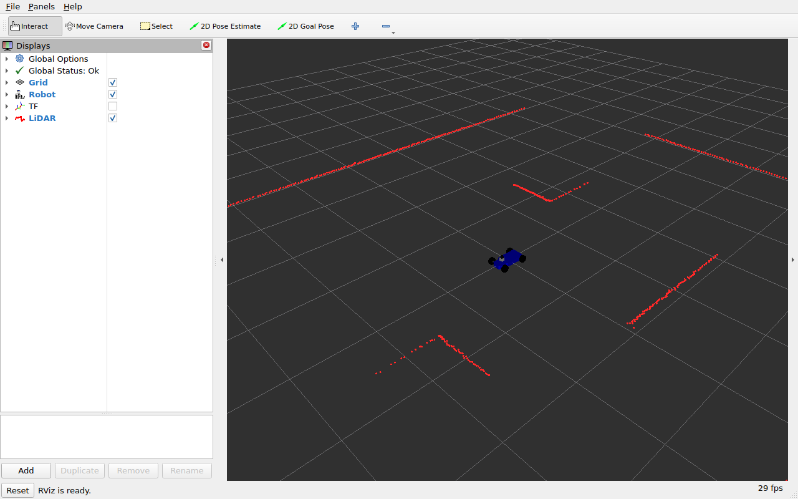

# 4. F1Tenth 차량으로 확장하기

`simple_rover`는 좌우 바퀴 속도를 다르게 해 회전합니다. `f1tenth_sim`은 자동차처럼
앞바퀴 조향 관절을 돌리는 **Ackermann 조향** 모델입니다.
원본의 차체·바퀴·조향 메쉬를 유지하고 Harmonic 구동 파라미터를 실제 URDF 치수에 맞췄습니다.

## 4-1. 기존 실행 종료 후 차량 띄우기

Rover 시뮬레이션, SLAM/Nav2, 조종 노드를 모두 종료합니다.
두 패키지가 같은 `/cmd_vel`, `/odom`, `/tf`를 사용하므로 함께 실행하면 제어와 TF가 섞입니다.

첫 번째 터미널:

```bash
source /opt/ros/jazzy/setup.bash
source ~/robotics-sim-tutorial-kr/examples/ros2_ws/install/setup.bash
ros2 launch f1tenth_sim spawn_robot.launch.py
```

같은 `rover_arena` 월드에 작은 차량과 RViz가 나타납니다.
외형에는 패키지에 포함된 메쉬를 사용하므로 다른 메쉬 저장소를 받을 필요가 없습니다.



그림 1. 실제 Jazzy 실행에서 확인한 F1Tenth의 정지 화면이다. 차량 모델과 주변 장애물의 라이다 단면이 표시된다.

이 화면은 정지 상태입니다. 조향은 4-3절에서 전진 명령과 함께 확인하고, 마우스 휠로 확대해 앞바퀴를 살펴보세요.

[실행 결과와 측정값](../06_reference/04_jazzy-audit.md)에서 검사 환경과 주행 결과를 확인할 수 있습니다.

## 4-2. 센서와 조향 관절 확인

두 번째 터미널:

```bash
source /opt/ros/jazzy/setup.bash
source ~/robotics-sim-tutorial-kr/examples/ros2_ws/install/setup.bash
ros2 topic echo /scan --once --qos-reliability best_effort --field header
ros2 topic echo /imu --once --qos-reliability best_effort --field header
ros2 topic echo /joint_states --once --qos-reliability best_effort
ros2 run tf2_ros tf2_echo base_link laser
```

라이다 frame은 `laser`, IMU frame은 `imu_link`입니다.
관절 상태에는 바퀴 4개와 좌우 조향 관절 2개가 포함되어야 합니다.
원본 IMU는 실제 링크 이름과 메시지 frame 이름이 달랐지만 포팅 버전은 `imu_link`로 통일했습니다.

## 4-3. 전진하면서 조향하기

```bash
ros2 run teleop_twist_keyboard teleop_twist_keyboard --ros-args \
  -p speed:=0.2 -p turn:=0.2 -p stamped:=false
```

`i`는 직진, `u`와 `o`는 전진하면서 좌우로 회전하는 명령입니다. `k`로 멈춥니다.
이 차량은 제자리 회전을 하지 못하므로 `j`/`l`만 눌러 rover와 같은 동작을 기대하면 안 됩니다.

Harmonic의 AckermannSteering 플러그인이 받는 `Twist.angular.z`는 **yaw 회전 속도(rad/s)**입니다.
조향각 자체를 그대로 넣는 인터페이스가 아닙니다. 정지 상태에서는 회전 속도만 요청해도
제자리에서 차체가 돌아가지 않습니다.

직접 명령을 보낼 때도 전진 속도와 회전 속도를 함께 지정합니다.

```bash
ros2 topic pub --once /cmd_vel geometry_msgs/msg/Twist \
  '{linear: {x: 0.2}, angular: {z: 0.15}}'
# 짧게 관찰한 뒤 반드시 정지
ros2 topic pub --once /cmd_vel geometry_msgs/msg/Twist \
  '{linear: {x: 0.0}, angular: {z: 0.0}}'
```

RViz와 Gazebo에서 앞바퀴 방향이 변하고 차량이 원호를 따라 움직이는지 확인합니다.
다른 터미널에서 `/joint_states`를 보면 조향각도 함께 바뀝니다.

## 4-4. 차량 치수가 왜 중요한가

| 항목 | 포팅 값 | 기준 |
|---|---|---|
| 바퀴 반경 | `0.05 m` | URDF 충돌 원통의 반경 |
| 앞뒤 바퀴 축 거리 | `0.325 m` | 앞 조향 힌지와 뒷바퀴 관절의 x 좌표 차이 |
| 킹핀 사이 거리 | `0.2 m` | 좌우 조향 힌지의 y 좌표 차이 |
| 바퀴 중심 사이 거리 | `0.245 m` | 좌우 관절 위치 + 각 바퀴 충돌 형상의 0.0225 m 오프셋 |
| 조향 제한 | `0.4 rad` | 원본의 최대 조향 설정 유지 |

원본에서는 `wheel_radius`가 빠져 플러그인의 기본값 `0.2 m`가 사용될 수 있었습니다.
실제 바퀴는 반경 `0.05 m`이므로 바퀴 회전 속도와 odometry 계산이 맞지 않게 됩니다.
포팅 버전은 이를 명시적으로 지정했습니다.
[Harmonic AckermannSteering 파라미터](https://gazebosim.org/api/sim/8/classgz_1_1sim_1_1systems_1_1AckermannSteering.html)에 각 값의 의미가 나와 있습니다.

```xml
<wheel_radius>0.05</wheel_radius>
<wheel_base>0.325</wheel_base>
<kingpin_width>0.2</kingpin_width>
<wheel_separation>0.245</wheel_separation>
```

차량 외형 크기를 바꾸려면 메쉬 크기만 조절하지 말고 관절 위치, 충돌 형상, 관성,
구동 플러그인 치수를 함께 바꿔야 합니다. 정적 회귀 검사는 URDF 치수와 플러그인 값이 같은지 확인합니다.

## 4-5. 확장 과제

1. 같은 전진 속도에서 `angular.z`를 조금씩 바꾸며 회전 반경을 비교합니다.
2. Gazebo 차체 움직임과 RViz의 odometry가 비슷하게 이어지는지 확인합니다.
3. 바퀴 반경을 바꾸려면 어떤 파일과 파라미터를 함께 수정해야 하는지 정리합니다.

`simple_rover`의 Nav2 설정은 제자리 회전이 가능한 차동구동을 가정합니다.
F1Tenth에 그대로 사용하면 `Spin` 복구 동작과 경로가 차량의 운동 제약에 맞지 않습니다.
이 장의 완료 범위는 **차량 모델·센서·수동 조향 확인**입니다.
F1Tenth 자율주행까지 확장하려면 Ackermann에 맞는 경로 계획기와 제어기,
최소 회전 반경, 복구 동작을 별도로 설계해야 합니다.
