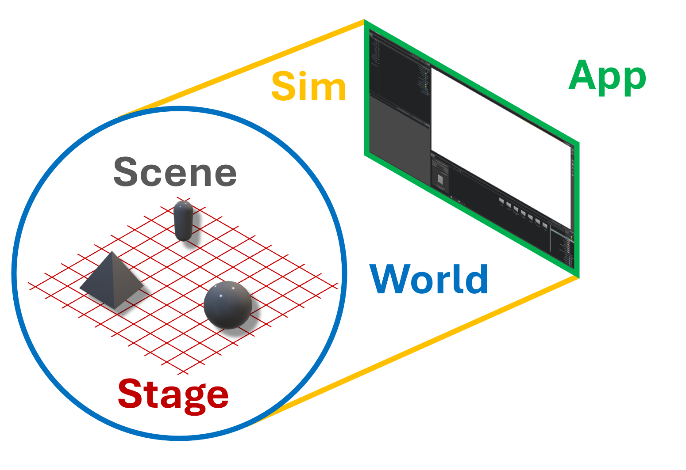

# Core API Overview
> **출처** : [해당링크](https://docs.isaacsim.omniverse.nvidia.com/5.1.0/python_scripting/core_api_overview.html)  
  
> **Important**  
> Isaac Sim 5.0.0에서는 **Core Experimental API**가 새롭게 도입이 되었다.
> 이 API는 기존의 Core API를 다시 구현한 버젼으로, 기존 버젼보다 더 robust, flexible, powerful하게 작성되었다고 엔비디아는 얘기하고 있다. 그래서 이 Experimental API가 기본 API가 될 예정이고, 현재의 core API는 deprecated 처리될 것이라고 하고 있다. 근데 5.1.0 버젼의 기본 예제는 그냥 Core API다. 띠용.  
  
## Core API는 Wrapper다.
일반적으로 OpenUSD로 raw USD와 stage를 다루려면 귀찮다. 예를 들어서
```
from pxr import UsdPhysics, PhysxSchema, Gf, PhysicsSchemaTools, UsdGeom
import omni

stage = omni.usd.get_context().get_stage()

# Setting up Physics Scene
gravity = 9.8
scene = UsdPhysics.Scene.Define(stage, "/World/physics")
scene.CreateGravityDirectionAttr().Set(Gf.Vec3f(0.0, 0.0, -1.0))
scene.CreateGravityMagnitudeAttr().Set(gravity)
PhysxSchema.PhysxSceneAPI.Apply(stage.GetPrimAtPath("/World/physics"))
physxSceneAPI = PhysxSchema.PhysxSceneAPI.Get(stage, "/World/physics")
physxSceneAPI.CreateEnableCCDAttr(True)
physxSceneAPI.CreateEnableStabilizationAttr(True)
physxSceneAPI.CreateEnableGPUDynamicsAttr(False)
physxSceneAPI.CreateBroadphaseTypeAttr("MBP")
physxSceneAPI.CreateSolverTypeAttr("TGS")

# Setting up Ground Plane
PhysicsSchemaTools.addGroundPlane(stage, "/World/groundPlane", "Z", 15, Gf.Vec3f(0,0,0), Gf.Vec3f(0.7))

# Adding a Cube
path = "/World/Cube"
cubeGeom = UsdGeom.Cube.Define(stage, path)
cubePrim = stage.GetPrimAtPath(path)
size = 0.5
offset = Gf.Vec3f(0.5,0.2,1.0)
cubeGeom.CreateSizeAttr(size)
cubeGeom.AddTranslateOp().Set(offset)

# Attach Rigid Body and Collision Preset
rigid_api = UsdPhysics.RigidBodyAPI.Apply(cubePrim)
rigid_api.CreateRigidBodyEnabledAttr(True)
UsdPhysics.CollisionAPI.Apply(cubePrim)
```
근데 Core API를 사용한다면 딸깍으로 가능하다.
```
import numpy as np
from isaacsim.core.api.objects import DynamicCuboid

DynamicCuboid(
   prim_path="/new_cube_2",
   name="cube_1",
   position=np.array([0, 0, 1.0]),
   scale=np.array([0.6, 0.5, 0.2]),
   size=1.0,
   color=np.array([255, 0, 0]),
)
```
이렇듯 사용하기 편하게 해주는 존재이다.

# Application vs Simulation vs World vs Scene vs Stage

USD에서는 모든 scene description이 attribute를 가진 prim으로 표현된다. 이전에 공부했듯이.  
  
**Simulation**은 이런 prim들의 attribute를 프로그램적으로 직접 변경하면서, 시간의 흐름에 따라 prim들의 state를 갱신한다.  
**Application**은 시뮬레이션의 큰 틀을 관리하는 역할을 한다. 예를 들어 어떻게 렌더링 할지, 사용자가 어떻게 시뮬레이션과 상호작용 할지 등에 대해서 말이다. 시뮬레이션에 GUI가 존재한다면, 그 GUI 역시 application의 일부이다.  
**Stage**는 USD에서 정의된 개념으로, 시뮬레이션에 존재하는 prim들의 논리적 관계와 구조적 맥락을 정의한다.  
  
예를 들어 머그컵 prim이 테이블 prim 위에 놓여있다면, 이 관계는 Stage 상에서 두 prim의 상대적인 위치와 각 prim이 가진 attribute를 통해 표현된다. 이러한 방식으로 Stage는 Application에 필요한 scene context를 제공할 수 있다. Prim은 Stage 없이 존재할 수 없기 때문에, Prim을 다루는 Application이 정상적으로 동작하려면 Stage가 필요하다.  
  
이와 유사하게 **World** 역시 시뮬레이션에 필요한 Context를 제공한다.  
World는 시간의 흐름에 따라 어떤 prim들이 실제 시뮬레이션의 대상이 되는지 정의하고, **Scene**을 관리하며, 사용자에게 중요한 시뮬레이션 요소들을 관리한다.  
  
이를 극장으로 비유한다면 다음과 같다.  
극장 자체는 **Application**이다. 반면, 실제 진행되는 연극 자체는 **Simulation**이다. 관객이 자리에 앉으면 앞에 **Stage**를 볼 수 있으며, 이건 실제로 연극이 진행되는 공간이다. 그리고 연극이 시작되면 배우와 소품들로 구성된 하나의 **Scene**이 나타난다. 이런 무대 뒤에서 막을 올리고 내리거나, 소품을 배치하고, Scene을 관리하는 스태프들과 기계 장치들은 **World**라고 볼 수 있다.