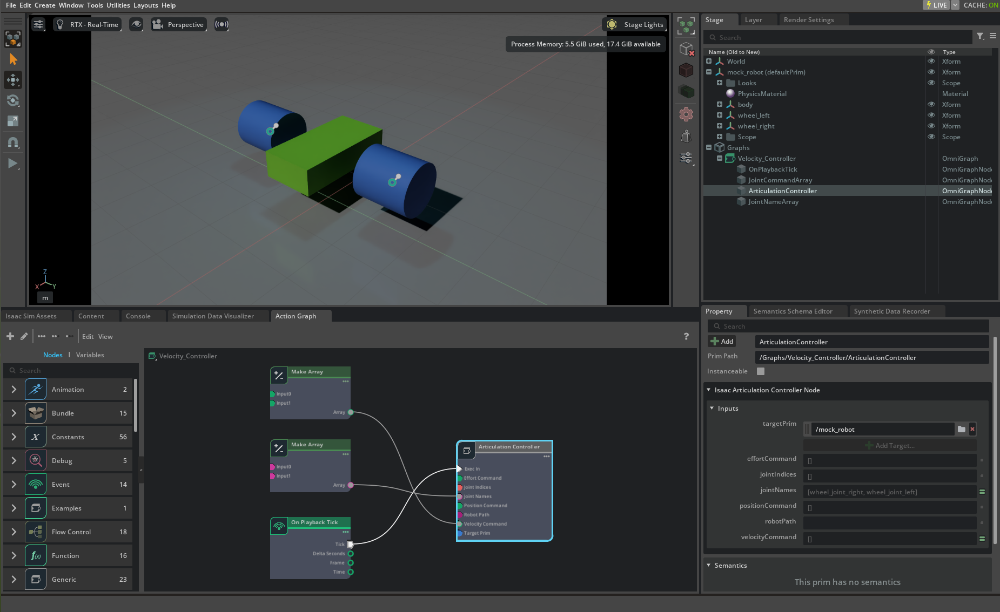

# Articulation controller
> **출처**: [해당 링크](https://docs.isaacsim.omniverse.nvidia.com/5.1.0/robot_simulation/articulation_controller.html)  
  
## Articulation이 뭔데..?
앞에서 개념적으로 안다루고 넘어가서 지금 좀 더 자세하게 얘기한다. Isaac Sim 5.1에서 **Articulation**은 여러 Joint로 연결된 Rigid Body들을 하나의 로봇 시스템으로 묶어서 효율적으로 시뮬레이션 하고 제어할 수 있게 해주는 개념이다. Isaac Sim에서 다수의 Link-Joint로 구성된 로봇 시스템은
- **Rigid Body (Link)** : 질량, 관성, 충돌 형상을 가진 물리 객체
- **Joint** : Rigid Body 사이의 상대적 움직임을 제한하거나 제어하는 연결 요소
- **Articulation** : 연결된 Rigid Body와 Joint를 하나의 multi-joint 물리 시스템으로 취급하는 구조
이렇게 구분할 수 있다.  
  
따라서 Articulation의 기능은
1. 여러 Joint를 한번에 제어 가능
2. 연결된 로봇 전체를 하나의 물리 시스템으로 연산 진행
   1. 이를 통해서 PhysX 엔진이 multi-joint를 더 효율적으로 연산 가능
   2. 여러 Link가 연결된 구조에서 물리 시뮬레이션의 정확성, 안정성 향상
   3. Joint 위치, 속도, 힘 등 상태를 통합해서 관리

# 그러면 Articulation Controller란?
Joint Position, Velocity, Effort를 제어할 수 있는 low-level controller이다. 파이썬과 Omnigraph를 통해서 사용할 수 있는 기능이다.

## 파이썬 인터페이스
### 생성하기
파이썬을 통해서 Articulation Controller를 생성하는 방법은 여러가지가 있다. 일반적으로는 **SingleArticulation** 클래스를 사용해서 로봇 Prim에 articulation을 적용하는 과정에서, **Articulation Controller가 암묵적으로 함께 생성**이 된다. 하지만 시뮬레이션을 시작하기 전에 **Controller** 클래스를 직접 import 해서 **Articulation Controller를 명시적으로 생성**하는 것도 가능하다. 다만 이 방식을 사용할 경우에는 초기화 과정에서 사용할 Articulation 객체를 직접 생성하거나, 이미 생성된 객체를 전달해야 하는 점을 기억해야 한다.  
  
**Single Articulation**
```
import isaacsim.core.utils.stage as stage_utils
from isaacsim.core.prims import SingleArticulation
usd_path = "/Path/To/Robots/FrankaRobotics/FrankaPanda/franka.usd"
prim_path = "/World/envs/env_0/panda"

# load the Franka Panda robot USD file
stage_utils.add_reference_to_stage(usd_path, prim_path)
# wrap the prim as an articulation
prim = SingleArticulation(prim_path=prim_path, name="franka_panda")
```
  
**Articulation Controller**
```
import isaacsim.core.utils.stage as stage_utils
from isaacsim.core.api.controllers.articulation_controller import ArticulationController
usd_path = "/Path/To/Robots/FrankaRobotics/FrankaPanda/franka.usd"
prim_path = "/World/envs/env_0/panda"

# load the Franka Panda robot USD file
stage_utils.add_reference_to_stage(usd_path, prim_path)
# Create the articulation controller
articulation_controller = ArticulationController()
```
### 초기화 하기
**Single Articulation**
```
prim.initialize()
```
**Articulation Controller**
```
from isaacsim.core.prims import Articulation
# Create the articulation view
articulation_view = Articulation(prim_paths_expr="/World/envs/env_0/panda", name="franka_panda_view")
# Initialize the articulation controller
articulation_controller.initialize(articulation_view)
```
### Articulation Action
사용자에 의해서 입력된 Joint 제어 명령은 Articulation Controller로 전달되기 전에 먼저 `ArticulationAction` 객체 형태로 패키징 된다. 이때 articulation controller를 사용한다면, 다음과 같은 항목들을 먼저 지정할 수 있다.
- 각 Joint에 적용할 Pisition 명령
- Velocity 명령
- Effort 명령
- 실제로 구동할 Joint들의 Joint Index

만약 Joint indices가 비어있다면, `ArticulationAction`은 해당 명령을 모든 조인트에 적용해야 하는 것으로 이해하고 실행한다. 또한 특정 커맨드 값이 0인 경우에는 해당 Joint를 구동하지 않는 (unactuated) 것으로 간주한다.  
  
예를 들어, 아래 코드는 Franka 로봇의 두 손가락 Joint인
- `panda_finger_joint1 (7)`
- `panda_finger_joint2 (8)`

을 모두 `0.0` 위치로 이동시켜 그리퍼를 닫는 명령을 생성하는 예제이다.
```
import numpy as np
from isaacsim.core.utils.types import ArticulationAction

action = ArticulationAction(joint_positions=np.array([0.0, 0.0]), joint_indices=np.array([7, 8]))
```
이거는 모든 로봇 조인트가 지정된 위치로 움직이도록 하는 명령을 생성한다.
```
import numpy as np
from isaacsim.core.utils.types import ArticulationAction

action = ArticulationAction(joint_positions=np.array([0.0, -1.0, 0.0, -2.2, 0.0, 2.4, 0.8, 0.04, 0.04]))
```
> **Important!!**  
> Articulation action에 전달하는 Joint command의 순서와 개수는 Joint Indice에 지정한 순서와 개수를 반드시 일치시켜야 한다. Joint Indices를 전달하지 않았다면, command의 개수는 로봇 전체 joint의 개수와 일치해야 한다.  
  
> **Note**
> 하나의 Joint는 동시에 한가지 제어 방식으로만 제어가 가능하다.
> 예를 들어 하나의 Joint에 대해 동시에 **목표 포지션(desired postion)**과 **목표 torque**를 한번에 명령할수는 없다.  
  
### Apply Action
`SingleArticulation` 클래스와 `ArticulationController` 클래스에 있는 `apply_action` 함수는 앞에서 생성한 `ArticulationAction`을 로봇에 적용한다.  
  
**Single Articulation**
```
prim.apply_action(action)
```
**Articulation Controller**
```
articulation_controller.apply_action(action)
```
### 스크립트 에디터 예제
- **Single Articulation**
```
import numpy as np
from isaacsim.core.utils.stage import add_reference_to_stage
from isaacsim.storage.native import get_assets_root_path
from isaacsim.core.prims import SingleArticulation
from isaacsim.core.utils.types import ArticulationAction
from isaacsim.core.api.world import World
import asyncio

async def robot_control_example():
    if World.instance():
        World.instance().clear_instance()
    world = World()
    await world.initialize_simulation_context_async()
    world.scene.add_default_ground_plane()

    # Load the robot USD file
    usd_path = get_assets_root_path() + "/Isaac/Robots/FrankaRobotics/FrankaPanda/franka.usd"
    prim_path = "/World/envs/env_0/panda"
    add_reference_to_stage(usd_path, prim_path)

    # Create SingleArticulation wrapper (automatically creates articulation controller)
    robot = SingleArticulation(prim_path=prim_path, name="franka_panda")
    await world.reset_async()

    # Initialize the robot (initializes articulation controller internally)
    robot.initialize()

    # Run simulation
    await world.play_async()

    # Get current joint positions
    current_positions = robot.get_joint_positions()
    print(f"Current joint positions: {current_positions}")

    # Create target positions
    target_positions = np.array([0.0, -1.5, 0.0, -2.8, 0.0, 2.8, 1.2, 0.04, 0.04])

    # Create and apply articulation action
    action = ArticulationAction(joint_positions=target_positions)
    robot.apply_action(action)

    await asyncio.sleep(5.0)  # Run for 5 seconds to reach target positions

    # Get current joint positions
    current_positions = robot.get_joint_positions()
    print(f"Current joint positions: {current_positions}")

    world.pause()

# Run the example
asyncio.ensure_future(robot_control_example())
```
- **Articulation Controller**
```
import numpy as np
from isaacsim.core.utils.stage import add_reference_to_stage
from isaacsim.storage.native import get_assets_root_path
from isaacsim.core.api.controllers.articulation_controller import ArticulationController
from isaacsim.core.prims import Articulation
from isaacsim.core.utils.types import ArticulationAction
from isaacsim.core.api.world import World
import asyncio

async def robot_control_example():
    if World.instance():
        World.instance().clear_instance()
    world = World()
    await world.initialize_simulation_context_async()
    world.scene.add_default_ground_plane()

    # Load the robot USD file
    usd_path = get_assets_root_path() + "/Isaac/Robots/FrankaRobotics/FrankaPanda/franka.usd"
    prim_path = "/World/envs/env_0/panda"
    add_reference_to_stage(usd_path, prim_path)

    # Create Articulation view for the robot
    robot_view = Articulation(prim_paths_expr=prim_path, name="franka_panda_view")

    # Create and initialize the articulation controller with the articulation view
    articulation_controller = ArticulationController()
    articulation_controller.initialize(robot_view)

    # Run simulation
    await world.play_async()

    # Get current joint positions
    current_positions = robot_view.get_joint_positions()
    print(f"Current joint positions: {current_positions}")

    # Create target positions
    target_positions = np.array([0.0, -1.5, 0.0, -2.8, 0.0, 2.8, 1.2, 0.04, 0.04])

    # Create and apply articulation action
    action = ArticulationAction(joint_positions=target_positions)
    articulation_controller.apply_action(action)

    await asyncio.sleep(5.0)  # Run for 5 seconds to reach target positions

    # Get current joint positions
    current_positions = robot_view.get_joint_positions()
    print(f"Current joint positions: {current_positions}")

    world.pause()

# Run the example
asyncio.ensure_future(robot_control_example())
```
## Omnigraph Interface
Articulation controller는 Omnigraph 노드로서도 접근이 가능하며, visual 기반의 node-based approach를 제공한다.
### Input Parameters
| Input Parameter | Description |
| -- | -- |
| execln | Input execution trigger - connects to other nodes to control when the articulation controller runs |
| targetPrim | The prim containing the robot articulation root. Leave empty if using robotPath |
| robotPath | String path to the robot articulation root. Leave empty if using targetPrim |
| jointIndices | Array of joint indices to control. Leave empty to control all joints or use jointNames |
| jointNames | Array of joint names to control. Leave empty to control all joints or usd jointIndices |
| positionCommand | Desired joint positions. Leave empty if not using position control |
| velocityCommand | Desired joint velocities. Leave empty if not using velocity control |
| effortCommand | Desired joint efforts/torques. Leave empty if not using effort control |

### Usage Guidlines
> **Important!**  
> **Parameter Validation**: Joint command의 순서와 개수가 지정한 joint indices 또는 joint names의 순서와 개수에 부합하는지 확인할 것.  
  
> **Note**  
> **Control Method Limitations**: 하나의 조인트는 한가지 제어 방식만으로 제어 가능  
  
For a complete example of the articulation controller Omnigraph node in action, see the mock_robot_rigged asset in the Content Browser at Isaac Sim > Samples > Rigging > MockRobot > mock_robot_rigged.usd.
