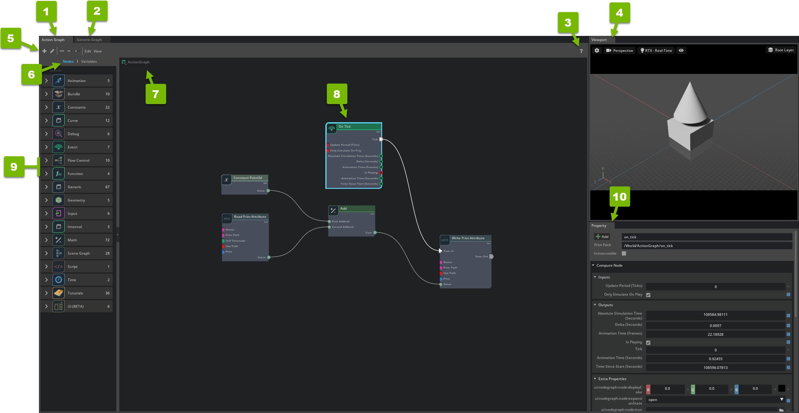

# OmniGraph Interface
> **출처**: [해당 링크](https://docs.omniverse.nvidia.com/extensions/latest/ext_omnigraph/interface.html)  
  
## Overview

| **Reference Number** | **Option** | **Description** |
| -- | -- | -- |
| 1 | Action Graph Editor | Provides a visual scripting editor for action graphs |
| 2 | Push Graph Editor | Provides a visual scripting editor for push graphs |
| 3 | Documentation | Opens the [OmniGraph documentation portal](https://docs.omniverse.nvidia.com/extensions/latest/ext_omnigraph.html#omnigraph-overview) |
| 4 | Viewport | Refer to [Viewport](https://docs.omniverse.nvidia.com/extensions/latest/ext_core/ext_viewport.html#viewport) for details |
| 5 | Editor Options | Refer to [Editor Options](https://docs.omniverse.nvidia.com/extensions/latest/ext_omnigraph/interface.html#omnigraph-editor-options) for details |
| 6 | Node / Variable Switch | Switches between [Node List](https://docs.omniverse.nvidia.com/extensions/latest/ext_omnigraph/interface.html#node-list) and [Graph Variables](https://docs.omniverse.nvidia.com/extensions/latest/ext_omnigraph/interface.html#graph-variables) |
| 7 | Current Graph | Identifies the current graph that you're editing |
| 8 | Node | Reas and writes values and controls logic flow in the graph editor |
| 9 | Node List / Graph Variables | The [Node List](https://docs.omniverse.nvidia.com/extensions/latest/ext_omnigraph/interface.html#node-list) and [Graph Variables](https://docs.omniverse.nvidia.com/extensions/latest/ext_omnigraph/interface.html#graph-variables) Editor |
| 10 | Property | Refer to [Property Panel](https://docs.omniverse.nvidia.com/extensions/latest/ext_core/ext_property-panel.html#property-panel) for detail |

그 외 자세한 내용은 출처 링크 참고할 것.