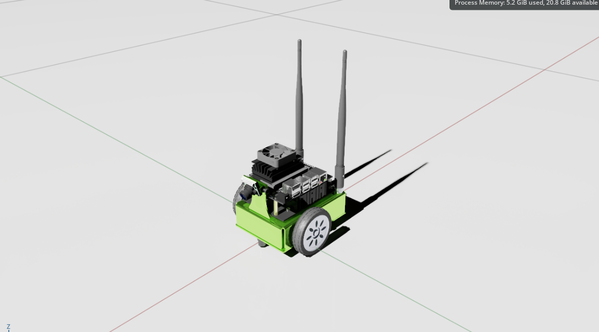
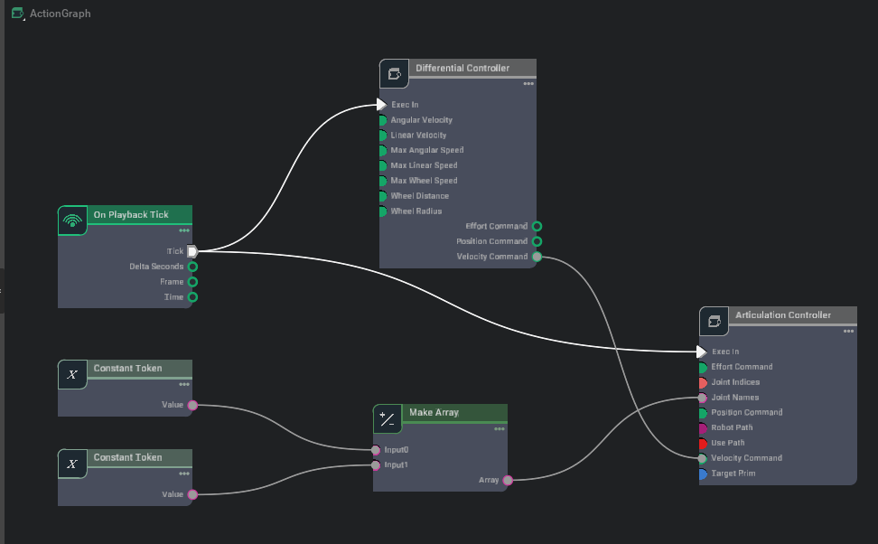
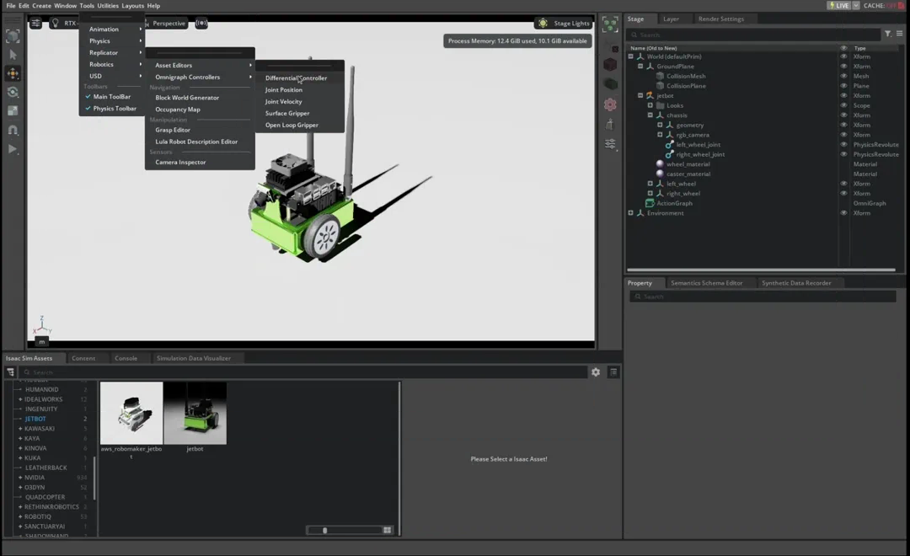

# Isaac Sim Omnigraph Tutorial
여기서는 Omnigraph를 통한 visual programming 튜토리얼을 지원한다.

## 학습 목표
- Isaac Sim에서 로봇, 구체적으로는 **JetBot**을 제어하기 위한 **Action Graph**를 직접 만들어보기
- **OmniGraph Shortcut**를 사용해 JetBot용 **DIfferential Controller Graph**를 생성

## Build The Graph
### Stage 설정
1. 새로운 Stage에 우클릭 한 뒤 `Create > Physics > Ground Plane` 선택
2. Content Browser에서 다음 경로로 이동: `Isaac Sim/Robots/NVIDIA/Jetbot/jetbot.usd`
3. `jetbot.usd`를 클릭해 Stage로 Drag and Drop 하기
4. Groud Plane보다 살짝 위에 배치하는거 잊지 말기
5. 설정이 완료되면 Context Tree에서 JetBot이 `/World/jetbot` 아래에 있는지 확인하기

### Building the Graph
1. 에디터 상단의 드롭다운 메뉴에서 `Window > Graph Editors > Action Graph`를 선택한다. 그러면 Graph Editor가 Content Browser와 같은 Pane에 나타난다.
2. **New Action Graph**를 클릭해서 비어있는 그래프를 연다.
3. Graph Editor의 검색창에 controller를 입력한다.
4. Articulation Controller와 Differential Controller를 Graph 위로 드래그 & 드롭 한다.

Articulation Controller는 Articulation Root가 적용된 Prim에 대해서 지정한 Joint들에 Force, Position, Velocity 형태의 구동 명령을 적용한다.  
  
Controller에게 어떤 로봇을 제어할 것인지 입력을 주려면:
1. 그래프에서 Articulation Controller Node를 선택하고, Property Pane을 연다.
2. 다음 두 방법 중 하나를 선택해서 사용 가능하다.
   - **usePath**를 활성화 한 뒤 **robotPath**에 로봇의 경로인 `/World/jetbot`을 입력
   - `input:targetPrim` 항목의 Pane 위쪽에 있는 **Add Targets**를 클릭한 뒤, 팝업창에서 **JetBot**을 선택

Differential Controller는 목표 선속도와 각속도가 주어졌을 때, 2륜 로봇에 필요한 Wheel Drive Command를 연산한다. Articulation Controller와 마찬가지로 Differential Controller 역시 설정이 필요하다:
1. 그래프에서 Differential Controller Node를 선택
2. Properties Pane에서 다음과 같이 설정
   - `wheelDistance = 0.1125`
   - `wheelRadius = 0.03`
   - `maxAngularSpeed = 0.2`

Articulation Controller의 경우 어떤 Joint들이 실제로 구동되어야 하는지에 대해서 알아야 한다. 이 정보는 **Token의 List 또는 Joint index 값들의 List** 형태로 전달이 되어야 한다. 로봇의 각 Joint들은 각각 이름을 가지고 있으며, JetBot에서는 2개의 Joint가 존재한다.  
  
이는 Stage의 Context Tree에서 JetBot을 확인해보면 검증이 가능한데, `/World/jetbot/chassis` 아래에는 다음 2개의 `Revolute Physics Joint`가 존재한다.
- `left_wheel_joint`
- `right_wheel_joint`

그 다음으로 할 것은:
1. 그래프 편집기의 검색창에 **token**을 입력한다.
2. 그래프에 **Constant Token Node**를 2개 추가한다.
3. 그 중 하나를 선택해 Properties Pane에서 값을 **left_wheel_joint**로 설정하고, 다른 하나는 **right_wheel_joint**로 설정한다.
4. 그래프 편집기 검색창에 **make array**를 입력한다.
5. 이후 그래프에 **Make Array Node**를 추가한다.
6. 해당 노드를 선택한 다음, Properties Pane의 inputs 섹션에 있는 `+` 아이콘을 클릭해 2번째 입력을 추가한다.
7. `arraySize`를 2로 설정하고 같은 Pane의 드롭다운 메뉴에서 input Type을 `token[]`으로 설정한다.
8. 두 Constant Token Node를 각각 Make Array Node의 `input0`, `input1`에 연결한다. 그리고 Make Array Node의 출력을 Articulation Controller Node의 `Joint Names` 입력에 연결한다.

마지막으로 추가할 Node는 **Event Node**이다.
1. 그래프 에디터 검색창에 `playback`을 입력한다.
2. 그래프는 `On Playback Tick Node`를 추가한다. 이 Node는 Simulation이 플레이 일때만, **매 Frame마다 Execution Event를 발생**시킨다.
3. `On Playback Tick Node`의 Tick 출력을 두 Controller Node의 `Exec In` 입력에 각각 연결한다.
4. `Differential Controller`의 Velocity Command 출력을 `Articulation Controller`의 Velocity Command 입력을에 연결한다.
5. 최종적으로 그래프가 다음과 같은 형태면 된다.

## Omnigraph Shortcuts
그래프를 From scratch로 구현하는건 어렵고 귀찮다. 따라서 Isaac Sim에서는 자주 사용하는 그래프의 경우 쉽게 사용할 수 있도록 미리 잘 포장을 해서 제공하고 있다. 이런 기 제공되는 그래프들 같은 경우 **`Tools > Robotics > Omnigraph Controllers`**에서 확인할 수 있으며, 보다 자세한 튜토리얼은 [**Commonly Used Omnigraph Shortcuts**](https://docs.isaacsim.omniverse.nvidia.com/5.1.0/omnigraph/omnigraph_shortcuts.html#isaac-sim-app-tutorial-advanced-omnigraph-shortcuts)에서 확인할 수 있다.  
  
이번에는 Differential Controller에 대해서 Graph shortcut을 사용해보자.
1. 위에 예제를 아직 끄고 새로 JetBot Stage를 켜지 않았다면, 우선 기존 OmniGraph부터 제거하자.
2. `Tools > Robotics > Omnigraph Controllers > Differential Controller`로 들어가자
3. 필요한 파라미터를 입력하자: `/World/jetbot`을 `Articulation Root`로 넣고, **distance between wheels**를 `0.1125`로, **wheel radius**는 `0.03`으로 입력한다.
4. **Use Keyboard Control (WASD)** 옵션을 켜자
5. **Ok**를 누리면 자동으로 그래프가 생성된다. 이건 `/Graph/differential_controller`에서 확인할 수 있다.
6. Play를 누르고, JetBot이 WASD로 움직이는지 검증해보자.

