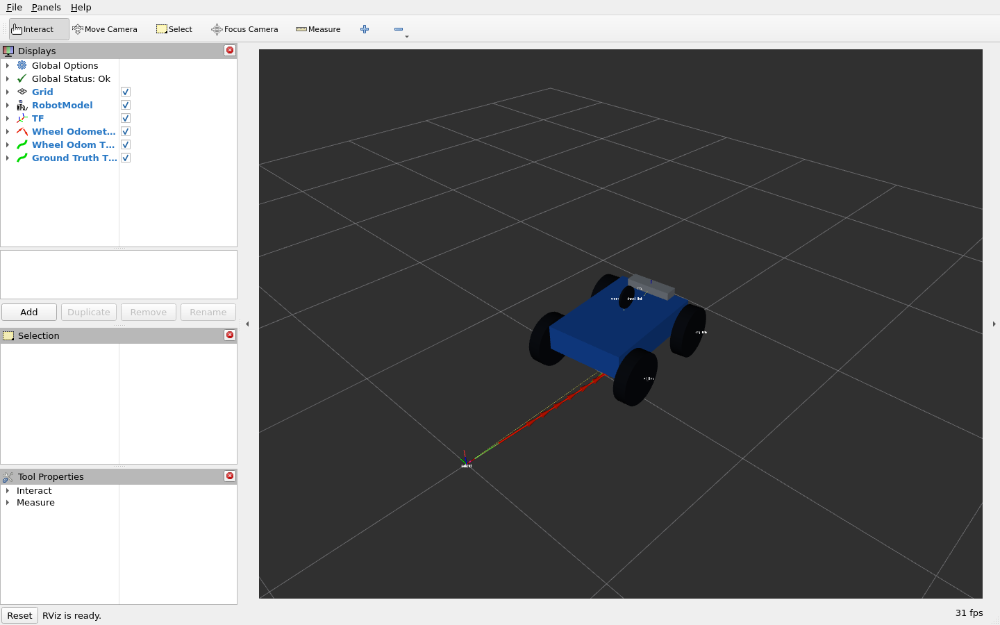
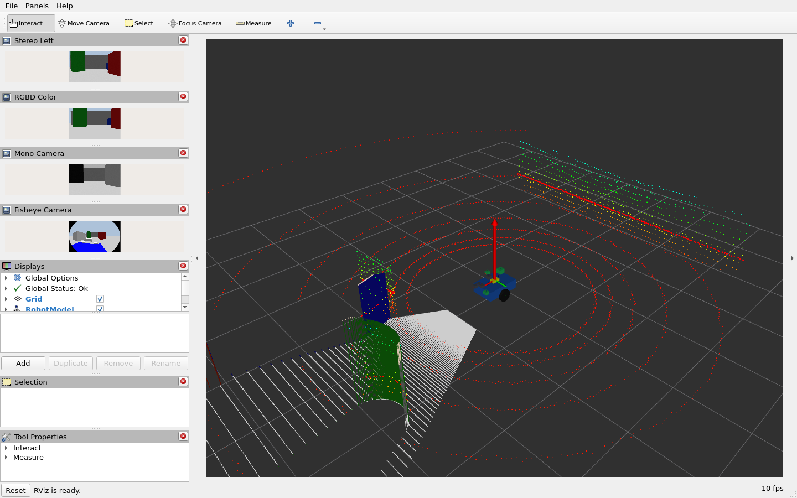
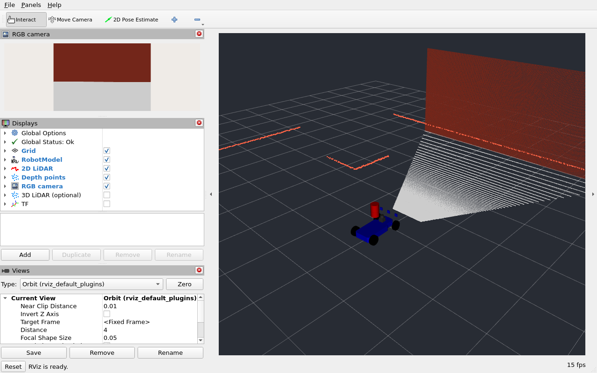

# Humble 과정 재점검 기록

> 이 문서는 **2026년 9월 7일 구성의 검증 기록**이다. 9월 8일 수정에서 F1TENTH은 기존 Building Editor 맵과 기본 센서 구성으로 돌아갔고, 센서 실습 차량은 4륜 Ackermann으로 바뀌었다. 아래의 이전 센서 차량 화면과 F1 거리값은 당시 구성에 해당한다. 현재 센서 실습은 [5장](05_sensors.md)을 따른다.

이 기록은 Ubuntu 22.04, ROS 2 Humble, Gazebo Classic 11을 사용하는 `Humble` 브랜치의 문서·모델·실행 코드를 점검한 내용이다. 다른 브랜치의 구현은 변경하지 않았다.

## 문서에서 바꾼 내용

README, 1~10장, 패키지별 README와 F1TENTH 안내를 검토했다. 번역투와 불필요한 영어 표현을 줄이고, 실제 실행 파일과 일치하지 않는 예제를 수정했다. 실습마다 준비할 터미널, 환경 설정, 실행 명령, 기대하는 토픽·화면, 정지 방법을 연결했다.

- ROS 패키지 저장소 등록부터 `rosdep`, 전체 워크스페이스 빌드까지 설명한다.
- 명령을 실행할 폴더와 새 터미널에서 다시 읽어야 하는 `setup.bash`를 명시한다.
- 센서는 프로필별로 실행하고, 메시지·프레임·RViz 표시를 차례로 확인한다.
- Gazebo 시스템 플러그인을 월드 플러그인처럼 넣던 예제를 공식 launch 사용법으로 바꿨다.
- 존재하지 않는 파일·토픽과 잘못된 저장소 주소를 바로잡았다.
- rosbag 재생에서는 `/clock`과 TF가 중복으로 발행되지 않도록 실행 순서를 설명한다.

## 발견한 코드 문제와 수정

| 대상 | 문제 | 수정 |
| --- | --- | --- |
| 스테레오 카메라 | 좌우 영상의 프레임과 실제 렌즈 위치, 오른쪽 투영행렬이 일치하지 않음 | 카메라 두 개에 각각의 optical 프레임을 지정하고 물리적 간격과 `-P[3]/P[0]`을 0.08 m로 맞춤 |
| RGB-D | Classic 점군 생성식과 기본 CameraInfo 주점이 1픽셀 어긋남 | 320×240 영상에 `cx=159.5`, `cy=119.5`를 지정하고 optical 좌표계 유지 |
| IMU와 RViz | 지원하지 않는 크기 설정 키와 절대 자세를 해석하기 부적절한 기준 프레임 | 실제 플러그인 설정 키, `world` 기준 자세·가속도 표시 적용 |
| RViz 화면 | 큰 오도메트리 공분산 도형이 화면을 덮고 IMU 가속도 화살표가 로봇을 가림 | 기본 공분산 표시를 끄고 가속도 화살표 배율을 0.3에서 0.1로 조정 |
| Ackermann 휠 오도메트리 | 뒤 차축의 이동량을 앞쪽 차체 중심의 이동량으로 취급 | 0.28 m 기준점 차이를 위치 적분과 `linear.y`에 반영 |
| GroundTruthPath | 월드 좌표를 임의의 다른 프레임 이름으로 발행할 수 있음 | `world`만 허용하고 다른 프레임 설정은 오류로 처리 |
| Gazebo 플러그인 검색 | Gazebo ROS가 읽지 않는 export 키와 설치 경로 | `plugin_path="${prefix}/../../lib"`로 수정 |
| F1 조향 명령 | Classic의 조향각 입력에 요 각속도를 전달 | `/drive`의 조향각을 `/cmd_vel.angular.z`로 변환하고 후진 부호 처리 |
| F1 모델과 센서 | odometry 비활성화, 중복 TF, 조향 조인트 제한 누락, 카메라 센서 이름 충돌 | 발행 주체와 조인트를 정리하고 센서 이름·프레임·보정값 수정 |
| F1 AMCL 실행 | Humble launch의 Python 표현식에 소문자 `false`를 전달 | Python 불리언 문자열 `False`로 수정 |
| F1 2D 라이다 | `ray/noise`의 종류를 속성으로 지정해 SDF 파서가 무시함 | `<noise><type>gaussian</type>…` 문법 적용 |
| Velodyne 플러그인 | 콜백 선언·정의 불일치, 비정렬 메모리 접근, 빈 스캔 처리 오류 | 콜백 형식 통일, `memcpy` 사용, 스캔 경계·필터 처리 보강 |
| 기본 실습 월드 | 외부 모델 다운로드에 의존 | 지면과 조명을 월드에 포함하고 F1용 센서 확인 월드 추가 |

기본 로봇과 센서 프로필 7개의 무게중심과 관성도 확인했다. 이 부분은 기존 값이 적절해 물리 치수를 유지했다. Classic RGB-D 점군의 전방은 **optical 프레임의 +Z**다. 센서가 설치된 로봇 좌표계의 +X와 구별해야 한다.

설정의 의미는 CI에 설치된 `gazebo_ros_pkgs` 3.9.0의 [카메라 플러그인 구현](https://github.com/ros-simulation/gazebo_ros_pkgs/blob/ae6e5793a31f5927df89cb58007d2a5eb567baa8/gazebo_plugins/src/gazebo_ros_camera.cpp), [Ackermann 플러그인 구현](https://github.com/ros-simulation/gazebo_ros_pkgs/blob/ae6e5793a31f5927df89cb58007d2a5eb567baa8/gazebo_plugins/src/gazebo_ros_ackermann_drive.cpp)과 대조했다. 카메라·조향의 핵심 처리 방식은 앞서 확인한 3.7.0과 같았다.

첫 실행에서는 센서·TF·물리 주행 검사가 모두 통과했지만, [당시 RViz 화면](assets/humble-review/before-covariance.png)에서 공분산 도형이 로봇을 가리는 문제가 보였다. 그래서 자동 검사 뒤에 화면 검토를 추가하고 기본 표시 설정을 수정했다. 오도메트리 화살표도 전체 길이를 1.3 m에서 0.28 m로 줄여 궤적을 읽기 쉽게 했다.

## 검증을 다시 실행하는 방법

저장소 최상위 폴더에서 정적 검사를 실행한다. 문서 빌드 도구는 별도 가상환경에 설치한다.

```bash
cd ~/robotics-sim-tutorial-kr
sudo apt install -y python3-venv
python3 -m venv .venv-docs
source .venv-docs/bin/activate
python -m pip install -r requirements-docs.txt
python3 scripts/validate_humble.py
python3 -m unittest discover -s tests -p 'test_validate_humble.py' -v
mkdocs build --strict
deactivate
```

실제 실행 검사는 ROS와 전체 워크스페이스를 빌드한 환경이 필요하다. **문서용 가상환경을 활성화하지 않은 새 터미널**에서 다음을 실행한다. 화면이 없는 환경에서는 Xvfb로 렌더링한다.

```bash
sudo apt update
sudo apt install -y python3-pytest python3-yaml xvfb xauth xdotool \
  imagemagick libgl1-mesa-dri libglx-mesa0 procps
source /opt/ros/humble/setup.bash
source ~/robotics-sim-tutorial-kr/ros2_ws/install/setup.bash
cd ~/robotics-sim-tutorial-kr
python3 -m pytest -q scripts/test_humble_sensors.py
LIBGL_ALWAYS_SOFTWARE=1 QT_XCB_NO_MITSHM=1 \
  xvfb-run -a -s '-screen 0 1920x1200x24 -noreset' \
  python3 scripts/check_humble_runtime.py --model sensor_bot --rviz \
  --evidence /tmp/humble-sensor-check
cat /tmp/humble-sensor-check/result.json
```

`--model`은 `diffbot`, `rover_diff`, `rover_ackermann`, `sensor_bot`, `f1`을 지원한다. 모델마다 결과 폴더를 다르게 지정한다. 검사기는 별도의 ROS 도메인과 Gazebo 포트를 사용하고, 자신이 실행한 프로세스만 종료한다. ROS가 없으면 종료 코드 69를 반환한다. 이는 실행 검사를 통과했다는 뜻이 아니다.

검사 중에는 기본 월드를 복사해 상태 관찰용 플러그인을 추가한다. 검사기는 이 플러그인의 상태 토픽만 구독한다. 바퀴 회전으로 계산한 odometry와 Gazebo의 실제 차체 이동을 따로 확인하기 위해서다. 센서 데이터와 TF의 시각, 스테레오 간격, 깊이·점군의 투영, 알려진 벽까지의 거리, 정지 IMU, 직진과 Ackermann 회전을 측정한다. 기본 로봇 네 종류는 `/wheel_odom_path`의 프레임·좌표·시각과 0.15 m 이상의 경로 진행도 확인한다. F1은 `/drive`에서 시작해 변환 노드를 거친 출력과 실제 주행을 함께 검사한다.

`result.json`에 성공 여부와 오류를 기록하고, 실행을 시작하면 `launch.log`도 남긴다. 센서 준비와 화면 캡처 단계까지 성공하면 확장된 `robot.urdf`와 실제 `rviz.png`가 추가된다. 초기에 실패했다면 이 두 파일은 없을 수 있다. 화면은 직진·조향 후 정지하고 0.5초의 시뮬레이션 시간이 지난 뒤 캡처한다. 자동 검사를 통과해도 RViz 스크린샷에서 모델·점군·영상과 Displays 상태를 함께 확인해야 한다.

센서 TF 준비 검사는 새 메시지의 서로 다른 시각 3개에서 연속으로 변환이 가능한지 확인한다. 시작 직후 TF보다 먼저 온 메시지 한 개를 고정해 계속 기다리는 방식은 쓰지 않는다. `tf_diagnostics`에 실제로 확인한 센서 시각, TF 오류 이유와 최신 odometry·clock 시각을 기록하므로 초기 준비 지연과 지속적인 프레임 오류를 구분할 수 있다.

CI에서는 모델마다 가상 디스플레이와 Qt 실행 디렉터리를 분리한다. `xvfb.log`와 `glxinfo.txt`에 그래픽 환경을 기록하고, Qt 5의 `QT_XCB_NO_MITSHM=1` 설정을 사용한다. 기본 로봇 세 종류는 직진 0.8 m 이상, odom과 Path 진행 0.75 m 이상을 요구한다. 센서 로봇과 F1은 앞쪽 장애물과의 간격을 고려해 직진 0.2 m 이상을 확인한다.

## 검증 범위

센서 회귀 검사 19개를 수정 전 코드에 적용하면 10개가 실패하고 9개가 통과한다. 수정 후에는 19개가 모두 통과한다. 별도의 Ackermann 계산 검사 17개와 정적 검사기 회귀 검사 12개도 통과했다. 정적 검사기는 XML 예제의 태그·속성 이름까지 한국어로 번역하는 실수도 검출한다.

CI에서 전체 8개 패키지 빌드와 URDF·SDF 검사, 패키지 테스트를 통과했다. `colcon test-result`는 36건, 실패 0건, 오류 0건, 생략 1건으로 집계했다. 생략된 검사는 배포판의 cppcheck 2.7에 알려진 성능 문제가 있어 ament가 자동으로 건너뛴 항목이다. 이 결과를 cppcheck 검사 완료로 해석해서는 안 된다.

## 실제 실행 결과와 RViz 화면

2026년 9월 7일 [GitHub Actions 실행 34117481381](https://github.com/kimhoyun-robotair/robotics-sim-tutorial-kr/actions/runs/34117481381)에서 **다섯 모델이 모두 통과**했다. 검사 대상 코드는 [06966b4 커밋](https://github.com/kimhoyun-robotair/robotics-sim-tutorial-kr/commit/06966b4cfcda53f46f7ccf8255fe3414b4fa537b)이며, 아래 화면과 측정값은 모두 같은 실행에서 얻었다. 기록을 추가한 이후의 문서 커밋과 실행 대상 코드의 커밋을 구분한다.

실행 환경은 Ubuntu 22.04 컨테이너, Gazebo 11.10.2, `gazebo_ros_pkgs` 3.9.0, RViz 11.2.28, `rviz_imu_plugin` 2.1.5다. Xvfb와 Mesa 23.2.1의 llvmpipe로 렌더링했다. GPU가 있는 데스크톱 환경의 성능 측정은 아니다.

| 모델 | Gazebo 실제 직진 거리 | odometry 직진 거리 | 추가 확인 |
| --- | ---: | ---: | --- |
| `diffbot` | 0.802 m | 0.798 m | 바퀴·정답 궤적과 TF 표시 |
| `rover_diff` | 0.805 m | 0.805 m | 바퀴 궤적과 네 바퀴 조인트 |
| `rover_ackermann` | 0.804 m | 0.795 m | 좌회전 시 차체 요각 0.120 rad 변화, 앞바퀴 조향 |
| `sensor_bot` | 0.205 m | 0.193 m | 센서 관련 토픽 16개의 메시지 시각별 TF, 영상·점군 |
| `f1` | 0.208 m | 0.206 m | `/drive` 변환, 좌회전 요각 0.126 rad, 센서 관련 토픽 13개의 TF |

직진 거리는 정지 상태에서 명령을 보낸 뒤 검사 기준을 충족했을 때의 값이다. 좌회전은 이어지는 별도 단계에서 측정한다. 물리 시뮬레이션과 휠 오도메트리의 차이는 위 표처럼 따로 기록하며, 실행 시점에 따라 수치가 조금 달라질 수 있다.

| 센서 측정값 | `sensor_bot` | `f1` |
| --- | ---: | ---: |
| 스테레오 간격 | 0.080 m | 0.200 m |
| RGB-D 중앙 깊이 | 5.631 m | 2.800 m |
| 중앙 외 4개 지점의 최대 점군 투영 오차 | 0.0000277 m | 0.0000010 m |
| 2D 라이다 전방 거리 | 5.796 m | 2.887 m |
| 3D 라이다에서 확인한 전방 벽의 X 좌표 | 6.062 m | 3.003 m |
| 정지 IMU의 Z축 평균 가속도 | 9.804 m/s² | 9.809 m/s² |

카메라와 라이다는 설치 위치·측정 방향이 달라 같은 벽을 보더라도 거리 값이 같지 않다. 검사기는 각 센서의 위치와 프레임에 맞는 예상 범위를 사용한다. 원본 검사 결과, 센서별 TF 진단과 패키지 버전은 [validation-results.json](assets/humble-review/validation-results.json)에 보관했다. 모든 모델의 오류 목록과 종료 후 남은 프로세스 목록은 비어 있다. 정적 검사, URDF·SDF 확장, 빌드·테스트와 실행 로그 전체는 위 CI의 `humble-classic-validation` 아티팩트에서 확인할 수 있다.

아래는 실제 RViz 창을 그대로 캡처한 화면이다. 다섯 화면 모두 `Global Status: Ok`를 확인했고, 모델·궤적·영상·점군이 표시되는지 직접 검토했다. 자동 검사 결과의 `rviz_capture.review`에는 캡처 뒤 화면 검토가 필요하다는 안내가 그대로 남아 있으며, 화면 검토 결과는 이 문서와 JSON의 `visual_review`에 별도로 기록했다.

### Ackermann 로버의 직진·좌회전 후 궤적

공분산 도형이 로봇을 가리지 않고, 차체 뒤로 휠 오도메트리와 정답 궤적이 보인다. [차동구동 로봇](assets/humble-review/diffbot.png)과 [차동구동 로버](assets/humble-review/rover_diff.png)의 화면도 함께 보관했다.



### 센서 로봇의 영상·점군·IMU

왼쪽에는 스테레오 왼쪽 영상, RGB-D 색상 영상, 흑백 영상, 어안 영상이 표시된다. 가운데에는 로봇, 깊이 점군, 라이다 점군과 IMU가 보인다. 정지 상태의 IMU 가속도 화살표가 위를 가리키는 것은 중력이 포함된 측정값을 표시하기 때문이다. 어안 영상은 렌더링과 TF를 확인했으며, 플러그인이 제공하는 일반 CameraInfo를 정밀 어안 보정값으로 검증한 것은 아니다.



### F1TENTH의 영상과 깊이 점군

기본 RViz 설정에서 RGB 영상, 2D 라이다와 깊이 점군을 확인했다. 선택 항목인 3D 라이다는 이 화면에서 꺼져 있지만, 실행 검사에서는 활성화해 7,040개의 유효 점과 수직 시야각을 확인했다. 스테레오·IMU·GPS도 메시지와 좌표를 검사했다.



AMCL 위치 추정의 정확도, 자율주행 완주, 실제 조이스틱·로봇 하드웨어, 다른 운영체제나 그래픽 드라이버까지 검증한 것은 아니다. 이 기록의 통과 범위는 위 환경에서 수행한 빌드·회귀 검사와 다섯 모델의 센서·TF·주행·RViz 확인이다.
