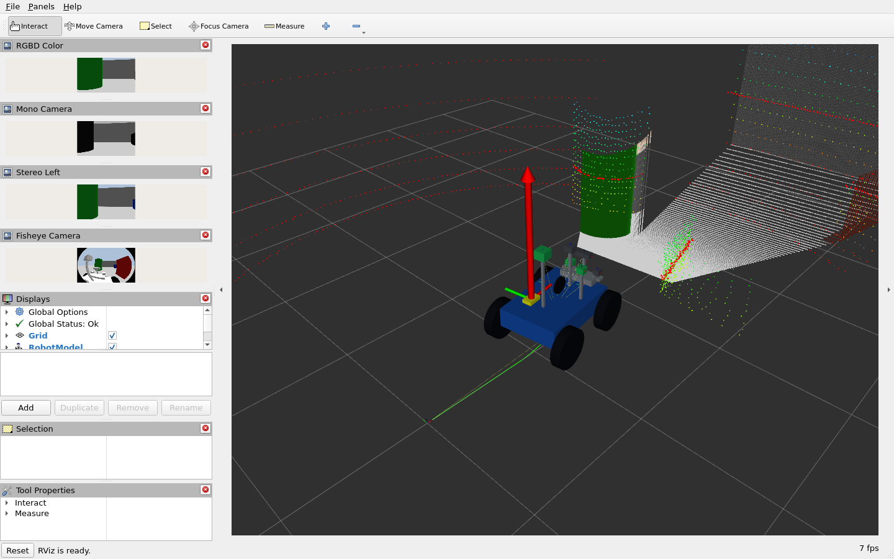
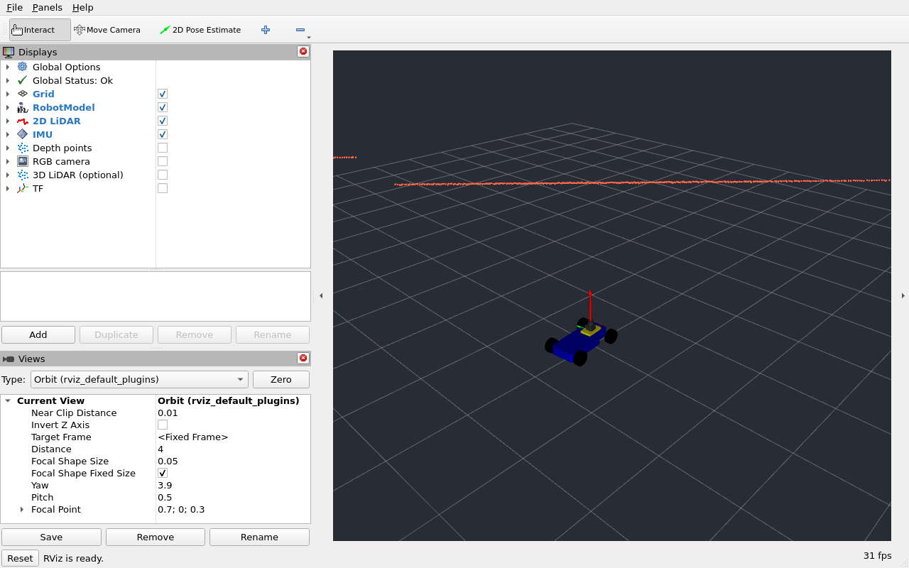
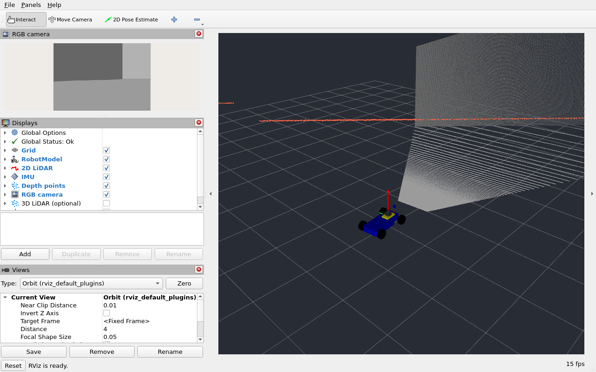
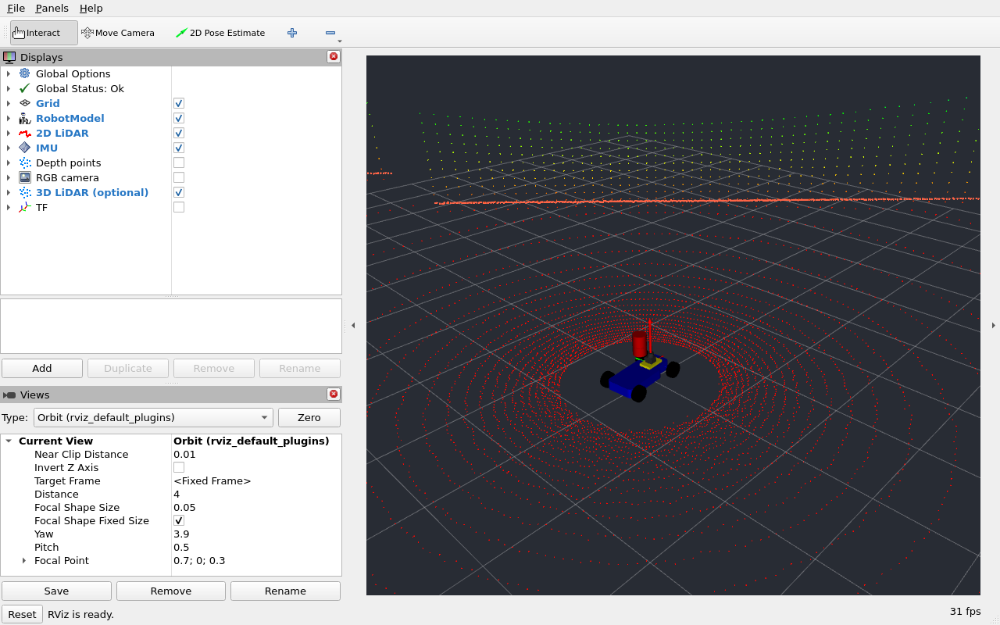
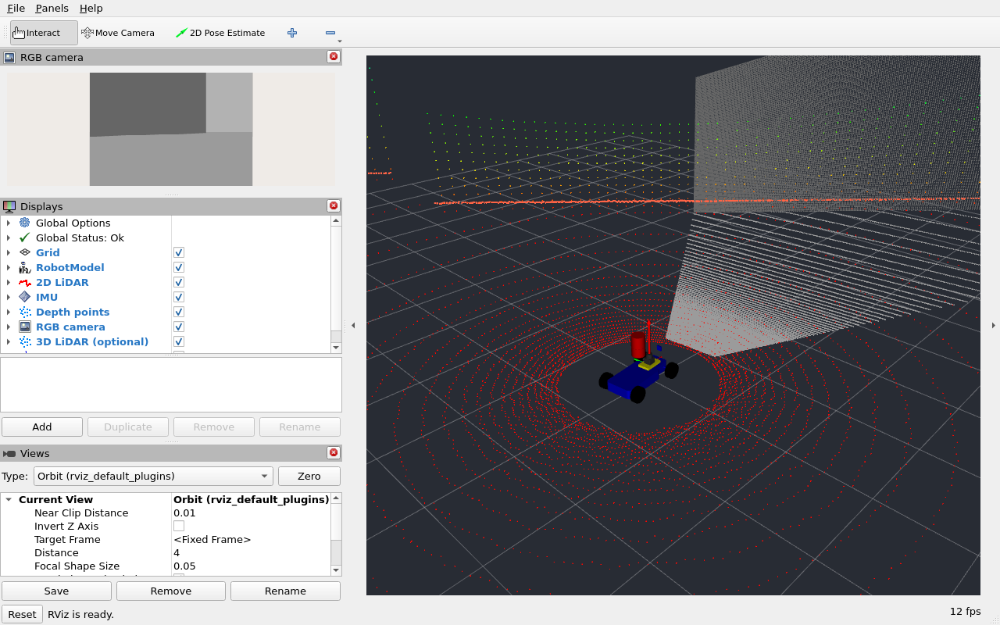

# F1TENTH 기본 구성 복원과 4륜 센서 실습 변경 기록

2026년 9월 8일 요청에 따라 `Humble` 브랜치의 F1TENTH 기본 실행과 센서 실습 차량을 수정했다. F1TENTH은 기존 Building Editor 맵에서 바퀴·IMU·2D 라이다로 시작하고, RGB-D 카메라와 3D 라이다를 각각 선택해 추가한다. 모든 센서를 다루는 `sensor_bot` 실습은 기존 4륜 Ackermann 로버를 기반으로 한다.

이 문서는 [9월 7일 재점검 기록](11_review.md) 이후 바뀐 구성과 검사 기준을 설명한다. 이전 기록의 2륜 센서 차량 화면과 F1 센서 시험용 월드의 거리값은 당시 구성에 해당한다. 현재 차량과 맵의 검증 근거로 사용하지 않는다.

## 1. F1TENTH에서 복원한 범위

복원 기준은 재점검 전 [d1b0169 커밋](https://github.com/kimhoyun-robotair/robotics-sim-tutorial-kr/commit/d1b01698b16af03616a62b414a132926989091a6)의 F1TENTH 실습이다. 맵, 생성 위치, 기본 센서 구성을 이 기준과 이번 요청에 맞췄다. 저장소 전체를 과거 커밋으로 되돌린 것은 아니다.

| 항목 | 현재 구성 |
|---|---|
| 기본 월드 | 기존 Building Editor 맵 `world/demomap_2/model.sdf` |
| 차량 생성 위치 | `x=0`, `y=0`, `z=0`, `yaw=0`인 월드 원점 |
| 차량 자산 | 기존 메시, 차축 위치, 바퀴 치수 사용 |
| 기본 센서 | 바퀴 관절 상태, IMU, 2D 라이다 |
| 추가 센서 | RGB-D·3D 라이다를 독립적으로 선택; 모두 기본값 `false` |
| 실행 파일 | `robot_spawn.launch.py`와 `display.launch.py`가 같은 기본 맵·센서 구성 사용 |

이전 재점검에서 추가한 F1 센서 시험용 월드와 차체 충돌 상자는 제거했다. 원본 파일에 켜져 있던 GPS는 이번에 지정한 기본 센서 구성에 맞춰 링크와 플러그인을 함께 끈다.

주행과 RViz 표시를 위해 필요한 수정은 유지했다. 메시 경로와 URDF material 위치, 조향 관절 한도, 실제 조인트 상태에 따른 단일 TF 발행, odometry, Classic 플러그인에 맞는 조향 명령 변환, 센서 프레임·카메라 보정값·QoS가 여기에 해당한다. 상세한 출처와 수정 범위는 [F1 패키지의 UPSTREAM.md](https://github.com/kimhoyun-robotair/robotics-sim-tutorial-kr/blob/Humble/ros2_ws/src/f1_robot_model/UPSTREAM.md)에 정리했다.

## 2. F1TENTH의 센서 옵션 네 가지

다음 네 구성은 모두 같은 Building Editor 맵과 원점을 사용한다. 기본 바퀴·IMU·2D 라이다는 항상 포함한다.

| 검사 이름 | 추가 센서 | `robot_spawn.launch.py`에 붙일 인자 |
|---|---|---|
| `basic` | 없음 | 추가 인자 없음 |
| `rgbd` | RGB-D 카메라 | `depth_camera:=true` |
| `lidar3d` | 3D 라이다 | `lidar_3d:=true` |
| `both` | RGB-D 카메라와 3D 라이다 | `depth_camera:=true lidar_3d:=true` |

예를 들어 두 센서를 함께 확인하려면 이전 Gazebo 실행을 종료한 뒤 다음 명령을 사용한다.

```bash
source /opt/ros/humble/setup.bash
source ~/robotics-sim-tutorial-kr/ros2_ws/install/setup.bash
ros2 launch f1_robot_model robot_spawn.launch.py \
  depth_camera:=true lidar_3d:=true
```

기본 제공 RViz 설정은 활성화한 센서에 맞춰 디스플레이를 켠다. RGB-D를 켜면 RGB 영상과 깊이 점군이, 3D 라이다를 켜면 해당 점군이 표시된다. 사용자가 직접 지정한 RViz 설정 파일은 수정하지 않는다.

| 데이터 | 토픽 | 좌표계 |
|---|---|---|
| 기본 IMU | `/imu/data` | `imu` |
| 기본 2D 라이다 | `/scan` | `laser` |
| RGB-D 영상·깊이·점군 | `/camera/image_raw`, `/camera/depth/image_raw`, `/camera/points` | `camera_link_optical` |
| 3D 라이다 점군 | `/lidar_3d/points` | `lidar_3d_link` |

카메라 점군은 optical 프레임의 **+Z 전방**, 라이다는 센서 프레임의 **+X 전방**이다. RViz에 점군이 나타나는 것과 올바른 방향에 표시되는 것은 별도로 확인한다. RGB-D 검사는 영상의 깊이와 CameraInfo로 계산한 3D 좌표를 실제 점군 좌표와 대조한다.

`basic` 검사에서는 선택 센서의 토픽이 발행되지 않는지도 확인한다. 나머지 세 구성도 켠 센서만 생성되고, 끈 카메라·라이다의 발행자가 남지 않아야 한다. 스테레오와 GPS의 기존 선택 기능은 유지하지만 기본값은 `false`이며 이번 네 구성의 실행 검증에는 포함하지 않는다.

수동으로 토픽과 화면을 확인하는 순서는 [F1TENTH 사용 안내](https://github.com/kimhoyun-robotair/robotics-sim-tutorial-kr/blob/Humble/F1TENTH_USERGUIDE.md)를 따른다.

## 3. 센서 실습 차량을 4륜 Ackermann으로 변경

`sensor_bot.urdf.xacro`는 기존 `rover_ackermann`과 같은 `macros/ackermann_rover.xacro`를 호출한다. 차체·바퀴·조향 관절·구동 플러그인을 공유하며, `all`, `cameras`, `lidars`, `minimal` 프로필 모두 이 4륜 차량을 사용한다. 앞바퀴 두 개가 조향하고 뒷바퀴가 차량을 구동한다.

| 항목 | 값 |
|---|---|
| 차체 길이 × 너비 × 높이 | 0.72 × 0.50 × 0.16 m |
| 바퀴 반지름 | 0.16 m |
| 앞뒤 차축 간격 / 좌우 바퀴 간격 | 0.56 m / 0.62 m |
| 차체 기준 높이 | `base_footprint → base_link`: 0.24 m |
| 주행 명령 | `/cmd_vel.linear.x`: 속도(m/s), `angular.z`: 조향각(rad) |
| 휠 오도메트리 | `/ackermann_odom`이 뒷바퀴 회전량과 앞바퀴 조향각을 적분 |
| 비교용 위치·궤적 | `/ground_truth/odom`, `/ground_truth_path` |

차동구동 로봇처럼 각속도만 주어 제자리 회전할 수는 없다. `{linear: {x: 0.15}, angular: {z: 0.20}}`은 천천히 전진하면서 왼쪽으로 조향하는 명령이다. 이 명령과 정지 방법은 [센서 실습 5.7절](05_sensors.md#57-ackermann)에 있다.

센서는 새 차체의 전면과 상단에 배치하고 지지대를 추가했다. 카메라의 optical 회전, 스테레오 간격, ROS 토픽 이름은 유지했다. 센서별 위치와 지면 기준 높이는 [센서 장착 위치 표](05_sensors.md#4_1)에서 확인할 수 있다.

| TF | 발행 담당 |
|---|---|
| `world → odom` | 실행 파일의 고정 TF 노드 |
| `odom → base_footprint` | `ackermann_odom` 단독 발행 |
| `base_footprint → base_link` | URDF를 읽는 `robot_state_publisher` |
| 차체 → 바퀴·조향부 | `/joint_states`를 읽는 `robot_state_publisher` |
| 차체 → 센서·광학 프레임 | 고정 관절을 읽는 `robot_state_publisher` |

Gazebo Ackermann 플러그인은 `/ground_truth/odom`을 발행하지만 odometry TF와 바퀴 TF는 발행하지 않는다. 이렇게 발행 역할을 나눠 같은 자식 프레임이 두 곳에서 갱신되는 문제를 방지한다. 센서용 RViz의 Fixed Frame은 `world`이며, 시점을 조정해 네 바퀴와 높아진 센서 장착부가 함께 보이도록 했다.

## 4. 검사 항목과 통과 기준

구현을 반영한 [7ee540b 커밋](https://github.com/kimhoyun-robotair/robotics-sim-tutorial-kr/commit/7ee540bc37893aa670ed81f5d615ec8a00db0ecc)을 대상으로 [GitHub Actions 실행 34187107192](https://github.com/kimhoyun-robotair/robotics-sim-tutorial-kr/actions/runs/34187107192)에서 빌드와 실제 실행을 검사한다. 아래 수치는 **실행 검사의 통과 기준**이며 측정 결과가 아니다.

| 대상 | 직진 검사 | 조향 검사 | 구성·센서 검사 |
|---|---|---|---|
| `sensor_bot`의 `all` | Gazebo 실제 이동 0.80 m 이상, 휠 odometry·Path 진행 0.75 m 이상 | 왼쪽 원호 주행에서 차체 요각 변화 0.12 rad 이상 | 네 바퀴·조향 관절, caster 없음, 전체 센서·TF·영상·점군 |
| F1의 네 구성 | Gazebo 실제 이동 0.20 m 이상, odometry 진행 0.15 m 이상 | 왼쪽 원호 주행에서 차체 요각 변화 0.12 rad 이상 | 기존 맵·원점, 선택한 센서만 생성, `/drive` 변환과 실제 주행 |

검사기는 실제 사용할 월드를 결과 폴더에 복사하고, 차량의 월드 좌표를 읽기 위한 상태 관찰용 플러그인을 추가한다. F1의 맵이나 장애물을 별도의 시험용 맵으로 바꾸지는 않는다. 바퀴가 도는 것에 더해 Gazebo에서 차량의 위치가 실제로 변하는지 확인한다. 센서 거리 검사는 현재 월드의 장애물 위치와 각 센서의 장착 위치를 사용한다.

센서 메시지의 시각이 계속 증가하고, 각 센서의 새로운 메시지 시각 세 개에서 연속으로 TF 변환이 가능한지 검사한다. 최신 TF 한 개만 조회해 메시지 시각의 변환 검사를 대신하지 않는다. IMU의 정지 가속도, 카메라 보정값, RGB-D 깊이·점군의 투영, 라이다의 거리와 수직 분포도 확인한다.

실제 실행에 앞서 센서 회귀 검사 36개와 거리 계산 검사 5개, 총 41개가 통과했다. 정적 검사기 회귀 검사도 18개가 통과했다. 이 결과만으로 Gazebo·RViz 실행까지 성공했다고 판단하지 않으며, 아래 실제 실행 기록과 화면을 함께 확인한다.

### 실제 실행에서 추가로 확인한 문제

Gazebo가 `model://f1_robot_model/meshes/...`를 찾지 못하는 경로 문제가 있었다. `package.xml`에 `gazebo_model_path="${prefix}/.."`를 등록해 설치된 패키지의 부모 폴더에서 메시를 찾도록 수정했다. 원본 메시 파일은 바꾸지 않았다. 검사기는 이제 Gazebo 로그의 메시 로딩 오류도 실패로 처리한다.

Building Editor 맵의 벽 끝 너머를 보는 RGB-D 픽셀은 8 m 측정 범위를 벗어날 수 있다. 이때 깊이와 점군의 `+inf`는 정상적인 범위 밖 표시다. [Classic 카메라 구현](https://github.com/ros-simulation/gazebo_ros_pkgs/blob/3.9.0/gazebo_plugins/src/gazebo_ros_camera.cpp)의 깊이·점군 처리와 대조했다. 투영 오차는 실제 벽이나 바닥이 보이는 네 지점에서 검사하고, 벽 너머의 픽셀은 현재 월드의 광선 교차점이 측정 범위 밖에 있는지와 무한대 반환 여부를 별도로 검사한다. 카메라 범위를 늘리거나 맵을 바꿔 통과시키지 않는다.

정적 검사에서는 `transmission`의 조인트 참조를 실제 조인트의 중복 정의와 구분하도록 수정했다. 실제 중복 조인트는 계속 오류로 처리하며, 정상 참조를 허용하는 경우와 중복을 거부하는 경우를 각각 회귀 검사로 확인한다.

## 5. 검증을 다시 실행하기

먼저 [환경 구성](01_setup.md)에 따라 ROS 2 Humble을 설치하고 전체 워크스페이스를 빌드한다. 검사에서는 F1과 기본 센서 차량의 패키지를 모두 사용한다. 실행 중인 Gazebo·조종 노드는 종료한다.

```bash
cd ~/robotics-sim-tutorial-kr/ros2_ws
source /opt/ros/humble/setup.bash
rosdep install --from-paths src --ignore-src -r -y --rosdistro humble
colcon build --symlink-install
source install/setup.bash
cd ..
sudo apt install -y python3-pytest python3-yaml xdotool imagemagick procps
python3 -m pytest -q scripts/test_humble_sensors.py scripts/test_runtime_geometry.py
python3 -m unittest discover -s tests -p 'test_validate_humble.py' -v
python3 scripts/validate_humble.py
```

다음은 화면이 있는 데스크톱 터미널에서 실행한다. 결과를 덮어쓰지 않도록 시각이 포함된 폴더를 만들고, 시나리오마다 하위 폴더를 따로 사용한다. 각 명령은 Gazebo와 RViz를 실행하고 검사 후 종료하므로 수동 launch를 함께 실행하지 않는다.

```bash
evidence_root="$PWD/ros2_ws/log/humble-revision-$(date +%Y%m%d_%H%M%S)"
mkdir -p "$evidence_root"
python3 scripts/check_humble_runtime.py --model sensor_bot --rviz \
  --evidence "$evidence_root/sensor_bot"

for sensors in basic rgbd lidar3d both; do
  python3 scripts/check_humble_runtime.py --model f1 --f1-sensors "$sensors" \
    --rviz --evidence "$evidence_root/f1_$sensors" || break
done
```

`sensor_bot` 검사는 `sensor_profile:=all`로 실행한다. F1의 `basic` 검사는 센서 옵션을 덧붙이지 않고 launch 기본값을 그대로 사용한다. 나머지 세 검사는 선택한 카메라·라이다 옵션만 켠다. 하나의 검사는 기본 제한 시간 300초 안에 수행하며, 종료 정리에는 추가 시간이 걸릴 수 있다.

화면이 없는 환경에서는 Xvfb를 사용한다. 아래는 F1의 두 센서 옵션을 함께 검사하는 예다. 같은 방식을 센서 차량이나 다른 F1 구성에도 적용할 수 있다.

```bash
sudo apt install -y xvfb xauth libgl1-mesa-dri libglx-mesa0
headless_evidence="$PWD/ros2_ws/log/f1-both-headless-$(date +%Y%m%d_%H%M%S)"
LIBGL_ALWAYS_SOFTWARE=1 QT_XCB_NO_MITSHM=1 \
  xvfb-run -a -s '-screen 0 1920x1200x24 -noreset' \
  python3 scripts/check_humble_runtime.py --model f1 --f1-sensors both --rviz \
    --evidence "$headless_evidence"
cat "$headless_evidence/result.json"
```

검사 폴더의 `result.json`에서 성공 여부와 오류를 읽는다. `launch.log`에는 실행 로그가 남고, 모델과 화면을 확보한 단계에서는 `robot.urdf`, `rviz.png`도 생성된다. ROS나 화면 환경을 찾지 못해 종료 코드 69가 나온 경우는 실행 검사를 수행하지 못한 것이다. 성공으로 처리하지 않는다.

```bash
# 앞의 데스크톱 예시에서 생성한 결과 확인
cat "$evidence_root/sensor_bot/result.json"
cat "$evidence_root/f1_basic/result.json"
```

자동 검사가 끝나면 각 `rviz.png`도 열어 차량·바퀴·센서의 방향, 영상·점군, Displays 상태를 확인한다. 초기 단계에서 실패하면 화면 파일이 없을 수 있으므로 그 경우 `result.json`과 `launch.log`의 첫 오류부터 확인한다.

## 6. 이번 검증에서 제외한 항목

F1의 스테레오·GPS 선택 기능 실행, AMCL 위치 추정 정확도, 자율주행 완주, 조이스틱과 실제 로봇 하드웨어는 이번 검증 범위에 포함하지 않는다. `sensor_bot`의 스테레오는 `all` 프로필의 검사에 포함한다. 모든 센서 프로필의 차량 구조는 정적 검사로 확인하고, 기본 센서 차량의 실제 실행은 `all` 프로필을 대상으로 한다. 다른 운영체제·그래픽 드라이버의 동작이나 실행 성능을 보장하는 검사도 아니다.

## 7. 실제 실행 결과와 RViz 화면

**2026년 9월 8일 실행 34187107192에서 8개 시나리오가 모두 통과했다.** 아래 결과와 화면은 모두 `7ee540b` 커밋을 실행한 같은 CI에서 얻었다. 이 문서와 결과 파일을 추가한 커밋은 실행 대상 코드의 커밋과 구분한다.

Ubuntu 22.04 컨테이너에서 Gazebo 11.10.2, `gazebo_ros_pkgs` 3.9.0, RViz 11.2.28, `rviz_imu_plugin` 2.1.5를 사용했다. Xvfb와 Mesa llvmpipe로 렌더링했다.

- 전체 8개 패키지 빌드와 URDF·SDF 검사 통과: 7,368개 확인, 경고 0개.
- 센서·거리 계산 회귀 검사 41개, 정적 검사기 회귀 검사 18개 통과.
- `colcon test-result`: 36건, 오류 0건, 실패 0건, 생략 1건. 생략 항목은 ament가 배포판의 cppcheck 2.7 문제로 건너뛴 검사다.
- 변경 대상 다섯 구성과 기존 `diffbot`, `rover_diff`, `rover_ackermann`의 실제 실행 모두 통과.

| 변경 대상 | 실제 직진 거리 | odometry 직진 거리 | 좌회전 요각 변화 | 메시지 시각별 TF를 확인한 센서 토픽 수 |
|---|---:|---:|---:|---:|
| 4륜 `sensor_bot`, `all` | 0.811 m | 0.830 m | 0.125 rad | 16 |
| F1 기본 구성 | 0.204 m | 0.202 m | 0.121 rad | 2 |
| F1 + RGB-D | 0.205 m | 0.205 m | 0.121 rad | 7 |
| F1 + 3D 라이다 | 0.201 m | 0.200 m | 0.121 rad | 3 |
| F1 + 두 센서 | 0.200 m | 0.200 m | 0.124 rad | 8 |

표는 각 단계의 통과 기준을 충족한 시점의 측정값이다. 직진과 좌회전은 순서대로 따로 측정하며, 시뮬레이션 실행 시점에 따라 수치가 조금 달라질 수 있다. 모든 대상에서 센서 토픽마다 서로 다른 새 메시지 시각 3개의 TF를 확인했다. 모든 오류 목록, 종료 후 남은 프로세스 목록, Gazebo 메시 로딩 오류 목록은 비어 있다.

4륜 센서 차량의 RGB-D 중앙 깊이는 5.513 m였고, 네 지점의 최대 점군 투영 오차는 0.000460 m였다. F1의 RGB-D 중앙 깊이는 두 구성 모두 4.777 m였으며 최대 투영 오차는 0.000002 m 이하였다. F1의 범위 밖 픽셀 `(200, 120)`이 보는 벽은 계산상 약 20.961 m 앞에 있어 8 m 측정 범위를 넘는다. 이 픽셀에서 깊이와 점군이 모두 무한대를 반환하는 것도 확인했다. 3D 라이다를 켠 F1 두 구성에서는 각각 7,001개의 유효 점과 여러 수직 층을 확인했다.

원본 검사 결과 8개, 패키지 버전, 센서별 TF 진단과 화면 검토 결과는 [validation-results.json](assets/humble-revision/validation-results.json)에 보관했다. 전체 실행 로그는 [CI의 `humble-classic-validation` 아티팩트](https://github.com/kimhoyun-robotair/robotics-sim-tutorial-kr/actions/runs/34187107192)에서 확인할 수 있다.

아래 다섯 이미지는 실제 RViz 창을 그대로 캡처한 원본이다. 모두 `Global Status: Ok`를 확인했고, 차량·영상·점군과 센서 옵션별 표시 상태를 직접 검토했다. 자동 캡처만으로 화면 검토를 대체하지 않았다. 원본 JSON의 `rviz_capture.review`는 캡처 직후 상태를 그대로 보존하고, 별도 `visual_review`에 화면을 검토한 결과를 기록했다.

### 4륜 Ackermann 센서 차량

네 바퀴와 앞바퀴 조향 구조, 센서 지지대가 보인다. 영상 패널과 점군, IMU, 주행 궤적도 함께 표시된다. IMU의 위쪽 화살표는 정지 가속도에 포함된 중력을 나타낸다.



### F1TENTH 기본 구성

차량과 IMU·2D 라이다만 표시된다. RGB-D·3D 라이다 표시 항목은 꺼져 있고, 해당 센서 발행자도 없다.



### F1TENTH + RGB-D

RGB 영상과 깊이 점군이 추가되고 3D 라이다 표시는 꺼져 있다. 원래 맵의 회색 벽과 바닥이 카메라 영상과 점군에서 확인된다.



### F1TENTH + 3D 라이다

여러 높이의 라이다 점들이 나타나며 RGB-D 표시는 꺼져 있다.



### F1TENTH + RGB-D·3D 라이다

RGB 영상, 깊이 점군과 3D 라이다가 동시에 표시된다. 두 센서 옵션을 함께 켰을 때도 기존 맵과 차량 구성을 유지한다.


