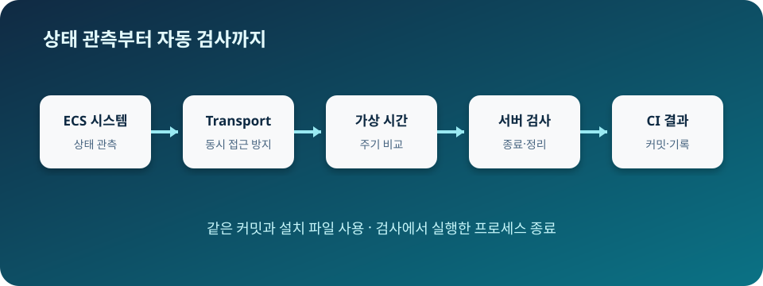

# 고급: Gazebo 확장과 자동 검증

> **난이도:** 고급  
> **Gazebo:** Harmonic  
> **ROS 2:** Jazzy  
> **선행 학습:** [중급 프로젝트](../intermediate/project-autonomous-bot.md)

## 과정 목표

이 과정은 `tutorial_bot`의 동작을 바꾸지 않는 진단용 System Plugin을 중심으로, ECS 관측부터 CI 증거까지 하나의 재현 가능한 경로를 만듭니다. 완료하면 다음을 할 수 있습니다.

- entity와 component를 simulation update 경계에서 안전하게 읽습니다.
- Transport callback과 simulation thread 사이의 소유권을 분리합니다.
- host 속도 대신 simulation time과 실제 표본으로 물리 결과를 비교합니다.
- 설치 산출물만으로 headless nominal·fault·timeout·cleanup을 판정합니다.
- 같은 source SHA에서 문서와 runtime 증거를 독립적으로 재생성합니다.

<figure class="course-figure" id="advanced-course-architecture" style="box-sizing: border-box; max-width: 100%; overflow-x: auto; padding-bottom: 0.5rem; width: 100%;">
  <span style="display: block; font-size: 0.75rem;">모바일에서는 도식을 좌우로 스크롤하세요.</span>
  
  <figcaption>그림 1. ECS 관측은 Transport와 simulation time 검증을 거쳐 headless·CI 증거로 전달됩니다.</figcaption>
</figure>

## 학습 경로

1. [ECS System Plugin](01-ecs-system-plugin.md)
2. [Transport 인터페이스](02-transport-interfaces.md)
3. [물리와 주기 디버깅](03-physics-debugging.md)
4. [Headless 통합 테스트](04-headless-integration.md)
5. [CI 재현성](05-ci-reproducibility.md)
6. [Production Stack 프로젝트](project-production-stack.md)

## 설치 산출물 확인

아래 블록은 source workspace의 파일을 읽지 않습니다. Task 13 검증기는 fresh build 뒤 `TUTORIAL_INSTALL_BASE`를 설정합니다.

<!-- course-command -->
```bash
: "${TUTORIAL_INSTALL_BASE:?fresh install 경로가 필요합니다}"
test -f "$TUTORIAL_INSTALL_BASE/tutorial_bot_plugins/lib/libTutorialBotDiagnosticsSystem.so"
test -f "$TUTORIAL_INSTALL_BASE/tutorial_bot_gazebo/share/tutorial_bot_gazebo/worlds/advanced-diagnostics.sdf"
printf 'advanced-install=ready\n'
```

예상 출력은 `advanced-install=ready`이며, 앞선 두 파일 검사가 실패하면 출력 전에 종료합니다.

## 문제 해결

라이브러리가 없으면 `tutorial_bot_plugins`가 fresh build에 포함되었는지 확인합니다. world가 없으면 `tutorial_bot_gazebo`의 install 규칙을 확인하고, 이전 install을 재사용하지 말고 새 install base로 다시 빌드합니다.

## 출처

- [Gazebo Sim: Create System Plugins](https://gazebosim.org/api/sim/8/createsystemplugins.html)
- [Gazebo Transport tutorials](https://gazebosim.org/api/transport/13/tutorials.html)
- [ROS 2 Jazzy documentation](https://docs.ros.org/en/jazzy/)

[선행 과정](../intermediate/project-autonomous-bot.md) · [다음: ECS System Plugin](01-ecs-system-plugin.md)
