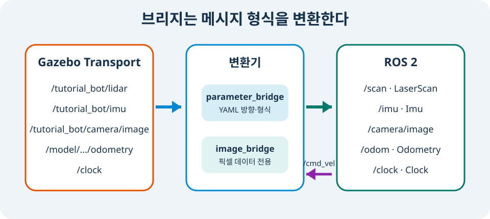

# Gazebo와 <span class="course-nowrap">ROS 2</span> 연결

> **난이도:** 초급  
> **Gazebo:** Harmonic  
> **ROS 2:** Jazzy  
> **선행 학습:** Gazebo Fuel

## 학습 목표

- ROS 2 DDS topic과 Gazebo Transport topic의 역할을 구분합니다.
- YAML로 ROS → Gazebo와 Gazebo → ROS bridge를 설정합니다.
- `/cmd_vel`, `/odom`, `/scan`, `/imu`, Camera, `/clock`의 실제 전달을 확인합니다.

## 배경 지식

Gazebo는 내부 통신에 Gazebo Transport를 사용하고 ROS 2는 DDS를 사용합니다. 같은 이름의 topic이라도 두 통신 계층은 자동으로 연결되지 않습니다. `ros_gz_bridge`는 지정한 메시지 형식과 방향에 따라 두 계층 사이에서 메시지를 변환합니다.

이 예제에서는 ROS 2의 `/cmd_vel`을 Gazebo의 `/model/tutorial_bot/cmd_vel`로 보내고, Gazebo의 odometry·LiDAR·IMU·clock을 ROS 2 topic으로 가져옵니다. Camera는 이미지 전용 도구인 `ros_gz_image`로 ROS 2 `sensor_msgs/msg/Image`를 발행합니다.

<figure class="course-figure" markdown="span">
  
  <figcaption>그림 6. 일반 메시지는 <code>parameter_bridge</code>, 픽셀 데이터는 <code>image_bridge</code>를 거칩니다. <code>/cmd_vel</code>만 반대 방향으로 흐릅니다.</figcaption>
</figure>

<pre class="course-mermaid">
flowchart LR
  G[Gazebo Transport] --> P[parameter_bridge]
  G --> I[image_bridge]
  P --> R[ROS 2 sensor topics]
  I --> C[ROS 2 image topic]
  R --> P --> G
</pre>

## 예제 파일

Bridge YAML은 실제 ament package에 있습니다.

`examples/ros2_ws/src/tutorial_bot_bringup/config/bridge.yaml`

IMU와 센서 System 설정은 기존 `tutorial_bot` Xacro와 world 원본에 누적됩니다.

`examples/ros2_ws/src/tutorial_bot_description/urdf/tutorial_bot.urdf.xacro`

`examples/gazebo/worlds/first-world.sdf`

통합 headless 검증은 다음 스크립트가 담당합니다.

`scripts/check_ros_gz_bridge.sh`

## dependency preflight

실행 전에 필요한 ROS package가 설치됐는지 확인합니다. checker도 같은 preflight를 수행하며, 누락된 package 이름과 설치 명령을 함께 출력합니다.

```bash
for package in ros_gz_bridge ros_gz_image xacro; do
  ros2 pkg prefix "$package" >/dev/null || {
    echo "누락: $package"
    echo "설치: sudo apt install ros-jazzy-${package//_/-}"
  }
done
```

예를 들어 `ros_gz_image`가 없으면 `image_bridge`를 시작한 뒤 기다리는 대신 즉시 `sudo apt install ros-jazzy-ros-gz-image`를 안내해야 합니다. 이는 실행 중 timeout과 설치 누락을 구분합니다.

## Bridge YAML 읽기

`bridge.yaml`의 한 항목은 ROS topic, Gazebo topic, 두 메시지 형식, 방향을 정의합니다.

```yaml
- ros_topic_name: "/cmd_vel"
  gz_topic_name: "/model/tutorial_bot/cmd_vel"
  ros_type_name: "geometry_msgs/msg/Twist"
  gz_type_name: "gz.msgs.Twist"
  direction: ROS_TO_GZ
```

`ROS_TO_GZ`는 ROS 발행자를 Gazebo 구독자로 연결합니다. 반대로 LiDAR와 IMU 항목의 `GZ_TO_ROS`는 Gazebo sensor 메시지를 ROS로 보냅니다. Sensor data에는 `SENSOR_DATA`, `/clock`에는 `CLOCK` QoS profile을 지정했습니다.

메시지 anatomy는 “주소, 형식, 방향” 세 칸으로 읽으면 됩니다. `/tutorial_bot/lidar` + `gz.msgs.LaserScan` + `GZ_TO_ROS`가 `/scan` + `sensor_msgs/msg/LaserScan`으로 바뀝니다. 내부 전송 세부보다 YAML에서 이 세 값이 정확한지가 초급 단계의 핵심입니다.

## 실행

저장소 루트에서 전체 전달 경로를 검증합니다.

```bash
./scripts/check_ros_gz_bridge.sh
```

스크립트는 headless Gazebo에 `tutorial_bot`을 spawn하고, `parameter_bridge`와 `image_bridge`를 시작합니다. ROS `/cmd_vel`에 `linear.x = 0.2`를 한 번 발행한 뒤, ROS 쪽의 odometry·LiDAR·Camera·IMU·clock을 확인합니다.

정상 출력 예시는 다음과 같습니다.

```text
ROS cmd_vel to Gazebo verified: odom x=0.40..., linear.x=0.20...
Gazebo sensors to ROS verified: scan=360, image=320x240, IMU and clock received.
```

`scan` 숫자는 ROS CLI가 출력한 수신 range 항목 수입니다. 정상 검증은 성공 문구가 아니라 `/scan`의 360개 값과 `angle_min/max`, `range_min/max`, Camera의 320×240 geometry, IMU field, 증가하는 `/clock`을 파싱합니다.

## 직접 실행하기

Gazebo가 이미 실행되고 `tutorial_bot`이 spawn된 상태라면, 다른 terminal에서 YAML bridge를 시작할 수 있습니다.

```bash
source /opt/ros/jazzy/setup.bash
ros2 run ros_gz_bridge parameter_bridge --ros-args \
  -p config_file:=examples/ros2_ws/src/tutorial_bot_bringup/config/bridge.yaml
```

Camera는 별도 terminal에서 연결합니다.

```bash
source /opt/ros/jazzy/setup.bash
ros2 run ros_gz_image image_bridge /tutorial_bot/camera/image
```

그 다음 ROS 2에서 속도 명령과 sensor topic을 확인합니다.

```bash
ros2 topic pub --once /cmd_vel geometry_msgs/msg/Twist '{linear: {x: 0.2}}'
ros2 topic echo --once /scan sensor_msgs/msg/LaserScan
ros2 topic echo --once /imu sensor_msgs/msg/Imu
ros2 topic echo --once /clock rosgraph_msgs/msg/Clock
```

## 결과 확인

Bridge가 실행되면 ROS 2 topic 목록에 다음이 나타납니다.

```text
/clock
/cmd_vel
/odom
/scan
/imu
/tutorial_bot/camera/image
```

`/odom`의 `pose.pose.position.x`가 양수이고 `twist.twist.linear.x`가 약 `0.2`이면, ROS 명령이 Gazebo DiffDrive와 ROS odometry까지 왕복한 것입니다.

## 자주 발생하는 문제

### ROS topic이 나타나지 않습니다

Gazebo sensor topic이 먼저 생긴 뒤 bridge를 실행했는지와 YAML의 `gz_topic_name`을 확인합니다. ROS topic 이름과 Gazebo topic 이름은 이 예제처럼 다를 수 있습니다.

### Camera topic에 이미지가 없습니다

Camera는 `ros_gz_bridge` YAML 항목이 아니라 `ros_gz_image image_bridge`가 처리합니다. `gz sim`의 렌더 엔진과 `/tutorial_bot/camera/image` topic 존재 여부도 확인합니다.

### 시간이 벽시계와 다릅니다

`/clock`은 simulation time입니다. simulation이 일시 정지되면 이 시계도 멈추고, 빠르게 계산되면 벽시계와 다른 속도로 갑니다. 이후 ROS node를 만들 때는 `use_sim_time`을 사용해 센서 timestamp와 같은 기준으로 시간을 맞춥니다.

## 정리

ROS 2와 Gazebo는 bridge를 통해 명시적으로 연결됩니다. 다음 마지막 초급 프로젝트에서는 이 경로와 `tutorial_bot`의 모든 기능을 함께 검증합니다.
