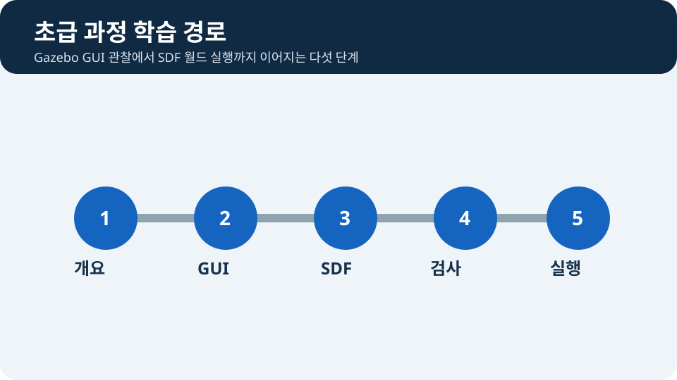

# 초급: Gazebo Sim으로 `tutorial_bot` 시작하기

> **난이도:** 초급  
> **Gazebo:** Harmonic  
> **ROS 2:** Jazzy  
> **선행 학습:** 시작하기

## 목표

초급 과정에서는 먼저 Gazebo GUI에서 simulation time과 entity를 관찰합니다. 그다음 SDF world의 구조를 살펴보고 직접 실행합니다. 이어서 같은 `tutorial_bot`에 바퀴·DiffDrive·LiDAR·카메라·IMU를 추가하고 `ros_gz_bridge`로 ROS 2에 연결합니다.

<figure class="course-figure">
  
  <figcaption>그림 1. 초급 기초 과정은 개요, GUI, SDF, 검사, 실행의 순서로 진행합니다.</figcaption>
</figure>

## 장 구성

1. Gazebo Server와 GUI의 역할, simulation time, RTF를 익힙니다.
2. Entity Tree와 Component Inspector에서 이름과 pose를 교차 확인합니다.
3. SDF의 `world → model → link` 계층과 `visual`·`collision`을 읽습니다.
4. 첫 world를 검사한 뒤 GUI와 server-only 모드로 실행합니다.
5. URDF/Xacro로 로봇을 만들고 센서와 ROS 2 연결로 확장합니다.

<pre class="course-mermaid">
flowchart TB
    A[Gazebo 실행 모델] --> B[GUI 관찰]
    B --> C[SDF 구조]
    C --> D[문법 검사]
    D --> E[first_world 실행]
</pre>

## 시작 전 확인

저장소 루트에서 다음 파일이 존재하는지 확인합니다.

```bash
test -f examples/gazebo/worlds/first-world.sdf
```

아무 출력 없이 종료 코드가 `0`이면 준비가 끝난 것입니다. [Gazebo Sim 개요](01-gazebo-overview.md)부터 차례대로 진행하세요.

## 기초 과정에서 확인할 결과

- GUI의 Entity Tree에 `ground`, `training_box`, `beacon`이 표시됩니다.
- `gz sdf -k`가 `Valid.`를 출력합니다.
- 재생 후 빨간 상자는 바닥 위에 놓이고 파란 beacon은 움직이지 않습니다.
- GUI에서 바꾼 상태와 SDF 파일에 저장한 상태의 차이를 설명할 수 있습니다.

## 막히면

GUI가 열리지 않거나 렌더링이 깨지면 [문제 해결](../getting-started/troubleshooting.md)을 먼저 확인합니다. 명령은 모두 저장소 루트에서 실행하며, 상대 경로가 다르면 `pwd`로 현재 위치를 확인합니다.

## 첫 실습

[SDF 기초](03-sdf-basics.md)와 [첫 World](04-first-world.md)에서 순수 Gazebo 예제를 실행합니다. 이어서 [첫 Robot](05-first-robot.md)과 [바퀴와 Joint](06-joints.md)에서 이동 기반 `tutorial_bot`을 만듭니다.
