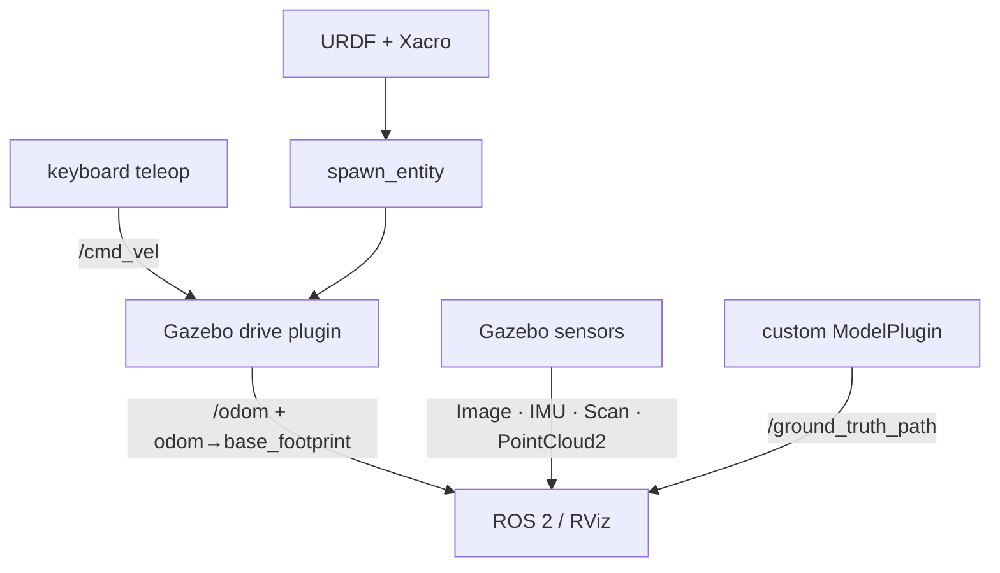

# ROS 2 Humble × Gazebo Classic 11

이 과정의 목표는 “Gazebo 창에 로봇이 보인다”보다 한 단계 더 구체적이다. 학습을 마치면 직접 만든 URDF/Xacro 로봇이 물리적으로 안정되게 움직이고, ROS 2 토픽과 TF가 연결되며, 센서 데이터와 wheel odometry 궤적을 RViz에서 스스로 검증할 수 있어야 한다.

## 완성할 시스템

## 과정에서 지키는 기준

- 모든 명령은 Ubuntu 22.04와 ROS 2 Humble을 기준으로 설명한다.
- `gazebo`라는 명령을 쓰는 **Gazebo Classic 11**을 사용한다. `gz sim`을 쓰는 새 Gazebo와 플러그인·launch 형식이 다르다.
- 모델에는 `visual`뿐 아니라 `collision`, `inertial`, joint limit와 마찰을 함께 정의한다.
- “토픽이 존재한다”와 “RViz에서 올바른 frame으로 보인다”를 구분해 검증한다.
- Gazebo의 simulation time을 사용하는 모든 ROS 노드에 `use_sim_time:=true`를 적용한다.
- wheel odometry와 ground truth를 서로 다른 값으로 취급한다. 전자는 바퀴 운동학 추정이고, 후자는 시뮬레이터가 아는 실제 pose이다.

## 권장 학습 순서

| 단계 | 문서 | 완료 기준 |
| --- | --- | --- |
| 1 | [환경 구성](01_setup.md) | Gazebo 11과 ROS 패키지 버전을 확인한다 |
| 2 | [URDF·Xacro·SDF](02_urdf_xacro_sdf.md) | 세 형식의 책임과 변환 경계를 설명한다 |
| 3 | [2륜 로봇](03_diffbot.md) | 사각형으로 주행하고 `/wheel_odom_path`를 본다 |
| 4 | [4륜 rover](04_rover.md) | skid와 Ackermann 궤적 차이를 비교한다 |
| 5 | [센서](05_sensors.md) | 각 메시지를 RViz에서 올바른 frame으로 본다 |
| 6 | [TF와 RViz](06_tf_rviz.md) | TF tree와 동적/정적 변환의 출처를 찾는다 |
| 7 | [커스텀 플러그인](07_custom_plugin.md) | 직접 빌드한 `.so`가 Path를 publish한다 |
| 8 | [디버깅](08_debugging.md) | 시간·QoS·TF·물리 문제를 분리 진단한다 |

각 장의 명령은 저장소를 `Humble` 브랜치로 clone하고 `ros2_ws`를 빌드했다는 전제로 작성한다. 처음이라면 환경 구성부터 순서대로 진행한다.

!!! warning "Gazebo Classic의 수명"
    Gazebo Classic은 2025년 1월에 공식 지원이 종료되었다. 이 튜토리얼은 ROS 2 Humble 기반의 기존 시스템을 재현하고 유지보수하는 데 초점을 둔다. 새 제품을 시작한다면 최신 ROS 2와 새 Gazebo의 지원 조합도 검토한다.

## 구성 참고 범위

주제의 배열과 실습의 점진적인 전개는 MOGI-ROS의 [Week-3-4-Gazebo-basics](https://github.com/MOGI-ROS/Week-3-4-Gazebo-basics)와 [Week-5-6-Gazebo-sensors](https://github.com/MOGI-ROS/Week-5-6-Gazebo-sensors)를 교육 구성 참고 자료로 삼았다. 두 자료는 새 Gazebo/Harmonic 계열을 대상으로 하므로 이 브랜치의 ROS 연동 방식이나 플러그인 코드를 그대로 적용할 수 없다. 본 튜토리얼은 해당 문구나 코드를 복제하지 않고, 개념과 학습 순서만 참고하여 ROS 2 Humble과 Gazebo Classic 11에 맞게 독립적으로 구성한다. Ackermann 구동, stereo 카메라, C++ 커스텀 플러그인 실습은 이 과정의 목표에 맞추어 별도로 설계한다.
