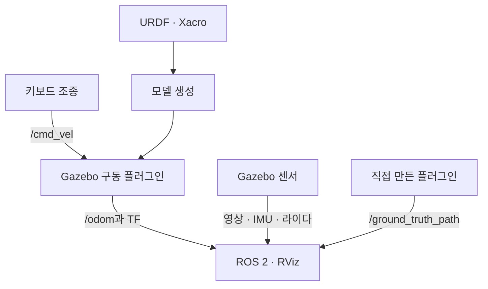

# ROS 2 Humble × Gazebo Classic 11

이 과정에서는 URDF/Xacro로 로봇을 만들고 Gazebo Classic 11에서 움직여 본다. 키보드로 주행 명령을 보내고, 센서 데이터와 바퀴 회전량으로 계산한 궤적을 RViz에서 확인한다. 마지막에는 직접 만든 C++ 플러그인으로 시뮬레이터의 실제 이동 경로를 출력한다.

**Gazebo가 처음이라면 [환경 구성](01_setup.md)부터 차례로 진행한다.** 이 문서는 Ubuntu 22.04와 ROS 2 Humble을 사용하며, 모든 실행 파일은 저장소의 `Humble` 브랜치를 기준으로 한다.

## 먼저 알아둘 용어

| 용어 | 이 과정에서의 뜻 |
| --- | --- |
| Gazebo | 중력·접촉·센서를 계산하며 로봇을 움직이는 시뮬레이터 |
| 월드(world) | 지면, 조명, 장애물, 로봇을 배치하는 가상 환경 |
| ROS 2 노드 | 제어·센서 처리 등 한 가지 작업을 맡는 실행 프로그램 |
| 토픽(topic) | 노드가 이름과 메시지 형식을 정해 데이터를 주고받는 통로 |
| TF | 차체·바퀴·센서 좌표계 사이의 위치·방향 관계 |
| RViz | ROS 2로 들어온 모델·센서·좌표계·경로를 보여 주는 화면 |
| 휠 오도메트리(wheel odometry) | 바퀴 회전량으로 추정한 로봇의 이동량·위치 |
| 기준 위치(ground truth) | 시뮬레이터가 계산한 실제 위치. 추정값과 비교할 때 사용 |

RViz 자체가 로봇의 움직임이나 센서 값을 계산하지는 않는다. Gazebo와 ROS 2 노드가 만든 데이터를 TF에 맞춰 화면에 그린다.

## 완성할 시스템

## 학습 순서와 완료 기준

| 단계 | 문서 | 완료 기준 |
| --- | --- | --- |
| 1 | [환경 구성](01_setup.md) | Gazebo 11과 ROS 패키지를 설치하고 버전을 확인한다 |
| 2 | [URDF·Xacro·SDF](02_urdf_xacro_sdf.md) | 세 형식의 역할을 구분하고 모델을 변환·검사한다 |
| 3 | [2륜 로봇](03_diffbot.md) | 로봇을 주행하고 `/wheel_odom_path`를 확인한다 |
| 4 | [4륜 로버](04_rover.md) | 차동구동과 Ackermann 조향의 움직임을 비교한다 |
| 5 | [센서](05_sensors.md) | 카메라·라이다·IMU를 올바른 좌표계로 표시한다 |
| 6 | [TF와 RViz](06_tf_rviz.md) | 정적·동적 좌표 변환을 어떤 노드가 발행하는지 찾는다 |
| 7 | [플러그인 만들기](07_custom_plugin.md) | 직접 빌드한 `.so` 파일로 실제 이동 경로를 발행한다 |
| 8 | [문제 해결](08_debugging.md) | 시간·통신 설정·TF·물리 문제를 나누어 진단한다 |

예제는 모델의 외형뿐 아니라 충돌 형상·질량·관성·관절·마찰을 함께 정의한다. 각 단계에서는 토픽 이름만 확인하는 데 그치지 않고, 데이터가 계속 들어오는지와 RViz의 위치·방향이 맞는지까지 확인한다. 시뮬레이션 시간을 사용하는 노드는 `use_sim_time:=true`로 설정한다.

!!! note "Gazebo Classic과 새 Gazebo 구분"
    이 과정은 `gazebo` 명령을 사용하는 **Gazebo Classic 11** 전용이다. `gz sim`을 사용하는 새 Gazebo와는 플러그인과 실행 설정이 다르다. Gazebo Classic은 2025년 1월에 공식 지원이 종료됐으며, 이 과정은 기존 Humble 시스템 학습·유지보수에 초점을 둔다. [공식 안내](https://classic.gazebosim.org/)에서 지원 종료 정보를 확인할 수 있다.
