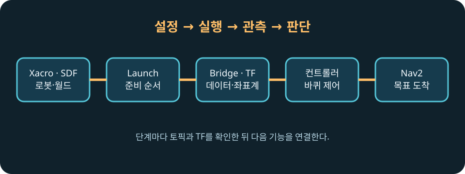

# 중급 과정: ROS 2 통합

> **난이도:** 중급  
> **Gazebo:** Harmonic  
> **ROS 2:** Jazzy  
> **선행 학습:** 초급 프로젝트

## 학습 목표

- 하나의 Xacro 로봇 원본을 Gazebo와 ROS 2에서 함께 사용합니다.
- launch, bridge, TF, `ros2_control`, 센서, 다중 로봇, Nav2를 하나의 흐름으로 연결합니다.
- 저장소의 자동 검증 스크립트로 관찰 결과를 재현합니다.

## 배경 지식

이 과정은 Gazebo Classic이 아니라 **Gazebo Harmonic**과 `ros_gz` 계열 패키지를 사용합니다. 로봇의 원본은 URDF/Xacro이며, SDF는 world와 Gazebo 고유 물리·센서 설정에 사용합니다. 같은 로봇을 별도 SDF 원본으로 중복 관리하지 않습니다.

[선행 과정: 초급 프로젝트](../beginner/project-tutorial-bot.md)

<figure class="course-figure" id="intermediate-course-dataflow">
  
  <figcaption>그림 1. 중급 과정에서 모델, 실행, 관측, 제어, 자율주행이 이어지는 전체 구조입니다.</figcaption>
</figure>

## 구조를 따라 계산하기

<div class="course-worked" data-worked-example="course-dataflow">
한 단계의 출력 집합을 \(O_k\), 다음 단계의 필수 입력 집합을 \(I_{k+1}\)라 두면 연결 조건은 \(I_{k+1}\subseteq O_k\)입니다. 예를 들어 TF 장의 출력 `odom → base_link`와 `/scan` frame은 Nav2의 입력입니다. checker는 단순 실행 문구 대신 이 집합의 토픽, frame, lifecycle 상태를 파싱합니다.
</div>

## 과정 구성

1. [고급 SDF](01-advanced-sdf.md)
2. [URDF·Xacro·SDF](02-urdf-xacro-sdf.md)
3. [ROS 2 Launch](03-ros2-launch.md)
4. [Robot Spawn](04-spawn-model.md)
5. [`ros_gz_bridge` 심화](05-bridge-yaml.md)
6. [TF·Joint State·RViz](06-tf-rviz.md)
7. [`gz_ros2_control`](07-gz-ros2-control.md)
8. [센서 심화](08-advanced-sensors.md)
9. [다중 로봇](09-multi-robot.md)
10. [Nav2 연동](10-nav2.md)
11. [프로젝트: 자율주행 `tutorial_bot`](project-autonomous-bot.md)

## 공통 예제 파일

- 로봇 원본: `examples/ros2_ws/src/tutorial_bot_description/urdf/tutorial_bot.urdf.xacro`
- 단일 로봇 launch: `examples/ros2_ws/src/tutorial_bot_bringup/launch/simulation.launch.py`
- 다중 로봇 launch: `examples/ros2_ws/src/tutorial_bot_bringup/launch/multi_robot.launch.py`
- 학습 world: `examples/ros2_ws/src/tutorial_bot_gazebo/worlds/training.sdf`

## 실행 준비

`colcon build`는 소스 패키지를 빌드하지만 `package.xml`에 선언된 ROS 2·시스템 의존성을 설치하지는 않습니다. 저장소 루트에서 워크스페이스로 이동한 뒤, 먼저 `rosdep`으로 의존성을 설치하고 빌드합니다.

```bash
cd examples/ros2_ws
rosdep install --from-paths src --ignore-src --rosdistro jazzy -r -y
colcon build --packages-select tutorial_bot_description tutorial_bot_gazebo tutorial_bot_control tutorial_bot_bringup \
  --cmake-args -DPython3_EXECUTABLE=/usr/bin/python3
source install/setup.bash
cd ../..
```

## 결과 확인

각 장은 “실행 → 결과 확인 → 동작 원리 → 문제 해결” 순서로 진행합니다. 자동 검증은 headless 환경에서도 실제 토픽, TF, controller, action 결과를 검사합니다.

## 동작 원리

앞 장의 출력이 다음 장의 입력이 됩니다. Xacro와 SDF가 모델·world를 만들고, launch가 프로세스를 조립하며, bridge와 TF가 데이터를 연결하고, controller와 Nav2가 로봇의 운동을 완성합니다.

## 문제 해결

의존성이 없다는 오류가 나오면 `examples/ros2_ws`에서 위 `rosdep install` 명령을 다시 실행하고 `rosdep check --from-paths src --ignore-src --rosdistro jazzy`로 확인합니다. 빌드한 패키지를 찾지 못하면 새 터미널에서 `examples/ros2_ws/install/setup.bash`를 다시 source합니다. Gazebo Classic 명령인 `gazebo`나 `ign gazebo` 대신 Harmonic의 `gz sim` 및 `ros_gz_*` 도구를 사용해야 합니다.

## 정리

중급 과정은 초급 로봇을 재작성하지 않고, 검증된 Xacro 원본 위에 실제 ROS 2 시뮬레이션 스택을 단계적으로 올립니다.
