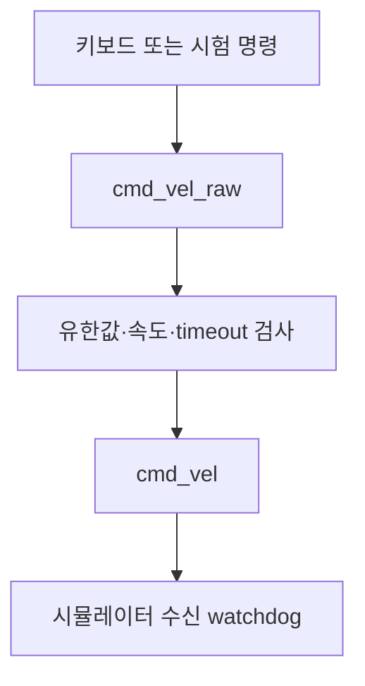

# 34. 조종 명령의 제한과 timeout 정지

[전체 목차](../../README.md) · [이전](33-project6-ros-loop.md) · [다음](35-rosbag-nav2.md)

## 이번 단계에서 할 일

키보드나 Nav2가 보낸 명령을 로봇에 전달하기 전에 속도 제한과 수신 timeout을 적용한다. 33단계의 직육면체 장면으로 먼저 시험한다. 로봇 모델에 잘못된 큰 명령이 들어오는 문제와 메시지가 끊겼는데 마지막 속도가 남는 문제를 나누어 다룬다.

속도 제한만으로 장애물 충돌을 막을 수는 없다. 이번 guard는 장애물을 보지 않으며, 시뮬레이션 통신 실습용이다. 실제 로봇에는 수신 장치 내부의 watchdog과 별도 비상정지 체계가 필요하다.

## 1. 명령 통로를 하나로 만든다



33단계의 `ros_goal.py`는 종료한다. 터미널 A에서 `07_ros_scene.py`가 실행 중인지 확인하고, 터미널 B에서 다음 relay를 실행한다.

```bash
python3 scripts/ros_drive_guard.py \
  --input /tutorial/cmd_vel_raw --output /tutorial/cmd_vel \
  --timeout 0.5 --linear-limit 0.2 --angular-limit 0.6
```

입력과 출력 토픽을 같은 이름으로 지정하면 자기 메시지를 다시 받아 반복하는 구조가 된다. 프로그램은 이 설정을 오류로 처리한다. `ros2 topic info /tutorial/cmd_vel --verbose`에서 **운동 명령 publisher가 guard 하나인지** 확인한다. zero를 보내는 guard와 nonzero를 보내는 다른 controller가 동시에 있으면 정지와 이동이 번갈아 나타난다.

## 2. 의도적으로 큰 명령을 넣어 제한을 관찰한다

터미널 C에서 시험 명령을 **3초만** 보낸다.

```bash
timeout 3s ros2 topic pub --rate 10 /tutorial/cmd_vel_raw geometry_msgs/msg/Twist \
  '{linear: {x: 2.0}, angular: {z: 1.5}}'
```

입력은 2.0 m/s와 1.5 rad/s지만, 출력은 최대 0.2 m/s와 0.6 rad/s가 된다. 다른 터미널에서 다음처럼 확인한다.

```bash
ros2 topic echo /tutorial/cmd_vel --once
ros2 topic echo /tutorial/odom --once --field twist
```

명령 입력이 끝나면 guard는 0.5초 후 0 속도를 반복 발행한다. 시뮬레이터 자체에도 0.5초 watchdog이 있으므로 guard 프로세스가 종료되더라도 이전 명령을 계속 적용하지 않도록 한다. 임의의 로봇 공식 샘플에 이 receiver watchdog이 이미 있다고 가정하면 안 된다.

## 3. 제한 함수와 시간 기준을 읽는다

[ros_drive_guard.py](../../scripts/ros_drive_guard.py)의 핵심은 다음과 같다.

```python
def bounded(value, limit):
    if not math.isfinite(value):
        return 0.0
    return max(-limit, min(limit, value))

if time.monotonic() - last_receive_time > timeout:
    output = Twist()
else:
    output.linear.x = bounded(input_linear, 0.2)
    output.angular.z = bounded(input_angular, 0.6)
```

실제 수신 callback에서는 선속도나 각속도 중 하나라도 NaN/Inf이면 둘 다 0으로 만든다. `linear.y`, `linear.z`, `angular.x`, `angular.y`도 0으로 유지한다. 평면 주행 모델이 받지 않는 축의 값을 그대로 통과시키지 않는다. 입력 queue는 depth 1로 제한해 오래된 명령을 쌓아 두지 않는다.

watchdog은 `/clock` 기준으로 만들지 않는다. 사용자가 Pause를 누르면 `/clock`도 멈출 수 있기 때문이다. 벽시계로 검사하면 렌더링이나 시뮬레이션 시간이 늦어지는 상황에서도 다음 코드 실행 시점에 오래된 명령을 거부할 수 있다.

## 4. 키보드 조종에 적용한다

패키지가 없으면 Jazzy 환경에서 설치하고, 화면에 표시되는 키 설명을 읽는다.

```bash
sudo apt install ros-jazzy-teleop-twist-keyboard
ros2 run teleop_twist_keyboard teleop_twist_keyboard \
  --ros-args -r cmd_vel:=/tutorial/cmd_vel_raw
```

키보드 노드의 terminal에 포커스가 있어야 키 입력을 받는다. 이 노드는 키 입력 간격에 따라 명령이 끊길 수 있으므로 일정 시간 키를 누르지 않으면 guard가 멈추는 것이 정상이다. 프로그램 화면의 정지 키를 확인하고, 종료할 때는 정지 명령을 보낸 뒤 Ctrl+C를 누른다.

33단계의 `--exercise-timeout` 검사는 guard를 종료한 후 실행한다. guard가 `/tutorial/cmd_vel`에 계속 0을 보내는 동안 검사기까지 같은 토픽에 속도를 보내면 원치 않는 publisher 경합이 발생한다.

## 5. 실제 바퀴 로봇에 연결할 때

차동구동에서는 몸체의 선속도 v와 각속도 w를 바퀴 각속도로 바꾼다. 반지름 r, 바퀴 중심 간 거리 L이면 다음과 같다.

```python
left_wheel_rad_s = (v - 0.5 * L * w) / r
right_wheel_rad_s = (v + 0.5 * L * w) / r
```

이 결과는 몸체 속도가 아니라 관절 목표 속도이다. 실제 모델의 바퀴 반지름·관절축·회전 방향·관절 이름을 먼저 확인한다. 힘 제어와 위치 제어를 같은 관절에 동시에 걸거나, GUI의 deg/s와 Python의 rad/s를 혼동하면 큰 충격이 생길 수 있다. 바퀴 명령으로 전환한 뒤에는 낮은 속도에서 직진, 제자리 회전, 명령 단절 정지를 각각 시험한다. [NVIDIA TurtleBot 주행 실습](https://docs.isaacsim.omniverse.nvidia.com/6.0.1/ros2_tutorials/tutorial_ros2_drive_turtlebot.html)

## 완료 기준과 과제

입력을 크게 주어도 출력 상한이 유지되고, 입력을 중단한 뒤 odometry 속도가 0으로 돌아오면 완료한다. 과제로 watchdog을 0.3초로 줄여 키 입력에 어떤 변화가 나타나는지 기록한다. 단순히 더 짧은 timeout이 항상 좋은 것은 아니다. 정상적인 전송 지연과 제어 주기도 함께 고려해야 한다.

멈추지 않으면 출력 토픽의 publisher 수, guard 실행 상태, 실제 로봇의 구독 토픽을 확인한다. 로봇이 움직이지 않으면 Twist/TwistStamped 자료형 불일치와 잘못된 remap부터 확인한다. 아래 Nav2 단계에서도 이 자료형 확인을 먼저 수행한다.
