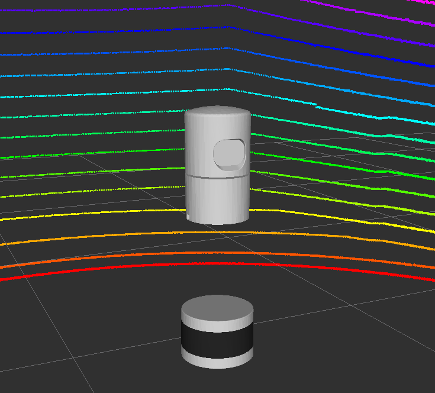

# Humble 튜토리얼에서 사용하는 Velodyne 시뮬레이터

이 디렉터리는 Dataspeed의 BSD 라이선스 코드입니다. 원래 저작권 표시와 아래 원본 설명을 유지합니다. F1TENTH 차량에서 실행하는 방법은 [사용 안내](../../../F1TENTH_USERGUIDE.md)의 3D 라이다 절을 따르세요.

이 저장소에서 수정한 부분은 선언과 정의가 달랐던 `OnScan` 콜백 인자, Humble 실행 의존성, Gazebo 플러그인 검색 경로, RViz의 시뮬레이션 시간, 비정렬 메모리 접근을 피하는 점군 직렬화, 빈 스캔 방어와 organized cloud의 `min_intensity` 처리입니다. 점 필드와 22바이트 `point_step`은 유지했습니다.

독립 예제는 작업 공간을 빌드한 뒤 `ros2 launch velodyne_description example.launch.py`로 실행합니다. 화면 없이 센서만 실행하려면 `gui:=false rviz:=false`를 덧붙이세요. 이 독립 예제 월드는 기본 Gazebo 모델 검색 경로를 사용하므로, 오프라인 실습은 외부 모델을 포함하지 않는 F1TENTH 기본 월드로 진행합니다.

## 원본 설명

# Velodyne Simulator
URDF description and Gazebo plugins to simulate Velodyne laser scanners



# Features
* URDF with colored meshes
* Gazebo plugin based on [gazebo_plugins/gazebo_ros_ray_sensor](https://github.com/ros-simulation/gazebo_ros_pkgs/blob/foxy/gazebo_plugins/src/gazebo_ros_ray_sensor.cpp)
* Publishes PointCloud2 with same structure (x, y, z, intensity, ring, time)
* Simulated Gaussian noise
* GPU acceleration (with known issues)
* Supported models:
    * [VLP-16](velodyne_description/urdf/VLP-16.urdf.xacro)
    * [HDL-32E](velodyne_description/urdf/HDL-32E.urdf.xacro)
    * Pull requests for other models are welcome
* Experimental support for clipping low-intensity returns

# Parameters
* ```*origin``` URDF transform from parent link.
* ```parent``` URDF parent link name. Default ```base_link```
* ```name``` URDF model name. Also used as tf frame_id for PointCloud2 output. Default ```velodyne```
* ```topic``` PointCloud2 output topic name. Default ```/velodyne_points```
* ```hz``` Update rate in hz. Default ```10```
* ```lasers``` Number of vertical spinning lasers. Default ```VLP-16: 16, HDL-32E: 32```
* ```samples``` Nuber of horizontal rotating samples. Default ```VLP-16: 1875, HDL-32E: 2187```
* ```organize_cloud``` Organize PointCloud2 into 2D array with NaN placeholders, otherwise 1D array and leave out invlaid points. Default ```false```
* ```min_range``` Minimum range value in meters. Default ```0.9```
* ```max_range``` Maximum range value in meters. Default ```130.0```
* ```noise``` Gausian noise value in meters. Default ```0.008```
* ```min_angle``` Minimum horizontal angle in radians. Default ```-3.14```
* ```max_angle``` Maximum horizontal angle in radians. Default ```3.14```
* ```gpu``` Use gpu_ray sensor instead of the standard ray sensor. Default ```false```
* ```min_intensity``` The minimum intensity beneath which returns will be clipped.  Can be used to remove low-intensity objects.

# Known Issues
* At full sample resolution, Gazebo can take up to 30 seconds to load the VLP-16 pluggin, 60 seconds for the HDL-32E
* When accelerated with the GPU option, ranges are heavily quantized ([image](img/gpu.png))
    * Solution: Use CPU instead of GPU
* Gazebo cannot maintain 10Hz with large pointclouds
    * Solution: User can reduce number of points (samples) or frequency (hz) in the urdf parameters, see [example.urdf.xacro](velodyne_description/urdf/example.urdf.xacro)
* Gazebo crashes when updating HDL-32E sensors with default number of points. "Took over 1.0 seconds to update a sensor."
    * Solution: User can reduce number of points in urdf (same as above)

# Example Gazebo Robot
```ros2 launch velodyne_description example.launch.py```

# Example Gazebo Robot (with GPU)
```ros2 launch velodyne_description example.launch.py gpu:=true```

