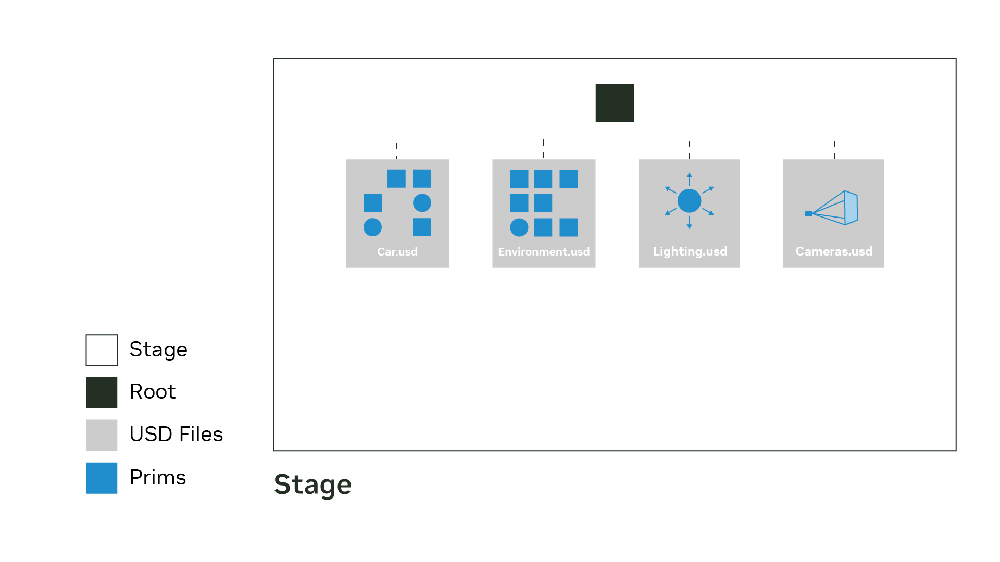

# Stage와 Prim

USD의 가장 기초가 되는 개념인 **Stage**와 **Prim**에 대해서 배워보자.  
**Stage**는 여러 장면 데이터를 조합(composition)해서 보여주는 전체 3D Scene이라고 보면 되고  
**Prim**은 한 장면 안에서 고유한 이름과 경로를 가지는, 장면의 구성요소라고 보면 된다.

> 지금 Layer, Property, Schema 등에 대해서 이해하지 못해도 괜찮다. 그런 부분들은 모두 다음 Markdown 파일에서 다루게 될 예정이다.

## Stage의 정의
OpenUSD의 공식 정의는 다음과 같이 기술한다.
> A stage is a fully composed scenegraph.
> The stage always presents a composed view of scene description, managing prim composition, value resoulution and change processing. A stage is created by opening a root layer and composing all referenced/layered files it specifies. Stage provide the primary API for querying and authoring USD data through UsdPrim and UsdProperty objects. Multiple stages can be open simultaneously, and stages support both read-only and editable modes.  

이에 대해서 간단히 요약하면 다음과 같이 쓸 수 있다: **Scene Description을 담고 있는 최상위 컨테이너, 내부에 다수의 Prim들을 조합하고 계층화 시킨 다음에 Scene Graph로 제공하는 것**.

- **Scene Description** : 픽셀을 직접적으로 기술하는 것이 아니라, 장면 내에 어떤 물체가 있고, 어떤 계층 구조가 있으며, 어떤 속성이 설정되어 있는지 표현하는 데이터
- **Scene Graph** : 장면의 구성요소와 연결 구조를 노드와 엣지 형태로 표현한 데이터 구조. USD의 Prim들은 계층 구조로 구성이 되며, Stage 내부에 그 계층이 존재하고 / 탐색 및 읽기 기능을 지원한다.
    ```
    Stage
    └─ /World                  ← Prim
    ├─ /World/Car           ← Prim
    │  ├─ /Body             ← Prim
    │  └─ /Wheel            ← Prim
    ├─ /World/Camera        ← Prim
    └─ /World/Light         ← Prim
    ```
    - 이 구조 자체가 Scene Graph이다.
- **Composition** : Stage는 여러 파일이나 데이터 소스의 내용을 (작업 내용에 따라) 여러 Prim 등을 조합해서 사용한다.

기본적으로 다음과 같은 구조라고 구분지으면 된다.
```
장면을 기술한 파일·데이터
          ↓ USD가 해석하고 조합한다
Stage: 프로그램이 조회하고 편집하는 장면
          ↓ 렌더링 시스템이 사용한다
화면에 보이는 이미지
```
다만 오해하면 안되는건 Stage가 파일이나 이미지를 의미하는건 아니다. Stage는 그냥 3D 프로그램 안에서, 조합된 여러 장면들을 다루기 위한 객체로서 만들어져있고, 여러 방식으로 접근이 가능한 객체일 뿐이다. 예를 들어서 파이썬에서는 `Usd.Stage`로 Stage 그 자체에 접근해서 사용한다.

## Prim의 정의
Prim의 공식적인 정의는 다음과 같다.
> A Prim (primitive) is the primary container object in USD that can hold other prims and properties.
> Prim create a namespace hierachy on a stage and contain ordered properties (attributes and relationship) that hold meaningful data. Prims always have a resolved specifier (def, over, or class) that deteremines their role, and may have a schema typeName that dictates what data they contain. Prims provide the granularity for instancing, load/unload behavior, and activation/deactivation. The `UsdPrim` class provides the API for interacting with prims.

Prim은 USD의 가장 기본적인 컨테이너 객체라고 이해하면 된다. Prim은 다른 Prim을 포함해서 계층 구조를 만들 수 있고, 각 객체의 실제 데이터를 담는 Property도 내부에 담을 수 있도록 구성된다.
```
어떤 Prim
├─ 이 Prim을 설명하는 데이터
├─ 이 Prim의 속성들
└─ 이 Prim 아래에 배치된 다른 Prim들
```
이러한 특성 때문에 Prim은 기본 도형, 형상 뿐 아니라 재질, 조명, 카메라, 좌표 변환을 위한 구성요소도 모두 Prim으로 취급해서 다룰 수 있다.

## Stage와 Prim 구분해보기
먼저 간단한 예시를 하나 들어보자.
```
Stage
└─ /                          ← Pseudo-root
   └─ World                   ← Xform Prim
      ├─ Robot                ← Xform Prim
      │  └─ Body              ← Cube Prim
      └─ Camera               ← Camera Prim
```
이 예시에서 우리는 4개의 Prim을 정의한다.
| 이름 | 전체 경로 | 타입 | 이 예제에서의 역할 |
| -- | -- | -- | -- |
| World | /World | Xfrom | 장면의 구성요소들을 통합한다. |
| Robot | /World/Robot | Xform | 로봇에 속할 구성요소들을 한데 묶어 통합한다. |
| Body | /World/Robot/Body | Cube | 큐브 형상을 의미한다. |
| Camera | /World/Camera | Camera | 카메라 데이터를 의미한다. |

이것처럼 우리는 Prim을 경로를 통해서 탐색하고, Prim의 타입을 통해 어떤 종류의 데이터인지 해석할 수 있다.

### /World가 Stage인가?
여기서 `/World`는 **Stage 안에 있는 Prim 하나**이다.  
가장 위의 `/`는 **Pseudo-root** 라는 이름의 특별한 Prim이다. 이 Pseudo-root의 정확한 정의는 다음과 같다.
> The pseudo-root is a convenience prim at path `/` that serves as the parent of all root prims on a stage. Each stage contains a pseudo-root prim that allows the stage to contain a single tree of prims rather thas a forest. The pseudo-root facilitates traversal and processing by providing a common ancestor for all authored root prims. It's represented by the path `/` and is accessible via `UsdStage::GetPseudoRoot()`.

Stage의 최상위 Prim들을 하나의 계층 아래에서 쉽게 다룰 수 있도록 제공하는 편의용 Root라고 생각하면 된다. 저기 나와있는건 C++에서 접근할 때의 API고, 파이썬에서는 `stage.GetPseudoRoot()`를 통해서 얻을 수 있다. 위 예시에서, `/World`의 부모는 Stage 객체 자체가 아니라 이 Pseudo-root이다.  
```
Stage : 전체 장면을 제공하는 객체
/ : 그 장면 계층의 편의용 root prim
/World : 일반적인 prim
```

### Prim이 있으면 반드시 시각적 요소가 있어야 하는가?
꼭 그런 것은 아니다. 위 예시에서 알 수 있듯이 `/World`와 `/Robot`은 시각적으로 구성이 되어있지 않은 타입의 Prim들이다 (둘 다 `Xform`). 여기서 `Xform`은 이동, 회전, 크기 변경과 같은 공간 변환을 표현하는 타입이고, 시각적으로 뭔가 보여지는 타입은 아니다.

## Prim의 이름, 타입, 경로, 속성이란?
Prim은 총 4가지 구성요소로 이루어져 있다.

### 이름(name)
이름은 그냥 식별하기 위해서 붙이는거고, 이름에 따라서 타입이나 속성이 자동으로 부여되는건 아니다. 예를 들어서 다음과 같다.
```
def Cube "Camera"
{

}

def Camera "Camera"
{

}
```
둘은 서로 같은 이름이지만 다른 타입의 Prim이다.

### 타입
`Cube`, `Camera`, `Xform` 등은 타입이다.  
USD에서는 `Schema`(후술 예정)가 Prim 데이터의 구조와 의미를 정의한다. 우선 Schema는 "이 종류의 Prim에는 어떤 데이터가 있고, 그 데이터를 어떻게 해석하는지 정한 규칙"이라고 생각하면 된다. 예를 들어서, `Sphere` schema는 `radius`라는 반지름 속성을 정의한다.  
  
다만, 모든 Prim이 반드시 구체적인 타입을 가져야 하는 것은 아니며 타입을 지정하지 않은 Prim도 생성이 가능하다. 실제로 `DefinePrim()` 함수를 사용하면 타입 없는 Prim 정의가 가능하다.

### 경로
Prim 경로는 이 Prim이 장면의 어디에 있는지를 나타내는 정보이다.  
```
/World/Robot/Body
```
이러면 `Body`는 `Robot`의 자식(child)이고, `Robot`은 `World`의 자식이다.  
경로는 Stage 내부에서 각 Prim들이 어디에 위치해 있는지 나타낸다고 보면 된다. 실제로 NVIDIA 공식 문서에서는 `/`를 통해서 Prim의 이름들을 구분하고, 각 Prim을 장면 안에서 경로로 식별한다고 설명하고 있다. 여기서 주의해야 하는 점은 이름이 같아도 경로가 다르면 다른 Prim이라는 것이다.
```
/World/RobotA/Body
/World/RobotB/Body
```
이 2개는 서로 다른 경로고, 서로 다른 Prim이다.

### Property
이 Prim이 어떤 데이터를 가지고 있는가? 에 대한 대답이다. Prim에 속한 데이터를 표현하는 구성요소라고 보면 된다. USD의 Property는 보통 다음과 같이 2종류가 있다.
| 종류 | 의미 | 예시 |
| -- | -- | -- |
| Attribute | 특정 타입의 값 | 크기, 위치, 색상, 문자열 |
| Relationship | 장면의 다른 구성요소를 가리키는 연결  | 특정 재질이나 다른 Prim을 가리키는 경로 |
쉽게 얘기해서, **Attribute**는 값이라고 생각하면 된다. 각 Attribute는 데이터 타입을 가지며, 기본적인 값이나 시간에 따라 달라지는 값도 모두 표현이 가능하다. 그리고 Prim 경로와 Property 경로 역시 구분될 수 있다.
```
/World/Robot/Body                       ← Prim 경로
/World/Robot/Body.size                  ← Attribute 경로
/World/Robot/Body.xformOp:translate      ← Attribute 경로
```
**Relationship** 같은 경우 연결 관계를 표현하기 위해서 작성되는 내용으로, 다른 Prim/다른 Attribute/다른 Relationship 모두 가리켜서 연결할 수 있다. 예를 들면 다음과 같이 추가가 가능하다.
```
custom rel demo:camera = </World/Camera>
```

## 실제 USD 파일은 어떻게 작성이 되어있을까?
`.usda` 형식은 USD 파일 중 사람이 텍스트로 읽고 편집할 수 있도록 만들어진 USD 형식이다.  
`lesson.usda` 라는 이름으로 예시 파일을 하나 작성하겠다.
```
#usda 1.0
(   
    defaultPrim = "World"
    metersPerUnit = 1
    upAxis = "Z"
)

def Xform "World"
{
    def Xform "Robot"
    {
        double3 xformOp:translate = (1, 0, 0)
        uniform token[] xformOpOrder = ["xformOp:translate"]

        def Cube "Body"
        {
            double size = 1
            float3[] extent = [
                (-0.5, -0.5, -0.5),
                (0.5, 0.5, 0.5)
            ]

            double3 xformOp:translate = (0, 0, 0.5)
            uniform token[] xformOpOrder = ["xformOp:translate"]
        }
    }

    def Camera "Camera"
    {
    }
}
```
### 중괄호의 중첩은 Prim의 계층 구조를 의미한다
```
def Xform "World"
{
    def Xform "Robot"
    {
        def Cube "Body"
        {
        }
    }
}
```
### 파일 맨 위의 괄호는 메타데이터를 의미한다.
```
(
    defaultPrim = "World"
    metersPerUnit = 1
    upAxis = "Z"
)
```
레이어 수준의 메타데이터를 의미한다.  
여기서는 길이 단위 1을 1m로 해석 가능하도록 하고, `upAxis="Z"`를 통해서 Z축이 위쪽 방향임을 정의하고 있다. `defaultPrim="World"`는 기본적으로 사용할 대표 Prim을 `World`로 지정함을 의미한다.

### Prim을 읽는 법
```
def Cube "Body"
{
    double size = 1
}
```
먼저, `def` 는 함수를 정의하는게 아니고, USD의 **specifier**라는 것을 정의한다. 이는 해당 Scene description이 어떤 역할을 하는지 나타내는 표시이다. 따라서 `def`는 Prim을 정의하는데 사용됨을 알 수 있다. 그리고 `double size=1`은 `Body Prim`의 `size`라는 Attribute에 `double` 타입의 값 1을 기록했다고 해석하면 된다. 또한, 예제의 `extent` 같은 경우 큐브의 로컬 좌표계에서 형상을 둘러싸는 범위를 나타내면 된다. 한변의 크기를 1로 지정하였으므로 각 축에서 `-0.5` 에서 `0.5`로 지정한다.

## 부모자식 Prim간의 위치 변환은 어떻게 하면 될까?
위의 예제에서, `Robot`이 `(1,0,0)` 이동했다고 정의하고 이후 `Bdoy`가 `(0, 0, 0.5)` 이동했다고 정의했다. URDF도 조인트와 링크 사이의 상대 위치를 기술해서 전체 robot description을 작성하듯이 USD 역시 마찬가지로 절대 위치를 적는게 아니라 부모-자식 간의 상대위치를 기술해서 작성한다.  
따라서 이 예제에서는 다음과 같이 해석될 수 있다.
```
Robot의 전역 위치              = (1, 0, 0)
Robot 기준 Body의 로컬 위치    = (0, 0, 0.5)
Body의 전역 위치               = (1, 0, 0.5)
```
단, URDF의 경우 링크-조인트를 통해서 실제 Physical Joint가 연결된 것으로 간주하고 전개하지만 USD에서는 Scene 안에서 각 Prim이 어디에 놓여있는 것인지를 기술한 것 뿐, 실제 물리적으로 연결되어있다고 확언할 수 있는 것이 아니다 (동시에 물리 속성이 실제로 부여되는 것도 아니다).

## 그럼 다시 Stage로 돌아와볼까?
`lesson.usda`와, 새롭게 작성할 `experiment.usda` 파일을 통해서 Stage를 구성해보자.  
`experiment.usda`는 다음과 같이 작성된다.
```
#usda 1.0
(
    defaultPrim = "World"
    metersPerUnit = 1
    upAxis = "Z"

    subLayers = [
        @lesson.usda@
    ]
)

over "World"
{
    over "Robot"
    {
        over "Body"
        {
            double size = 2
            float3[] extent = [
                (-1, -1, -1),
                (1, 1, 1)
            ]
        }
    }
}
```
여기에서 메타데이터 부분에서 사용된 `subLayers`는 다른 레이어의 내용을 같은 경로 체계에 포함시키는 방식이다. 같은 위치에 대한 데이터가 여러 레이어에 존재한다면, USD의 우선순위 규칙에 따라서 조합이 된다. 관련해서는 [**다음 링크**](https://docs.nvidia.com/learn-openusd/latest/creating-composition-arcs/sublayers/what-are-sublayers.html)를 참조하면 된다.  
  
이제 두 파일을 열게 되면 다음과 같은 점이 차이가 생긴다.
| 파일명 | 조회할 Prim 경로 | 타입 | size |
| -- | -- | -- | -- |
| `lesson.usda` | `/World/Robot/Body` | Cube | 1 |
| `experiment.usda` | `/World/Robot/Body` | Cube | 2 |
새롭게 큐브의 타입과 위치를 정의하지 않고, 내가 새롭게 제공한 값에 한정해서 Scene description을 바꿀 수 있다. USD는 이것처럼 데이터의 일부만 추가하거나 재정의해서 최종 결과를 구성할 수 있다.  
  
여기서 반드시 유념해야 하는 부분은 다음과 같다.  
> **experiment Stage에는 크기가 1인 Cube Body와 크기가 2인 Cube Body 이렇게 2개가 생기는게 아니다. 같은 경로의 Body 하나가 조합된 결과로 나타나게 된다.**  
  
이렇게 Layer 안에 기술된 Prim에 대해서 **PrimSpec**이라고 부르고, Stage에서 조회하는 조합된 Prim은 `UsdPrim`이라고 부른다. OpenUSD에서는 조합된 Prim이 여러 PrimSpec의 Scene description으로부터 만들어질 수 있다고 설명한다.  
  
우리 예제에서는 다음과 같다.
```
lesson.usda의 Body에 대한 기술
    타입 = Cube
    size = 1
    위치 = (0, 0, 0.5)
                   \
                    → experiment Stage의 Body Prim
                   /      타입 = Cube
experiment.usda의 기술     size = 2
    size = 2               위치 = (0, 0, 0.5)
```
따라서 **지금 선택한 Prim의 데이터가 어느 파일에 들어있는거지?** 라는 질문에 대한 대답이, 단순히 파일 하나가 **아닐수도 있다는게** 중요한 것이다. 타입은 A 레이어에서, 크기는 B 레이어에서, 변환은 C 레이어에서 제공할 수 있기 때문이다.

## Python으로 직접 Stage와 Prim에 대해서 만들어보기
OpenUSD에서는 파이썬으로 USD를 다룰 수 있도록 API를 제공한다.  
그중에서도 가장 기초적인 구문은 다음과 같다: `from pxr import Usd, UsdGeom`  
그럼 앞의 장면을 코드로 생성해보자.
```
from pxr import Usd, UsdGeom, Gf

# 1. 메모리에 새 Stage를 만듭니다.
stage = Usd.Stage.CreateInMemory()

# 2. 장면의 단위와 위쪽 방향을 설정합니다.
UsdGeom.SetStageMetersPerUnit(stage, 1.0)
UsdGeom.SetStageUpAxis(stage, UsdGeom.Tokens.z)

# 3. /World라는 Xform Prim을 만듭니다.
world_xform = UsdGeom.Xform.Define(stage, "/World")
stage.SetDefaultPrim(world_xform.GetPrim())

# 4. /World/Robot이라는 Xform Prim을 만듭니다.
robot_xform = UsdGeom.Xform.Define(stage, "/World/Robot")
robot_xform.AddTranslateOp().Set(Gf.Vec3d(1, 0, 0))

# 5. /World/Robot/Body라는 Cube Prim을 만듭니다.
body_cube = UsdGeom.Cube.Define(stage, "/World/Robot/Body")
body_cube.CreateSizeAttr(1.0)
body_cube.CreateExtentAttr([
    Gf.Vec3f(-0.5, -0.5, -0.5),
    Gf.Vec3f(0.5, 0.5, 0.5),
])
body_cube.AddTranslateOp().Set(Gf.Vec3d(0, 0, 0.5))

# 6. Camera Prim을 만듭니다.
UsdGeom.Camera.Define(stage, "/World/Camera")

# 7. 루트 레이어에 기록된 내용을 USD 텍스트로 확인합니다.
print(stage.GetRootLayer().ExportToString())

body_prim = stage.GetPrimAtPath("/World/Robot/Body")

if not body_prim:
    raise RuntimeError("Body Prim을 찾지 못했습니다.")

print("name:", body_prim.GetName())
print("path:", body_prim.GetPath())
print("type:", body_prim.GetTypeName())
print("parent:", body_prim.GetParent().GetPath())
print("size:", body_prim.GetAttribute("size").Get())
```
여기서 특기할만한 부분은 다음과 같다.
### `Usd.Prim`과 `UsdGeom.Cube`는 뭔 차이?
```
body_prim = stage.GetPrimAtPath("/World/Robot/Body")
body_cube = UsdGeom.Cube(body_prim)

print(body_cube.GetPrim() == body_prim)  # True
```
`body_prim`은 일반적인 Prim 관점에서 접근하는 객체이고, 우리가 공부했듯 이름, 경로, 부모, Property 등에 대해서 다룬다. 반면, `body_cube`는 그 Prim을 **Schema 차원**에서 다루는 것이다(Schema에 대해서는 다음 강의에서 공부를 할 것이다). 이때 `UsdGeom.Cube(body_prim)`을 호출했다고 해서 새로운 Cube 객체를 만드는건 아니고, 그냥 기존의 Scene description에서 읽어온다.

### Stage의 전체 Prim 나열해보기
```
for prim in stage.Traverse():
    print(prim.GetPath(), prim.GetTypeName())
```

### Isaac Sim에서 이 Stage는 어떻게 확인 가능할까?
```
import omni.usd

current_stage = omni.usd.get_context().get_stage()

if current_stage is None:
    raise RuntimeError("현재 열린 Stage가 없습니다.")

for prim in current_stage.Traverse():
    print(prim.GetPath(), prim.GetTypeName())
```
Isaac Sim에서는 `omni.usd` API를 사용해서 접근한다.  
이걸 통해서 3가지 접근 방법이 모두 다른 것을 알 수 있다.  
| 코드(문법) | 의미 |
| -- | -- |
| `Usd.Stage.CreateInMemory()` | 별도의 새 Stage를 메모리 안에 생성 |
| `Usd.Stage.Open("lesson.usda")` | 파일을 해석해서 USD Stage 객체로 열기 |
| `omni.usd.get_context().get_stage()` | Omniverse 어플리케이션에서 현재 사용 중이 Stage 객체에 접근 |
앞에 2개 문법은 OpenUSD에서 제공하는 `USD API`고, 마지막은 어플리케이션에서 열려있는 현재 Scene Description 객체를 연결하는 API이다.