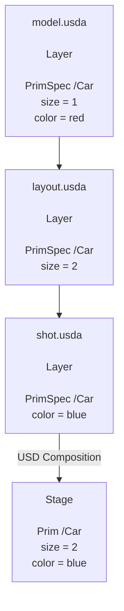

# Layer
Layer란?
[NVIDIA 공식 자료](https://docs.nvidia.com/learn-openusd/latest/composition-basics/layers.html)에서는 다음과 같이 얘기하고 있다.  
> OpenUSD scenes are organized into layers, whose contents can be combined or overridden to create a composed scene, with each layer containing a subset of the complete scene data (succh as geometry, materials, or animations).
> (..)
> A layer is a single file or resource that contains scene description data. This could be a USD file(.usd, .usda, .usdc), a file format supported by a plugin (e.g. .gltf, .fbx, etc.) or even a resource that's not file-based at all (e.g. from a database).  
  
또한 [NVIDIA의 공식 USD 튜토리얼 glocery](https://docs.nvidia.com/learn-openusd/latest/glossary.html#term-Layer)에서는 이렇게 얘기하고 있다.  
> A Layer is a container that stores USD scene description, typically backed by a file on disk.
> Layers contain prim specs, properties, metadata, and composition arcs, and can be files in `.usd`, `.usda`(text) or `.usdc`(binary) format, or exist only in memory. Multiple layers combine through composition arcs to create the final composed stage, making layers the fundamental unit of USD compotision.  
  
즉, Layer란 **Scene Description을 담고 있는 데이터 단위**이다. 하나의 scene을 모두 담고 있을 필요는 없고, 어떤 물체의 속성 하나만 바꾸는 데이터를 담고 있을 수도 있다.

## Layer 구분
| 파이썬 API 상의 객체 | 다루는 것 |
| -- | -- |
| `Sdf.Layer` | 개별 Layer의 Scene description |
| `Usd.Stage` | 조합된 Scene 전체 |
| `Sdf.PrimSpec` | 특정 Layer에 기술된 Prim에 대한 내용 |
| `Usd.Prim`| Stage에서 조회하는, 조합된 Prim |

## Opinion은 뭐지?
**Opinion**이라는 표현이 Layer에 대해서 설명할 떄 많이 나오는데, **어떤 Layer가 특정 데이터에 대해서 명시적으로 작성한 내용**이라고 받아들이면 된다. 
예를 들어서 다음 두 내용이 있다고 하자.
```
원본 Layer:
    Body의 이동값은 (1, 0, 0.5)다.

수정 Layer:
    Body의 이동값은 (2, 0, 0.5)다.
```
둘 다 같은 Attribute에 대한 Opinion이다.  
Composition은 이 Opinion들을 규칙에 따라서 조합해서 Prim과 Property를 구성한다.

# Composition
위에 링크해둔 NVIDIA 공식 자료에서 Composition은 다음과 같이 정의한다.  
> Composition is the process of combining multiple layers and scene graph elements together to create a final composed scene.
> USD evaluates all composition arcs (sublayers, references, payloads, variant sets, inherits, and specializes) to build the stage's scene graph, creating indexes for each prim that enable efficient value resolution. Composition happens when opening a stage, loading or unloading prims, and whenever contributing layers are edited.  
  
즉 쉽게 말하면 **여러 Layer와 자산에 기록된 Scene description을 조합해서, Stage에서 사용할 Prim과 Property의 구조를 구성하는 과정**이라고 할 수 있다.  
그리고 이때 **scene을 조합하는 연결 방식**들을 **Composition Arc**라고 부른다. 정확한 정의는 다음과 같다.  
> Composition Arcs are the operators that allow USD to combine multiple layers of scene description in specific ways.  
> USD provides seven composition arcs -- sublayer, inherit, variant set, relocate, reference, payload, and specialize -- remembered by the mnemonic LIVERPS, which also represens their strength ordering. Thses directional operators combine layers and prim specs into an ordered graph, and all arcs except sublayers support prim name changes through path translation.  
  
## 예시 파일을 통해서 한번 Sublayer에 대해서 알아보자
다음 파일이 같은 디렉터리에 있다고 가정하자.
```
base.usda
    원본 장면

overrides.usda
    Body의 이동만 바꾸는 기록

scene.usda
    두 Layer를 조합하는 진입점
```
### `base.usda` : 원본 장면
다른거 공부할 때 했던 예제대로 파이썬으로 만든 scene이다.
```
#usda 1.0
(
    defaultPrim = "World"
    metersPerUnit = 1
    upAxis = "Z"
)

def Xform "World"
{
    def Xform "Robot"
    {
        double3 xformOp:translate = (10, 0, 0)
        float xformOp:rotateZ = 90

        uniform token[] xformOpOrder = [
            "xformOp:translate",
            "xformOp:rotateZ"
        ]

        def Cube "Body"
        {
            double size = 1
            float3[] extent = [
                (-0.5, -0.5, -0.5),
                (0.5, 0.5, 0.5)
            ]

            double3 xformOp:translate = (1, 0, 0.5)

            uniform token[] xformOpOrder = [
                "xformOp:translate"
            ]
        }
    }
}
```
### `override.usda` : translation만 바꿔볼까?
```
#usda 1.0

over "World"
{
    over "Robot"
    {
        over "Body"
        {
            double3 xformOp:translate = (2, 0, 0.5)
        }
    }
}
```

### `scene.usda` : 어떻게 composition 할지 지정하기
```
#usda 1.0
(
    defaultPrim = "World"
    metersPerUnit = 1
    upAxis = "Z"

    subLayers = [
        @./overrides.usda@,
        @./base.usda@
    ]
)
```
Sublayer는 다른 layer의 내용을 **같은 Prim 경로 안에서 조합**한다. 이 예제에서는 두 파일의 `/World/Robot/Body`에 대한 opinion을 같은 Prim에서 composition 한다.

### 그러면 `scene.usda`를 열면 어떤 결과가 나오는데?
| 데이터 | 최종 결과 | 가져온 곳 |
|---|---|---|
| Body의 타입 | `Cube` | `base.usda` |
| Body의 크기 | `1` | `base.usda` |
| Body의 이동값 | `(2, 0, 0.5)` | `overrides.usda` |
| Body의 변환 순서 | `[translate]` | `base.usda` |
| Robot의 이동·회전 | `(10, 0, 0)`, Z축 90도 | `base.usda` |
2개의 USDA 파일이 합쳐진 것이다.

## Sublayer의 우선순위
위 예제에서 알 수 있듯, sublayer의 우선순위는 목록에서 위에 놓인 Layer가 뒤에 놓인 Layer보다 우선순위가 높다. 그리고 이 Sublayer들을 포함하는 상위 Layer가 자체적으로 가지고 있는 opinion이 Sublayer들의 opinion보다 더 우선순위가 높다.  
따라서 이 예제에서의 우선순위는 다음과 같다고 할 수 있다.
```
낮음
    scene.usda의 직접 기록
    overrides.usda
    base.usda
높음
```
## Layer Stack
OpenUSD의 공식적은 정의는 다음과 같다.
> The Ordered set of layers resulting from the recursive gathering of all Sublayers of a Layer, plus the layer itself as first and strongest.  
  
즉, 하나의 Layer와 그 Layer가 재귀적으로 포함된 Sublayer들의 Ordered Set이 Layer Stack이다.

# 그러면 Layer를 고려했을 때 USD 파일을 어떻게 읽고 수정해야 하는가
## `def`, `over`, `class`
| 표기 | 역할 |
|---|---|
| **`def`** | Prim을 정의 |
| **`over`** | Prim에 대한 추가·수정 기록을 제공 |
| **`class`** | 상속 등에 사용할 추상적인 장면 기술을 정의 |
`over`만 있는 Prim은 보통 scene description에 단독으로 사용되기보다는, 다른 Layer의 `def`와 조합해서 일부 데이터만 수정하는데 사용된다. 또한 `class`도 파이썬이나 schema에서 사용하는 정의가 아니므로 헷갈리지 말자. `class`는 USD scene description의 composition arc 중 하나인 specifier를 얘기할 때 사용되는 것이다.

## Edit Target : 무엇을 어떻게 수정하고, 어따가 반영할건데?
다수의 Layer로 구성된 Scene은 다음 2가지에 대해서 반드시 알아야 한다.
```
수정할 대상
    /World/Robot/Body.xformOp:translate

수정 내용을 기록할 Layer
    overrides.usda
```
**Edit Target은 Stage에서 하는 편집을 어느 Layer의 어느 경로에 기록할지 정하는 대상**이다.

### 수정 Layer에 값을 작성하기
앞에서 예시로 든 3가지 USD 파일이 `fixtures` 디렉터리에 있다고 가정하자.
```
from pathlib import Path
from pxr import Usd, Sdf, Gf

folder = Path("fixtures").resolve()

scene = Usd.Stage.Open(str(folder / "scene.usda"))

overrides_layer = Sdf.Layer.FindOrOpen(
    str(folder / "overrides.usda")
)

if not scene or not overrides_layer:
    raise RuntimeError("장면 또는 수정 Layer를 열지 못했습니다.")

body = scene.GetPrimAtPath("/World/Robot/Body")
translate_attr = body.GetAttribute("xformOp:translate")

with Usd.EditContext(scene, overrides_layer):
    translate_attr.Set(Gf.Vec3d(3, 0, 0.5))
```
이 코드는 다음 내용을 의미한다.
> 전체 Stage에서 Body의 이동 Attribute 탐색
> 편집 대상을 `override.usda`로 변경
> 그 Layer에 translation 3을 기록
> 블록이 끝나면 이전 편집 대상으로 되돌아가기
  
다만 Layer에 대해서 값을 수정할 때, 위에서 다룬 우선순위 규칙을 지키지 않으면 최종 변환값에 반영이 되지않을 수 있다는 것을 반드시 기억해야 한다.

# Reference : 다른 Asset들을 내가 원하는 Prim 위치에 조합하기
Sublayer는 같은 경로 안에 여러 Layer를 합쳐서 Prim을 조합했다. 반면에 Reference는 **다른 자산의 Prim 하위 구조를, 현재 Scene의 특정 Prim 위치에 연결**하는 것을 의미한다. 공식적인 정의를 먼저 살펴보자.  
> A reference is a way to graft and reuse content from another USD layer into your current layer, like linking to an external file so its contents appear in your stage.  
> References are a type of composition arc that copy the namespace or prim hierarchy of the referenced file into the referencing prim, allowing you to build complex scenes from modular assets. The referencing layer can apply overrides on top of the referenced content, following USD's strength ordering rules where opinions closer to the root are stronger. This enables non-destructive workflows where the same asset can be referenced multiple times with different variations without modifying the original source file.  
  
그럼 이제 예시를 살펴보자.
## 예시 파일을 통해 공부하는 Reference
```robot.usda
#usda 1.0
(
    defaultPrim = "Robot"
    metersPerUnit = 1
    upAxis = "Z"
)

def Xform "Robot"
{
    def Cube "Body"
    {
        double size = 1
        float3[] extent = [
            (-0.5, -0.5, -0.5),
            (0.5, 0.5, 0.5)
        ]

        double3 xformOp:translate = (1, 0, 0.5)
        uniform token[] xformOpOrder = ["xformOp:translate"]
    }
}
```
이러면 이 파일의 경로는 다음과 같다.
```
/Robot
└─ Body
```
여기에 Reference를 추가해준다면?
```
from pathlib import Path
from pxr import Usd, UsdGeom, Gf

asset_path = str(Path("fixtures/robot.usda").resolve())

reference_stage = Usd.Stage.CreateInMemory()
UsdGeom.SetStageMetersPerUnit(reference_stage, 1.0)
UsdGeom.SetStageUpAxis(reference_stage, UsdGeom.Tokens.z)

UsdGeom.Xform.Define(reference_stage, "/World")

robot_a = UsdGeom.Xform.Define(reference_stage, "/World/RobotA")
robot_a.GetPrim().GetReferences().AddReference(asset_path, "/Robot")

robot_b = UsdGeom.Xform.Define(reference_stage, "/World/RobotB")
robot_b.GetPrim().GetReferences().AddReference(asset_path, "/Robot")

robot_a.AddTranslateOp().Set(Gf.Vec3d(10, 0, 0))
robot_a.AddRotateZOp().Set(90.0)

robot_b.AddTranslateOp().Set(Gf.Vec3d(-10, 0, 0))
```
이렇게 되면 다음과 같이 구성이 된다.
```
/World
├─ RobotA
│  └─ Body
└─ RobotB
   └─ Body
```
Reference를 이용하면, 원본 파일에서 선택한 Prim을, 내가 원하는 composition 위치에 mapping 할 수 있다. 여기서 핵심이 되는 코드는 다음과 같다.
```
robot_a.GetPrim().GetReferences().AddReference(
    asset_path,
    "/Robot"
)
```
이걸 3가지 서로 다른 경로로 분해하면 다음과 같이 쓸 수 있다.  
| 구분 | 예 |
|---|---|
| 자산 파일 경로 | `/somewhere/robot.usda` |
| 원본 자산 안의 Prim 경로 | `/Robot` |
| 현재 Stage에서 조합할 위치 | `/World/RobotA` |
Reference는 USD 파일 안에서는 다음과 같이 작성된다.
```
def Xform "RobotA" (
    prepend references = @./robot.usda@</Robot>
)
{
}
```
# 주의해야하고, 추가로 알아두면 좋은 부분들
SubLayer와 Reference에 대해서 공부를 했다면, USD에서는 **Scene의 구성요소들이 가지고 있는 여러 데이터들이, 서로 다른 곳에서 복잡하게 제공될 수 있다**는 것을 알 수 있다. 그렇기 때문에 값들 사이의 우선순위는 어떻게 mapping 되는지, 값의 재정의나 편집은 어떻게 할 수 있는지에 대해서 정확하게 알아야 순서를 파악할 수 있다.

# Payload와 Variant
## Payload : 필요에 따라 내용을 loading 하거나 안하거나
먼저 공식 정의부터 살펴보자.
> A payload is a composition arc similar to references but with deferred loading for scalability.
> Payloads act like references but are recorded without traversing when you open a stage with `LoadNone`, letting you control which parts of large scenes load like in working sets. Payloads are also weaker than references in LIVERPS oredering, and are typically added to component asset root prims for efficient scalable composition.  
  
즉, 무거운 자산들을 연결해놓고 내가 원할 때만 로딩할 수 있다는 것이다.
```
def Xform "RobotPayload" (
    prepend payload = @./robot.usda@</Robot>
)
{
}
```
예를 들면 다음과 같다. 내가 만약에 로딩하지 않으면 이런 결과가 된다.
```
payload_stage = Usd.Stage.Open(
    str(Path("fixtures/payload.usda").resolve()),
    load=Usd.Stage.LoadNone,
)

print(bool(payload_stage.GetPrimAtPath("/World/RobotPayload")))
# 예상: True

print(bool(payload_stage.GetPrimAtPath("/World/RobotPayload/Body")))
# 예상: False

payload_stage.Load("/World/RobotPayload")

print(bool(payload_stage.GetPrimAtPath("/World/RobotPayload/Body")))
# 예상: True
```
다시 언로드 하려면 이렇게 하면 된다.
```
payload_stage.Unload("/World/RobotPayload")
```

## Variant : 한 Asset에서 여러 Composition 선택지 만들기
역시 공식 정의부터 보고가자.
> A variant is one possible option within a variant set, allowing switchable variations of scene descipriotn.  
> Variants contain complete scene description for one variation of a prim and its descendants. Only one variant from a variant set is active at a time (determined by the variant selection), antd the variant's opinions participate in composition. Variants enable non-destructive alternatives like different geometries, material variations, or configuration options without duplicating the entire asset.  
  
근데 그러면 **Variant Set**은 뭘까?
> A Variant Set is a composition arc that provides switchable alternatives for a prim and its descendants.  
> Variant Sets contain named variants (options), with one variant selected at a time to contribute to composition. A prim can have multiple variant sets for different types of variations (modeling, shading, etc.), and variant dets can be nested. Selections are typically stored in stronger layers or the session layer, allowing interactive switching. Variant dets are the "V" in LIVERPS strength ordering.  
  
간단히 얘기해서 여러 선택지를 모아놓은 것이라고 보면 된다.  
그러면 짧은 예시를 통해서 variant에 대해서 알아보자.  
```
variant_stage = Usd.Stage.CreateInMemory()
prim = UsdGeom.Xform.Define(variant_stage, "/Robot").GetPrim()

mode = prim.GetVariantSets().AddVariantSet("mode")

for name, gain in [("slow", 10.0), ("fast", 20.0)]:
    mode.AddVariant(name)
    mode.SetVariantSelection(name)

    with mode.GetVariantEditContext():
        prim.CreateAttribute(
            "demo:gain",
            Sdf.ValueTypeNames.Float,
            custom=True,
        ).Set(gain)

mode.SetVariantSelection("slow")
print(prim.GetAttribute("demo:gain").Get())
# 예상: 10.0

mode.SetVariantSelection("fast")
print(prim.GetAttribute("demo:gain").Get())
# 예상: 20.0
```
`GetVariantEditContext()` 안에서 작성하는 값은, 내가 선택한 Variant의 선택지 중 하나로 기록이 된다.  
단, 여기서 거듭 주의해야 하는 점은 이것 역시 우선순위(strength)에 따라서 값이 변경된다는 점이다. 예를 들어..
```
# Variant 편집 블록 밖에서 작성합니다.
prim.GetAttribute("demo:gain").Set(99.0)

mode.SetVariantSelection("slow")

print(prim.GetAttribute("demo:gain").Get())
# 예상: 99.0
```
Variant 밖의 로컬 Attribute가 더 강하기 때문에 Variant가 무시되었다.

# Composition의 Strength 규칙은 뭘까?
현재 USD의 composition strength 규칙은 **LIVERPS**라고 불리며 다음과 같다.
| 기호 | 의미 |
|---|---|
| **L** | Local |
| **I** | Inherits |
| **V** | VariantSets |
| **E** | rElocates |
| **R** | References |
| **P** | Payloads |
| **S** | Specializes |
[NVIDIA 공식 문서](https://docs.nvidia.com/learn-openusd/latest/composition-basics/strength-ordering.html)에 들어가면 더 자세한 내용에 대해서 공부할 수 있다.

# Layer의 저장과 Flatten
Layer에 대해서 정확히 이해하려면 어떻게 저장하는지에 대해서도 알면 좋다.
| 코드 | 의미 |
| -- | -- |
| `layer.Save()` | 해당 파일을 기반으로 Layer의 변경을 저장 |
| `stage.GetRootLayer().Save()` | Root Layer를 저장 |
| `layer.Export("copy.usda")` | 해당 Layer의 opinion을 다른 파일로 내보내기 |
| `stage.Flatten()` | 현재 조합된 scene을 하나의 합쳐진 Layer로 만들기 |
| `stage.Export("flat.usda")` | 조합된 scene을 파일로 내보내기 |

## Flatten에 대해서 더 자세히 알아보자
Flatten은 간단히 얘기하면, 여러 Layer와 Composition 결과를 **하나의 Layer로 bake**하는 작업이라고 보면 된다. 예를 들어서 다음과 같은 Layer Stack이 있다고 가정하자.
```
shot.usda            ← 가장 강한 Layer
  └─ anim.usda
  └─ layout.usda
  └─ modeling.usda   ← 가장 약한 Layer
```
각 Layer는 같은 Prim에 대해서 서로 다른 Opinion을 가지고 있을 수 있다.
```
# modeling.usda
def Xform "Car"
{
    double size = 1
}
```
```
# layout.usda
over "Car"
{
    double size = 2
}
```
이걸 바탕으로 composition을 한다면, Stronger Layer인 `layout.usda`의 `size=2`가 반영되서 보일 것이다. 이때, Flatten을 해버린다면 **최종 Composition 결과를 하나의 Layer에 작성**하기 때문에 다음과 같이 작성될 것이다.
```
def Xform "Car"
{
    double size = 2
}
```
즉, 다음과 같이 이해하면 된다.
> **Flatten : "어떤 Layer에서 이 값이 왔는지" 라는 Composition 정보를 축약하거나 없애버리고, 현재 Stage에서 최종적으로 보이는 결과들만 하나의 USD Layer로 만드는 작업**  
  
이런 Flatten 작업은 보통 2가지가 있다.
### Stage Flatten
`UsdStage::Flatten()` 또는
```
usdcat --flatten scene.usda
```
와 같은 명령으로 실행되는데, 이건 **Stage 전체의 composition을 규칙에 따라 평가해서, 하나의 scene layer로 bake**하는 것을 의미한다.  
예를 들어 원래:
```
shot.usda
 │
 ├─ subLayer → lighting.usda
 │
 └─ /Car
      └─ reference → car_asset.usda
```
같은 구성이었다면, 여기에 Stage Flatten을 한다면
```
flattened.usda
 └─ /Car
      ├─ Body
      ├─ Wheel
      ├─ Interior
      └─ ...
```
처럼 `reference`, `sublayer`, `variant` 등의 composition 결과가 최종 실제 scene description에 반영된다. 다시 말하면, composition arc가 대부분 사라지고, 그 arc들이 만들어낸 결과만 반영된다고 보면 된다. OpenUSD에서는 **reference, sublayer, variant 같은 namespace composition operator뿐만 아니라 layer/reference time offset과 같은 valu-resolution 효과도 같이 bake 된다**고 하고 있다.

### Layer Stack Flatten
`UsdUtilsFlattenLayerStack(...)` 혹은
```
usdcat --flattenLayerStack
```
를 사용한다.  
이거는 위의 Stage 전체를 bake 하는게 아니라
```
root.usda
  ├─ sublayerA.usda
  ├─ sublayerB.usda
  └─ sublayerC.usda
```
Layer stack만 하나로 합친다.  
예를 들어:
```
root.usda
 └─ sublayer → animation.usda
 └─ sublayer → layout.usda

/World/Car
 └─ reference → car.usda
```
라면 Layer Stack Flatten 하게 되면:
```
flattenedRoot.usda

/World/Car
 └─ reference → car.usda
```
가 된다. 즉, `root + animation + layout`는 하나로 합치지만,
```
reference → car.usda
```
는 그대로 남게 된다.  
실제로 OpenUSD 문서에서는 `UsdUtilsFlattenLayerStack()`은 `reference`, `payloads`, `inherits`, `specializes`, `variants` 같은 composition arc를 flatten 하지 않는다고 안내하고 있다.  
  
구분해서 정리하면 다음과 같다.
| | Layer Stack Flatten | Stage Flatten |
|---|---|---|
| Sublayer | 합쳐짐 | 합쳐짐 |
| Reference | **유지** | **bake** |
| Payload | **유지** | **bake** |
| Variant | **유지** | **선택 결과가 bake** |
| Layer opinions | 최종 opinion으로 합침 | 최종 opinion으로 합침 |
| 목적 | Layer Stack 단순화 | 완전히 self-contained된 결과 생성 |
  
좀 더 간단하게 정리하면 다음과 같다.
```
Layer Stack Flatten
=
"이 Layer Stack 안에서만 정리하자"

Stage Flatten
=
"현재 화면에 보이는 최종 Stage를 통째로 하나의 파일로 구워버리자"
```

# Layer와 Prim의 관계
그래서 Layer랑 Prim은 뭔데..? Stage에서 scene description을 하고, Prim이 Stage 안의 scene 구성요소라면서 Layer가 또 여럿 모여서 Scene을 만든다고 하면 Prim이랑 Layer랑 뭔 차인데..? 라는 질문이 당연히 나올 수 있다. 나도 이거 하면서 비슷한 질문을 했기 때문에..  
  
다음과 같이 이해하면 조금 더 편하다.  
> **여러 Layer 안에 있는 `PrimSpec`들이 Composition 되어서 Stage 위의 Prim을 만든다**  
  
공식 OpenUSD 문서에서는 `Layer`는 scene descipriotn의 저장 컨테이너, `PrimSpec`을 Layer 안의 `prim description`, `UsdPrim`을 Stage에서 composition 된 결과로 구분한다.

## 구체적인 구조
```
저장/작성 세계 (Sdf)
──────────────────────────
Layer
 ├─ PrimSpec
 │   ├─ AttributeSpec
 │   └─ RelationshipSpec
 └─ PrimSpec
     └─ ...

          ↓ Composition

실제 Scene 세계 (Usd)
──────────────────────────
Stage
 ├─ Prim
 │   ├─ Attribute
 │   └─ Relationship
 └─ Prim
     └─ ...
```
보통 USD는 이런 식으로 2가지 구조로 구성되어있다고 생각하면 편하다.  
즉, 개념적으로
```
Layer : PrimSpec
Stage : Prim
```
이렇게 구성이 되어있다.

## 여러 Layer가 같은 Prim에 기여할 수 있다.
예를 들어서:
**model.usda**
```
def Xform "Car"
{
    double size = 1
    color3f color = (1, 0, 0)
}
```
**layout.usda**
```
over "Car"
{
    double size = 2
}
```
**shot.usda**
```
over "Car"
{
    color3f color = (0, 0, 1)
}
```
그리고 Layer Stack이
```
shot.usda       strongest
layout.usda
model.usda      weakest
```
라고 해보자. 그러면 각 Layer에는 별개의 PrimSpec들이 존재한다고 알 수 있다.
```
shot.usda
└─ PrimSpec /Car
      color = blue

layout.usda
└─ PrimSpec /Car
      size = 2

model.usda
└─ PrimSpec /Car
      size = 1
      color = red
```
하지만 이것들을 합친다고 `/Car`가 3개 생기는건 아니고, 하나의 `/Car` Prim으로 합쳐진다.
```
/Car PrimSpec ─┐
/Car PrimSpec ─┼── Composition ──→ /Car UsdPrim
/Car PrimSpec ─┘
```

# 따라서 Layer와 Prim 더 나아가서 USD는 다음과 같이 이해하면 편하다.

또 다르게 정리한다면
```
Layer
=
"Scene에 대한 의견(Opinion)을 저장하는 문서"

PrimSpec
=
"그 Layer가 특정 Prim에 대해 적어놓은 내용"

Composition
=
"여러 Layer의 의견을 조합하는 과정"

Prim
=
"Composition 결과로 Stage에서 보이는 Scene Object"

Stage
=
"Composition된 최종 Scene을 바라보는 인터페이스"
```
예를 들면:
```
model.usda:
"Car는 빨간색이야"

animation.usda:
"Car는 지금 여기 있어"

shot.usda:
"이번 shot에서는 Car를 파란색으로 해"
```
이것들이 각각 Layer의 Opinion이다.  
그러면 Stage가:
```
/Car

position = animation이 결정
color    = shot이 결정
geometry = model이 결정
```
처럼 하나의 Composed Prim으로 보여주게 된다.  
그러면 이제 Flatten 같은 경우는, 원래:
```
model.usda
   PrimSpec /Car
   geometry = ...

layout.usda
   PrimSpec /Car
   position = ...

shot.usda
   PrimSpec /Car
   color = blue

          ↓ Composition

Stage
   Prim /Car
   geometry = ...
   position = ...
   color = blue
```
이런 구조였다면, Stage Flatten은 이 **오른쪽 결과를 다시 하나의 Layer에 써버리는 것**이다.
```
flattened.usda

PrimSpec /Car
  geometry = ...
  position = ...
  color = blue
```
즉, 순서도로 정리하면
```
여러 Layer
    ↓
여러 PrimSpec
    ↓
Composition
    ↓
UsdPrim
    ↓
Flatten
    ↓
하나의 Layer에 완성된 PrimSpec으로 다시 기록
```
이렇다고 볼 수 있다.